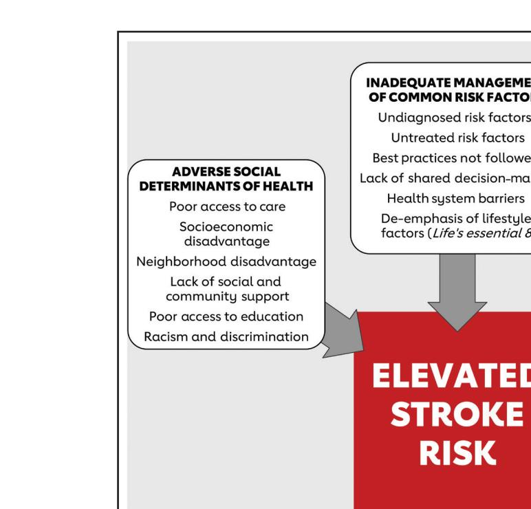
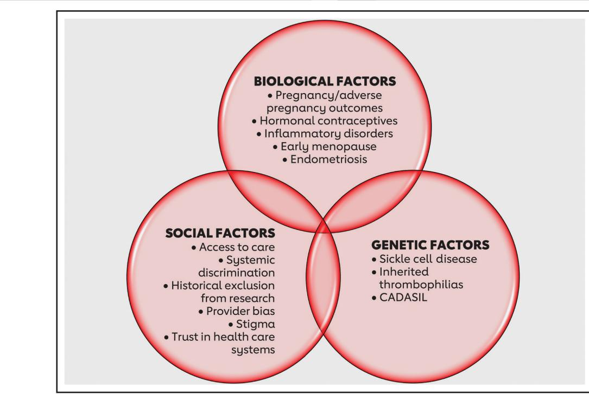
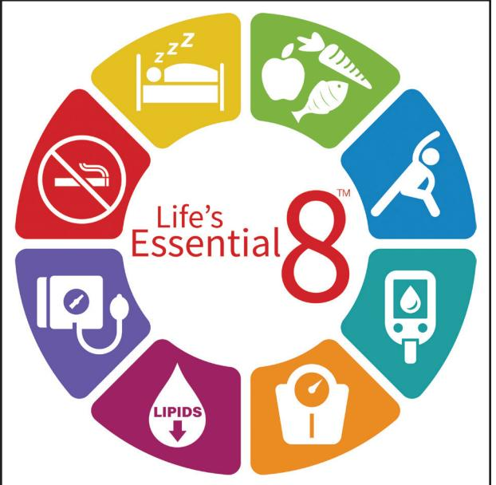
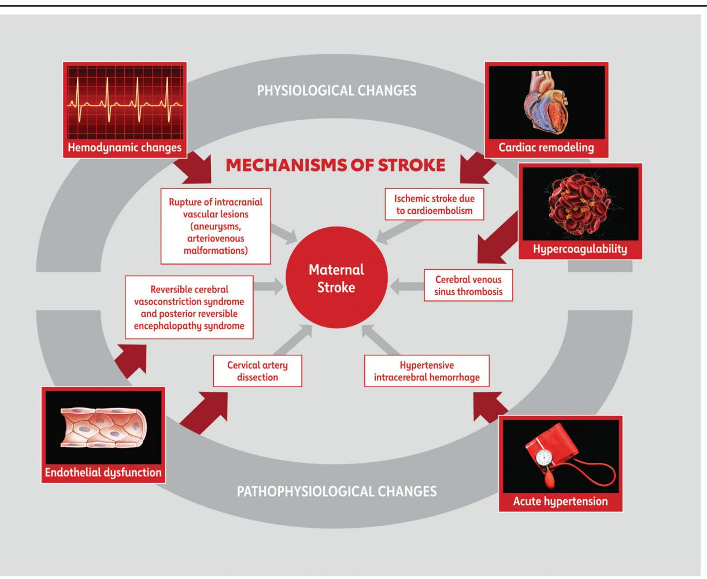
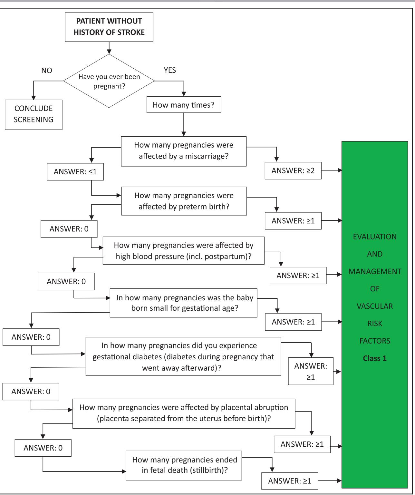
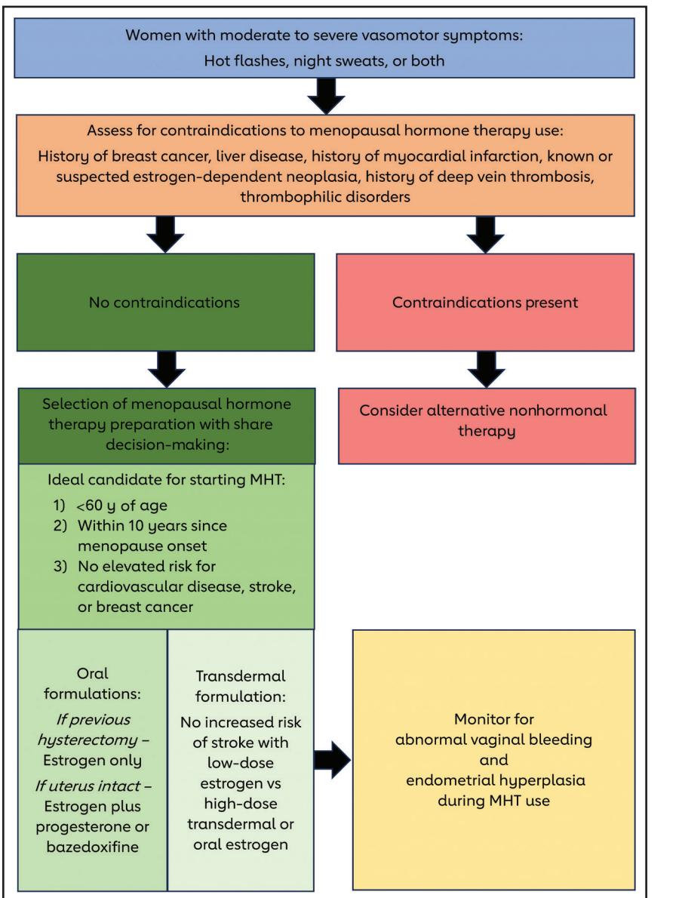

# **AHA/ASA GUIDELINE**

# 2024 Guideline for the Primary Prevention of Stroke: A Guideline From the American Heart Association/American Stroke Association

*Endorsed by the Preventive Cardiovascular Nurses Association and the Society for Vascular Surgery*

*The American College of Obstetricians and Gynecologists supports the value of this clinical document as an educational tool*

*The American Academy of Neurology affirms the value of this statement as an educational tool for neurologists*

#### GUIDELINE WRITING GROUP

Cheryl Bushnell, MD, MHS, FAHA, Chair; Walter N. Kernan, MD, Co–Vice Chair; Anjail Z. Sharrief, MD, MPH, FAHA, Co–Vice Chair; Seemant Chaturvedi, MD\*; John W. Cole, MD, MS; William K. Cornwell III, MD, MSCS, FAHA; Christine Cosby-Gaither, EdD; Sarah Doyle, MD; Larry B. Goldstein, MD, FAHA; Olive Lennon, PhD; Deborah A. Levine, MD, MPH; Mary Love, PhD, RN; Eliza Miller, MD, MS†; Mai Nguyen-Huynh, MD, MAS, FAHA; Jennifer Rasmussen-Winkler, MD, FAHA‡; Kathryn M. Rexrode, MD, MPH, FAHA; Nicole Rosendale, MD; Satyam Sarma, MD; Daichi Shimbo, MD; Alexis N. Simpkins, MD, PhD, MSCR, FAHA§; Erica S. Spatz, MD, MHS; Lisa R. Sun, MD; Vin Tangpricha, MD, PhD; Dawn Turnage, MS/AJS; Gabriela Velazquez, MD∥; Paul K. Whelton, MB, MD, MSc

**AIM:** The "2024 Guideline for the Primary Prevention of Stroke" replaces the 2014 "Guidelines for the Primary Prevention of Stroke." This updated guideline is intended to be a resource for clinicians to use to guide various prevention strategies for individuals with no history of stroke.

**METHODS:** A comprehensive search for literature published since the 2014 guideline; derived from research involving human participants published in English; and indexed in MEDLINE, PubMed, Cochrane Library, and other selected and relevant databases was conducted between May and November 2023. Other documents on related subject matter previously published by the American Heart Association were also reviewed.

**STRUCTURE:** Ischemic and hemorrhagic strokes lead to significant disability but, most important, are preventable. The 2024 primary prevention of stroke guideline provides recommendations based on current evidence for strategies to prevent stroke throughout the life span. These recommendations align with the American Heart Association's Life's Essential 8 for optimizing cardiovascular and brain health, in addition to preventing incident stroke. We also have added sex-specific recommendations for screening and prevention of stroke, which are new compared with the 2014 guideline. Many recommendations for similar risk factor prevention were updated, new topics were reviewed, and recommendations were created when supported by sufficient-quality published data.

**Key Words:** AHA Scientific Statements ◼ guideline ◼ hemorrhagic stroke ◼ ischemic stroke ◼ stroke

\*American Academy of Neurology representative. †American College of Obstetricians and Gynecologists liaison. ‡American Heart Association Stroke Council Stroke Performance Measures Oversight Committee liaison. §American Heart Association Stroke Council Scientific Statement Oversight Committee on Clinical Practice Guideline liaison. ∥Society for Vascular Surgery representative.

Peer Review Committee and AHA Stroke Council Scientific Statement Oversight Committee members, see page e398.

Supplemental Material is available at [https://www.ahajournals.org/doi/suppl/10.1161/STR.0000000000000475.](https://www.ahajournals.org/doi/suppl/10.1161/STR.0000000000000475)

© 2024 American Heart Association, Inc.

*Stroke* is available at www.ahajournals.org/journal/str

# TABLE OF CONTENTS

|                                | Abstract e344                                               |  |  |
|--------------------------------|-------------------------------------------------------------|--|--|
| Top 10 Take-Home Messages e345 |                                                             |  |  |
|                                | Preamble e346                                               |  |  |
| 1.                             | Introduction e347                                           |  |  |
|                                | 1.1 Methodology and Evidence Review e347                    |  |  |
|                                | 1.2. Organization of the Guideline                          |  |  |
|                                | Writing Group e347                                          |  |  |
|                                | 1.3. Document Review and Approval e348                      |  |  |
|                                | 1.4. Scope of the Guideline e348                            |  |  |
|                                | 1.5 Class of Recommendations and Level                      |  |  |
|                                | of Evidence e350                                            |  |  |
|                                | 1.6 Abbreviations e350                                      |  |  |
| 2.                             | General Concepts e351                                       |  |  |
|                                | 2.1 Evaluation of Evidence for Primary Stroke               |  |  |
|                                | Prevention e351                                             |  |  |
|                                | 2.2 Emphasis on Groups with Elevated                        |  |  |
|                                | Stroke Risk e351                                            |  |  |
|                                | 2.3 Social Determinants of Health e352                      |  |  |
| 3.                             | Patient Assessment e352                                     |  |  |
| 4.                             | Management of Health Behaviors and Health                   |  |  |
|                                | Factors for Primary Prevention of Stroke:                   |  |  |
|                                | Life's Essential 8 e355 4.1 Diet Quality e355            |  |  |
|                                | 4.2 Physical Activity e357                                  |  |  |
|                                | 4.3 Weight and Obesity e359                                 |  |  |
|                                | 4.4 Sleep e360                                              |  |  |
|                                | 4.5 Blood Sugar e361                                        |  |  |
|                                | 4.6 Blood Pressure e363                                     |  |  |
|                                | 4.7 Lipids e365                                             |  |  |
|                                | 4.8 Tobacco Use e367                                        |  |  |
| 5.                             | Atherosclerotic and Non-Atherosclerotic                     |  |  |
|                                | Risk Factors e369                                           |  |  |
|                                | 5.1 Asymptomatic Carotid Artery                             |  |  |
|                                | Stenosis e369                                               |  |  |
|                                | 5.2 Asymptomatic Cerebral SVD,                              |  |  |
|                                | Including Silent Cerebral Infarctse372                      |  |  |
|                                | 5.3 Migrainee373                                            |  |  |
|                                | 6. Specific Populationse374                                 |  |  |
|                                | 6.1 Sickle Cell Diseasee374                                 |  |  |
|                                | 6.2 Genetic Stroke Syndromes e377                           |  |  |
|                                | 6.3 Coagulation and Inflammatory                            |  |  |
|                                | Disorderse379                                               |  |  |
|                                | 6.3.1 Inflammation in Atherosclerosise379                   |  |  |
|                                | 6.3.2 Autoimmune Conditions e380                            |  |  |
|                                | 6.3.3 Malignancy e382                                       |  |  |
|                                | 6.3.4 Infection e382                                        |  |  |
|                                | 6.4 Substance Use and Substance                             |  |  |
|                                | Disorders e383 6.5 Sex- and Gender-Specific Factors e385 |  |  |
|                                | 6.5.1 Pregnancy e385                                        |  |  |
|                                | 6.5.2 Endometriosis e390                                    |  |  |
|                                | 6.5.3 Hormonal Contraception e391                           |  |  |
|                                | 6.5.4 Menopause e392                                        |  |  |
|                                |                                                             |  |  |

#### 6.5.5 Transgender Health . . . . . . . . . . . . . . . e394 6.5.6 Testosterone Use . . . . . . . . . . . . . . . . . e395 7. Heart Disease . . . . . . . . . . . . . . . . . . . . . . . . . . . . . . e396 7.1 Cardiomyopathy . . . . . . . . . . . . . . . . . . . . . . . . e396 8. Antiplatelet Use for Primary Prevention . . . . . . e397 Disclosures . . . . . . . . . . . . . . . . . . . . . . . . . . . . . . . . . . . . e399 References . . . . . . . . . . . . . . . . . . . . . . . . . . . . . . . . . . . . . e403

### TOP 10 TAKE-HOME MESSAGES

- 1. From birth to old age, every person should have access to and regular visits with a primary care health professional to identify and achieve opportunities to promote brain health.
- 2. Screening for and addressing adverse social determinants of health are important in the approach to prevention of incident stroke. This updated guideline includes an orientation to social determinants of health, acknowledging its impact on access to care and treatment of stroke risk factors. Therefore, screening for social determinants of health is recommended in care settings where at-risk stroke patients may be evaluated, with the acknowledgment that evidence-based interventions to address adverse social determinants of health are evolving.
- 3. The Mediterranean diet is a dietary pattern that has been shown to reduce the risk of stroke, especially when supplemented with nuts and olive oil. However, low-fat diets have had little impact on reducing the risk. This guideline recommends that adults with no prior cardiovascular disease and those with high or intermediate risk adhere to the Mediterranean diet.
- 4. Physical activity is essential for cardiovascular health and stroke risk reduction. This guideline includes a summary of high-quality data showing that prolonged sedentary behavior during waking hours is associated with an increased risk of stroke. Therefore, we provide a new recommendation for screening for sedentary behavior and counseling patients to avoid being sedentary, as well as a call for new studies of interventions to disrupt sedentary behavior. This is in addition to the recommendation to engage in regular moderate to vigorous physical activity.
- 5. Glucagon-like protein-1 receptor agonists have been shown to be effective not only for improving management of type 2 diabetes but also for weight loss and lowering the risk of cardiovascular disease and stroke. On the basis of these robust data, we provide a new recommendation for the use of these drugs in patients with diabetes and high cardiovascular risk or established cardiovascular disease.

**CLINICAL STATEMENTS** 

**AND GUIDELINES**

- 6. Blood pressure management is critical for stroke prevention. Randomized controlled trials have demonstrated that treatment with 1 antihypertensive medication is effective for reaching the blood pressure goal in only ≈30% of participants and that the majority of participants achieved the goal with 2 or 3 medications. Therefore, ≥2 antihypertensive medications are recommended for primary stroke prevention in most patients who require pharmacological treatment of hypertension.
- 7. Antiplatelet therapy is recommended for patients with antiphospholipid syndrome or systemic lupus erythematosus without a history of stroke or unprovoked venous thromboembolism to prevent stroke. Patients with antiphospholipid syndrome who have had a prior unprovoked venous thrombosis likely benefit from vitamin K antagonist therapy (target international normalized ratio, 2–3) over direct oral anticoagulants.
- 8. Prevention of pregnancy-related stroke can be achieved primarily through management of hypertension. Treatment of verified systolic blood pressure ≥160 mm Hg or diastolic blood pressure ≥110 mm Hg during pregnancy and within 6 weeks postpartum is recommended to reduce the risk of fatal maternal intracerebral hemorrhage. In addition, adverse pregnancy outcomes are common and are associated with chronic hypertension and an elevated stroke risk later in life. Therefore, screening for these pregnancy outcomes is recommended to evaluate for and manage vascular risk factors, and a screening tool is included to assist with screening in clinical practice.
- 9. Endometriosis, premature ovarian failure (before 40 years of age), and early-onset menopause (before 45 years of age) are all associated with an increased risk for stroke. Therefore, screening for all 3 of these conditions is a reasonable step in the evaluation and management of vascular risk factors in these individuals to reduce stroke risk.
- 10. Understanding transgender health is essential to truly inclusive clinical practice. Transgender women taking estrogens for gender affirmation have been identified as having an increased risk of stroke. Therefore, evaluation and modification of risk factors could be beneficial for stroke risk reduction in this population.

### PREAMBLE

Since 1990, the American Heart Association (AHA)/ American Stroke Association (ASA) has translated scientific evidence into clinical practice guidelines with recommendations to improve cerebrovascular health. These guidelines, which are based on systematic methods to evaluate and classify evidence, provide a foundation for the delivery of quality cerebrovascular care. The AHA/ASA sponsors the development and publication of clinical practice guidelines without commercial support, and members volunteer their time to the writing and review efforts.

Clinical practice guidelines for stroke provide recommendations applicable to patients with or at risk of developing cerebrovascular disease. The focus is on medical practice in the United States, but many aspects are relevant to patients throughout the world. Although it must be acknowledged that guidelines may be used to inform regulatory or payer decisions, the core intent is to improve quality of care and align with patients' interests. Guidelines are intended to define practices meeting the needs of patients in most but not all circumstances and should not replace clinical judgment; furthermore, the recommendations set forth should be considered in the context of individual patient values, preferences, and associated conditions.

The AHA/ASA strives to ensure that guideline writing groups contain requisite expertise and are representative of the broader medical community by selecting experts from a broad array of backgrounds, representing different sexes, races, ethnicities, intellectual perspectives, geographic regions, and scopes of clinical practice, and by inviting organizations and professional societies with related interests and expertise to participate as endorsers. The AHA/ASA has rigorous policies and methods for development of guidelines that limit bias and prevent improper influence. The complete policy on relationships with industry and other entities can be found at [https://professional.](https://professional.heart.org/-/media/phd-files/guidelines-and-statements/policies-devolopment/aha-asa-disclosure-rwi-policy-5118.pdf?la=en) [heart.org/-/media/phd-files/guidelines-and-state](https://professional.heart.org/-/media/phd-files/guidelines-and-statements/policies-devolopment/aha-asa-disclosure-rwi-policy-5118.pdf?la=en)[ments/policies-devolopment/aha-asa-disclosure](https://professional.heart.org/-/media/phd-files/guidelines-and-statements/policies-devolopment/aha-asa-disclosure-rwi-policy-5118.pdf?la=en)[rwi-policy-5118.pdf?la=en.](https://professional.heart.org/-/media/phd-files/guidelines-and-statements/policies-devolopment/aha-asa-disclosure-rwi-policy-5118.pdf?la=en)

Beginning in 2017, numerous modifications to the AHA/ASA guidelines have been implemented to make guidelines shorter and enhance user friendliness. Guidelines are written and presented in a modular knowledge chunk format; each chunk includes a table of recommendations, a brief synopsis, recommendation-specific supportive text, and, when appropriate, flow diagrams or additional tables. Other modifications to the guidelines include the addition of Knowledge Gaps and Future Research segments in some sections and a web guideline supplement ([Data Supplement 1](https://www.ahajournals.org/doi/suppl/10.1161/STR.0000000000000475)) for useful but noncritical tables and figures.

> *Jose Romano, MD, FAHA Chair, AHA Stroke Council Scientific Statement Oversight Committee*

### 1. INTRODUCTION

Adults in the United States can control their risk for stroke by optimizing a few behaviors and taking advantage of evidence-based preventive care. These simple behaviors and care strategies are included in the AHA's Life's Essential 8, which serves as an educational tool to help everyone know how to stay healthy and prevent all forms of cardiovascular disease (CVD).1 The 8 strategies are as follows: eat better, be more active, quit tobacco, get healthy sleep, manage weight, control cholesterol, manage blood sugar, and manage blood pressure (BP).

To move Americans toward a stroke-free life, however, we first need to bridge the gap between the present state of control for stroke risk factors among US residents (including Life's Essential 8; see Section 4) and the control that we could achieve with better implementation of available, proven care strategies. Often called the prevention gap,2 this phenomenon exists for behavioral risk factors (eg, low physical activity, poor diet quality, inadequate sleep duration), risk factors that respond to pharmacotherapy (eg, high BP, dyslipidemia, diabetes, and atrial fibrillation [AF]), and the most complex risk factors that are typically managed with combination behavior change and pharmacology (eg, cigarette smoking and high body weight).

Closing the prevention gap is of enormous consequence to US residents. Each year, 600000 residents have a first stroke and 200000 have a recurrent event.3 Nearly 160000 will die because of stroke, making it the fifth leading cause of death.3,4 The incidence and mortality of stroke disproportionately affect individuals who face adverse socioeconomic circumstances compared with individuals in more favorable circumstances. This is manifest in higher stroke rates and greater risk burden among individuals with economic instability, lower education, residence in stressed neighborhoods, and residence in states that make up the US Stroke Belt.5–7 Thus, stroke incidence and mortality may be correlated with health inequities in the United States.

Stroke is also a leading cause of adult-onset disability; among individuals who survive 6 months, almost half are dependent in at least 1 activity of daily living.8 Beyond physical dependence and disability, stroke and the cumulative brain injury that results from recurrent events lead to cognitive decline.9 With better implementation of known strategies for risk factor control, more than half of stroke events could be prevented, along with the associated disability and cognitive decline.10,11 Over time, this would be expected to lower the proportion of US adults living with brain injury related to stroke, which is currently estimated to be 7% among adults ≥60 years of age.12

Clinicians have a leading role to play in closing the prevention gap, which is to deliver preventive care to individual patients; most of this should occur in pediatric and adult primary care practices, but it will sometimes occur in subspecialty practices such as cardiology, neurology, obstetrics, gynecology, and vascular surgery. The "2024 Guideline for the Primary Prevention of Stroke" is written primarily for clinicians at the front line of stroke prevention. It provides recommendations to guide their care efforts and explanations to help them appraise the rationale behind each. However, clinicians cannot do this work alone. Thus, this guideline can be a reference for health system leaders, public policy officials, and government policymakers who partner with clinicians to help everyone live a stroke-free life.

#### 1.1. Methodology and Evidence Review

The recommendations listed in this guideline are, whenever possible, evidence based and supported by extensive evidence review. A search for literature derived from research principally involving human subjects; published in English since the last primary prevention guideline in 2014; and indexed in MEDLINE, PubMed, Cochrane Library, and other selected databases relevant to this guideline was conducted between April 2023 and December 2023. (Additional studies and articles published between January 2024 and March 2024 were added later when appropriate.) [Data Supple](https://www.ahajournals.org/doi/suppl/10.1161/STR.0000000000000475)[ment 1](https://www.ahajournals.org/doi/suppl/10.1161/STR.0000000000000475) contains the final evidence tables summarizing the evidence used by the guideline writing group to formulate recommendations. In addition, the guideline writing group reviewed documents related to subject matter previously published by the AHA/ASA ([Supplemental Table 1 in Data](https://www.ahajournals.org/doi/suppl/10.1161/STR.0000000000000475)  [Supplement 1](https://www.ahajournals.org/doi/suppl/10.1161/STR.0000000000000475)). References selected and published in the present document are representative and not all inclusive.

Each topic area was assigned a primary writer and a primary and sometimes secondary reviewer. These assignments were based on the areas of expertise of the members of the guideline writing group and their lack of any relationships with industry related to the section material. All recommendations were fully reviewed and discussed among the full group to allow diverse perspectives and considerations for this guideline. Recommendations were then voted on, and a modified Delphi process was used to reach consensus. Guideline writing group members who had relationships with industry that were relevant to certain recommendations were recused from voting on those particular recommendations. All recommendations in this guideline were agreed to by between 95% and 100% of the voting guideline writing group members.

### 1.2. Organization of the Guideline Writing Group

The 2024 Primary Prevention of Stroke Guideline Writing Group (writing group) consisted of vascular neurologists, internists, cardiologists, a nurse scientist, a fellow-intraining, and 2 lay/patient representatives. The writing group included representatives from the AHA/ASA, the American Academy of Neurology, the American College of Obstetricians and Gynecologists, the Preventive Cardiovascular Nurses Association, and the Society for Vascular Surgery. Appendix 1 of this document lists writing group members' relevant relationships with industry and other entities. On March 17, 2024, a writing group member disclosed having **CLINICAL STATEMENTS**

 **AND GUIDELINES**

**CLINICAL STATEMENTS AND GUIDELINES** taken a full-time employment with a pharmaceutical industry. As per our RWI policy, the industry employment precluded the member from continuing to serve on the guideline. The member was removed from the writing group and the manuscript was reviewed and approved by the guideline writing group. For the purposes of full transparency, the Guideline Writing Group members' comprehensive disclosure information is available in [Data Supplement 2](https://www.ahajournals.org/doi/suppl/10.1161/STR.0000000000000475).

### 1.3. Document Review and Approval

This document was reviewed by the AHA Stroke Council Scientific Statement Oversight Committee; the AHA Science Advisory and Coordinating Committee; the AHA Executive Committee; reviewers from the American Academy of Neurology, American College of Obstetricians and Gynecologists, Preventive Cardiovascular Nurses Association, and Society for Vascular Surgery; and 33 individual content reviewers. Appendix 2 lists reviewers' comprehensive disclosure information.

### 1.4. Scope of the Guideline

The scope of the present guideline is for clinicians who treat at an individual level, but we recognize that multilevel national strategies for public health are also required to promote and facilitate healthy lifestyles and to reduce environmental, socioeconomic, and educational factors that increase the risk of stroke. This 2024 guideline parallels the 2014 AHA/ASA "Guidelines for the Primary Prevention of Stroke"13 in addressing both ischemic and hemorrhagic strokes. We do this because of the overlap of risk factors and preventive strategies, differences in clinical practice, differences in how stroke presents in patient groups (eg, pregnancy), and treatment-related adverse effects that are different for hemorrhagic and ischemic strokes. The aim of the present guideline is to provide clinicians with evidence-based recommendations for prevention of the first stroke.

Many guidelines have been published in the past several years that are focused specifically on the management of common stroke risk factors. Therefore, this guideline will not cover the following topics:

- AF (covered in the 2019 American College of Cardiology [ACC]/AHA AF focused update)14;
- Congenital heart disease (covered in the 2018 ACC/AHA guideline)15;
- Valvular heart disease (covered in the 2020 ACC/ AHA guideline)16;
- Prevention of stroke in the setting of acute coronary syndromes (covered in the 2014 ACC/AHA guideline for non–ST-segment–elevation myocardial infarction [MI], and the 2017 ACC/AHA clinical performance measures for ST-segment–elevation MI and non–STsegment–elevation MI)17,18;
- Subarachnoid hemorrhage (covered in the 2023 AHA/ASA guideline)19;
- Pediatric stroke, except as it pertains to sickle cell disease (SCD)20;

**Figure 1. Elements associated with elevated stroke risk.**

CADASIL indicates cerebral autosomal dominant arteriopathy with subcortical infarcts and leukoencephalopathy.

- Secondary prevention of stroke (covered in the 2021 AHA/ASA guideline)21;
- Cerebral venous thrombosis (covered in the 2024 AHA scientific statement)22,23; and
- Pathways for the implementation and dissemination of guideline recommendations in clinical practice.

This guideline is organized into topics that are inclusive of primary prevention of stroke across the life span of adults. When the topics overlap with the 2014 guideline, studies and clinical trials published since 2014 have been summarized to underpin the current recommendations. There are 6 clinical sections:

1. Patient assessment;

Downloaded from http://ahajournals.org by on August 18, 2025

- 2. Life's Essential 81;
- 3. Atherosclerotic and nonatherosclerotic risk factors (eg, migraine);
- 4. Special populations, including trans health (a first for stroke primary prevention), SCD (the exception for including the pediatric population), genetic stroke syndromes, coagulation and inflammatory disorders, substance use, and sex-specific risk factors (pregnancy and pregnancy complications, endometriosis, hormonal contraception, menopause, and exogenous testosterone use);
- 5. Heart disease, specifically atrial cardiopathy and left ventricular dysfunction; and
- 6. Antiplatelet use for primary prevention.

#### **Table 1. Applying the American College of Cardiology/American Heart Association Class of Recommendation and Level of Evidence to Clinical Strategies, Interventions, Treatments, or Diagnostic Testing in Patient Care (Updated May 2019)**

| CLASS (STRENGTH) OF RECOMMENDATION                                                                                                                                                                                |                  | LEVEL (QUALITY) OF EVIDENCE +                                                                                                                                                                                                                                                                                                   |                  |  |
|-------------------------------------------------------------------------------------------------------------------------------------------------------------------------------------------------------------------|------------------|---------------------------------------------------------------------------------------------------------------------------------------------------------------------------------------------------------------------------------------------------------------------------------------------------------------------------------|------------------|--|
| CLASS 1 (STRONG)                                                                                                                                                                                                  | Benefit >>> Risk | LEVEL A                                                                                                                                                                                                                                                                                                                         |                  |  |
| Suggested phrases for writing recommendations: · Is recommended · Is indicated/useful/effective/beneficial · Should be performed/administered/other                                                      |                  | · High-quality evidence : from more than 1 RCT · Meta-analyses of high-quality RCTs · One or more RCTs corroborated by high-quality registry studies                                                                                                                                                                      |                  |  |
| · Comparative-Effectiveness Phrasest:                                                                                                                                                                             |                  | LEVEL B-R                                                                                                                                                                                                                                                                                                                       | (Randomized)     |  |
| - Treatment/strategy A is recommended/indicated in preference to treatment B - Treatment A should be chosen over treatment B                                                                                |                  | · Moderate-quality evidence from 1 or more RCTs · Meta-analyses of moderate-quality RCTs                                                                                                                                                                                                                                     |                  |  |
| CLASS 2a (MODERATE)                                                                                                                                                                                               | Benefit >> Risk  | LEVEL B-NR                                                                                                                                                                                                                                                                                                                      | (Nonrandomized)  |  |
| Suggested phrases for writing recommendations: · Is reasonable · Can be useful/effective/beneficial · Comparative-Effectiveness Phrasest: - Treatment/strategy A is probably recommended/indicated in |                  | · Moderate-quality evidence from 1 or more well-designed, well- executed nonrandomized studies, observational studies, or registry studies · Meta-analyses of such studies                                                                                                                                             |                  |  |
| preference to treatment B - It is reasonable to choose treatment A over treatment B                                                                                                                            |                  | LEVEL C-LD                                                                                                                                                                                                                                                                                                                      | (Limited Data)   |  |
| CLASS 2b (WEAK) Suggested phrases for writing recommendations:                                                                                                                                                 | Benefit > Risk   | · Randomized or nonrandomized observational or registry studies with limitations of design or execution Meta-analyses of such studies · Physiological or mechanistic studies in human subjects                                                                                                                         |                  |  |
| · May/might be reasonable · May/might be considered · Usefulness/effectiveness is unknown/unclear/uncertain or not well-                                                                                    |                  | LEVEL C-EO                                                                                                                                                                                                                                                                                                                      | (Expert Upinion) |  |
| established                                                                                                                                                                                                       |                  | · Consensus of expert opinion based on clinical experience                                                                                                                                                                                                                                                                      |                  |  |
| CLASS 3: No Benefit (MODERATE)                                                                                                                                                                                    | Benefit = Risk   | COR and LOE are determined independently (any COR may be paired with any LOE).                                                                                                                                                                                                                                                  |                  |  |
| (Generally, LOE A or B use only) Suggested phrases for writing recommendations: · Is not recommended                                                                                                        |                  | A recommendation with LOE C does not imply that the recommendation is weak. Many important clinical questions addressed in guidelines do not lend themselves to clinical trials. Although RCTs are unavailable, there may be a very clear clinical consensus that a particular test or therapy is useful or effective. |                  |  |
| · Is not indicated/useful/effective/beneficial · Should not be performed/administered/other                                                                                                                    |                  | * The outcome or result of the intervention should be specified (an improved clinical outcome or increased diagnostic accuracy or incremental prognostic information).                                                                                                                                                       |                  |  |
| Class 3: Harm (STRONG)                                                                                                                                                                                            | Risk > Benefit   | + For comparative-effectiveness recommendations (COR 1 and 2a; LOE A and B only), studies that support the use of comparator verbs should involve direct comparisons of the treatments or strategies being evaluated.                                                                                                     |                  |  |
| Suggested phrases for writing recommendations: · Potentially harmful · Causes harm · Associated with excess morbidity/mortality                                                                          |                  | + The method of assessing quality is evolving, including the application of stan- dardized, widely-used, and preferably validated evidence grading tools; and for systematic reviews, the incorporation of an Evidence Review Committee.                                                                                  |                  |  |
| · Should not be performed/administered/other                                                                                                                                                                      |                  | COR indicates Class of Recommendation; EO, expert opinion; LD, limited data; LOE, Level of Evidence: NR, nonrandomized: R. randomized: and RCT randomized controlled trial.                                                                                                                                                  |                  |  |

The current guideline includes recommendations for screening for stroke risk factors in the primary care setting in the Patient Assessment section, which incorporates social determinants of health (SDOH), a highly influential group of nonmedical factors that affect cardiovascular and stroke risk and prevention.24 In addition, in lieu of certain nonmodifiable risks such as age and genetic factors, we focused on prevention across the life span. The genetic factors that currently have treatments available that could potentially alter the risk of stroke also were the focus of this guideline. The modifiable risk factors are now organized and summarized according to a powerful new measure of cardiovascular health, Life's Essential 8, which is a pattern of treatment targets and behaviors that can affect the risk of stroke.1 To reflect the stroke risk that increases with age, we included atherosclerotic risk factors, specifically asymptomatic carotid disease, asymptomatic small-vessel disease (SVD)/cerebral infarcts, and nonatherosclerotic risk that includes migraine.

Another modification to this update is the inclusion of special populations, or individuals with potentially enhanced risk (Figure 1) that may occur across the life span but affects primarily young and middle-aged adults. Hypertensive disorders of pregnancy (HDP) and other pregnancy complications associated with stroke during and later in life were described in the 2014 AHA/ASA "Guidelines for the Prevention of Stroke in Women,"25 but the recommendations in this current guideline are guided by the vast amount of literature published since 2014. Other sex-specific topics that have yet to be covered in other stroke prevention guidelines include endometriosis, menopause, and testosterone use. Trans health is also extremely important to discuss because these individuals are marginalized in some societies and may be skeptical of medical care but could have unique risks for stroke.

We also discuss the evidence behind anticoagulation and cardiomyopathy, as well as anticoagulation for the primary prevention of stroke. The final section of the guideline is an update of antiplatelet use for primary prevention of stroke.

In the process of developing this guideline, the writing group reviewed prior published AHA/ASA guidelines and scientific statements, listed in [Supplemental Table 1](https://www.ahajournals.org/doi/suppl/10.1161/STR.0000000000000475)  [in Data Supplement 1](https://www.ahajournals.org/doi/suppl/10.1161/STR.0000000000000475). These are resources for readers and reduce the need for repetition of existing guideline recommendations.

### 1.5. Class of Recommendations and Level of Evidence

Recommendations are designated with both a Class of Recommendation (COR) and a Level of Evidence (LOE). The COR indicates the strength of recommendation, encompassing the estimated magnitude and certainty of benefit in proportion to risk. The LOE rates the quality of scientific evidence supporting the intervention based on the type, quantity, and consistency of data from clinical trials and other sources (Table 1).

#### 1.6. Abbreviations

| Abbreviation | Meaning                                                                                         |  |
|--------------|-------------------------------------------------------------------------------------------------|--|
| ACC          | American College of Cardiology                                                                  |  |
| ACCORD       | Action to Control Cardiovascular Risk in Diabetes                                            |  |
| ACS          | asymptomatic carotid artery stenosis                                                            |  |
| ACST         | Asymptomatic Carotid Surgery Trial                                                              |  |
| AF           | atrial fibrillation                                                                             |  |
| AHA          | American Heart Association                                                                      |  |
| aPL          | antiphospholipid antibody                                                                       |  |
| APO          | adverse pregnancy outcome                                                                       |  |
| APS          | antiphospholipid syndrome                                                                       |  |
| ASA          | American Stroke Association                                                                     |  |
| ASPREE       | Aspirin in Reducing Events in the Elderly                                                       |  |
| BMI          | body mass index                                                                                 |  |
| BP           | blood pressure                                                                                  |  |
| CADASIL      | cerebral autosomal dominant arteriopathy with subcortical infarcts and leukoencephalopathy   |  |
| CEA          | carotid endarterectomy                                                                          |  |
| CHC          | combined hormonal contraceptive                                                                 |  |
| COR          | Class of Recommendation                                                                         |  |
| CPAP         | continuous positive airway pressure                                                             |  |
| CRCT         | chronic red cell transfusion                                                                    |  |
| CREST 2      | Carotid Revascularization and Medical Management for Asymptomatic Carotid Ste nosis Trial |  |
| CSVD         | cerebral small-vessel disease                                                                   |  |
| CVD          | cardiovascular disease                                                                          |  |
| DASH         | Dietary Approaches to Stop Hypertension                                                         |  |
| DBP          | diastolic blood pressure                                                                        |  |
| e-cigarette  | electronic cigarette                                                                            |  |
| ERT          | enzyme replacement therapy                                                                      |  |
| GLP-1        | glucagon-like protein-1                                                                         |  |
| HDP          | hypertensive disorders of pregnancy                                                             |  |
| HHT          | hemorrhagic telangiectasia                                                                      |  |
| HOPE-3       | Heart Outcomes Prevention Evaluation–3                                                          |  |
| HR           | hazard ratio                                                                                    |  |
| HT           | hormone therapy                                                                                 |  |
| ICH          | intracerebral hemorrhage                                                                        |  |
| JPPP         | Japanese Primary Prevention Project                                                             |  |
| LDL          | low-density lipoprotein                                                                         |  |
| LDL-C        | low-density lipoprotein cholesterol                                                             |  |
| LOE          | Level of Evidence                                                                               |  |
| MI           | myocardial infarction                                                                           |  |
| MRI          | magnetic resonance imaging                                                                      |  |
| OSA          | obstructive sleep apnea                                                                         |  |
| PAVM         | pulmonary arteriovenous malformation                                                            |  |
| PCSK9        | proprotein convertase subtilisin/kexin 9                                                        |  |
| PD           | periodontal disease                                                                             |  |
| PFO          | patent foramen ovale                                                                            |  |
| RCT          | randomized controlled trial                                                                     |  |
| SBP          | systolic blood pressure                                                                         |  |

| Abbreviation | Meaning                                                                                                                     |
|--------------|-----------------------------------------------------------------------------------------------------------------------------|
| SCD          | sickle cell disease                                                                                                         |
| SCI          | silent cerebral infarct/infarction                                                                                          |
| SDOH         | social determinants of health                                                                                               |
| SLE          | systemic lupus erythematosus                                                                                                |
| SPRINT       | Systolic Blood Pressure Intervention Trial                                                                                  |
| STOP         | Stroke Prevention Trial in Sickle Cell Anemia                                                                               |
| SVD          | small-vessel disease                                                                                                        |
| TCD          | transcranial Doppler                                                                                                        |
| TIA          | transient ischemic attack                                                                                                   |
| TRAVERSE     | Testosterone Replacement Therapy for Assessment of Long-Term Vascular Events and Efficacy Response in Hypogonadal Men |
| USPSTF       | US Preventive Services Task Force                                                                                           |
| VKA          | vitamin K antagonist                                                                                                        |
| WARCEF       | Warfarin Versus Aspirin in Reduced Cardiac Ejection Fraction                                                             |
| WC           | waist circumference                                                                                                         |
| WHR          | waist-to-hip ratio                                                                                                          |

## 2. GENERAL CONCEPTS

### 2.1. Evaluation of Evidence for Primary Stroke Prevention

Eligible studies included the following broadly defined populations:

- The general population of adults without established CVD;
- A population of adults with CVD but without a history of stroke or transient ischemic attack (TIA); and
- A population of adults with CVD, including stroke or TIA.

If guideline section authors cited data from a study that included patients with stroke, no more than 50% of participants could have a history of stroke. Section authors and reviewers were instructed to follow general guidelines provided for assigning COR and LOE to recommendations (Section 1.5). Additional guidance was provided to guideline section authors on how to assign LOE for studies in which primary evidence was derived from secondary analyses (prespecified or post hoc) and subgroup analyses (Table 2). Study populations and characteristics that were included for this guideline evidence review can be found in Table 3.

### 2.2. Emphasis on Groups With Elevated Stroke Risk

Certain patient populations have elevated risk for stroke. In these populations, elevated risk can be related to genetic factors in the case of inherited conditions, biological factors related to sex-specific risks or hormones, social factors that relate to health care access or other SDOH, or a combination of these factors (Figure 2).

#### **Table 2. Supplemental Guidance on Level of Evidence**

| Level (quality) of                                  |                                 |            |
|-----------------------------------------------------|---------------------------------|------------|
| evidence                                            | Outcome Type                    | LOE        |
| >1 High-quality RCT                                 | Primary                         | A          |
| Meta-analyses of such                               | Secondary prespecified          | A*         |
| studies                                             | Secondary post hoc (full group) | B-R        |
|                                                     | Secondary post hoc (subgroup)   | C-LD       |
| ≥1 Moderate-quality                                 | Primary                         | B-R        |
| RCTs                                                | Secondary prespecified          | B-R        |
| Meta-analyses of such studies                    | Secondary post hoc (full group) | C-LD       |
|                                                     | Secondary post hoc (subgroup)   | C-LD†      |
| ≥1 Nonrandomized,                                   | Primary                         | B-NR       |
| observational, or registry studies (prospective) | Secondary prespecified          | B-NR/C-LD‡ |
| Meta-analyses of such                               | Secondary post hoc (full group) | C-LD       |
| studies                                             | Secondary post hoc (subgroup)   | C-LD       |
| Randomized or nonran                                | Primary                         | C-LD       |
| domized studies with limitations of design/      | Secondary prespecified          | C-LD       |
| execution                                           | Secondary post hoc (full group) | C-LD/C-EO  |
|                                                     | Secondary post hoc (subgroup)   | C-LD/C-EO  |

LOE indicates Level of Evidence; and RCT, randomized controlled trial.

\*Option to assign C-LD.

†Option not to use because of weakness of data.

‡Based on whether results inform a recommendation.

In this guideline, we introduce several new sections to highlight populations at higher risk for stroke and, in some cases, populations who may be less likely to receive routine screening for common vascular risk factors despite their elevated risk. For several of these populations, high-quality clinical trial data testing the effect of risk factor control on stroke risk do not exist. The lack of data to guide management for these patient populations is largely related to the following:

- Lack of inclusion in stroke clinical trials;
- Clinical trial feasibility given low prevalence; and
- Failure to identify populations as important subgroups.

We highlight research gaps for these higher-risk populations to encourage research that can be used to guide clinical management in the future. We acknowledge that there are many other populations with elevated stroke risk related to SDOH, including access to care, geographic location, educational attainment, economic stability, and structural racism. Because many of these underlying drivers of inequities operate at societal and systemic levels,

**Table 3. Study Populations and Characteristics Included for Primary Prevention Evidence Review**

| Study populations                    | Characteristics                              |
|--------------------------------------|----------------------------------------------|
| 1. General population without CVD    | Primary prevention                           |
| 2. Population with CVD and no stroke | Primary prevention                           |
| 3. Population with CVD and stroke    | ≥50% without stroke is primary prevention |

CVD indicates cardiovascular disease.

**Figure 2. Selected genetic, biological, and social factors affecting stroke risk.** CADASIL indicates cerebral autosomal dominant arteriopathy with subcortical infarcts and leukoencephalopathy.

they are not within the scope of this guideline, and we do not include recommendations for them here. However, in mentioning these drivers of inequities, we aim to highlight the critical need for future research to understand mechanisms by which they influence risk so that we can develop evidence-based interventions to target them.

### 2.3. Social Determinants of Health

SDOH are nonmedical factors, including education, economic stability, health care access, neighborhood of residence, experiences of racism, and others, that contribute to inequities in care, health, and health care outcomes.3,26–45 Adverse SDOH relate directly to primary stroke prevention because they contribute to the higher prevalence of risk factors among groups at risk for disparities, can decrease access to health care for screening and management of stroke risk factors, and impair the ability to engage in behaviors and lifestyle changes that promote reduction of stroke risk.26–38,46 At a societal level, historical discrimination, structural racism, and other present-day and historical biases not only have influenced the differential distribution of adverse SDOH across population groups but also have contributed to research access and inclusion and thus underrepresentation in research for populations at risk for health disparities.26,47–49 Therefore, the data needed to make research-informed recommendations for specific populations are limited.47,50

Patient-level SDOH include health care access, health literacy, food security, and housing security, all of which influence the likelihood of developing and controlling vascular risk factors.26 Evidence-based approaches for addressing patient-level adverse SDOH include ensuring that patient education is provided at the appropriate educational levels and language51,52 and building trust to be able to re-educate a patient who has health beliefs that are based on misinformation.24–27,50–52 Other approaches involve advocating for patients, choosing the most efficacious and cost-effective medications, connecting patients to resources that help address health-related social needs such as food and housing insecurity, referring patients to programs that support lifestyle change,41,53–55 and connecting patients with programs that help defray health care costs.47 Last, this writing group acknowledges that social factors operating above the individual level influence CVD and stroke prevention; however, addressing these societal factors is beyond the scope of this guideline and is the topic of other documents and AHA statements.24,26,36,37,40,56,57

# 3. PATIENT ASSESSMENT

| Recommendations for Patient Assessment |      |                                                                                                                                                                                                                                                                                       |  |  |
|----------------------------------------|------|---------------------------------------------------------------------------------------------------------------------------------------------------------------------------------------------------------------------------------------------------------------------------------------|--|--|
| COR                                    | LOE  | Recommendations                                                                                                                                                                                                                                                                       |  |  |
| 1                                      | B-NR | 1. In individuals 40–79 years of age, estimation of risk for atherosclerotic CVD (ie, nonfatal MI, non fatal stroke, and fatal CVD) every 1 to 5 years is beneficial to guide decisions on treatments and lifestyle recommendations that may reduce risk for stroke.58 |  |  |

|     | CL  |
|-----|-----|
|     |     |
|     |     |
| AN  | IN  |
|     |     |
|     |     |
|     | ICA |
|     |     |
|     |     |
| D G |     |
|     |     |
|     | L S |
| UI  |     |
|     |     |
|     |     |
|     |     |
| DE  | TAT |
|     |     |
| LIN | EM  |
|     |     |
|     |     |
|     |     |
|     | EN  |
|     |     |
| ES  |     |
|     |     |
|     | TS  |
|     |     |
|     |     |

| Recommendations for Patient Assessment (Continued) |      |                                                                                                                                                                                                              |  |
|----------------------------------------------------|------|--------------------------------------------------------------------------------------------------------------------------------------------------------------------------------------------------------------|--|
| COR                                                | LOE  | Recommendations                                                                                                                                                                                              |  |
| 1                                                  | B-NR | 2. In individuals with AF, calculation of the CHA2DS2- VASc score is recommended to guide decisions on prescription of oral anticoagulation to reduce risk for stroke.59                            |  |
| 1                                                  | C-EO | 3. In individuals ≥18 years of age, periodic screening for modifiable behaviors and medical conditions that increase stroke risk is recommended to reduce risk for stroke.60,61                     |  |
| 1                                                  | C-EO | 4. In individuals ≥18 years of age, periodic screening for SDOH (eg, food insecurity, lack of transporta tion) is beneficial to identify additional factors that contribute to stroke risk.35,62–65 |  |

### Synopsis

Prevention of stroke in office-based care begins by meeting with patients to identify behaviors and conditions that place them at risk. Prevention should begin early in life because unidentified and unmanaged risk causes damage to arteries, the brain, and the heart years before disease is manifest. The most common treatable behaviors and conditions that increase risk are the AHA's Life's Essential 8,1 but others include AF and substance use disorders.66 Talking with patients will identify modifiable behaviors (eg, cigarette smoking, physical inactivity, sleep problems, and poorquality diet) and social, environmental, or economic factors that contribute to risk or affect remediation (Table 4). Physical findings that should prompt offers of treatment include high weight and high BP. Findings on testing include dyslipidemia and hyperglycemia. Estimation of 10-year risk for atherosclerotic CVD, as described in a special report by the ACC/AHA,73 can inform shared decision-making. Screening and risk remediation are usually achieved in the context of regular primary care. For women, their obstetriciangynecologist may be this source of primary care; obstetrical complications (ie, preeclampsia) are associated with pregnancy-related stroke and risk for hypertension later in life.

### Recommendation-Specific Supporting Text

1. An important application for stroke risk classification is to support primary prevention decisionmaking on initiation of antiplatelet therapy and therapy to lower BP or cholesterol. The relative risk (RR) reduction for these therapies is similar in patients at high and low risk for first stroke. The absolute risk reduction, however, is higher for those at higher risk. This means that fewer patients at high risk need to be treated to prevent a stroke compared with patients at low risk. Therefore, patients with higher absolute risk reduction may be more willing to incur the risk and inconvenience of preventive therapy than those at lower risk. Both the US Preventive Services Task Force (USPSTF) and the AHA endorse risk assessment for decision-making in primary prevention.67,68,74,75 Clinicians use risk prediction instruments that estimate risk for atherosclerotic CVD broadly rather than cerebrovascular disease alone for 3 reasons: (1) Risk factors and preventive therapy overlap for these 2 diseases; (2) the broader instruments perform as well as strokespecific instruments for stroke risk58; and (3) in patient-centered care, both diseases are important. Among instruments,67,77–79 the Pooled Cohort Equation is widely used in the United States.58,80 However, the AHA has developed new equations, the Predicting Risk of CVD Events equations, that are expected to replace the Pooled Cohort Equation.77

- 2. Risk prediction instruments can facilitate patientcentered, preventive stroke care. The right instrument, however, needs to be selected for the right patient, and the resulting risk estimates need thoughtful interpretation and application. Prediction instruments are commonly applied to 2 groups of patients to guide stroke prevention therapy: those with nonvalvular AF and those with or without AF who are at risk for arterial disease. The CHA2DS2-VASc score is recommended by the AHA to inform risk-based anticoagulation of patients with nonvalvular AF of any duration.14,59 However, the CHA2DS2-VASc instrument is imperfect in that risk of stroke varies among populations with the same score. For this reason, the AHA recommends that a patient's risk estimate may also consider other factors related to stroke risk such as burden of AF. With this understanding, oral anticoagulation is recommended for patients with an annual stroke risk ≥2% (generally a CHA2DS2-VASC score of ≥2 in men or ≥3 in women).14,82 Our recommendation to apply the CHA2DS2-VASc score for assessment of patients with AF is consistent with other AHA guidelines.82,83 These guidelines also recognize that risk estimation is just one factor in the decision for anticoagulation in patients with nonvalvular AF. Another is bleeding risk.84 We agree with the ACC and AHA that treatment decisions should be individualized in the context of shared decision-making.83
- 3. Several modifiable behaviors and medical conditions have been associated with increased stroke risk in observational research. Except for AF, no high-quality randomized trials have tested the effect of screening for these behaviors and conditions on stroke risk. Our recommendation to screen for modifiable behaviors and medical

**CLINICAL STATEMENTS** 

**AND GUIDELINES**

| Risk condition          | Screening method        | Comment                                                                                                                                                                                                                                                                                                |
|-------------------------|-------------------------|--------------------------------------------------------------------------------------------------------------------------------------------------------------------------------------------------------------------------------------------------------------------------------------------------------|
| BP                      | Office measurement      | Elevated office measures should be confirmed with home or ambulatory monitoring per AHA guidance on BP classification.67                                                                                                                                                                            |
| Cigarette smoking       | Interview               | Direct questioning helps classify individuals as never, past, or current cigarette smokers. It will identify whether a patient is ready to quit, which would be the clinician's cue to offer treatment options.                                                                                     |
| Diabetes                | Blood test              | Most convenient tests include fasting blood glucose and hemoglobin A1c.                                                                                                                                                                                                                                |
| Diet quality            | Interview               | Direct questioning of patients can help determine whether their current eating pattern emphasizes healthy foods and minimizes less healthy foods.68 Instruments for clinical use include the Mediterranean Diet Adherence Screener and the Mediterranean Eating Pattern for Americans tool.69,70 |
| Dyslipidemia            | Blood test              | Current guidelines offer nonfasting testing as convenient for patients with validity similar to that of fasting testing for key lipid fractions.                                                                                                                                                    |
| Overweight              | Office measurement      | BMI is the most common measure of weight health, but additional measures of central adiposity such as the WC may refine risk.                                                                                                                                                                       |
| Physical inactivity     | Interview               | Direct inquiry can be used to determine whether a patient is meeting US Department of Health and Human Services guidelines for physical activity. Formal questionnaires are not accurate for clinical use.                                                                                          |
| SDOH                    | Interview/questionnaire | SDOH include employment status, household income, education, food insecurity, health care access, housing, access to transportation, neighborhood and built environment, and internet access. Screening instruments are available.71                                                             |
| Sleep disorder          | Questionnaire           | Clinicians can ask patients about sleep hours. Questionnaires include the Epworth Sleepiness Index, Berlin Questionnaire, and Pittsburgh Sleep Quality index.72                                                                                                                                     |
| Substance use disorders | Interview/questionnaire | Direct questioning or use of validated instruments can identify individuals with substance use disorders related to stroke risk (ie, alcohol, cocaine, intravenous drug injection).                                                                                                                 |

| Table 4. | Key Conditions Affecting Stroke Risk and Screening Methods to Classify Them as Emphasized in This Guideline for |
|----------|-----------------------------------------------------------------------------------------------------------------|
|          | Primary Prevention of Stroke                                                                                    |

AHA indicates American Heart Association; BMI, body mass index; BP, blood pressure; SDOH, social determinants of health; and WC, waist circumference.

conditions is based on (1) randomized trials that demonstrate the benefit of treating risk factors, however identified, to reduce risk for stroke; (2) trials that demonstrate the benefits of treating risk factors to reduce the factors themselves; and (3) nonrandomized studies. In subsequent sections of this guideline that deal with specific behaviors and conditions, we summarize the evidence behind screening recommendations. For convenience, Table 4 lists modifiable behaviors or medical conditions for which we recommend screening. Some of these risk factors are associated. For example, hypertension, obesity, and obstructive sleep apnea (OSA) are risk factors for AF; modifying them could reduce risk for AF.85 Table 4 also includes a recommendation to screen for SDOH, discussed in the Synopsis. One consequence of few screening trials is that the optimal screening interval is uncertain. The USPSTF recommends screening for hypertension yearly for adults >40 years of age and every 3 to 5 years for adults 18 to 39 years of age.60 The AHA recommends screening for traditional risk factors every 4 to 6 years in adults 20 to 79 years of age.61 More frequent screening for modifiable behaviors and medical conditions may be warranted after a person is found to have borderline values on initial or subsequent testing.

4. Economic, environmental, and social factors modify risk for atherosclerotic CVD62 and stroke specifically.35,63–65 Together, these nonclinical and nonbiological factors are referred to as SDOH.57 They include fundamental factors such as exposure to structural racism, income, wealth, employment opportunity, and educational attainment; intermediate factors such as neighborhood safety, social environment (including isolation), and access to care; and proximate factors such as access to transportation, access to communication technology, and health literacy. The result of exposure to adverse SDOH is decreased detection and control of stroke risk.26 In a recent scientific statement,26 the AHA pointed out that fundamental causes are best addressed by policy and social movements. Intermediate and proximate factors can be addressed by local and individual interventions. At the clinic level, these include assistance with housing, food access, transportation to medical care, special efforts to build trust with health care professionals, health education, and assistance with medication adherence. No trials have tested the effect of screening for SDOH on stroke incidence, but we recommend screening for actionable determinants (eg, transportation, health knowledge, access to healthy food, health insurance, housing, transportation, communication technology, access to safe walking space) as a logical prerequisite to helping patients overcome barriers to control of their stroke risk.

### Knowledge Gaps and Future Research

- Validation and testing of various tools to screen for SDOH are needed.
- Testing of strategies is needed to address SDOH as an approach to decreasing stroke risk.
- Development of improved instruments to predict risk of stroke alone is needed. These might include polygenic risk scoring to capture the familial aspect of risk.

## 4. MANAGEMENT OF HEALTH BEHAVIORS AND HEALTH FACTORS FOR PRIMARY PREVENTION OF STROKE: LIFE'S ESSENTIAL 8

Section 4 focuses on the components of cardiovascular health, or Life's Essential 8 (Figure 3). This tool includes a foundation of primordial and primary lifestyle, health factors, and health behaviors with a wealth of epidemiological data and clinical trials to support their association with not only stroke and CVD but also cardiovascular health. In addition, this tool includes health and well-being factors important for maintaining or improving cardiovascular health. Important contextual factors include psychological well-being and SDOH. The 8 components include healthy diet, physical activity, healthy weight, healthy sleep, avoidance of tobacco products, and healthy levels of blood lipids, blood glucose, and BP.1

**Figure 3. Life's Essential 8.** From Lloyd-Jones et al.1 Used with permission. Copyright 2022 American Heart Association, Inc.

## 4.1. Diet Quality

| Recommendations for Diet Quality |      |                                                                                                                                                                                                                                                                                                                                               |
|----------------------------------|------|-----------------------------------------------------------------------------------------------------------------------------------------------------------------------------------------------------------------------------------------------------------------------------------------------------------------------------------------------|
| COR                              | LOE  | Recommendations                                                                                                                                                                                                                                                                                                                               |
| 1                                | B-R  | 1. In adults without prior CVD and who are at high or intermediate CVD risk, a Mediterranean diet is recommended to reduce the risk of incident stroke.86,87                                                                                                                                                                         |
| 2a                               | B-R  | 2. In adults who are ≥60 years of age and have uncontrolled BP (systolic BP [SBP] ≥140 mmHg if taking antihypertensive medication or ≥160 mmHg if not), compared with using 100% sodium chloride, salt substitution (75% sodium chloride and 25% potassium chloride) is reasonable to reduce the risk of incident stroke.88 |
| 2b                               | B-NR | 3. In adults, folic acid supplementation and B complex (folic acid, B12, B6) vitamins supplementa tion for reducing the risk of stroke are not well established.89–91                                                                                                                                                                |
| 3: No Benefit                 | B-R  | 4. In adults without prior CVD, long-chain fatty acids are not effective for reducing the risk of stroke.89,91–96                                                                                                                                                                                                                       |
| 3: No Benefit                 | B-R  | 5. In adults, vitamin C, vitamin E, selenium, anti oxidants, calcium, calcium with vitamin D, and multivitamin supplementation are not effective for reducing the risk of stroke.89–91,97–99                                                                                                                                         |

### Synopsis

Diet ranges from individual nutrients to broader dietary patterns, which contribute to broader human health. In the 2014 AHA/ASA guideline for the primary prevention of stroke,13 there were few randomized trials examining the effect of dietary interventions on the risk of stroke. Subsequently, multiple randomized controlled trials (RCTs) have been published investigating whether specific dietary interventions reduce the risk of CVD events, including stroke. Here, we focus only on individual RCTs and systematic reviews and meta-analyses of RCTs that included stroke as an end point. Mediterranean diet and sodium substitution with potassium were beneficial for stroke reduction. Some benefits were seen with folic acid and B-complex vitamins. No evidence of a benefit was observed when the following supplements were added to a diet: long-chain fatty acids, vitamin C, vitamin E, selenium, antioxidants, calcium without vitamin D, calcium with vitamin D, and multivitamins. Limitations included lack of stratified analyses by primary and secondary CVD prevention groups. Furthermore, most of the trials were not powered for examining differences in incident stroke. We also examined the RCT evidence on the following: reducing fat intake and supplementing with vitamin B6, B-carotene, or vitamin B3 (niacin). Because of specific limitations of these trials (Table 5), specific recommendations were not included. Last, although the DASH (Dietary Approaches to Stop Hypertension) diet has been shown to lower BP,102 we found no RCTs that examined the effect of the DASH diet on stroke. Therefore, no specific recommendations were included.

| CLINICAL STATEMENTS AND GUIDELINES |  |  |
|---------------------------------------|--|--|
|                                       |  |  |
|                                       |  |  |
|                                       |  |  |

#### **Table 5. Summary of the RCT Evidence for the Effects of Miscellaneous Dietary Interventions on Stroke Risk**

| Diet intervention                      | Summary of the evidence                                                                                                                                                                                                                                                                                                                                                                                                                                                                                                                                   |
|----------------------------------------|-----------------------------------------------------------------------------------------------------------------------------------------------------------------------------------------------------------------------------------------------------------------------------------------------------------------------------------------------------------------------------------------------------------------------------------------------------------------------------------------------------------------------------------------------------------|
| Reduced fat intake                     | Systematic reviews and meta-analyses (n=2) showed that reducing fat did not reduce the risk of stroke, but the evidence was very low quality.91,100 A systematic review and meta-analysis showed no effect on stroke using moderate- to high-quality evidence, but this study did not stratify the analyses by primary and secondary CVD prevention.87 One RCT showed that reducing fat may increase stroke among postmeno pausal women without CVD and without hyperten sion, but multiple testing may have been an issue.101 |
| Vitamin B6 supplementation          | A systematic review and meta-analysis showed that vitamin B6 alone did not reduce the risk of stroke, but the evidence was very low quality.91                                                                                                                                                                                                                                                                                                                                                                                                   |
| β-Carotene supplementation          | A systematic review and meta-analysis showed that β-carotene increased the risk of stroke, but the evidence was low quality.89 Another systematic review and meta-analysis indicated that β-carotene had no effect on stroke risk, but the evidence was low quality.91                                                                                                                                                                                                                                                                     |
| Vitamin B3 (niacin) supplementation | A systematic review and meta-analysis showed that vitamin B3 did not reduce the risk of stroke using moderate-quality evidence.90 This study also showed that vitamin B3 may increase the risk of all-cause mortality (RR, 1.10 [95% CI, 1.00–1.20]; P=0.05). Another systematic review and meta-analysis showed that vitamin B3 did not reduce the risk of stroke according to low-quality evidence and had no effect on all-cause mortality (RR, 1.04 [95% CI, 0.94–1.16]) according to very low-quality evidence.91      |

CVD indicates cardiovascular disease; RCT, randomized controlled trial; and RR, relative risk.

### Recommendation-Specific Supporting Text

- 1. In a systematic review and network meta-analysis of RCTs, Mediterranean dietary programs were superior to minimal intervention for the prevention of stroke for individuals at intermediate CVD risk (5%–10% 5-year cardiovascular event risk) and high CVD risk (20%–30% 5-year cardiovascular event risk) according to moderate-certainty evidence from 12 trials: pooled risk difference −7 per 1000 (95% CI, −11 to −1) and −16 per 1000 (95% CI, −25 to −3), respectively.87 Subgroup analyses revealed that results did not vary according to the presence of CVD at baseline. The Mediterraneanstyle eating pattern has been endorsed by the AHA as part of Life's Essential 8.1
- 2. In an RCT of 20 995 adult men and women from rural China who had a history of stroke or were ≥60 years of age and had uncontrolled BP (SBP ≥140 mmHg if receiving antihypertensive medication or ≥160 mmHg if not), the use of a salt substitute (75% sodium chloride and 25% potassium chloride) compared with the use of regular salt (100% sodium chloride) reduced the risk of stroke.88 Among the 5732 participants without stroke at baseline, the rate ratio for stroke was

0.78 (95% CI, 0.63–0.98). The use of the salt substitute was not associated with any serious adverse effects. However, because potassium levels were not measured in this trial, caution is warranted for individuals taking a potassiumsparing diuretic or a potassium supplement and those who have known kidney disease. Furthermore, the implementation of salt substitution with potassium may be difficult in countries where sodium is already added to processed food. Implementation would require food processing to be changed at the factory level.

- 3. In a systematic review of meta-analyses and single RCTs, B-complex vitamins (defined as a combination of 2 or more of the following: vitamin B6, folic acid, vitamin B12) reduced the risk of stroke in 9 of 12 trials.90 The pooled rate ratio from the 12 trials was 0.90 (95% CI, 0.81–1.00; *P*=0.04) based on moderate-quality evidence. These results confirmed an earlier systematic review of meta-analyses and single RCTs.91 The studies included populations who were healthy and those with medical comorbidities such as end-stage renal disease, suspected or prevalent coronary artery disease, and prevalent CVD risk factors. None of the systematic reviews included the proportion of patients who were vitamin deficient, nor did they present results solely for the primary prevention of stroke.
- 4. REDUCE-IT (Reduction of Cardiovascular Events With Icosapent Ethyl–Intervention Trial)103 was a randomized trial of 8179 individuals with established CVD or with diabetes and other risk factors who had been receiving statins and had a fasting triglyceride level of 135 to 499 mg/dL and a lowdensity lipoprotein (LDL) level of 41 to 100 mg/dL. Compared with placebo, icosapent ethyl, a highly purified form of eicosapentaenoic acid ethyl ester, which some investigators do not consider to be a dietary supplement,91 reduced the primary composite end point of cardiovascular death, nonfatal MI, nonfatal stroke, coronary revascularization, or unstable angina (hazard ratio [HR], 0.75 [95% CI, 0.68–0.83]). Although there was a reduction in stroke (HR, 0.72 [95% CI, 0.55–0.93]), the study did not report stroke outcomes among participants without baseline CVD. Meta-analyses have demonstrated that long-chain fatty acids do not reduce the risk of stroke according to moderate-quality89,92 or low- or very low–quality91,93,95 evidence. Another meta-analysis reported that long-chain fatty acids do not reduce the risk of stroke, with 6 of the 7 identified trials identified as good quality.96 Study quality was not described in another systematic review and meta-analysis, which showed that longchain fatty acids do not reduce the risk of stroke.9

In 3 meta-analyses, there was no effect on stroke in primary prevention CVD studies.92–95

5. In 1 RCT, 14641 male US physicians initially ≥50 years of age were enrolled and randomized to multivitamins (Centrum Silver) or placebo. Of the 14641 participants, 754 (5.1%) had a history of CVD at baseline. At a median of 11.2 years of follow-up, multivitamins did not reduce the risk of stroke, including among those without CVD at baseline.98 In another RCT of 1708 individuals ≥50 years of age who were ≥6 weeks after an MI, multivitamins (a 28-component high-dose multivitamin and multimineral mixture) did not reduce the risk of stroke compared with placebo.99 Of the study population, 17% and 18% were female in the multivitamin and placebo arms, respectively. Systematic reviews and meta-analyses, which included these 2 studies, described the evidence examining stroke risk as very low quality.90,91

### Knowledge Gaps and Future Research

Most of the RCT evidence did not stratify the analyses by primary and secondary CVD prevention groups. Most of the individual trials were not powered for examining differences in incident stroke. Future research should examine the following:

- Whether sodium substitution with potassium reduces the risk of incident stroke in the United States, where processed food products are common;
- Whether folic acid or B-complex vitamins reduce the risk of incident stroke;
- The effect of icosapent ethyl on incident stroke among those without baseline CVD;
- The effect of saturated fat reduction on the risk of incident stroke;
- The effect of the DASH diet on the risk of incident stroke;
- The challenges of adherence to a recommended diet in socioeconomically oppressed communities;
- How patients with conditions that affect dietary intake should be counseled on nutrition; and
- The impact of plant-based diets on primary stroke prevention.

### 4.2. Physical Activity

| Recommendations for Physical Activity |      |                                                                                                                                       |  |
|---------------------------------------|------|---------------------------------------------------------------------------------------------------------------------------------------|--|
| COR                                   | LOE  | Recommendations                                                                                                                       |  |
| Screening intervention                |      |                                                                                                                                       |  |
| 1                                     | C-EO | 1. In adults, screening for physical activity is recom mended as part of a comprehensive effort to estimate stroke risk.104–107 |  |

| Recommendations for Physical Activity (Continued) |                     |                                                                                                                                                                                                                                                                           |  |
|---------------------------------------------------|---------------------|---------------------------------------------------------------------------------------------------------------------------------------------------------------------------------------------------------------------------------------------------------------------------|--|
| COR                                               | LOE                 | Recommendations                                                                                                                                                                                                                                                           |  |
|                                                   | Other interventions |                                                                                                                                                                                                                                                                           |  |
| 1                                                 | C-LD                | 2. In adults, counseling patients to engage in at least 150 minutes of moderate-intensity physical activity, 75 minutes of vigorous-intensity physical activity, or an equivalent combination per week is recommended to reduce the risk of stroke.108–111 |  |
| 1                                                 | C-LD                | 3. In adults, counseling to avoid excessive time spent in sedentary behavior (characterized by low energy expenditure while sitting, reclining, or lying while awake) is recommended to reduce the risk of stroke.112–115                                     |  |

### Synopsis

Observational research demonstrates an association between more physical activity and lower risk for coronary artery disease, stroke, and all-cause mortality.114,116–127 The association is curvilinear, and benefits become apparent even with low durations of nonoccupational physical activity.109,120,122,128,129 As an example, a recent meta-analysis of nonoccupational physical activity revealed that the benefit of physical activity in terms of total CVD incidence, including stroke, improved more as activity durations rose from 1 to 150 min/wk than for increments above that109 (although benefits did continue to improve with higher doses of activity). These data support the idea that any physical activity is better than none.128 The mechanism for the benefit of aerobic (and isometric physical activity) on risk for ASCVD includes improvements in BP, lipids, inflammatory markers, insulin resistance, endothelial function, and weight.108,109,130–133 Because physical activity is associated with reduced risk for stroke, coronary artery disease, diabetes, and other conditions, the US Department of Health and Human Services (2018) and other organizations recommend that adults achieve at least 150 minutes of moderateintensity physical activity (eg, brisk walking), at least 75 minutes of vigorous-intensity activity (eg, running or jogging), or an equivalent combination.134,135 Although these targets are widely accepted, newer data as discussed previously suggest that even light physical activity can be of benefit to those who may be unable or reluctant to participate in moderate to vigorous physical activity. Although achieving targets for physical activity, avoidance of excessive sedentary behavior may further reduce risk for vascular disease, obesity, hypertension, and diabetes.104,115,136–138 Not surprisingly, the AHA includes physical activity in Life's Essential 8.1 Health care professionals can help their patients reach targets for physical activity by screening and classifying their activity levels and counseling those in need to help them reach their targets.

# **CLINICAL STATEMENTS AND GUIDELINES**

### Recommendation-Specific Supporting Text

- 1. The US Centers for Disease Control and Prevention estimates that only ≈20% of US adults meet the 2018 guidelines for aerobic activity (ie, at least 150 minutes of moderate activity, 75 minutes of vigorous activity, or an equivalent combination) and engage in strength training at least 2 d/wk.139 To identify patients who need help becoming more active, health care professionals can obtain data from self-report or wearable activity monitors such as pedometers.131 A recent systemic review identified 4 self-report questionnaires that scored highest on an objective rating scale, including the 9-item Rapid Assessment of Physical Activity and the 2-question Exercise Vital Sign ("On average, how many days per week do you engage in moderate to strenuous exercise [like a brisk walk]?" and "On average, how many minutes do you engage in exercise at this level?").105,131,140 In a large, single health system, implementation of Exercise Vital Sign surveys was associated with greater clinical documentation of physical activity participation rates, physician counseling on physical activity, more lifestyle-related referrals, and modest reductions in body weight and hemoglobin A1c.132 Wearable activity monitors are best at measuring step count; although this metric can be a useful measure of walking, it does not inform adherence to the US Department of Health and Human Services guideline for moderate and vigorous physical activity, misses some aerobic activity (eg, swimming, cycling), and does not reflect strength training.131 In addition, monitors vary in accuracy.141 No method for classifying physical activity is perfectly accurate,128,142–144 and no unbiased research shows that screening and classification lead to sustained physical activity change in individual patients or reduced stroke incidence. Despite these shortcomings in classification and effectiveness research, we recommend screening on the rationale that it can identify individuals with low activity who may benefit from counseling.
- 2. The AHA and the USPSTF recommend that health care professionals offer or refer adults for counseling to promote physical activity.131,145,146 The target for physical aerobic activity according to these organizations and the World Health Organization135 is at least 150 minutes of moderate-intensity, at least 75 minutes of vigorousintensity physical activity, or some equivalent of moderate and vigorous activity each week. In addition, most organizations recommend regular strength training, usually ≥2 d/wk. A systematic review conducted for the USPSTF reported that, on average, behavioral counseling increased
- physical activity by 33 min/wk among adults without CVD risk factors.146 Individuals assigned to a physical activity intervention were more likely to meet physical activity recommendations at 6 to 12 months compared with individuals assigned to control interventions (pooled odds ratio [OR], 1.41 [95% CI, 1.18–1.67]). Evidence-based methods to promote physical activity include repeated, individual counseling (minimum, 3–5 sessions) or group meetings based on models of behavior change that typically involve goal setting, monitoring, problem-solving, and feedback.110,111,147–149 There is evidence that wearable activity trackers, as a primary or secondary intervention, may improve participation in physical activity.150 When physicians cannot provide intensive counseling themselves, brief counseling followed by referral to an exercise coach may be effective.110,111,151,152 Most studies of interventions to improve physical activity have had short durations; studies with longer follow-up (eg, >1 year) show that treatment effects commonly do not persist without ongoing coaching.152,153 The USPSTF recommends offering or referring adults with cardiovascular risk factors for behavioral counseling to promote physical activity (Grade B recommendation from the USPSTF).145
- 3. Sedentary behavior has been associated with a statistically significant increased risk for CVDs, including stroke in several115,154 but not all studies.155 In a recent systematic review and meta-analysis, stroke risk began to increase in a nearly linear pattern after 3.7 h/d sedentary behavior. Above 6.5 h/d, risk of stroke increased 6% for each additional hour. Above 11 h/d, risk increased by 21% for each hour.114 The association of sedentary behavior and risk for stroke may be modified by physical activity. As an example, in 1 study, nonoccupational sedentary behavior (≥8 hours) was significantly associated with increased stroke risk only in individuals with low physical activity.107 Other researchers have reported a similar effect modification by physical activity level.154–156 One meta-analysis, however, reported that greater time in sedentary behavior was associated with higher risk for CVD mortality even in individuals in the more-than-low levels of physical activity, suggesting that physical activity and sedentary behavior may have independent effects.112,115,157 No unbiased research has tested the effect of interventions to reduce sedentary time on stroke risk. Our recommendation is based on epidemiological associations that suggest a benefit of reducing sedentary time and the low harm of acting on this data.

### Knowledge Gaps and Future Research

- Further research would help to confirm that physical activity modifies the effect of sedentary behavior and to further test whether physical activity and sedentary behavior have independent effects on stroke risk or whether they are simply colinear variables.
- There is a great need for both public health and clinical interventions that are effective for helping individuals reduce time in sedentary behavior and increase time in moderate-to-vigorous physical activity.

# 4.3. Weight and Obesity

| Recommendations for Weight and Obesity |      |                                                                                                                                                                                        |  |
|----------------------------------------|------|----------------------------------------------------------------------------------------------------------------------------------------------------------------------------------------|--|
| COR                                    | LOE  | Recommendations                                                                                                                                                                        |  |
| Screening intervention                 |      |                                                                                                                                                                                        |  |
| 1                                      | B-NR | 1. In adults >18 years of age, screening for over weight and obesity is recommended to inform the risk of stroke.158–162                                                         |  |
| Other intervention                     |      |                                                                                                                                                                                        |  |
| 2b                                     | C-LD | 2. In patients with class II obesity (35–39.9 kg/m2) or greater, bariatric surgical procedures to pro mote weight loss may be considered to reduce the risk of stroke.163–167 |  |

### Synopsis

The public health importance of obesity is undeniable, and the prevalence has increased from 30.5% in 1999 to 2000 to >42% of the US population in 2017 to 2018.168 It is estimated that by 2030, almost 1 in 2 adults (48.9%) in the United States will have obesity. Obesity, as defined by body mass index (BMI), may be overestimated or underestimated by this measure because it fails to distinguish the contribution of fat mass from fat-free mass (ie, muscle mass) to overall weight. Other measures of abdominal obesity (Table 6) also predict cardiovascular risk, including stroke, independently of BMI.160,161 The AHA therefore recommends annual measurement of waist circumference (WC) in addition to BMI, especially in non-White race and ethnicities, to improve cardiovascular risk assessment.173 Consequences of obesity (eg, hypertension, inflammation, dyslipidemia, hyperglycemia) mediate most of the association between obesity and CVD and stroke.174–177 Intensive lifestyle interventions (Look AHEAD trial [Action for Health in Diabetes] for patients with diabetes) produced modest weight loss and reduced WC compared with controls, but the effect was not sustained, and there was no benefit in CVD prevention.178 However, recent meta-analyses provide strong evidence that pharmacological treatments for diabetes that lower both blood glucose and weight (ie, glucagon-like peptide receptor agonists) and bariatric surgery procedures in individuals with class II or III obesity, with and without diabetes, are associated with a reduced risk of cardiovascular events, including stroke, in selected patients.167,179,180

## Recommendation-Specific Supporting Text

- 1. BMI is associated with an increased risk of stroke globally.181–186 For each 5 kg/m2 increment of BMI, stroke risk increases by 10%, as shown in a metaanalysis of 44 prospective cohort studies, >4 million participants, and >100000 cases of incident stroke.169 WC, waist-to-hip ratio (WHR), and waistto-height ratio have been associated with incident stroke independently of BMI.158–160,183 WHR was associated with stroke in the Northern Manhattan Study after adjustment for BMI and other stroke risk factors (OR, 3.0 [95% CI, 1.8–4.8], fourth versus first quartile). Men with WHR >0.93 cm had a 3.8-fold (95% CI, 1.8–5.0) and women with WHR >0.86 cm had a 2.5-fold (95% CI, 1.6–4.0) increased risk of stroke, with similar magnitude in White individuals, Black individuals, and Hispanic individuals.162 For waist-to-height ratio, a metaanalysis of 7 studies showed that this measure was associated with an RR of 1.55 (95% CI, 1.37– 1.76) for ischemic stroke and trended toward significance with intracerebral hemorrhage (ICH; RR, 1.30 [95% CI, 0.99–1.73]) when the highest and lowest quartiles were compared. The same metaanalysis showed that for a 10-cm higher WC, the relative stroke risk was 10% higher; for a 0.1-unit increase in WHR, the risk was 16% higher; and for a 0.05-unit increase in waist-to-height ratio, the risk was 13% higher.161 Therefore, screening for and recognizing obesity and adiposity are important first steps in the evaluation of stroke risk in primary care.
- 2. Bariatric surgery such as gastric bypass or sleeve gastrectomy can lead to significant weight loss in patients with obesity. Although not all studies have been shown to reduce the risk of incident stroke,187–190 several high-quality nonrandomized studies do show reduced risk. An observational cohort study of 2287 patients with obesity who received bariatric surgery compared with controls with obesity showed that the risk of cerebrovascular disease (including ischemic stroke, hemorrhagic stroke, and carotid interventions) was reduced by 33% (HR, 0.67 [95% CI, 0.48–0.94]; *P*=0.02).163 A retrospective propensity score–matched cohort of patients with severe obesity (BMI >35 kg/m2 with comorbidities or BMI >40 kg/m2) showed a lower risk of cerebrovascular events in the surgical compared with the matched nonsurgical group (HR, 0.162 [95% CI, 0.073–0.360]).164 A prospective cohort study of 2010 patients with obesity with bariatric surgery compared with 2037 matched

**CLINICAL STATEMENTS** 

**AND GUIDELINES**

**Table 6. Anthropometric Measures of Obesity and Associated Stroke Risk**

| Obesity measure | Measurement technique                                                                                | Obesity criteria and classification                                                                                                                                                                                   | Stroke risk                                                                        |
|-----------------|------------------------------------------------------------------------------------------------------|-----------------------------------------------------------------------------------------------------------------------------------------------------------------------------------------------------------------------|------------------------------------------------------------------------------------|
| BMI             | Weight (kg)/height (m2)                                                                              | Class I: 30–34.9 kg/m2 Class II: 35–39.9 kg/m2 Class III: ≥40 kg/m2                                                                                                                                             | Each 5-unit increase in BMI=10% increased stroke risk.169                    |
| WC*             | Measured at midpoint between lower margin of the least palpable rib and top of the iliac crest | Women >80 cm: increased cardiometabolic risk >88 cm: substantially increased cardiometabolic risk Men >94 cm†: increased cardiometabolic risk >102 cm: substantially increased cardiometabolic risk170 | For each 10-cm higher WC, RR is higher by 10% on average.161                    |
| WHR*            | WC (cm)/hip circumference (cm) measured around the widest portion of the buttocks              | Women >0.85 cm: substantially increased cardiometabolic risk Men >0.90 cm: substantially increased cardiometabolic risk170                                                                                   | 0.1-unit increase in WHR=16% RR of stroke161                                    |
| WHtR*           | Waist circumference (cm)/height (m)                                                                  | No available data                                                                                                                                                                                                     | 0.05-unit increase in WHtR=13% RR of stroke161                                  |
| WWI*            | Waist circumference (cm)/√weight (kg)                                                                | No available data                                                                                                                                                                                                     | Stroke OR, 1.62 (95% CI, 1.06–2.48) in highest versus lowest WWI quartile171 |
| VAI*            | Calculated from WC, BMI, triglycerides, and HDL-C                                                 | No available data                                                                                                                                                                                                     | Stroke HR, 1.45 (95% CI, 1.15–1.75) in highest versus lowest VAI quartile172 |

BMI indicates body mass index; HDL-C, high-density lipoprotein cholesterol; HR, hazard ratio; OR, odds ratio; RR, relative risk; VAI, visceral adiposity index; WC, waist circumference; WHR, waist-to-hip ratio; WHtR, waist-to-height ratio; and WWI, weight-adjusted waist index.

\*Measures specific to abdominal obesity.

†South Asian/Chinese/Japanese cutoff for men: >90 cm.

nonsurgical controls reported a 34% decrease in total stroke events (adjusted HR, 0.66 [95% CI, 0.49–0.90]; *P*=0.008).166 One meta-analysis reported significant reductions in relative odds of stroke, a 51% relative reduction in cumulative odds of stroke (4 studies; OR, 0.49 [95% CI, 0.32– 0.75]),165 and another reported a 36% relative reduction in stroke (14 studies; OR, 0.64 [95% CI, 0.53–0.77]; *P*<0.001).167 The meta-analyses are therefore consistent in showing a benefit in stroke reduction.

### Knowledge Gaps and Future Research

- Medications for both diabetes and obesity such as the glucagon-like protein-1 (GLP-1) receptor agonists, dual GLP-1 receptor agonists/glucosedependent insulinotropic polypeptide agonist, and combination GLP-1 receptor agonists/long-acting amylin analog and sodium-glucose cotransporter-2 inhibitors, as well as new multitarget drugs demonstrating dramatic weight loss in phase II trials, should be tested in trials and other research to determine their safety and efficacy for primary stroke prevention.
- Visceral adiposity index is a measure of abdominal adipose volume, calculated from WC, BMI, and triglyceride and high-density lipoprotein cholesterol levels with some adjustments that differ between men and women. This has been associated with incident stroke in China but should be assessed

in other studies in diverse populations. Further research is needed before it is incorporated into clinical practice.

• Additional studies of bariatric surgery with or without GLP-1 receptor agonists and sodium-glucose cotransporter-2 inhibitors and new derivatives to maintain weight loss are needed to determine the best strategy to lower cardiovascular risk, including stroke.

### 4.4. Sleep

| Recommendations for Sleep |      |                                                                                                                                    |  |
|---------------------------|------|------------------------------------------------------------------------------------------------------------------------------------|--|
| COR                       | LOE  | Recommendations                                                                                                                    |  |
| Screening intervention    |      |                                                                                                                                    |  |
| 2b                        | B-R  | 1. The effectiveness of screening adults for OSA to prevent stroke is unclear.191                                               |  |
| Other intervention        |      |                                                                                                                                    |  |
| 2b                        | C-LD | 2. In patients with OSA, continuous positive airway pressure (CPAP) might be reasonable to reduce the risk of stroke.192–194 |  |

### Synopsis

More than 30% of middle-aged men and 15% of middleaged women in North America have OSA.195 The prevalence of OSA has increased substantially as a result of the obesity epidemic.195 Recurrent episodes of obstruction of the upper airway during sleep, resulting in paused (apnea) or shallow (hypopnea) breathing, characterize OSA.196 Health care professionals diagnose OSA using Bushnell et al 2024 Guideline for the Primary Prevention of Stroke

the apnea-hypopnea index, which measures the number of obstructive respiratory events (apneas, hypopneas, or respiratory effort-related arousals) per hour of sleep.197 An apnea-hypopnea index of ≥5 events per hour diagnoses OSA, and an increasing apneahypopnea index indicates higher OSA severity.197 An apnea-hypopnea index of 15 events per hour of sleep defines moderate to severe OSA.197 OSA is an independent risk factor for stroke.198,199 OSA also increases stroke risk through its indirect effects on hypertension.200 CPAP effectively reduces daytime sleepiness and improves the quality of life of people with moderate to severe OSA.201 CPAP also reduces BP levels over the short term.201 CPAP is more effective than mandibular advancement devices in reducing apnea and hypopnea and improving sleep efficiency and oxygen levels in people with moderateto-severe apnea.201 Direct evidence of the effect of CPAP on stroke risk reduction is lacking.

### Recommendation-Specific Supporting Text

- 1. Direct evidence that screening for OSA reduces stroke risk is lacking. A 2022 review of the evidence on screening for OSA included 86 studies, and none addressed whether screening for OSA in adults improves health outcomes.191 No study compared OSA screening with no screening directly.191 The authors and the USPSTF concluded that the evidence is insufficient to recommend screening for OSA in the general population of adults with no signs or symptoms of OSA.191 They noted that none of the screening instruments for OSA (eg, the Berlin Questionnaire, STOP-BANG [Snoring, Tiredness during daytime, Observed apnea, high blood Pressure-BMI, Age, Neck circumference, Gender] questionnaire, Epworth Sleepiness Scale) have been adequately validated in general populations such as people in primary care settings.
- 2. Nonrandomized observational studies suggest CPAP treatment might reduce stroke risk in patients with OSA. A meta-analysis of 4 cohort studies including 2681 participants with or without stroke suggested that CPAP treatment for OSA was associated with lower stroke risk (pooled OR, 0.59 [95% CI, 0.35–0.99]; *P*=0.047) with modest heterogeneity across studies (*I* 2=21%).192 In a separate meta-analysis of 3 cohort studies including 912 participants, CPAP treatment was associated with lower stroke risk (RR, 0.27 [95% CI, 0.14–0.53]; *P*≤0.001); however, 1 RCT and 2 studies using administrative data did not reproduce this result.193 A propensity score–matched analysis from the SAVE (Sleep Apnea Cardiovascular Endpoints) trial showed that patients who were adherent to CPAP therapy had a lower stroke risk

than those in the usual-care arm (HR, 0.56 [95% CI, 0.32–1.00]; *P*=0.05194). Despite this observational evidence, individual and aggregated RCTs have not shown that CPAP treatment for OSA reduces stroke. For example, a meta-analysis of 9 RCTs including 4698 participants found that CPAP treatment did not reduce stroke risk (pooled OR, 0.94 [95% CI, 0.70–1.24]; *P*=0.64) with no evidence of heterogeneity across trials (*I* 2=0%).192 Most trials enrolled participants with stroke or CVD.

### Knowledge Gaps and Future Research

- There are no clinical trial data on the effect of interventions for other sleep disorders on stroke risk. In particular, health care professionals and patients need clinical trial evidence on the impact of interventions optimizing sleep duration (7–9 hours of sleep daily) to reduce stroke risk.
- Clinical trial evidence that CPAP or mandibular advancement devices for OSA reduce stroke risk is lacking. Most CPAP and mandibular advancement device trials included middle-aged men who were overweight or obese and had moderate-to-severe OSA. Trials in women, in younger and older adults, and in those with normal weight or mild OSA are needed.
- OSA trials of participants free of CVD, including stroke, are needed. Such trials will need a larger sample size, longer duration, or both compared with the trials of participants with CVD to have sufficient stroke events and to determine the efficacy of OSA on stroke risk. Most trials of mandibular advancement devices were ≤12 weeks and did not measure stroke events. More extended studies of the effect of the devices on stroke are needed.
- Adherence to CPAP treatment is challenging for patients with OSA. The minimum duration of CPAP use (hours per night) required to reduce stroke risk is unclear.

### 4.5. Blood Sugar

| Recommendations for Blood Sugar |                        |                                                                                                                                                                                                                |  |
|---------------------------------|------------------------|----------------------------------------------------------------------------------------------------------------------------------------------------------------------------------------------------------------|--|
| COR                             | LOE                    | Recommendations                                                                                                                                                                                                |  |
|                                 | Screening intervention |                                                                                                                                                                                                                |  |
| 1                               | C-LD                   | 1. In asymptomatic adults ≥18 years of age who have overweight, obesity, or atherosclerotic CVD, screening for prediabetes and diabetes is recom mended to inform stroke risk.202–204                 |  |
| Other interventions             |                        |                                                                                                                                                                                                                |  |
| 1                               | A                      | 2. In patients with diabetes and high cardiovascular risk or established CVD and hemoglobin A1c ≥7%, treatment with a GLP-1 receptor agonist is effective to reduce the risk of stroke.180,205–208 |  |

| Recommendations for Blood Sugar (Continued) |     |                                                                                                                                                                          |  |
|---------------------------------------------|-----|--------------------------------------------------------------------------------------------------------------------------------------------------------------------------|--|
| COR                                         | LOE | Recommendations                                                                                                                                                          |  |
| 3: No Benefit                            | B-R | 3. In patients with type 1 diabetes or diabetes, intensive glycemic control (targeting a hemo globin A1c ≤6.5%) is not beneficial for stroke prevention.209–215 |  |

#### Synopsis

More than 37 million people of all ages have diabetes (11.3% of the US population), of whom 8.5 million people (23%) are undiagnosed.216 Diabetes accounts for >95% of diabetes cases. Another 96 million adults ≥18 years of age have prediabetes (38% of the adult US population).216 Although diabetes usually develops in adults ≥45 years of age, diabetes increasingly occurs in younger adults (18–44 years of age) as a result of the obesity epidemic.217,218 Health care professionals diagnose diabetes using hemoglobin A1c level, fasting plasma glucose level, an oral glucose tolerance test (Table 7), or a random blood glucose of ≥200 mg/dL with symptoms,204 with hemoglobin A1c preferred. Diabetes, prediabetes, and type 1 diabetes are independent risk factors for stroke.219,220 In adults with diabetes, higher cumulative hyperglycemia levels are associated with higher stroke risk, with a 12% higher stroke risk per 1% hemoglobin A1c increase.220 Lifestyle interventions (most involving >360 minutes of contact) for people with obesity or overweight with prediabetes are associated with lower diabetes incidence.203 For example, participants in the Diabetes Prevention Program were asked to participate in 16 sessions during the first 24 weeks (the "core curriculum") in which they were trained in behavior modification, flexible approaches to improve diet and exercise, and emphasis on self-esteem, empowerment, and social support. Good evidence shows that metformin is associated with a lower diabetes incidence.203 Thiazolidinediones and α-glucosidase also reduce diabetes risk but are less well tolerated.203 Direct evidence of the effect of these interventions and diabetes prevention on stroke risk reduction is lacking.

### Recommendation-Specific Supporting Text

1. Direct evidence that screening for diabetes or prediabetes in asymptomatic adults or those with

**Table 7. Methods and Ranges of Diabetes Diagnosis**

| Result      | Hemoglobin A1c level, % | Fasting plasma glucose level, mg/dL | 2-h Plasma glucose from oral glucose tolerance test, mg/dL |
|-------------|----------------------------|-------------------------------------------|------------------------------------------------------------------|
| Normal      | <5.7                       | <100                                      | <140                                                             |
| Prediabetes | 5.7–6.4                    | 100–125                                   | 140–199                                                          |
| Diabetes    | ≥6.5                       | ≥126                                      | ≥200                                                             |

unrecognized diabetes symptoms reduces stroke risk is lacking. A 2021 review of the evidence on screening for diabetes or prediabetes found inadequate direct evidence that screening for diabetes or prediabetes leads to improvements in mortality or cardiovascular morbidity.202 No trials assessed initial screening with hemoglobin A1c or fasting glucose, and none assessed screening for prediabetes.203 However, the authors and the USPSTF recommend screening for diabetes and prediabetes in adults 35 to 70 years of age who have overweight or obesity on the basis of evidence that interventions for newly diagnosed diabetes and prediabetes have net health benefits,202 but they do not provide screening intervals. The American Diabetes Association recommends screening for diabetes or prediabetes for all adults ≥35 years of age at a minimum of 3-year intervals.204 They also recommend considering screening for diabetes or prediabetes in asymptomatic adults of any age with overweight or obesity and another risk factor: highrisk race or ethnicity (eg, African American, Latino, Native American, Asian American, Pacific Islander), CVD, hypertension, high-density lipoprotein cholesterol level <35 mg/dL, triglyceride level >250 mg/dL, polycystic ovary syndrome, physical inactivity, and insulin resistance–associated conditions (eg, severe obesity, acanthosis nigricans).204

2. Individual and aggregated RCTs have demonstrated that GLP-1 receptor agonists reduce stroke risk. SUSTAIN-6 (Trial to Evaluate Cardiovascular and Other Long-Term Outcomes With Semaglutide in Subjects With Diabetes) showed that semaglutide reduced stroke risk more than placebo (event rate, 1.6% versus 2.7%; HR, 0.61 [95% CI, 0.38–0.99]; *P*=0.04) in patients with diabetes.205 An exploratory analysis of the REWIND trial (Researching Cardiovascular Events With a Weekly Incretin in Diabetes) suggested that dulaglutide might reduce ischemic stroke in patients with diabetes (HR, 0.75 [95% CI, 0.59–0.94]; *P*=0.01).206 A meta-analysis of 12 RCTs involving 20867 patients found that GLP-1 receptor agonist use compared with placebo/active comparator in adults with diabetes was associated with lower stroke risk (RR, 0.73 [95% CI, 0.60–0.89]; *P*≤0.01) with no evidence of heterogeneity across trials (*I* 2=0%).180 Most trials enrolled patients with a hemoglobin A1c of ≥7% and CVD or high cardiovascular risk. Individual and aggregated RCTs have not established that sodium-glucose cotransporter-2 inhibitors reduce stroke risk.207 A post hoc trial analysis suggested that sotagliflozin might reduce stroke risk more than placebo (HR, 0.66 [95% CI, 0.48–0.91]; *P*  value not provided) in patients with diabetes and

**CLINICAL STATEMENTS**

 **AND GUIDELINES**

chronic kidney disease.208 Confirmatory trials are needed.

3. RCTs have not demonstrated that intensive glycemic control (targeting hemoglobin A1c ≤6.5%) reduces stroke risk more than looser glycemic control (targeting hemoglobin A1c of 7%–8%) in patients with type 1 or type 2 diabetes.209–214 A review of the evidence on intensive compared with conventional glycemic targets in patients with type 1 diabetes, including 12 trials and 2230 patients, found low-quality evidence for stroke with small numbers of the outcome.211 The authors concluded that the evidence of the effect of intensive glycemic control on stroke was insufficient.211 Furthermore, tight glycemic control increases treatment burden, costs, and side-effect risks and might cause patient harm (eg, severe hypoglycemia).211,215 In summary, for individuals with diabetes, both the potential benefit of more intensive control (eg, to hemoglobin A1c ≤6.5%) for prevention of microvascular disease and the potential risk of hypoglycemia should be considered in decision-making.

### Knowledge Gaps and Future Research

- Health care professionals and patients need more evidence on the effect of screening for diabetes or prediabetes on stroke risk, particularly in racial groups with higher risk of diabetes and stroke than White people.
- The optimal ages and frequency of screening for diabetes or prediabetes are unclear. Research is needed to better understand the optimal frequency and ages of screening.
- Referring patients with prediabetes to effective interventions (lifestyle or metformin) to prevent stroke has uncertain benefits.
- Health care professionals and patients need clinical trial evidence on the effects of lifestyle interventions and medical treatments for screen-detected prediabetes and diabetes on stroke over long follow-up periods, particularly in racial and ethnic groups with high diabetes and stroke risk.
- Optimal hyperglycemia control (ie, hemoglobin A1c levels) to lower stroke risk in people with type 1 or type 2 diabetes is unclear. Most trials of medication treatments included middle-aged men, White people or Asian people, and participants with CVD or high CVD risk. Trials in women; people who are African American, Latino, Native American, or Pacific Islander; younger and older adults; and participants free of CVD are needed.
- In primary prevention, the majority of participants in GLP1 receptor agonist trials had prevalent CVD

(including stroke). Although diabetes is rarely isolated, more longitudinal research is needed to better understand the primary prevention impact of these and other diabetes drugs on stroke.

### 4.6. Blood Pressure

| Recommendations for Blood Pressure |                        |                                                                                                                                                                                                                                                                                     |  |
|------------------------------------|------------------------|-------------------------------------------------------------------------------------------------------------------------------------------------------------------------------------------------------------------------------------------------------------------------------------|--|
| COR                                | LOE                    | Recommendations                                                                                                                                                                                                                                                                     |  |
|                                    | Screening intervention |                                                                                                                                                                                                                                                                                     |  |
| 1                                  | C-LD                   | 1. In adults ≥18 years of age, screening for hyper tension is recommended to identify individuals at increased risk for stroke and eligible for antihy pertensive treatment.221                                                                                            |  |
|                                    | Other interventions    |                                                                                                                                                                                                                                                                                     |  |
| 1                                  | A                      | 2. In adults with stage 2 hypertension or stage 1 hypertension with a higher risk for atherosclerotic CVD, lifestyle improvement and antihypertensive drug treatment to a SBP/diastolic BP (DBP) <130/80 mmHg are recommended to prevent stroke.222–229              |  |
| 1                                  | A                      | 3. In adults with hypertension, thiazide and thiazide like diuretics, calcium channel blockers, angiotensin-converting enzyme inhibitors, and angiotensin receptor blockers are recommended as initial antihypertensive drug therapies to pre vent stroke.68,230–232 |  |
| 1                                  | A                      | 4. In most adults with hypertension, antihypertensive drug treatment incorporating ≥2 antihypertensive medications is indicated to achieve the BP control necessary to prevent stroke.224,229,234–237                                                                      |  |

### Synopsis

Cohort and electronic records linkage studies document a strong, continuous, and progressive association between BP, especially SBP, and risk of ischemic and hemorrhagic stroke.238,239 At any level of BP, CVD risk can vary >30-fold.240 BP-related absolute risk is usually higher at older age when high BP is often accompanied by other CVD risk factors, whereas the RR is usually higher in younger adults who often present with high BP as an isolated risk factor.238 In addition to stroke, high BP is associated with other CVD complications, kidney disease, cognitive impairment, and dementia.241 Hypertension is customarily designated as the level of usual BP, accurately measured, at which antihypertensive medications are recommended in addition to BP-lowering lifestyle change interventions; it is therefore useful for treatment decisions. The ACC/AHA BP guideline defines stage 1 hypertension as an SBP of 130 to 139 mm Hg or DBP of 80 to 89 mm Hg and stage 2 hypertension as an SBP ≥140 mm Hg or DBP ≥90 mm Hg.68 In addition, hypertension is diagnosed when use of antihypertensive medication is reported. Approximately 46% of US adults have hypertension.68

### Recommendation-Specific Supporting Text

- 1. Only a few studies have assessed the value of screening for hypertension to facilitate stroke prevention. One cluster RCT randomized 39 communities in Canada to a program of pharmacy-based screening and education or no intervention.221 Participants were volunteers who responded to direct solicitation, advertising, or referral from a health care professional. The intervention consisted of 3-hour weekday BP measurement, CVD risk factor assessment, and educational sessions held concurrently in all 20 intervention communities during a 10-week period in 2006. Participants received pharmacy-based BP screenings with an automated instrument and completed a standardized risk profile. The primary outcome was relative change in the mean annual rate of hospital admissions for acute MI, congestive heart failure, or stroke in the cluster populations. After 1 year of follow-up, the intervention arm had 3.02 fewer annual hospital admissions for CVD per 1000 individuals compared with the control group (rate ratio, 0.91 [95% CI, 0.86–0.97]; *P*≤0.01). For a strokespecific outcome, the rate ratio was 0.99 (95% CI, 0.88–1.12; *P*=0.89). Design features of this and other screening RCTs do not permit accurate estimation of the effect of screening for hypertension to prevent stroke in individuals. However, compelling data linking hypertension to stroke risk and compelling data on treatment effect were considered when this recommendation was crafted. The 2021 USPSTF recommended annual screening for adults ≥40 years of age and those at increased risk for hypertension.
- 2. Abundant high-quality RCTs222–224,229 and systematic reviews/meta-analyses225–228 support this recommendation for primary (and secondary) prevention of stroke. Individual primary prevention– oriented RCTs include a 2-arm cluster-designed community health care worker–led implementation trial conducted in rural China,222 which resulted in an SBP/DBP treatment group difference of 23.1/9.9 mmHg and a stroke (secondary outcome) HR of 0.66 (95% CI, 0.60–0.73). More traditional 2-arm RCTs include an early trial from the United States with a 5-year SBP/DBP difference of 12/4 mmHg and a stroke (primary outcome) HR of 0.64 (95% CI, 0.50–0.82) and a more recent RCT from China with an SBP/DBP difference of 9.3/2.8 mmHg and a stroke (secondary outcome) HR of 0.67 (95% CI, 0.47–0.97).223,229 The ACCORD BP trial (Action to Control Cardiovascular Risk in Diabetes), which was restricted to adults with diabetes, yielded a stroke (secondary outcome) HR of 0.59 (95% CI, 0.39–0.89).224 Individual participant data,225 group

data,226 and network meta-analyses227 have demonstrated a stroke benefit of more compared with less intensive antihypertensive treatment, including an SBP <130 mmHg versus higher BP treatment targets benefit. A network meta-analysis restricted to adults with type 2 diabetes also demonstrated significant stroke reductions in those randomized to more versus less intensive antihypertensive treatment, including an HR for an achieved SBP of 130 to 134 mmHg versus 140 to 144 mmHg of 0.76 (95% CI, 0.54–0.99).228

- 3. In a meta-analysis of first-step treatments, diuretic, β-blocker, calcium channel blocker, angiotensinconverting enzyme inhibitor, and angiotensin receptor blocker agents were more effective than placebo for prevention of stroke.242 In subsequent meta-analyses, first-step antihypertensive therapy with β-blockers was shown to be inferior to diuretic, calcium channel blocker, angiotensin-converting enzyme inhibitor, or angiotensin receptor blocker therapy, and calcium channel blocker treatment was the most consistently beneficial for prevention of stroke.230,231 In the most scientifically rigorous RCT comparison of first-step antihypertensive medications, there was no superiority for prevention of stroke (secondary outcome) in those randomized to the calcium channel blocker amlodipine or the angiotensin-converting enzyme inhibitor lisinopril compared with the thiazide-type diuretic chlorthalidone.232 Chlorthalidone was superior for the prevention of heart failure, especially compared with amlodipine. The ACC/AHA BP guideline recommends the use of diuretics, calcium channel blockers, angiotensin-converting enzyme inhibitors, and angiotensin receptor blockers for first-step antihypertensive drug therapy.68
- 4. RCTs and surveys document the need for ≥2 antihypertensive medications in most adults with hypertension who require BP-lowering therapy. In trials that have used an SBP/DBP target of <140/90 mmHg, the average number of antihypertensive medications required has been ≈2.229,234,235 In ALLHAT (Antihypertensive and Lipid-Lowering Treatment to Prevent Heart Attack Trial), the SBP/DBP <140/90 mmHg goal was achieved in only 29.6% of the participants treated with drug monotherapy.235 The corresponding percentages for BP goal achievement with up to 2, 3, and 4 antihypertensive medications were 54.2%, 65.6%, and 70.4%, respectively. For the trials with an SBP target <120 mmHg, the average number of antihypertensive drugs required has been ≈3.224,236 A National Health and Nutrition Examination Survey 2013 to 2016 report documented treatment with 1, 2, 3, or 4 antihypertensive medications in 40.1%, 38.4%, 16.6%, and 4.3% of US adults, respectively,

and ≥2 antihypertensive medications were being used in almost 60%.237

### Knowledge Gaps and Future Research

- It is intuitive to screen for hypertension to initiate treatment in those at a higher risk for stroke. However, no data exist to guide clinicians on BP screening frequency or interval for effective primary prevention of stroke. Future research should investigate the frequency and interval of hypertension screening for prevention of stroke based on sex, race and ethnicity, and risk of stroke.
- SPRINT (Systolic Blood Pressure Intervention Trial) and post-hoc analyses of the ACCORD BP trial have reported a CVD prevention benefit and, in the case of the ACCORD BP trial, a stroke (secondary outcome) prevention benefit for treatment to an SBP target <120 mm Hg compared with <140 mm Hg. Ongoing SPRINT-like trials in Brazil and China are using the same SBP treatment targets as the SPRINT and ACCORD BP trial. Experience in these and other trials will be helpful in confirming and quantifying the potential for an incremental stroke primary prevention benefit with an SBP target <120 mm Hg compared with <140 mm Hg.
- Third-generation β-blockers such as carvedilol and nebivolol are highly cardio-selective and result in vasodilation in addition to β1-receptor blockade. RCT meta-analysis indicates that third-generation β-blockers reduce central BP more than the earlier nonvasodilating second-generation β-blockers such as atenolol and metoprolol. RCTs with sufficient power to recognize stroke differences are needed to resolve the role of third-generation β-blockers for first-step treatment of hypertension in adults without a compelling indication for selection of a β-blocker.
- Additional RCTs are needed to compare the effectiveness for stroke prevention of a policy of initial combination pill with a policy of sequential or stepped addition of separate antihypertensive agents.
- Antihypertensive drugs with complementary mechanisms of action are recommended for initial combination drug therapy. The ACCOMPLISH RCT (Avoiding Cardiovascular Events Through Combination Therapy in Patients Living with Systolic Hypertension) investigators reported that initial benazepril plus amlodipine was superior to benazepril plus hydrochlorothiazide for a CVD composite outcome (HR, 0.80 [95% CI, 0.72–0.90]). However, the stroke difference was nonsignificant (HR, 0.84 [95% CI, 0.65–1.08]). In addition, the choice and dosage of the diuretic used have been criticized. Additional single-pill combination antihypertensive drug therapy comparisons are needed.

#### 4.7. Lipids

| Recommendations for Lipids |     |                                                                                                                                                                                                                                                                                                                                                                                                                                                                                                                                                                                                       |  |
|----------------------------|-----|-------------------------------------------------------------------------------------------------------------------------------------------------------------------------------------------------------------------------------------------------------------------------------------------------------------------------------------------------------------------------------------------------------------------------------------------------------------------------------------------------------------------------------------------------------------------------------------------------------|--|
| COR                        | LOE | Recommendations                                                                                                                                                                                                                                                                                                                                                                                                                                                                                                                                                                                       |  |
| 1                          | A   | 1. In adults who qualify for treatment with lipid lowering therapy according to the 2019 ACC/ AHA guideline on the primary prevention of CVD (eg, 20–75 years of age with LDL cholesterol [LDL-C] level >190 mg/dL [>4.9 mmol/L], 10-year ASCVD risk ≥20%, or 10-year ASCVD risk ≥7.5%–<20% plus ≥1 risk enhancers), treat ment with a statin is recommended to reduce the risk of a first stroke.243,244                                                                                                                                                                     |  |
| 2b                         | A   | 2. In adults without CVD who qualify for treatment with lipid-lowering therapy, according to the 2019 ACC/AHA guideline on the primary prevention of CVD (eg, 20–75 years of age with LDL-C level >190 mg/dL [>4.9 mmol/L], 10-year ASCVD risk ≥20%, or 10-year ASCVD risk ≥7.5%–<20% plus ≥1 risk enhancers), who cannot reach goals or cannot tolerate other therapies such as statins, the benefit of treatment with alirocumab or evo locumab compared with other active lipid-lowering therapy for the reduction of the risk of a first stroke is uncertain.245 |  |
| 2b                         | B-R | 3. In adults who do not tolerate statin therapy and who have LDL-C >100 mg/dL and elevated car diovascular risk, treatment with bempedoic acid to reduce the risk of a first stroke is not well estab lished.246                                                                                                                                                                                                                                                                                                                                                                          |  |
| 3: No Benefit           | A   | 4. In adults with moderate or low intake of long-chain omega-3 fatty acid, supplementation is not recom mended to reduce the risk of a first stroke.92                                                                                                                                                                                                                                                                                                                                                                                                                                          |  |

### Synopsis

The relationship between cholesterol and lipid subclasses and risk for first stroke is complex, partly because stroke can occur through several mechanisms in addition to atherosclerosis. There are no primary prevention lipid management treatment trials with stroke as the primary end point, although stroke is a secondary end point or part of a composite primary end point for several studies (eg, ASCOT LLA [Anglo-Scandinavian Cardiovascular Outcomes Trial–Lipid Lowering Arm],247 HOPE-3 [Heart Outcomes Prevention Evaluation–3]248). Nonetheless, these studies were neither designed nor powered to detect an independent effect on stroke reduction. Although lipid management strategies to prevent a first stroke need to be considered in the context of lowering the risk of other forms of atherosclerotic vascular disease, meta-analyses are consistent with a reduction in the risk of a first stroke with lipid-lowering therapies in populations at risk.249 Comprehensive, US evidence-based recommendations guiding the approach to lipid management for the prevention of atherosclerotic vascular disease, incorporating stroke, have been published74,75,249 and supplemented by an expert consensus document.251 Recommendations related to lipid management from the 2019 ACC/AHA guideline on the primary prevention of CVD249 are also applicable to prevention of a first stroke and are supported by multiple meta-analyses.243,244,252,253 Within the context of general atherosclerotic vascular disease risk reduction,249 the present recommendations are focused on stroke prevention. Lifestyle and other interventions that may also affect lipids are reviewed elsewhere in this guideline. There has also been concern about low levels of LDL-C lead to an increased risk of hemorrhagic stroke. However, recent clinical trials and a meta-analysis provide no evidence that statins increase the risk of hemorrhagic stroke in a primary prevention population.244

#### Recommendation-Specific Supporting Text

- 1. According to 2 meta-analyses, statin therapy reduces the risk for first stroke in adults who qualify for lipid-lowering therapy (Table 8) and are at high cardiovascular risk (risk ratio, 0.78 [95% CI, 0.68–0.89]; 10 trials, n=40295;243 RR, 0.81 [95% CI, 0.75–0.87]; 24 trials, n=165972).244 A secondary analysis of data from the HOPE-3 trial, a 2×2 factorial study of antihypertensives and rosuvastatin 10 mg in patients with vascular risk factors and no CVD, also found that treatment with a statin was associated with an overall reduction in stroke (HR, 0.70 [95% CI, 0.52–0.95]).248 The reduction in stroke with statin treatment in those at high cardiovascular risk can be included in patient discussions related to the overall benefit of statins for lowering their risk of vascular events.
- 2. Effective management of hyperlipidemia in adults includes potent proprotein convertase subtilisin/ kexin 9 (PCSK9) inhibitors to reach treatment goals. No trials of PCSK9 inhibitors have been designed to test their effect in primary prevention of stroke. A meta-analysis compared the effects of PCSK9 inhibitors with placebo or active treatment (ie, statins, ezetimibe, or both) for the prevention of adverse vascular outcomes.245 The study combined

**Table 8. Qualifications for Treatment With Lipid Therapy**

| Risk enhancer                                             | Included conditions                                                                                                                                                   |
|-----------------------------------------------------------|-----------------------------------------------------------------------------------------------------------------------------------------------------------------------|
| Family history of premature ASCVD                         | …                                                                                                                                                                     |
| Primary hypercholesterolemia                              | …                                                                                                                                                                     |
| Metabolic syndrome                                        | …                                                                                                                                                                     |
| Chronic kidney disease                                    | …                                                                                                                                                                     |
| Chronic inflammatory conditions                           | Psoriasis, rheumatoid arthritis, lupus erythematosus, HIV/AIDS                                                                                                     |
| High-risk race or ethnicity                               | South Asian ancestry                                                                                                                                                  |
| Lipids/biomarkers associated with increased ASCVD risk | Primary hypertriglyceridemia, elevated high-sensitivity C-reactive protein, elevated lipoprotein(a), elevated apolipoprotein B, ankle-brachial index <0.9 |
| Conditions specific to women                              | For example, preeclampsia, premature menopause                                                                                                                     |

ASCVD indicates atherosclerotic cardiovascular disease.

data from trials of patients with and without CVD, including stroke; no separate analysis was done to test the effect of PCSK9 inhibitors on first stroke. There were no statistically significant treatment effects of alirocumab compared with another active lipid treatment on risk for any stroke (an analysis of evolucumab versus active therapy for stroke prevention was not provided).245 Both alirocumab and evolocumab were effective in preventing any stroke compared with placebo.245 The metaanalysis did not report the effect of PCSK9 inhibitors in primary prevention populations separately. In summary, the effects of PCSK9 inhibitors for primary stroke prevention are uncertain.

- 3. The CLEAR Outcomes trial (Cholesterol Lowering via Bempedoic Acid, an ACL-Inhibiting Regimen) assessed the effect of bempedoic acid on cardiovascular outcomes for statin-intolerant individuals. Patients were eligible if they were statin intolerant and had LDL-C >100 mg/dL and elevated cardiovascular risk based on an elevated Reynolds risk score, a coronary artery calcium score >400 Agatston units, or presence of either type 1 or 2 diabetes in women >65 years of age or men >60 years of age. In a prespecified subgroup analysis of the 4206 primary prevention participants, although the point estimate favored treatment, the benefit of bempedoic acid for the reduction of a first stroke was not clear (HR, 0.76 [95% CI, 0.46–1.26]).246 Participants had a mean age of 67.9 years; 59% were female; >90% identified as White; and >80% identified as non-Hispanic. The trial was not powered to detect an independent effect on stroke, which was a secondary outcome.246
- 4. There is no evidence that supplementation with long-chain omega-3 fatty acid in adults taking moderate or low amounts of long-chain omega-3 fatty acids reduces the risk of a first stroke as shown by 1 meta-analysis (RR, 0.98 [95% CI, 0.9–1.07]).92

### Knowledge Gaps and Future Research

- There are no prospective, randomized, primary prevention trials of lipid management in which stroke is a primary end point. Because it is unlikely that such trials will be conducted in the future, trials might stratify enrollment according to the level of stroke risk to allow more robust assessments of therapies on stroke-related outcomes.
- Additional studies are needed to determine whether lipid-lowering therapies are similarly effective and have similar risks across racial and ethnic groups and in men and women.
- Additional studies of PCSK9 inhibitors and bempedoic acid are needed to establish whether these therapies reduce the risk of a first stroke.

### 4.8. Tobacco Use

|     |                         | Recommendations for Tobacco Use                                                                                                                                                                                                                                                                                                                                                                                                                                                    |
|-----|-------------------------|------------------------------------------------------------------------------------------------------------------------------------------------------------------------------------------------------------------------------------------------------------------------------------------------------------------------------------------------------------------------------------------------------------------------------------------------------------------------------------|
| COR | LOE                     | Recommendations                                                                                                                                                                                                                                                                                                                                                                                                                                                                    |
|     | Screening intervention  |                                                                                                                                                                                                                                                                                                                                                                                                                                                                                    |
| 1   | B-NR                    | 1. In all patients, screening for cigarette smoking, use of other forms of tobacco, use of electronic nicotine delivery systems such as electronic ciga rettes (e-cigarettes) and vapes, and environmental tobacco smoke exposure (secondhand smoke exposure) is effective to inform stroke risk and target cessation interventions.254–270                                                                                                                      |
|     | Prevention intervention |                                                                                                                                                                                                                                                                                                                                                                                                                                                                                    |
| 1   | B-NR                    | 2. For patients who are nonusers of tobacco products, continued complete abstention from cigarette smoking, in addition to other tobacco products and electronic nicotine delivery systems, and avoidance of exposure to environmental tobacco smoke (secondhand smoke exposure) are recommended to avoid the associated increased risk of stroke.254,255,257–263,265–270                                                                                     |
|     | Cessation intervention  |                                                                                                                                                                                                                                                                                                                                                                                                                                                                                    |
| 1   | A                       | 3. For patients who are active cigarette smokers, smoking cessation pharmacotherapy delivered along with behavioral counseling is recommended, in preference to behavioral counseling alone, to facilitate smoking cessation.271–277                                                                                                                                                                                                                                   |
| 1   | C-LD                    | 4. For patients who are active cigarette smokers and users of other tobacco products (eg, electronic nicotine delivery systems), assistance with cessation is recommended to reduce the risk of stroke.260,271,278–286                                                                                                                                                                                                                                                 |
| 2a  | B-R                     | 5. For patients who are active cigarette smokers encountered in the hospital setting, providing smoking cessation pharmacotherapy along with behavioral counseling as the default treatment ("opt-out"), in preference to providing such treat ment only for patients expressing a willingness to quit smoking ("opt-in"), can be beneficial to facili tate short-term smoking cessation and to increase engagement in smoking cessation treatment.287,288 |
| 2b  | B-R                     | 6. For patients who are active cigarette smokers, the long-term health benefits of using e-cigarettes in place of nicotine replacement therapy to facilitate cigarette smoking cessation are not well estab lished.289–291                                                                                                                                                                                                                                             |

# Synopsis

Tobacco use is a major modifiable risk factor for stroke worldwide. The prevalence of current smoking varies across the globe, with some regions facing current smoking rates as high as 50%.292 In the United States, the rate of cigarette smoking has declined to an all-time low of 11.5%, but smoking rates exceed 20% in parts of the Southeast, including many states in the Stroke Belt, where stroke mortality is highest.293 The use of other forms of tobacco and related products such as ecigarettes is increasingly common as well.294 Tobacco use is responsible for 18% of stroke deaths and disability worldwide according to estimates from the Global Burden of Disease collaborators.295 A large body of epidemiological data demonstrate a robust association of cigarette smoking and environmental smoke exposure with stroke risk, with emerging data revealing similar risks for other tobacco and related products.254,255,257–263,265–267,269,279 Most smokers are interested in smoking cessation, and ≈50% of smokers in the United States report having tried to quit in the past year.296 However, ≈40% of smokers report not having received counseling to quit smoking, and medications to assist with smoking cessation are underused.296 Therefore, these primary stroke prevention recommendations center around screening for, treating of, and preventing the use of and exposure to tobacco and related products, apart from policy-level interventions, for which there is also ample evidence297–303

### Recommendation-Specific Supporting Text

- 1. Cigarette smoking is associated with stroke regardless of age,254,261 sex,261–263 race,255,279 and smoking intensity.259,260 A contemporary meta-analysis showed that although there is heterogeneity, cigarette smoking is associated with ischemic stroke (RR, 2.17 [95% CI, 2.06–2.28]), ICH (RR, 1.77 [95% CI, 1.60–1.95]), and subarachnoid hemorrhage (RR, 3.46 [95% CI, 3.15–3.80]).263 Mendelian randomization studies support causality for ischemic stroke and subarachnoid hemorrhage.256,264 In addition, an updated meta-analysis found that environmental tobacco smoke exposure was associated with an increased risk of stroke (RR, 1.23 [95% CI, 1.16–1.31]).267 New data pertain to additional tobacco and related products. Water pipe smoking was associated with an increased odds of ischemic stroke in 2 case-control studies, with a stronger association among active cigarette smokers.265,269 Smokeless (oral) tobacco use was associated with stroke in a meta-analysis even after the exclusion of studies that did not adjust for cigarette smoking (RR, 1.18 [95% CI, 1.04–1.32]).266 The association of sole e-cigarette use with stroke (OR, 1.13 [95% CI, 0.99–1.29]) in a meta-analysis was inconclusive, with the confounding effect of combustible tobacco smoking noted.257,258 Moreover, these e-cigarette data do not reflect the long-term risk of stroke incurred by transitioning from sole e-cigarette use to combustible cigarette use and dual use.268,270
- 2. The preponderance of data demonstrating an association of cigarette smoking with stroke support discouraging smoking initiation among nonsmokers.254,255,259–263,279 The data on stroke risk attributable to water pipe smoking, smokeless tobacco, and electronic nicotine delivery systems such as ecigarettes remain comparatively limited.257,258,265,266,269 However, users of such products frequently also use combustible cigarettes, and there is a clear association of sole e-cigarette use with higher odds of subsequent combustible smoking initiation.268,269

Therefore, initiation of water pipe smoking, smokeless tobacco use, and use of electronic nicotine delivery systems such as e-cigarettes should also be discouraged among nonsmokers.

- 3. No randomized trials have compared individual smoking cessation strategies specifically for the outcome of stroke risk reduction. However, epidemiological analyses show that former smokers have a reduced risk of stroke compared with active smokers; smoking cessation is associated with a reduction in stroke risk.260,278,279 For active smokers, high-quality data from meta-analyses of randomized trials demonstrate that a range of counseling and advice interventions are effective for increasing smoking cessation compared with no or minimal interventions.271,280,281,284 Typically, in studies included in the meta-analysis, the intervention consisted of repeated contact by telephone or face-to-face contact outside of routine clinical care,280 but even brief interventions have been shown to be effective, including a 30-second physician intervention.285 Thus, at minimum, counseling and advice should be provided to all smokers to increase the odds of smoking cessation, consistent with USPSTF recommendations.304 Water pipe, smokeless tobacco, and e-cigarette use is variably associated with stroke risk, and users of such products frequently have concomitant and future combustible cigarette use. Therefore, patients using these products may also benefit from counseling interventions, for which there is variable, low-certainty evidence supporting the use of face-to-face, telephone-based, and text message–based interventions.282,283,286
- 4. Smoking cessation pharmacotherapy combined with behavioral counseling is superior to behavioral interventions alone. Pharmacotherapy options include varenicline, bupropion, and nicotine replacement therapy. In RCTs272 and in large metaanalyses,274,275,277 use of pharmacotherapy was associated with a substantial increase in smoking cessation compared with behavioral interventions alone. In a comparison of pharmacotherapy options, varenicline was found to be superior to bupropion (RR, 1.36 [95% CI, 1.25–1.49]) and nicotine replacement monotherapy (RR, 1.25 [95% CI, 1.14–1.37]) for achieving smoking abstinence.275 However, combination nicotine replacement therapy (fast acting plus transdermal) is superior to monotherapy (RR, 1.27 [95% CI, 1.17–1.37]),276 with evidence suggesting that varenicline and combination nicotine replacement therapy are similar in efficacy (RR, 1.02 [95% CI, 0.87–1.20]).275 These data are reflected in the USPSTF recommendation to initiate pharmacotherapy in combination with behavioral interventions for smoking cessation.304 However, behavioral support added to pharmacotherapy increases quit

rates modestly271; the unavailability of specialized behavioral counseling does not necessarily preclude initiation of pharmacotherapy. In addition, a recent trial found that varenicline was superior to behavioral interventions alone among light smokers (≤10 cigarettes/d), demonstrating that pharmacotherapy should be used even among light smokers, which constitute 65% of Black Americans who smoke.273

- 5. Recent research has investigated strategies to increase implementation of smoking cessation interventions. The "opt-out" approach is based on the concept that changing the default treatment may affect engagement in smoking cessation. In a randomized trial of 1000 smokers encountered in the hospital, delivery of an opt-out intervention to all patients was compared with the standard "opt-in" approach whereby patients reporting willingness to attempt smoking cessation were provided interventions.287 For both groups, intervention components included pharmacotherapy provision before discharge and up to 4 postdischarge telephone counseling visits. The opt-out intervention was associated with greater smoking cessation at 1 month (Bayesian posterior probability, 0.97) but not at 6 months (Bayesian posterior probability, 0.57). Patients in the opt-out group were approximately twice as likely to be engaged in smoking cessation after discharge, as reflected by smoking cessation medication and telephone counseling use. In an observational study, implementation of opt-out smoking cessation programs at the hospital level was feasible, and patients who received opt-out bedside interventions were more likely to use smoking cessation medications and quit at 1 month.288 Consistent with these and other data, the American Thoracic Society clinical practice guideline recommends varenicline initiation even in smokers not immediately ready to quit.305
- 6. According to a continuously updated systematic review and meta-analysis, there was high certainty based on 6 RCTs with 2378 participants that smoking cessation rates were higher in people randomized to nicotine e-cigarettes than in those randomized to nicotine replacement therapy (RR, 1.63 [95% CI, 1.30–2.04]).289 A key trial randomized 886 smokers in the UK National Health Service to nicotine replacement therapy, including combination therapy, compared with e-cigarettes, with both groups receiving behavioral counseling support.290 The 1-year abstinence rate was 18.0% in the e-cigarette group compared with 9.9% in the nicotine replacement group (RR, 1.83 [95% CI, 1.30– 2.58]). However, among participants with 1-year smoking abstinence, 80% in the e-cigarette group had continued use of e-cigarettes, whereas only 9% in the nicotine replacement therapy group had

Downloaded from http://ahajournals.org by on August 18, 2025

continued use of nicotine replacement. Although e-cigarettes may increase smoking cessation, the long-term health implications are unclear because there are no data on the long-term implications of e-cigarette use for stroke risk and other health outcomes294 and because switching to e-cigarettes may not, in the long term, prevent relapse to cigarette smoking or dual use.291

### Knowledge Gaps and Future Research

- Longitudinal studies are required to understand the long-term clinical cerebrovascular implications of e-cigarette use.
- Longitudinal studies are needed to understand the long-term impact of e-cigarette use on dual use and transitioning to use of combustible cigarettes.
- Future smoking cessation intervention studies should seek to identify pragmatic smoking cessation interventions that leverage both behavioral counseling and pharmacotherapy.
- Future studies should identify effective strategies to facilitate cessation of other tobacco products and use of electronic nicotine delivery systems such as e-cigarettes and vapes.
- Implementation studies should elucidate strategies for increasing delivery of effective smoking cessation strategies across various practice environments, resource settings, and patient populations.

# 5. ATHEROSCLEROTIC AND NONATHEROSCLEROTIC RISK FACTORS

|  | 5.1. Asymptomatic Carotid Artery Stenosis |
|--|-------------------------------------------|
|--|-------------------------------------------|

| Recommendations for Asymptomatic Carotid Artery Stenosis |                        |                                                                                                                                                                                                                                                                                                                                 |  |
|----------------------------------------------------------|------------------------|---------------------------------------------------------------------------------------------------------------------------------------------------------------------------------------------------------------------------------------------------------------------------------------------------------------------------------|--|
| COR                                                      | LOE                    | Recommendations                                                                                                                                                                                                                                                                                                                 |  |
|                                                          | Screening intervention |                                                                                                                                                                                                                                                                                                                                 |  |
| 3: No Benefit                                         | B-NR                   | 1. In the asymptomatic population, routine screen ing for carotid artery stenosis is not recom mended to reduce the risk of stroke.306,307                                                                                                                                                                                |  |
| Other interventions                                      |                        |                                                                                                                                                                                                                                                                                                                                 |  |
| 1                                                        | C-EO                   | 2. In patients with asymptomatic carotid artery stenosis (ACS) >70%, shared decision-making between the patient and the health care team to decide between the 2 courses of treatment (carotid revascularization or medical manage ment) is recommended to determine the best method of reducing stroke risk. |  |
| 2a                                                       | B-NR                   | 3. In patients with asymptomatic atherosclerotic carotid artery stenosis, medical treatment with statin can be beneficial to reduce the risk of stroke.308–311                                                                                                                                                         |  |
| 2b                                                       | B-R                    | 4. In patients with asymptomatic atherosclerotic carotid artery stenosis >70% and low periopera tive risk, the use of carotid revascularization, in addition to intensive medical therapy, may be reasonable to reduce the risk of stroke.309,312–314                                                               |  |

| Recommendations for Asymptomatic Carotid Artery Stenosis (Continued) |      |                                                                                                                                                                                                                            |
|-------------------------------------------------------------------------|------|----------------------------------------------------------------------------------------------------------------------------------------------------------------------------------------------------------------------------|
| COR                                                                     | LOE  | Recommendations                                                                                                                                                                                                            |
| 2b                                                                      | B-NR | 5. In patients with ACS >50%, annual carotid duplex ultrasound every 6 to 12 months might be reasonable to assess progression of disease and subsequent increased risk of stroke.308,315–318                      |
| 2b                                                                      | B-NR | 6. In patients with asymptomatic atherosclerotic carotid artery stenosis and high perioperative risk, the effectiveness of carotid revascular ization to reduce risk of stroke is not estab lished.314,319,320 |

### Synopsis

Atherosclerotic extracranial carotid artery stenosis and its association with increased risk of stroke have been extensively described. With limited large-scale data on asymptomatic vertebral artery stenosis and stroke prevention, we cannot develop comprehensive, evidence-based recommendations; hence, our focus is on the management of ACS. Numerous large clinical trials have supported that carotid revascularization in appropriately selected patients with asymptomatic carotid stenosis results in an RR reduction of stroke compared with medical management. However, contemporary medical management has improved, and subsequent trials have tried to answer whether optimal medical management and surgical treatment for asymptomatic atherosclerotic artery stenosis may be equivalent.309,312–314 The quest to determine the best way to reduce the risk of stroke in asymptomatic patients has sparked much debate; however, we continue to have the same pressing question: Is carotid revascularization as effective as contemporary medical management in reducing the risk of stroke in patients with ACS? Prior guidelines have addressed this controversial topic, encountering similar findings.321 There is an ongoing need to improve the selection of asymptomatic patients who would benefit from carotid artery revascularization with the advent of contemporary medical treatment. CREST 2 (Carotid Revascularization and Medical Management for Asymptomatic Carotid Stenosis Trial) is underway and will, we hope, provide clarity on some of these questions. Our recommendations reflect the latest evidence-based knowledge to guide management strategies for patients with ACS and mitigating the risk of stroke.

### Recommendation-Specific Supporting Text

1. Present data strongly recommend against screening the general population for ACS.316,322 The reasoning stems from multiple factors: effects of false-positive results, inadequate direct evidence that screening for ACS leads to reduction in stroke or death, and the likelihood of small to moderate harms of screening for treatment of ACS.316,323 A carotid bruit can reflect an underlying stenosis; however, sensitivity for detecting it is low. In NOMAS (Northern Manhattan Study), auscultation had a sensitivity of 56% and a positive predictive value of 25%. Some consideration must be given to specific high-risk asymptomatic populations such as those with atherosclerotic risk factors. Prior guidelines have proposed that screening of highly selected populations might be of benefit.306,324,325 Other reports have analyzed and identified patients at high risk of >50% carotid artery stenosis; risk factors identified were hypertension, current tobacco use, coronary artery disease, or first-degree family member with a history of stroke.326,327

- 2. Multidisciplinary decision-making plays a pivotal role in identifying the best course of management for asymptomatic carotid stenosis. With evolving medical management and growing options for surgical interventions, the health care team must carefully weigh the risks and benefits associated with each approach to effectively mitigate the risk of stroke. Although it is crucial for all patients to receive optimal medical management, it is essential to identify the subset of patients who remain at high risk of stroke despite optimal medical treatment. Despite trials supporting both revascularization and emerging evidence for best medical therapy, a consensus is still lacking. This is precisely why shared decision-making assumes paramount importance in advocating for the best course of treatment. By involving patients in the decision-making process, empowering them with a sense of agency over their health, enabling them to actively participate in making informed choices that align with their unique circumstances, a collaborative approach draws on the expertise of specialists dedicated to reducing the risk of stroke in patients with asymptomatic stenosis; this collaborative effort ensures a comprehensive evaluation and patient-centered care.
- 3. Most people in this population are already on statin therapy for other diagnoses; however, in those who are not, initiation of statin therapy provides stroke risk reduction. In a meta-analysis of 14 randomized trials of statins, there was a >15% decrease in the rate of stroke for every 10% reduction in serum LDL-C.310 In the MESA study (Multi-Ethnic Study of Atherosclerosis), carotid plaque lipid core detected by magnetic resonance imaging (MRI) was strongly associated with total cholesterol.328 In the Framingham Heart Study, the relative increased risk of carotid artery stenosis was 10% for every 10 mg/dL increase in total cholesterol.329 In ACST (Asymptomatic Carotid Surgery Trial), there was an absolute stroke risk reduction attributed to lipid-lowering therapy in patients undergoing carotid endarterectomy (CEA) for carotid stenosis

(>70%).313 Others have reported that the annual risk of ACS is lower than reported in CEA trials, presumably because of improved medical therapy.311 High-intensity statin therapy is appropriate for patients with ACS, regardless of revascularization. All patients with carotid artery atherosclerosis must be treated with optimal medical treatment and risk factor modification.325 No large, randomized trials have directly analyzed the effects of statin therapy in asymptomatic patients; however, the indirect evidence supports the use of statins for stroke risk reduction, as detailed in Section 4.7 Lipids.

4. This is a highly debated topic. Over the past 2 decades, medical management has evolved from when ACAS (Asymptomatic Carotid Atherosclerosis Study) highlighted the benefits of CEA in stroke risk reduction.312 ACST-1 underscored the merits of carotid revascularization (CEA or transfemoral stenting) for net 5-year risk stroke reduction benefit for patients undergoing immediate compared with deferred surgery.313 However, <40% of patients received statins, which is not consistent with current practices or recommendations. A 10 year analysis showed 4.5% absolute risk reduction for CEA compared with medical therapy alone.309 Although it was stopped prematurely; the SPACE-2 trial (Stent-Protected Angioplasty in Asymptomatic Carotid Artery Stenosis versus Endarterectomy: Two Two-Arm Clinical Trials) did not show clear superiority of carotid revascularization over medical therapy alone in patients with >70% to 99% of asymptomatic carotid stenosis.314 With more interventional options to treat carotid stenosis, comparative studies became essential to determine their role in stroke risk reduction.330–332 CREST 1 was the first large prospective randomized trial comparing stenting and endarterectomy. When revascularization was considered, CEA and carotid stenting had similar rates of perioperative stroke, MI, death, and subsequent ipsilateral stroke.333 Notably, there was an interaction between age and intervention, with better outcomes from coronary artery stenting for patients <70 years of age and better outcomes from CEA for patients >70 years of age. Likewise, transcarotid artery revascularization is a newer technique for carotid revascularization and could be considered on an individual basis. These trials showed greater effects for men than women.325 Without a large clinical trial directly comparing revascularization with contemporary medical management, a definitive conclusion on whether there is benefit from carotid revascularization in asymptomatic patients remains elusive. Results from the anticipated CREST 2 could provide much-needed clarity on this contentious subject.

**CLINICAL STATEMENTS**

 **AND GUIDELINES**

- 5. Duplex ultrasound, the method of choice for screening patients with known atherosclerotic carotid artery stenosis, has the lowest cost/risk. Both the severity of carotid stenosis and the progression of disease are associated with increased risk of stroke.318 A systematic review and metaanalysis stratifying by degree of stenosis showed that stroke risk increased according to the progression of stenosis. Ipsilateral stroke risk was highly dependent on degree of stenosis: <5% after 5 years for moderate stenosis and 15% with severe stenosis.315 Other studies support the association of stenosis severity and progression with independent stroke risk and adverse outcomes in high-risk cardiovascular patients.318,334,335 The association of ipsilateral neurological events with the yearly rate of change in luminal narrowing was highly statistically significant (*P*≤0.001) for patients who had progression of >2 categories in 1 year, considered to be at high risk of ipsilateral ischemic event relative to nonprogressors.317 Independent predictors of progression are male sex, high creatinine, not taking lipid-lowering therapy, less severe low grade of stenosis, and increased plaque area.318 Once patients have been diagnosed with >50% carotid stenosis, annual follow-up with carotid duplex may be reasonable to identify the progression of stenosis and subsequent risk of stroke.
- 6. Much has been reported on the benefit of carotid intervention for asymptomatic patients to reduce the risk of stroke, particularly in the population considered at high risk. This has been detailed in several studies. High-risk patients are those with the following characteristics: decreased life expectancy of 3 to 5 years, cardiovascular comorbidities (clinically significant cardiac disease, recent MI, congestive heart failure, ejection fraction <30%, abnormal stress test, or need for coronary artery bypass graft), severe pulmonary disease, and perioperative stroke/death rates >3%.307,319,320 Within this high-risk population, the 3-year outcome from the SAPPHIRE study (Stenting and Angioplasty With Protection in Patients at High Risk for Endarterectomy) revealed that patients undergoing carotid artery stenting had a notably higher death rate (20.0%) than stroke rate (10.1%). This brings up questions about the efficacy of reducing the risk of stroke in this high-risk cohort. In addition, there was no medically treated control group, and the complication rates in both treatment arms were high enough to raise questions about the benefit of either intervention over medical therapy alone.319 In this vulnerable group of patients, careful consideration for management strategies has to be discussed in a multidisciplinary setting, and shared decision-making is recommended.

### Knowledge Gaps and Future Research

Medical and interventional treatment for the treatment of ACS to reduce the risk of stroke has evolved significantly within the past 2 decades. Despite ongoing efforts by multiple societies, the asymptomatic patient with carotid stenosis continues to be a point of debate. We are aware that given the advancement in medical management, carotid revascularization may not be necessary in the future to prevent the risk of stroke. However, these questions are still unanswered:

- The efficacy of best medical management alone compared with carotid revascularization to reduce risk of stroke in patients with asymptomatic atherosclerotic carotid artery stenosis >70% should be assessed.
- The role of carotid revascularization in patients considered high-risk surgical candidates should be defined. Guidance should be developed to identify this vulnerable group of patients and include shared decision-making to optimize stroke risk reduction.
- Enhanced imaging modalities could provide detailed insights into plaque morphology, stability, and risk of rupture, which may ultimately play a role in risk stratification to aid decision-making on carotid interventions and medical management. Identification of patients with asymptomatic stenosis at high risk of stroke is an important priority.
- Sex-specific studies evaluating the efficacy and outcomes of carotid revascularization to reduce risk of stroke in women with asymptomatic atherosclerotic carotid artery stenosis are needed.
- Early evidence suggests that transcarotid artery revascularization might have a role in the treatment of patients with ACS who fulfill specific criteria. However, no RCT data exist comparing its outcomes with either transfemoral carotid stenting or CEA. There is a pressing need for more comprehensive evidence and validated data to thoroughly understand the long-term advantages and potential risks associated with the broader adoption of this surgical technique. Long-term trials to establish a clear understanding of its efficacy, safety, and overall impact on patient outcomes for ACS are still needed.
- Ultimately, shared decision-making is paramount in determining the best treatment approach for ACS, including carotid revascularization with CEA, stenting (transfemoral/transcarotid artery revascularization), or contemporary medical management.
- Currently, there are no validated tools to precisely determine the optimal frequency of carotid duplex surveillance for patients exhibiting a more severe degree of stenosis or rapid progression of stenosis or presenting with high-risk carotid plaque characteristics. There is a critical need for additional research aimed at pinpointing which patient

**CLINICAL STATEMENTS AND GUIDELINES** groups would benefit from more frequent surveillance beyond standard annual monitoring. This will ensure tailored, evidence-based care strategies that can potentially enhance patient outcomes by closely monitoring and effectively managing the progression of carotid stenosis.

• Addressing the seemingly contradictory notions that carotid revascularization might be reasonable for some patients with ACS yet screening of the general population is not recommended requires a nuanced understanding of high-risk population, risk/benefit ratios, individual patient considerations, and the evolving landscape of medical evidence.

### 5.2. Asymptomatic Cerebral SVD, Including Silent Cerebral Infarcts

| Recommendations for Asymptomatic Cerebral SVD, Including Silent Cerebral Infarcts |      |                                                                                                                                                                                                                                                                                                                                                                                                                                |
|--------------------------------------------------------------------------------------|------|--------------------------------------------------------------------------------------------------------------------------------------------------------------------------------------------------------------------------------------------------------------------------------------------------------------------------------------------------------------------------------------------------------------------------------|
| COR                                                                                  | LOE  | Recommendations                                                                                                                                                                                                                                                                                                                                                                                                                |
| 1                                                                                    | C-LD | 1. In adults with asymptomatic cerebral SVD (CSVD), including silent infarcts, assessment and management of risk factors (eg, hypertension, dyslipidemia, tobacco use, and diabetes) are recommended to reduce stroke risk.336–341                                                                                                                                                                                 |
| 2b                                                                                   | B-NR | 2. In adults with silent cerebral infarcts (SCIs) who do not have an indication for statin therapy according to the 2019 ACC/AHA guideline (eg, 20–75 years of age with LDL-C level >190 mg/dL [>4.9 mmol/L], 10-year ASCVD risk ≥20%, or 10-year ASCVD risk ≥7.5%–<20% plus ≥1 more risk enhancers), use of low-dose statin therapy might be considered to reduce the risk of ischemic stroke.342–345 |
| 2b                                                                                   | C-LD | 3. In adults with SCI, the benefit of antiplatelet therapy to reduce the risk of ischemic stroke is uncertain.346,347                                                                                                                                                                                                                                                                                                    |

# Synopsis

CSVD is one of the most frequently encountered conditions in neurology. CSVD is defined radiographically by the presence of white matter hyperintensities, recent small subcortical infarct, lacune of presumed vascular origin, cerebral microbleeds, enlarged perivascular spaces, and cerebral atrophy.348,349 There are multiple CSVD subtypes, including the most common form related to arteriosclerosis or hypertensive arteriopathy.350,351 Other forms of CSVD include cerebral amyloid angiopathy, genetic syndromes such as cerebral autosomal dominant arteriopathy with subcortical infarcts and leukoencephalopathy (CADASIL), and immunemediated and infection-mediated subtypes.350,351 CSVD may remain asymptomatic for many years before clinical manifestations of ischemic and hemorrhagic stroke, cognitive impairment, gait impairment, or psychiatric disturbances become apparent.340,341,350,352,353 MRI studies obtained for other clinical indications may incidentally reveal radiographic findings of CSVD. Clinicians may therefore be faced with decisions about how to manage these patients in the absence of apparent CSVD clinical manifestations. In this section, we examine literature and trials that address the primary prevention of stroke in individuals with asymptomatic CSVD, including SCI. More than 90% of silent infarcts are subcortical; therefore, these recommendations do not apply to individuals with silent cortical infarcts that are less likely to be related to CSVD. We focus on the most common subtype of CSVD; recommendations for other specific CSVD subtypes are covered elsewhere in the guideline.

### Recommendation-Specific Supporting Text

- 1. Observational studies and meta-analyses have revealed multiple risk factors for CSVD, CSVD disease progression, and risk for subsequent stroke.336–341,354 Modifiable risk factors for CSVD include hypertension, diabetes, tobacco use (smoking), dyslipidemia, OSA, and other factors such as excessive dietary salt intake with inconsistent data.336,339,354–357 Given the relationship between these risk factors and stroke risk in the general population and elevated stroke risk in individuals with asymptomatic CSVD, incidental identification of the described radiographic CSVD should prompt clinicians to identify and manage common vascular risk factors to reduce the risk of stroke.
- 2. SCIs (majority subcortical) are more common than acute ischemic stroke, with an estimated adult prevalence of 10% to 20%.337,338 Limited studies have investigated the role of statin therapy for the reduction of stroke risk in individuals with CSVD, including silent subcortical infarcts. Some trials support the role of statin therapy in lowering the risk of CSVD progression compared with placebo; however, the impact on stroke risk was not evaluated.343–345 In 1 study, investigators used data from a prospective population-based cohort study and a randomized, double-blind placebo-controlled clinical trial to determine the impact of low-dose statin therapy on CSVD progression in adults ≥75 years of age.342 For both the cohort and clinical trial groups, the risk of CVSD progression (primary outcome) was significantly lower with statin treatment without an increase in cerebral microbleeds. For both the cohort study and the clinical trial, the risk of incident stroke was significantly lower in the statin group compared with the nonstatin group (HR, 0.60 [95% CI, 0.37–0.97]; and HR, 0.56 [95% CI, 0.37–0.84], respectively). Although this study demonstrates the potential for benefit, study design (specific population, stroke as secondary outcome) may affect the reproducibility and generalizability of findings.
- 3. Given the benefit of antiplatelet therapy in clinical ischemic stroke clinicians may be inclined to treat patients with subcortical infarcts identified incidentally with aspirin or other antiplatelet therapy.21

Research to inform this practice is limited, and contemporary practice guidelines are equivocal.358,359 In SILENCE (Longitudinal Study on Low-Dose Aspirin Versus Placebo Administration in Silent Brain Infarcts), investigators randomized 83 participants ≥45 years of age with silent infarcts to aspirin compared with placebo and followed them up for 4 years.346 The primary outcome was a composite of silent brain infarcts, clinical ischemic stroke and TIA. The aspirin group had 2 events and the placebo group had 9 events at follow-up (*P*=0.10). The small sample size was a major limitation of this study. Although this study is not sufficient to support or refute the practice of using antiplatelet therapy for management of silent brain infarcts, the high prevalence of CSVD in the older population and evidence of increased harm with aspirin for primary prevention in populations at risk for CSVD suggest the need for increased caution and consideration of patientspecific risk and benefits.360,361 More data are needed to determine which groups, if any, would benefit from antiplatelet therapy to reduce the risk of ischemic stroke in the setting of incidentally identified subcortical brain infarcts.

### Knowledge Gaps and Future Research

- Clinical tools are needed to calculate patientspecific risk of ischemic or hemorrhagic stroke in the presence of asymptomatic CSVD, including silent subcortical infarcts.
- Although limited data suggest the benefit of BP lowering for the progression of radiographic CSVD, more data are needed to determine the contribution of BP lowering to stroke risk reduction.
- There remains unclear benefit of statin therapy (including for specific populations) to reduce the risk of stroke in the presence of asymptomatic CSVD is still unclear.
- There remains unclear benefit of antiplatelet therapy (including for specific populations) to decrease the risk of stroke in the presence of asymptomatic CSVD and SCI.
- It is unclear whether the presence of cerebral microbleeds should alter the management of other specific risk factors (eg, AF) to balance benefit for ischemic risk reduction with risk of hemorrhagic stroke; this requires further study.

### 5.3. Migraine

| Recommendations for Migraine |      |                                                                                                                                                                                                                                   |  |
|------------------------------|------|-----------------------------------------------------------------------------------------------------------------------------------------------------------------------------------------------------------------------------------|--|
| COR                          | LOE  | Recommendations                                                                                                                                                                                                                   |  |
| 1                            | C-LD | 1. In adults 18 to 64 years of age with migraine with or without aura, evaluation and modification of vascular risk factors are recommended to address the elevated risk of stroke in this patient population.362–369 |  |

hormonal contraception.370–372

**CLINICAL STATEMENTS**

### Synopsis

**1 C-LD**

**Recommendations for Migraine (Continued) COR LOE Recommendations**

Migraine is a recurrent headache disorder characterized by moderate to severe headache lasting hours to days, with typical associated features such as unilaterality, aggravation with activity, photophobia, phonophobia, and nausea.373 Migraine affects 14.4% of individuals and is a leading cause of disability worldwide.374,375 Migraine disproportionately affects women 15 to 49 years pf age with a prevalence between 20% and 30%.374 An association between migraine, particularly migraine with aura, and stroke risk has consistently been identified in observational studies.362–365 This association is stronger for ischemic stroke than for hemorrhagic stroke362 and is more evident in young women.365 Vascular risk factors are common in patients with migraine and contribute to excess stroke risk.366,368,369 The mechanistic links between migraine and stroke are not well understood. Migraine can directly cause stroke in rare instances (migrainous infarction)376 and is associated with a higher prevalence of white matter hyperintensities and cerebellar infarct-like lesions,376 especially in the posterior circulation.377 Use of combined hormonal contraception in those with migraine with aura is associated with increased risk for ischemic stroke.370 Migraine with aura is associated with patent foramen ovale (PFO),378 but a benefit of PFO closure for primary stroke prevention in patients with migraine has not been demonstrated despite the association between PFO and risk of both migraine and stroke. There is a dearth of high-quality evidence to guide stroke prevention in patients with migraine, and many areas of uncertainty remain.379

### Recommendation-Specific Supporting Text

1. Four recent systematic reviews and meta-analyses including a combined total of 49 observational studies (28 cohort studies, 21 case-control studies) showed a consistent association between migraine and stroke, with RRs ranging from 1.3 to 1.6 for any stroke,362–364 up to 1.7 for ischemic stroke362 and up to 1.5 for hemorrhagic stroke.365 Migraine with aura confers higher risk for ischemic stroke with a pooled RR of 2.17 (95% CI, 1.78–2.64).362 Cardiovascular risk factors are prevalent in patients with migraine, even at younger ages. A study using insurance claims data from 1.2 million US adults with migraine 18 to 64 years of age found that 18% of them were considered to be at either medium or high risk of vascular events according to comorbidities.368 Incidence rates of ischemic stroke were 3-fold higher in the medium-risk compared with the low-risk group and >16-fold higher in the high-risk compared with the low-risk group.368 Migraine prevalence peaks in the fourth decade of life,374 an age when standard risk calculators may underestimate cardiovascular risk. Thus, although no randomized trials have specifically investigated vascular risk factor modification for primary stroke prevention in individuals with migraine, particular attention to vascular risk factor screening and modification is recommended in these patients.

2. A systematic review of 12 observational studies found a consistent association between migraine, combined hormonal contraceptive (CHC) use, and ischemic stroke with an absolute risk of 36.9 per 100000 in women 20 to 44 years with migraine with aura who used CHC compared with 2.5 per 100000 in women with neither migraine nor CHC use.371 Increased risk was also seen in those with migraine without aura. Studies were highly heterogeneous in terms of estrogen dose, reporting of aura, and covariates included, with especially low agreement between studies of migraine without aura. A 2020 systematic review of 4 casecontrol studies including 12256 women included only studies of low-dose CHC and found a consistent association of migraine and low-dose CHC use with ischemic stroke, albeit with high heterogeneity between studies.372 In a case-control study of US female patients taking low-dose CHC (1884 cases, 7536 controls), those with migraine with aura who took CHC had 6-fold higher risk of ischemic stroke compared with those without either risk factor.370 Among those with migraine without aura, use of low-dose CHC did not increase stroke risk.370 No increased risk of stroke has been identified in individuals with migraine using progestinonly forms of contraception.380

### Knowledge Gaps and Future Research

Despite the large number of observational studies investigating the association between migraine and stroke, multiple areas of uncertainty remain in optimal stroke prevention in individuals with migraine. Priorities for future research should include the following:

- Determining whether migraine is associated with increased stroke risk in those prescribed estrogenbased therapy for reasons other than contraception such as gender-affirming hormone therapy (HT) or menopausal HT and what estradiol dose is considered safe for these indications;
- Determining the relationship among PFO, migraine with aura, and cryptogenic ischemic stroke, including RCTs to test whether specific primary prevention therapy is warranted in this population;
- Determining whether preventive treatment of migraine to reduce attack frequency and intensity reduces stroke risk in individuals with migraine; and
- Determining whether specific subgroups among those with migraine (eg, those with brainstem aura or persistent aura, pregnant patients, those with other vascular risk factors such as AF and femalespecific factors, patients with antiphospholipid antibodies [aPLs]) would benefit from treatment with antiplatelets, anticoagulants, statins, or other medications aimed at primary stroke prevention.

# 6. SPECIFIC POPULATIONS

### 6.1. Sickle Cell Disease

| Recommendations for Sickle Cell Disease |                        |                                                                                                                                                                                                                                                                                                                                          |  |
|-----------------------------------------|------------------------|------------------------------------------------------------------------------------------------------------------------------------------------------------------------------------------------------------------------------------------------------------------------------------------------------------------------------------------|--|
| COR                                     | LOE                    | Recommendations                                                                                                                                                                                                                                                                                                                          |  |
|                                         | Screening intervention |                                                                                                                                                                                                                                                                                                                                          |  |
| 1                                       | B-R                    | 1. In children 2 to 16 years of age with SCD (Hb SS or Hb S-beta0-thalassemia), transcranial Doppler (TCD) screening at a frequency based on the highest mean flow velocity in the terminal portion of the internal carotid or the proximal portion of the middle cerebral artery is recommended.381–384                  |  |
|                                         | Other interventions    |                                                                                                                                                                                                                                                                                                                                          |  |
| 1                                       | B-R                    | 2. In children 2 to 16 years of age with SCD at elevated risk per TCD measurements, regularly scheduled transfusion therapy (target reduction of hemoglobin S <30%) is effective for reducing stroke risk.382,383                                                                                                            |  |
| 2a                                      | B-R                    | 3. In children 2 to 16 years of age and young adults with Hb SS or Hb S-beta0-thalassemia, an MRI of the brain without sedation should be performed as soon as possible to evaluate for SCI and to deter mine the need for chronic red cell transfusions (CRCTs) for stroke prevention.385,386                            |  |
| 2a                                      | B-R                    | 4. In children 2 to 16 years of age with SCD whose TCD velocities revert to normal, continued transfu sion therapy can be beneficial to reduce the risk of stroke.384                                                                                                                                                           |  |
| 2a                                      | B-NR                   | 5. In children 2 to 16 years of age with SCD and normalized mean flow velocities and no intra cranial stenosis, transition from transfusion to hydroxyurea therapy can be considered to prevent stroke.387                                                                                                                   |  |
| 2b                                      | B-NR                   | 6. In children 2 to 16 years of age with SCD at high risk for stroke (TCD mean flow velocities ≥200 cm/s) but without intracranial stenosis who are unable to continue or cannot be treated with periodic red cell transfusion, hydroxyurea or bone marrow transplantation may be reasonable to prevent stroke.387–390 |  |

### Synopsis

SCD, estimated to occur in 1 in 365 African American individuals,391 is caused by an abnormal hemoglobin β-chain occurring through autosomal-recessive genetic transmission. SCD includes all patients who have 1 copy of the sickle β-globin allele, along with a second altered β-globin allele. The second β-globin allele may Bushnell et al 2024 Guideline for the Primary Prevention of Stroke

**CLINICAL STATEMENTS AND GUIDELINES**

also carry the sickle mutation (Hb SS), a β-thalassemia mutation (resulting in sickle beta0-thalassemia), or the hemoglobin C mutation (resulting in Hb SC disease), among others. Clinically, SCD causes chronic anemia or acute vaso-occlusive crises, most commonly manifesting as painful episodes. Complications include acute chest syndrome, pulmonary hypertension, bacterial infections, and organ infarctions, especially stroke. In addition, SCD may be complicated by the development of moyamoya syndrome, an intracranial angiopathy defined by stenoocclusion of terminal portion of internal carotid artery and development of collateral vessels. Other SCD effects include cognitive deficits related to SCI and otherwise asymptomatic white matter hyperintensities.392,393 An estimated 11% of patients with homozygous SCD have an overt stroke by 20 years of age,394 and many more have SCIs,391 demonstrated only with brain MRI. TCD ultrasound identifies those at high risk of stroke, allowing evidence-based decisions about optimal primary stroke prevention.381,382 It is not clear whether the high velocities in and of themselves increase stroke risk or if they are a noncausative marker of high stroke risk; nonetheless, the association is well established.

### Recommendation-Specific Supporting Text

- 1. Elevated TCD blood flow velocities are a strong predictor of stroke risk.381 In a study of 315 patients who were 3 to 18 years of age with SCD followed up for a mean of 64.4 months, the incidence of stroke in those with nonimaging time-averaged mean of the maximum velocities <170 cm/s was 2%, with velocities 170 to 200 cm/s was 7%, and with velocities >200 cm/s was 40%.381,382 In 209 children in the STOP-1 and -2 trials (Stroke Prevention Trial in Sickle Cell Anemia), there were 20 strokes, and the last TCD examination before the stroke showed abnormal velocities in all cases.383,384 TCD has become part of usual care to evaluate stroke risk in children 2 to 16 years of age with SCD. The utility of TCD screening for patients >16 years of age has not been established.395 Notably, abnormally low TCD velocities (eg, <50 to 70 cm/s) in any major vessel may indicate cerebral vasculopathy and warrants additional workup. As shown in Table 9, earlier RCTs implemented broader flow-velocity paradigms with 3 categories, with more recent guidelines396,397 now implementing 4 categories when considering TCD re-evaluation timing. As outlined, TCD should be repeated at an interval based on the highest flow velocity in the terminal internal carotid artery or proximal middle cerebral artery.
- 2. CRCTs for patients 2 to 16 years of age with highrisk TCD is the mainstay of usual care. In STOP-1, 130 children with SCD (mean age, 8 years) and high-risk TCD (velocity >200 cm/s in 2 repeated

studies) were randomized to CRCT with a goal hemoglobin S of <30% of total hemoglobin or to observation/standard care.382,383 The trial was terminated prematurely at a mean follow-up of 20 months because of a marked reduction in strokes in the prophylactic CRCT group (1 stroke in the transfusion arm [2%] versus 10 strokes and 1 ICH in the observation arm [16%]).

- 3. SCIs are the most common neurologic injury in SCD, occurring in 39% of children (by 18 years of age)401 and 53% of adults.402 Patients with SCI are at increased risk for recurrent SCI, overt stroke, and cognitive impairment.403 In the SIT Trial (Silent Cerebral Infarct Transfusion), 196 children without high-risk TCD velocities who were found to have SCI on brain MRI were randomized to CRCT or observation. Over a median follow-up of 3 years, CRCT led to a 58% RR reduction of stroke and new/enlarged SCIs.386 Because this is substantially less than the 92% RR reduction with CRCT seen in STOP,383 the decision to pursue CRCT for children with SCI remains individualized as a result of the significant risks associated with CRCT. Young children may not remain stationary for brain MRI. Sedating agents should be avoided because of the risk of vaso-occlusive complications (eg, through hypoxia/respiratory depression). Therefore, it is advisable to wait until a child is developmentally appropriate before obtaining an unsedated brain MRI. It is important to note that TCD and MRI studies are often discordant in patients with SCD385; therefore, MRI should be done in addition to TCD and should not supplant it as a screening mechanism.
- 4. Once a patient has initiated a prophylactic transfusion program, in most cases, this should usually continue indefinitely through 16 years of age with a reduced need for periodic TCD screening. This position is supported by data from the STOP-2 trial, in which children with SCD who had a high risk of stroke according to TCD measurements and who had received transfusions for ≥30 months with normalization of TCD readings were randomized to continue transfusion or not.384 Children with severe stenotic lesions on cerebral magnetic resonance angiography were excluded. The study was stopped early because of safety concerns after 79 children of a planned enrollment of 100 underwent randomization. Among the 41 children in the transfusion-halted group, high-risk TCD velocities redeveloped in 14 patients and stroke occurred in 2 others within a mean±SD of 4.5±2.6 months (range, 2.1–10.1 months) of the last transfusion. Neither stroke nor reversion to high risk of stroke Doppler results occurred in the 38 children who continued to receive transfusions.

#### **Table 9. Mean Flow Velocity Timing Paradigms for TCD Reevaluation and Candidacy for Exchange Transfusion**

| (used/tested in RCTs)381–384 | 3 Mean flow velocity categories | 4 Mean flow velocity categories (some organizations now use these)396,397 |                  |  |
|------------------------------|---------------------------------|---------------------------------------------------------------------------------|------------------|--|
| <170 cm/s                    | Repeat annually                 | <170 cm/s                                                                       | Repeat annually  |  |
| 170–199 cm/s                 | Repeat in 1–6 mo                | 170–184 cm/s                                                                    | Repeat in 3–6 mo |  |
|                              |                                 | 185–199 cm/s                                                                    | Repeat in 1–3 mo |  |
| ≥200 cm/s                    | Repeat in 1–2 wk                | ≥200 cm/s                                                                       | Repeat in 1–2 wk |  |

TCD velocities from the STOP trial (Stroke Prevention Trial in Sickle Cell Anemia) used dedicated Doppler (nonimaging TCDs) as opposed to TCD imaging. Several smaller studies have shown that TCD imaging velocities were generally lower than dedicated Doppler TCD velocities for the same arterial segment.398–400 The American Society of Hematology guidelines recommend using the STOP criterion of ≥200 time average mean of the maximum velocity for dedicated Doppler versus ≥185 time average mean of the maximum time for TCD imaging as the thresholds for treatment.396 Clinicians should consider the use of lower velocities when using TCD imaging screening and must document the type of TCD used for screening.398 RCT indicates randomized controlled trial; and TCD, transcranial Doppler.

- 5. Although CRCT is optimal, evidence indicates that hydroxyurea can be used in patients with normalized velocities and no stenosis posttransfusion therapy.387 In the Créteil newborn cohort, 45 patients with SCD whose TCD velocities normalized on CRCT were switched to hydroxyurea and followed up with quarterly TCDs for a mean of 3.4 years. Reversion to abnormal TCD velocities on hydroxyurea occurred in 13 of 45 patients (28.9%); transfusion was quickly reinitiated in these patients. No patient developed stroke or SCI while on hydroxyurea.387 In the TWiTCH trial (TCD With Transfusions Changing to Hydroxyurea), 121 children with SCD on CRCT (1 year minimum) with continued abnormal TCD flow velocities (≥200 cm/s) but no severe vasculopathy were randomized to continue transfusions (n=61) or transition to hydroxyurea after 1 year of CRCT (n=60).388 The primary end point was the 24-month TCD velocity; however, at the first scheduled interim analysis, noninferiority was demonstrated (*P*=8.82×10−16), and the study was terminated early. Iron burden (ie, ferritin), an established side effect of CRCT, was also beneficially decreased (*P*≤0.001). Ideally, transition to hydroxyurea should occur after transfusion therapy for the longest possible interval and with transfusion continued during escalation to the maximum tolerated dose of hydroxyurea.
- 6. Not all patients with SCD at risk for stroke will have access to or will be able to tolerate indefinite CRCT. The recent trials of children with SCD in Nigeria (SPRING [Stroke Prevention Trial in Nigeria]) and in Tanzania (SPHERE [Stroke Prevention With Hydroxyurea Enabled Through Research and Education]) demonstrated that, in such situations, daily hydroxyurea is an effective alternative for primary stroke prevention.389,390 In both studies, TCD velocities decreased after initiation of hydroxyurea,

and the stroke incidence rate was comparable to historical controls. The BABY HUG trial (Pediatric Hydroxyurea Phase III Clinical Trial)404 and SCATE trial (Sparing Conversion to Abnormal TCD)405 further suggest that hydroxyurea may mitigate rises in TCD velocities in low-risk children. In the Cre Créteil newborn cohort,387 24 patients with SCD who had normalized velocities and no stenosis posttransfusion therapy were treated with bone marrow transplantation from a genoidentical sibling donor. During the mean posttransplantation follow-up of 3.5 years (range, 0.3–11.0 years), no patient experienced a stroke or an SCI. Additional supporting data for bone marrow transplantation are derived from a study in which 67 children with elevated TCD velocities were treated with sibling-donor bone marrow transplantation or standard care (CRCT with the option to switch to hydroxyurea after the first year).406 Follow-up at 3 years showed no strokes or deaths in either group, no differences in cognitive performance, fewer SCIs, and a greater reduction in TCD velocities with bone marrow transplantation.

### Knowledge Gaps and Future Research

- Although TCD can be used to identify children who are at high risk of stroke and would benefit from transfusion therapy, improved prediction algorithms incorporating additional parameters such as anterior cerebral artery velocity, blood biomarkers, genetic variations, and nocturnal oxygen saturation should be developed and evaluated.
- Studies evaluating how antithrombotics, antihypertensive agents, and statins may influence primary stroke prevention in SCD are lacking.
- Most studies for primary (and secondary) stroke prevention in SCD were conducted in pediatric populations. Hence, a knowledge gap exists concerning whether transfusion or hydroxyurea recommendations in the pediatric population remain appropriate in the adult SCD population.
- As seen in STOP-2, even those whose risk of stroke decreases with transfusion therapy on the basis of TCD criteria have an ≈50% probability of reverting to high-risk TCD velocities or having a stroke if transfusion therapy is discontinued. Hydroxyurea may be an appropriate maintenance therapy. Further studies on optimal dosing and duration are required.
- Although there is some benefit of long-term transfusion therapy for children with SCI, the number needed to treat to see reduction of strokes is large, and the risk and cost of regular transfusions are high. Investigation of patient and SCI characteristics that portend the highest risk of stroke may help to determine which patients are most likely to benefit from long-term transfusions. Studies evaluating MRI

frequency in pediatric and adult populations are lacking.

- The role of newer therapies for SCD, including voxelotor, crizanlizumab, and L-glutamine, in stroke prevention warrants further investigation.
- RCTs for primary stroke prevention studies in adults with SCD and within specific populations (eg, pregnancy) are lacking.
- Sickle cell trait has been inconsistently associated with ischemic stroke, although hypercoagulability and chronic kidney disease, among other factors, may modify this risk; additional studies are warranted.
- Moyamoya vasculopathy as a late complication of SCD requires further study.
- The US Food and Drug Administration recently approved exagamglogene autotemcel and lovotibeglogene autotemcel, the first gene therapies for the treatment of SCD in patients ≥12 years of age. Studies to determine their effects on stroke risk are required.

### 6.2. Genetic Stroke Syndromes

| Recommendations for Genetic Stroke Syndromes |      |                                                                                                                                                                                                                                            |  |
|----------------------------------------------|------|--------------------------------------------------------------------------------------------------------------------------------------------------------------------------------------------------------------------------------------------|--|
| COR                                          | LOE  | Recommendations                                                                                                                                                                                                                            |  |
| 1                                            | C-LD | 1. In patients with CADASIL, counseling on smok ing cessation and treatment of hypertension and other vascular risk factors are beneficial to reduce the risk of incident stroke.407–412                                          |  |
| 2a                                           | B-NR | 2. In adults with hereditary hemorrhagic telangiecta sia (HHT), screening for pulmonary arteriovenous malformations (PAVMs) is reasonable to identify the need for multidisciplinary evaluation to man age stroke risk.413–421 |  |
| 2b                                           | C-LD | 3. In patients with Fabry disease, the effectiveness of enzyme replacement therapy (ERT) to reduce the risk of stroke is not well established.422–427                                                                                |  |

# Synopsis

The role of genetics in stroke pathogenesis is increasingly recognized. Monogenetic conditions are the most well understood. These include Fabry disease, CADASIL, HHT, and type IV collagen (*COL4A1/2*) mutations, among others (Table 10). Although each individual genetic condition is rare, stroke risk in some can be modified with prophylactic therapy, and a diagnosis can aid in prognostic discussions, limit unnecessary testing, and facilitate natural history studies. Several factors, including rarity of each individual disorder, make high-quality studies of stroke prevention in these disorders challenging. Because genetic conditions typically affect multiple organs and systems, many of the high-quality randomized controlled studies report composite outcomes, limiting data on stroke-specific outcomes. In addition, variable expression inherent in many of these genetic disorders makes uniform recommendations for stroke prevention challenging.

### Recommendation-Specific Supporting Text

- 1. CADASIL is an inherited CSVD caused by mutations in the *NOTCH3* gene. Although there is no cure, epidemiological data suggest that stroke risk in CADASIL is associated with modifiable stroke risk factors. Prospective cohort studies had demonstrated that hypertension, active cigarette smoking, and total pack-years of exposure are each associated with increased stroke risk in patients with CADASIL.407,408 Smoking may also be associated with earlier onset of stroke or TIA.410 A large prospective cohort study of 973 *NOTCH3* carriers showed that cardiovascular risk burden was associated with increased risk for stroke.409 Together, these data suggest indirectly that cardiovascular risk factor control may decrease stroke risk in patients with CADASIL. However, no randomized trials have evaluated the effect of vascular risk factor modification on stroke risk in individuals with CADASIL. Despite the lack of high-quality data on the effect of interventions such as BP control and smoking cessation, these measures are nonetheless recommended, at minimum to mitigate their deleterious effects on atherosclerotic vascular disease, which likely compounds stroke risk in those with CADASIL.412 Preventive therapies of proven benefit in other patients with stroke, including antiplatelet agents, have not been shown to affect the incidence of stroke in individuals with CADASIL.411,412
- 2. HHT is an autosomal dominant vascular dysplasia that typically manifests as epistaxis, telangiectasias, and vascular malformations of the brain, lungs, and liver. PAVMs are present in nearly half of patients with HHT and are associated with embolic complications, including ischemic stroke and brain abscesses. In a cross-sectional study of 108 patients with HHT, those with PAVM had more total embolic complications and more stroke/TIA, with a 7-fold increased odds for embolic events in an adjusted model.413 In a multivariate analysis of a retrospective cohort study of 353 patients with HHT, PAVMs were independently associated with SCI.414 In a cross-sectional study of 75 individuals with PAVMs, those with multiple PAVMs had greater odds of having stroke compared with those with a single PAVM.415 Data from observational research have demonstrated an association between PAVM embolization and reduced rate of stroke, but the findings have not been confirmed in clinical trials.416–421 Therefore, a multidisciplinary team with HHT expertise, consisting of at minimum specialists in pulmonology, interventional radiology, and neurology/neurosurgery, should weigh the risks and benefits of intervention for patients with PAVMs.

#### **Table 10. Genetic Stroke Syndromes**

| Genetic stroke syndrome                                                                                                                              | Inheritance                                            | Gene affected                                                | Stroke features                                                                                                                                           | Nonstroke manifestations                                                                                                                                                           | Estimated prevalence                                                                                                                                                                                                                                                                                              |
|---------------------------------------------------------------------------------------------------------------------------------------------------------|--------------------------------------------------------|--------------------------------------------------------------|-----------------------------------------------------------------------------------------------------------------------------------------------------------|---------------------------------------------------------------------------------------------------------------------------------------------------------------------------------------|-------------------------------------------------------------------------------------------------------------------------------------------------------------------------------------------------------------------------------------------------------------------------------------------------------------------|
| Fabry disease (OMIM 301500)                                                                                                                          | X-linked                                               | Alpha galatosidase (GLA] gene on X chromosome       | Young stroke (typically posterior circulation), white matter abnormali ties, dolichoectatic vessels                                        | Vertigo, hearing impair ment, tinnitus, cognitive disturbances, small fiber peripheral neuropathy, cardiomyopathy, renal failure, angiokeratomas, corneal dystrophy | Prevalence estimates of classic Fabry disease vary widely, ranging from 1:17000–1:117000 in males.428,429 Newborn screening studies suggest a higher prevalence of likely pathogenic Fabry-causing mutations of 1:3100–1:8454, although most detected cases are predicted to be late onset.430–433 |
| Deficiency of adenos ine deaminase 2 (OMIM 607575)                                                                                                | Autosomal recessive                                 | ADA2 gene                                                    | Recurrent ischemic strokes or hemor rhagic strokes                                                                                                  | Recurrent fevers, livedo racemosa, bone marrow failure, immunodeficiency                                                                                                        | Prevalence is estimated to be 1:222000 individuals.434                                                                                                                                                                                                                                                         |
| CADASIL (OMIM 125310)                                                                                                                                | Autosomal dominant                                  | NOTCH3 (chromosome 19)                                 | Lacunar strokes typi cally presenting in the 6th decade, cerebral microhemorrhages                                                               | Migraine with aura, dementia, pseudobulbar affect                                                                                                                               | Classic phenotype in 1:20000–1:50000.435–438 However, cysteine-altering NOTCH3 mutations may occur in as many as 1:300–1:450 people world wide, but the phenotype varies substantially.439,440                                                                                                           |
| CARASIL (OMIM 600142)                                                                                                                                | Autosomal recessive                                 | HTRA1                                                        | Small-vessel strokes, with onset around the 3rd decade                                                                                              | Premature alopecia, dementia, spondylosis                                                                                                                                          | Extremely rare; prevalence estimates unavailable                                                                                                                                                                                                                                                                  |
| Familial CCMs (OMIM 116860; 603284; 603285)                                                                                                       | Autosomal dominant                                  | CCM1 (KRIT1), CCM2 (malcav ernin), CCM3 (PDCD10) | CCM-related hemor rhage                                                                                                                                | Seizures, focal neurologic deficits                                                                                                                                                | Prevalence calculated at 1:3300–1:3800, although symptomatic cases occur in 1:5400–1:6200441                                                                                                                                                                                                                   |
| COL4A1/2-related disorders (OMIM 120130; 120090)                                                                                               | Autosomal dominant (although many de novo) | COL4A1 or COL4A2 (procollagen type IV)              | SVD, intracranial hemorrhages, micro hemorrhages, and aneurysms                                                                                  | Myopathy, renal disease, eye defects, cardiac arrhythmias                                                                                                                       | Extremely rare, although likely underdiagnosed; prevalence estimates unavailable                                                                                                                                                                                                                               |
| HHT (OMIM 187300; 600376; 175050)                                                                                                                 | Autosomal dominant                                  | ENG (HHT1), ACVRL1 (HHT2), SMAD4 (JPHT)          | Ischemic strokes (overt and silent) due to paradoxical emboli through PAVM; hem orrhagic stroke due to brain AVM/vascular malformations | Epistaxis, telangiectasias, pulmonary and hepatic AVMs                                                                                                                          | Prevalence estimates range from 1:5000– 1:10000442–445                                                                                                                                                                                                                                                         |
| Retinal vasculopathy with cerebral leukodystrophy/ hereditary endothe liopathy, retinopathy, nephropathy, and stroke (OMIM 192315) | Autosomal dominant                                  | TREX 1                                                       | SVD                                                                                                                                                       | Retinopathy, migraine, seizures, cognitive decline, psychiatric disturbances, renal and hepatic dysfunction                                                               | Extremely rare; prevalence estimates unavailable                                                                                                                                                                                                                                                                  |
| Mitochondrial encephalopathy, lactic acidosis, and stroke like episodes (OMIM 540000)                                                       | Maternal                                               | Mitochondrial DNA                                         | Metabolic stroke before 40 y of age                                                                                                                    | Seizures, dementia, migraines, short stature, hearing loss, vomiting                                                                                                            | Prevalence of 3243A>G mutation is likely 1:5500– 1:6000 individuals,446,447 but prevalence estimates as high as 1:400 and as low as 1:550000 have been reported in different populations and different ascertainment methods448,449                                                                   |
| Ehlers-Danlos syndrome type IV (vascular type) (OMIM 130050)                                                                                   | Autosomal dominant                                  | COL3A1                                                       | Arterial dissection                                                                                                                                       | Thin skin, ecchymoses, visceral organ rupture                                                                                                                                      | Prevalence estimates between 1:100000 and 1:250000450                                                                                                                                                                                                                                                          |
| Homocystinuria (OMIM 236250)                                                                                                                         | Autosomal recessive                                 | Cystathionine β-synthase (CBS)                         | SVD                                                                                                                                                       | Intellectual disability, ectopia lentis, osteopo rosis                                                                                                                          | Prevalence estimates vary widely, depending on method of ascertainment, and vary from 1:6400– 1:300000451–453                                                                                                                                                                                               |
| Pseudoxanthoma elasticum (OMIM 264800)                                                                                                            | Autosomal recessive                                 | ABCC6                                                        | Large- and small artery disease                                                                                                                        | Skin lesions, ocular find ings, including angioid streaks and "peau d'orange," peripheral arte rial disease, renal artery stenosis                                     | Estimated prevalence 1:25000–1:100000454–456                                                                                                                                                                                                                                                                      |

AVM indicates arteriovenous malformation; CADASIL, cerebral autosomal dominant arteriopathy with subcortical infarcts and leukoencephalopathy; CARASIL, cerebral autosomal recessive arteriopathy with subcortical infarcts and leukoencephalopathy; CCM, cerebral cavernous malformation; HHT, hereditary hemorrhagic telangiectasia; PAVM, pulmonary arteriovenous malformation; and SVD, small-vessel disease.

These genetic stroke syndromes represent the most common or well-recognized genetic stroke syndromes as of the time of this publication; this is not a comprehensive list of all genes that predispose to stroke.

OMIM indicates OMIM® An Online Catalog of Human Genes and Genetic Disorders [\(https://www.omim.org](https://www.omim.org)[/\)](/).

3. Fabry disease is an X-linked lysosomal storage disorder resulting in α-galactosidase deficiency and glycosphingolipid accumulation in various tissues, including vascular endothelium. ERT with recombinant α-galactosidase A (agalsidase β) has been shown in an RCT to reduce microvascular endothelial globotriaosylceramide deposits in the kidneys, heart, and skin in patients with Fabry disease.422 However, the impact of ERT on stroke in Fabry disease remains unclear. In an open-label trial extension of the aforementioned trial in which 58 patients with Fabry disease received ERT, 8.6% had a stroke during the 30- to 36-month follow-up, which was lower than the historical rate of 13.7%.424 In a subsequent randomized placebo-controlled trial, ERT delayed the first clinical event (renal, cardiac, or cerebrovascular events or death), but low stroke incidence (n=2) limited assessment of the impact of ERT on stroke.423 A meta-analysis of 77 cohort studies showed that ERT is associated with fewer composite complications (renal, cardiovascular, cerebrovascular).425 In contrast, in a prospective observational study, stroke rates did not differ between patients receiving ERT and matched patients with Fabry disease not on ERT.426 Another prospective cohort study of 362 patients with Fabry disease similarly failed to show a difference in stroke rate based on type or timing of ERT initiation.427

### Knowledge Gaps and Future Research

- Disease-modifying therapies, including gene therapies, for genetic syndromes that place affected individuals at high risk of stroke need to be developed, and stroke-specific outcomes must be evaluated. The roles of vascular risk factor modification, antiplatelet therapy, and calcium channel blockers in stroke prevention in patients with CADASIL are unknown.
- In patients with HHT, the optimal screening method for PAVM and the age at which screening should begin are unknown.
- In individuals with HHT and PAVMs, PAVM treatment selection criteria and optimal approach need refinement.
- Further research on iron-deficiency anemia as a modifiable stroke risk factor in individuals with HHT and PAVMs may lead to strategies to reduce stroke.
- The role of screening and treatment for brain arteriovenous malformations in individuals with HHT remains undefined.
- Future studies that evaluate the risk of ICH related to female HT in patients with familial cerebral cavernous malformations should stratify by type of HT and account for risks of withholding contraception.
- Research on the role of antithrombotic agents, propranolol, statins, and rhoA kinase inhibitors in
- Patient selection for and timing of administration of tumor necrosis factor inhibitors in individuals with deficiency of adenosine deaminase 2 warrant further investigation.
- Given the risk of hemorrhagic stroke in patients with deficiency of adenosine deaminase 2 and type IV collagen–related disorders, the risks of antithrombotic agents in these individuals should be systematically evaluated.
- Additional research is needed to better understand how genetic drivers influence stroke risk through vascular risk factors, common subtypes of stroke, and uncommon familial stroke syndromes.
- Further research is needed in pharmacogenomics to improve and personalize stroke prevention strategies.

### 6.3. Coagulation and Inflammatory Disorders

#### *6.3.1. Inflammation in Atherosclerosis*

| Recommendation for Inflammation in Atherosclerosis |     |                                                                                                                                                                             |  |
|----------------------------------------------------|-----|-----------------------------------------------------------------------------------------------------------------------------------------------------------------------------|--|
| COR                                                | LOE | Recommendation                                                                                                                                                              |  |
| 2b                                                 | B-R | 1. In adults with a recent MI, the addition of low dose colchicine to intensive statin therapy might be reasonable to decrease the risk of ischemic stroke.457,458 |  |

# Synopsis

Autoimmune conditions and inflammatory conditions, cancers, and infections are established contributors to primary stroke risk. These conditions are thought to predispose to stroke through various interrelated mechanisms, including hypercoagulability, accelerated atherosclerosis, abnormal vasoreactivity, endothelial dysfunction, and activation of intravascular leukocytes, among others. Some conditions, including psoriasis, rheumatoid arthritis, lupus erythematosus, HIV/AIDS, and others, are atherosclerotic CVD risk enhancers (Table 8) and should be considered in the determination of optimal lipid management; however, disease-specific treatments to lower stroke risk are not established. In terms of cancer risk, heterogeneity between cancer types and stroke mechanisms has led to limited data on risk stratification and optimal preventive therapies.

### Recommendation-Specific Supporting Text

1. Inflammation plays a key role in atherosclerosis,459 and colchicine is an anti-inflammatory medication that has been tested in a number of CVD trials. In COLCOT (Colchicine Cardiovascular Outcomes Trial),460 patients with recent MI (30 days) and planned intensive statin therapy were randomized to low-dose colchicine (0.5 mg daily) versus placebo. Colchicine was associated with a significant reduction in the primary end point (cardiovascular death, cardiac arrest, MI, stroke, angina leading to revascularization) and in the planned secondary end point of stroke (HR, 0.26 [95% CI, 0.10–0.70]). The absolute risk difference after a mean follow-up of 23 months was 0.6%. The potential benefit of colchicine for disease prevention with chronic coronary artery disease was evaluated in the low-dose colchicine trial LoDoCo2 (Low-Dose Colchicine vs. Placebo in Patients With Chronic Coronary Disease).461 In this study, colchicine was associated with a significant reduction in risk for the primary end point (ischemia-driven coronary revascularization, MI, ischemic stroke, cardiovascular death) but a nonsignificant reduction in risk for ischemic stroke (HR, 0.66 [95% CI, 0.35–1.25]).

#### *6.3.2. Autoimmune Conditions*

**Recommendation for Inflammation in Atherosclerosis COR LOE Recommendations**

| COR | LOE  | Recommendations                                                                                                                                                                                                                                                                                                                                                                                                                                                                                                                                  |
|-----|------|--------------------------------------------------------------------------------------------------------------------------------------------------------------------------------------------------------------------------------------------------------------------------------------------------------------------------------------------------------------------------------------------------------------------------------------------------------------------------------------------------------------------------------------------------|
| 1   | B-NR | 1. In patients without a history of stroke and no clini cal indication for anticoagulation, with a high-risk aPL profile (ie, triple-positive antiphospholipid testing [lupus anticoagulant, anticardiolipin anti body, anti–β2 glycoprotein 1] or double-positive [any combination] or isolated lupus anticoagulant or isolated persistently positive anticardiolipin antibody at medium to high titers), prophylactic treatment with aspirin (75–100 mg daily) is rec ommended to reduce the risk of stroke.462,463 |
| 1   | B-NR | 2. In patients with systemic lupus erythematosus (SLE) and no history of thrombosis or pregnancy complications and with a high-risk antiphospholipid profile (ie, lupus anticoagulant, anticardiolipin antibody, anti–β2-glycoprotein 1, or double-positive [any combination] or isolated lupus anticoagulant or isolated persistently positive anticardiolipin antibody at medium to high titers), prophylactic treatment with aspirin (75–100 mg daily) is rec ommended to reduce the risk of stroke.462,463        |
| 2a  | B-R  | 3. In patients with antiphospholipid syndrome (APS) with prior unprovoked venous thrombosis, it is reasonable to choose vitamin K antagonist (VKA) therapy with a target international normalized ratio of 2 to 3 in preference to aspirin or direct oral anticoagulants for prevention of recurrent throm botic events, including stroke.457,458.464,465                                                                                                                                                                      |
| 2b  | B-R  | 4. In patients with rheumatoid arthritis, statin treat ment may be reasonable to reduce major adverse cardiovascular events, including stroke.466,467                                                                                                                                                                                                                                                                                                                                                                                      |
| 2b  | B-NR | 5. In nonpregnant adults with a history of obstetric APS only, prophylactic treatment with aspirin (75–100 mg daily) after adequate risk/benefit evaluation (ie, aPL profile, coexistent traditional cardiovascular risk fac tors, intolerance, or contraindication to aspirin) may be considered to reduce the risk of stroke.462,468                                                                                                                                                                                            |
| 2b  | C-LD | 6. In patients with SLE and no history of thrombosis or pregnancy complications and with a low-risk antiphospholipid profile (ie, isolated anticardiolipin antibody or anti–β2-glycoprotein 1 antibodies at low to medium titers, particularly if transiently pos itive), prophylactic treatment with aspirin (75–100 mg daily) may be considered to reduce the risk of stroke.462,463,469,470                                                                                                                              |

Autoimmune conditions cause inflammation, which contributes to vascular injury and hypercoagulability, which increase the risk of stroke. Among these conditions, acquired and hereditary hypercoagulable states (ie, thrombophilias) are probably the most common and well understood. Of these conditions, the presence of aPLs is most convincingly associated with arterial thrombosis. APS is defined as an autoimmune condition characterized by the presence of venous or arterial thrombosis or pregnancy-related complications in patients with aPLs.471 APS can occur as a primary disease process or secondary to primarily autoimmune conditions (SLE, rheumatoid arthritis, Sjögren disease, or systemic sclerosis). APS is characterized by the persistent (repeat testing 12 weeks apart) presence of specific aPLs plus evidence of clinical criteria such as vascular thrombosis or pregnancy morbidity.471 Measurement of aPL titers (anticardiolipin antibodies or anti–β2-glycoprotein 1 antibodies and lupus anticoagulant) is used to define high-risk and low-risk aPL profiles.472

### Recommendation-Specific Supporting Text

- 1. Asymptomatic aPL carriers can be defined as individuals with ≥1 aPLs without history of thrombosis, obstetrical APS, or SLE. Use of aspirin (75–100 mg daily) for primary stroke prophylaxis was first supported by results of a meta-analysis of 7 observational studies of 460 asymptomatic aPL carriers showing that the risk of first thrombosis (arterial and venous combined) was reduced by half in those who used aspirin compared with those who did not use aspirin (OR, 0.50 [95% CI, 0.25–0.99]). Most patients had high-risk aPL profiles (see definition in Table 11) and a paucity of traditional cardiovascular risk factors.462 Associations of similar magnitude were present in a smaller 5-study meta-analysis of individual patient data derived from these same studies.463 Here, subgroup analysis revealed a greater protective effect of aspirin against arterial thrombosis in asymptomatic aPL carriers (HR, 0.43 [95% CI, 0.20–0.93]) compared with venous thrombosis (HR, 0.49 [95% CI, 0.22–1.11]). Both meta-analyses revealed consistent effects and clear benefits. Although this evidence is largely from observational studies, other professional societies have drawn similar conclusions given the likelihood of benefit and low risk of adverse events of this intervention.472
- 2. In patients with SLE and high-risk aPL (see definition in Table 11), a subanalysis of 8 mostly observational studies from a larger meta-analysis provides supportive evidence for the use of aspirin (75–100 mg daily) for primary stroke prevention. In this analysis, the risk of first thrombosis (arterial

**CLINICAL STATEMENTS**

 **AND GUIDELINES**

#### **Table 11. Definitions of Medium to High aPL Titers and of High-Risk and Low-Risk aPL Profiles**

| High-risk aPL profile  | The presence (in ≥2 occasions at least 12 wk apart) of lupus anticoagulant or of double (any combination of lupus anticoagulant, anticardiolipin antibodies, or anti–β2- glycoprotein 1 antibodies) or triple (all 3 subtypes) aPL positivity or the presence of persistently high aPL titers                                               |
|---------------------------|---------------------------------------------------------------------------------------------------------------------------------------------------------------------------------------------------------------------------------------------------------------------------------------------------------------------------------------------------------|
| Low-risk aPL profile   | Isolated anticardiolipin antibodies or anti–β2-glycoprotein 1 antibodies at low–medium titers, particularly if transiently positive473                                                                                                                                                                                                            |
| Medium–high aPL titers | Anticardiolipin antibody of IgG or IgM isotype in serum or plasma present in titers >40 GPL units or >40 MPL units or above the 99th percentile measured by a standardized ELISA Anti–β2-glycoprotein 1 antibody of IgG or IgM isotype in serum or plasma in titer above the 99th percentile mea sured by a standardized ELISA471,472 |

aPL indicates antiphospholipid antibody; GPL, immunoglobulin G phospholipid; IgG, immunoglobulin G; IgM, immunoglobulin M; and MPL, immunoglobulin M phospholipid.

and venous combined) was reduced by almost half among patients treated with aspirin compared with patients not treated with aspirin (OR, 0.55 [95% CI, 0.31–0.98]) without major bleeding events.462 In a follow-up study evaluating individual patient data in this clinical setting, there was greater benefit of aspirin use in arterial thrombosis prevention (HR, 0.43 [95% CI, 0.20–0.94]) compared with venous thrombosis (HR, 0.49 [95% CI, 0.21–1.10]).463 It is notable that this association was independent of the use of hydroxychloroquine, suggesting that aspirin offers additional benefit in this patient group. Patients with a high-risk aPL profile made up the majority (but not all) of patients in these studies. Although there was heterogeneity between the studies, the direction of effect was consistent, favoring aspirin use.463,463

3. In patients diagnosed with APS after an initial unprovoked venous thrombosis, recurrence rates without VKA therapy are high, so anticoagulation should be continued lifelong. Data from an RCT464 reporting exclusively patients with venous events and pooled data from several studies showed no additional benefit of a target international normalized ratio of 3 to 4 (versus 2–3).457,464 Notably, the target international normalized ratio in the highintensity groups was inconsistently achieved, potentially inferring the nonstatistically increased bleeding risk in those assigned to receive high-intensity warfarin (HR, 2.18 [95% CI, 0.92–5.15]).457 When anticoagulation has been compared with aspirin, an international normalized ratio of 2 to 3 has been shown to be effective.458,464,474 Use of direct oral anticoagulants has been suggested in patients not able to achieve a target international normalized ratio despite good adherence to VKA or in those with contraindications to VKA (eg, allergy or intolerance to VKA). Unfortunately, there is limited evidence on their safety and effectiveness in patients with APS.476 A recent meta-analysis of 4 open-label RCTs demonstrated that patients with thrombotic APS randomized to direct oral anticoagulants compared with VKAs had increased odds of arterial thrombosis (OR, 5.43 [95% CI, 1.87–15.75]; *P*≤0.001), especially stroke,465 but without significant differences in subsequent VTE risk or major bleeding.

- 4. Rheumatoid arthritis is a chronic autoimmune disorder that induces a globally elevated inflammatory response that affects primarily joints, also causing increased atherosclerosis that contributes to elevated MI and stroke risks. Treatment of rheumatoid arthritis focuses on reducing inflammation systemically. Some evidence supports a potential beneficial impact of statins on rheumatoid arthritis disease activity, attributable to their anti-inflammatory and immunomodulatory properties. This premise was recently explored in a large systematic review and meta-analysis of 40307 patients.466 Using a total of 6 studies, including 1 double-blind, placebo-controlled RCT,467 4 propensity score– matched cohorts, and 1 observational study, that study showed that the rate of major adverse cardiovascular events (nonfatal MI, nonfatal presumed ischemic stroke, TIA, any coronary or noncoronary revascularization, or cardiovascular death) was lower in patients with rheumatoid arthritis receiving statin therapy compared with those not on statin (OR, 0.67 [95% CI, 0.51–0.89]; *P*=0.005).466
- 5. The primary prevention of thrombosis with aspirin (75–100 mg daily) in women with a history of obstetric APS without SLE was addressed in a meta-analysis including 5 observational studies.462 The pooled OR for first thrombosis (arterial and venous) associated with the use of aspirin was 0.25 (95% CI, 0.10–0.62).462 A retrospective study evaluating the subgroup of female patients with APS diagnosed with APS solely as a result of pregnancy morbidity demonstrated the protective effect of aspirin (75–100 mg daily), with 59% of non–aspirin-treated and 10% of aspirin-treated patients experiencing further aspirin-related clinical events (*P*=0.00006).468 Although the data remain limited, prophylactic treatment with aspirin (75–100 mg daily) in nonpregnant women with a history of obstetric APS can be considered but only after adequate risk/benefit evaluation (ie, aPL profile, coexistent traditional cardiovascular risk factors, intolerance/contraindication to aspirin).
- 6. Less evidence is available on the use of aspirin (75–100 mg daily) in patients with a history of obstetric APS without SLE and low-risk aPL profile (see definition in Table 11); however, data from 2 cohort studies indicate that the use of aspirin was

**CLINICAL STATEMENTS AND GUIDELINES** associated with a lower risk of arterial (and venous) thrombosis in this clinical setting.469,470 In aggregate, the results of these studies and others462,463 demonstrate that up to one-third of patients with SLE with aPL (inclusive of all profiles) develop thrombotic complications at sometime during the disease course. The prevalence of clinical thrombotic events was significantly higher when all 3 types of aPL were present compared with only anticardiolipin–positive cases.469,470

### Knowledge Gaps and Future Research

Future research on primary stroke prevention as associated with thrombophilic and rheumatological conditions and traits should address the following:

- Whether, in the absence of venous thrombosis, there is an indication for antithrombotic therapy for primary stroke prevention;
- Whether, in the absence of venous thrombosis, the presence of a PFO influences the risk of primary stroke and what the optimal primary prevention strategy is; and
- Adequately powered studies to study each trait individually; if a heightened risk of primary stroke is confirmed, clinical trials to evaluate the optimal antithrombotic treatment to reduce risk.

There remains a paucity of data to inform primary prevention of stroke in people with APS; consequently, the following knowledge gaps remain:

- Further clarification of whether direct oral anticoagulants (all or some) are less effective than warfarin to reduce the risk of stroke in this population and
- The role of dual antiplatelets in APS, with reports suggesting a possible preventive role or in addition to anticoagulation.

### *6.3.3. Malignancy*

### Synopsis

Ischemic stroke risk begins to increase in the early stages of some cancers.475,476,477 Heterogeneity between cancer types and stroke mechanisms has led to limited data on risk stratification and optimal preventive therapies. Cancerrelated stroke is now considered an embolic stroke of unknown source subgroup, accounting for 5% to 10% of these strokes.478,479 Pathological mechanisms for cancerrelated stroke include hypercoagulability, direct invasion or compression of blood vessels, radiation arteriopathies, nonbacterial thrombotic endocarditis, and secondary effects of chemotherapy (eg, cardiac toxicity), among others.480 Arterial embolism in patients with cancer may be related to VTE in the setting of a PFO, which is present in ≈25% of the general population.481 Although hypercoagulability is common in patients with cancer, the benefit of antiplatelet or anticoagulant use, as well as in which situation, remains uncertain. Some evidence indicates that aspirin may help lower the risk of developing some cancers (eg, colorectal),482 but aspirin use for primary prevention of cancer-related stroke is not well established.483,484 Although low-molecular-weight-heparin agents are commonly used empirically, their benefit is unclear,484 particularly in patients with cancer with uncertain risk of hemorrhage.485

### Knowledge Gaps and Future Research

- Patients with cancer are variably predisposed to hypercoagulability but may also be at a higher risk for bleeding with antithrombotic therapies. In these patients, the benefit of antithrombotic therapies for primary stroke prevention is not well established, and further research is needed.
- The need for anticoagulation to prevent stroke in different types of cancer is not known and should be a focus of further research.
- Biomarkers (eg, D-dimer) and mRNA expression profiles to predict future stroke risk in the setting of cancer hold promise, but additional research is required.
- Although low-molecular-weight-heparin is often used in patients with cancer and stroke to prevent thromboembolic complications, the potential benefit for primary cancer-related stroke prevention is unknown.
- Although there is some evidence that direct oral anticoagulants may be used as an alternative to low-molecular-weight-heparin, further studies are needed to clarify indications, risks, and benefits.

#### *6.3.4. Infection*

| Recommendations for Infection |      |                                                                                                                                                                        |  |  |
|-------------------------------|------|------------------------------------------------------------------------------------------------------------------------------------------------------------------------|--|--|
| COR                           | LOE  | Recommendations                                                                                                                                                        |  |  |
| 2a                            | B-NR | 1. In patients with periodontal disease (PD), good oral hygiene and regular dental care can be ben eficial to lower stroke risk.486–488                          |  |  |
| 3: No Benefit              | B-R  | 2. In patients hospitalized with COVID-19, treat ment with full-dose anticoagulation (eg, enoxa parin, apixaban) is not recommended to prevent stroke.489,490 |  |  |

### Synopsis

Acute and chronic infections, including infections requiring hospitalization, have been associated with an increased risk of stroke. The mechanism underlying this transient interval after infection during which patients are predisposed to stroke may include inflammation, thrombophilia, or other mechanisms.491–493 Bacteremia is strongly associated with inflammation and thrombosis. Studies have reported a relative increased stroke risk associated with sepsis492,494,495; however, the absolute stroke risk remains low (≈0.5% within a year). Most infections in these studies were either respiratory or urinary. The exact organisms were not typically known. Influenza is a prevalent viral illness, but specific diagnoses of influenza are not usually available. In a casecrossover study using California data,496 the odds of ischemic stroke within 15 days after an influenza-like illness were increased (OR, 2.88 [95% CI, 1.86–4.47]). The risk decreased over time and was no longer significant after 60 days. During the COVID-19 pandemic of 2019 to 2023, researchers observed a high risk of stroke among infected patients. Stroke subtypes varied, including large-vessel occlusion and small-vessel, cardioembolic, and cerebral venous thrombosis and hemorrhages, suggesting that the mechanism may not be specific to the viral syndrome but rather the result of thrombophilia, endothelial dysfunction, thrombotic microangiopathy, and nonspecific effects of inflammation.497–500 As an example of stroke risk related to chronic infection, observational studies have found that poor periodontal health and periodontitis are strongly associated with an increased stroke risk.501–505

### Recommendation-Specific Supporting Text

- 1. A prospective nationwide population-based study assessed tooth scaling and CVD.487 In this study, 10887 subjects ≥50 years of age without prior MI or ischemic stroke who had received full-mouth or localized tooth scaling were compared with 10989 subjects who did not have tooth scaling. During an average follow-up of 7 years, the tooth scaling group had lower stroke risk (HR, 0.85 [95% CI, 0.78–0.93]). A retrospective study included 510762 subjects ≥20 years of age with PD and 208674 subjects without PD from 2000 to 2010.488 Those who received dental prophylaxis or intensive treatment for PD had significantly lower stroke risk than the non-PD group (HR, 0.78 [95% CI, 0.75–0.81]; HR, 0.95 [95% CI, 0.91–0.99], respectively). The individuals with PD without treatment had the highest risk of stroke (HR, 2.17 [95% CI, 1.64–2.87]). The ancillary dental ARIC study (Atherosclerosis Risk in Communities) assessed dental care use.486 In a total of 6736 subjects classified into 7 periodontal profile classes, all 7 levels showed a trend toward an increased stroke risk. PD was significantly associated with ischemic stroke (HR, 2.2 [95% CI, 1.3–3.8]).
- 2. A meta-analysis of 7 RCTs compared treatment with escalated-dose (intermediate- or full-dose) anticoagulation versus prophylactic-dose anticoagulation in 5154 patients with COVID-19 requiring hospitalization.489 The primary outcome was all-cause death (RR, 0.96 [95% CI, 0.78–1.18]). There were 4 RCTs with the secondary outcome of stroke. The incidence of stroke was 0.5% (11/2296) in the escalateddose group and 0.5% (12/2195) in the standarddose group, resulting in no significant differences between regimens (RR, 0.94 [95% CI, 0.43–2.09];

*I* 2=0%). Stone et al490 conducted a randomized, 3-arm, open-label, active-controlled, multinational multicenter trial between August 26, 2020, and September 19, 2022. There were 3398 noncritically ill patients hospitalized with COVID-19 randomized to prophylactic-dose enoxaparin (n=1141), fulldose enoxaparin (n=1136), or full-dose apixaban (n=1121). The 30-day primary composite outcome of all-cause mortality, requirement for intensive care unit level of care, systemic thromboembolism confirmed by imaging or requiring surgical intervention, or ischemic stroke occurred in 13.2% of patients in the prophylactic-dose group and 11.3% of patients in the combined therapeutic-dose groups (HR, 0.85 [95% CI, 0.69–1.04]; *P*=0.11). There were no stroke cases in the prophylactic-dose group and only 1 stroke case in the full-dose group.

### Knowledge Gaps and Future Research

- The use of the influenza vaccine for primary stroke prevention in adults remains unclear. Systematic reviews and meta-analyses of observation studies (cohort, case-control, and nested case studies) suggested a benefit of influenza vaccination on lowered stroke risk. However, other meta-analyses and RCTs reported no benefit. Further studies and clinical trials are needed to determine whether influenza vaccination could be used as a public health strategy for primary stroke prevention.
- It has been challenging to study the effects of SARS-CoV-2 on stroke risk because of the progressive decline of the pandemic, resulting in several studies ending early with inadequate sample size. Further research is needed to elucidate whether stroke is a complication specifically of SARS-CoV-2 infection or if it is an effect as seen with other infections and whether treatment of SARS-CoV-2 would lead to a lower risk of future stroke.

| Recommendations for Substance Use and Substance Disorders |      |                                                                                                                                                                                                                                                                                                                                                                                                                                        |
|-----------------------------------------------------------|------|----------------------------------------------------------------------------------------------------------------------------------------------------------------------------------------------------------------------------------------------------------------------------------------------------------------------------------------------------------------------------------------------------------------------------------------|
| COR                                                       | LOE  | Recommendations                                                                                                                                                                                                                                                                                                                                                                                                                        |
| Screening intervention                                    |      |                                                                                                                                                                                                                                                                                                                                                                                                                                        |
| 1                                                         | B-NR | 1. In all adults, screening for substance misuse and substance use disorders (eg, alcohol, cannabis, cocaine, opioids, amphetamines) is recommended to inform stroke risk.506–520                                                                                                                                                                                                                                             |
| Other interventions                                       |      |                                                                                                                                                                                                                                                                                                                                                                                                                                        |
| 2a                                                        | C-LD | 2. In patients who use recreational drugs (eg, cannabis, synthetic cannabinoids, cocaine, heroin, methamphet amine), misuse alcohol or prescription medications (eg, stimulants and opioids), or have a substance use disorder, counseling to stop or appropriate substance use disorder treatments (eg, pharmacological, behav ioral, or multimodal) as appropriate are reasonable to reduce stroke risk.521–531 |

### 6.4. Substance Use and Substance Disorders

### Synopsis

No data directly support interventions that address the use of recreational substances/prescribed medications in harmful ways (misuse) or substance use disorders (addictions) for primary stroke prevention. In the United States, 23.3% of adults >18 years of age engage in binge drinking, and 6.4% engage in heavy drinking.532 Alcohol has a dose-dependent relationship with stroke,506–510 conferring a 5.8% population attributable risk.10,518,533 US prevalence of recreational drug use is reported as 21.4% in those ≥12 years of age.532 Cannabis use (including synthetic analogs) is rising, reflected in the AHA scientific statement "Medical Marijuana, Recreational Cannabis and Cardiovascular Health,"534 which demonstrates a dose-dependent relationship with stroke.511,535 Observational data identify that amphetamine, methamphetamine, opioid, khat, and cocaine use increases the odds of stroke515,516,518,536–539 and that temporal substance use is common in younger stroke presentations.513,514,540 Proposed mechanisms include hemodynamic alterations, platelet activation, electrophysiological effects, vasculopathy, and cardioembolism.534,541–543 In addition to addressing risk at an individual level, effective primary prevention requires population-level approaches, targeting first the largest proportion at risk (ie, those misusing substances).534 For example, policy interventions (eg, taxation and alcohol outlet regulation) are cost-effective and reduce excessive alcohol consumption.544–546

### Recommendation-Specific Supporting Text

1. Heavy alcohol use, with a dose-dependent response, is consistently associated with increased stroke risk (ischemic and hemorrhagic).506–510 Although smoking or ingestion routes are not specified, hospitalizations for stroke in younger (18–38 years of age) cannabis users is increasing,513 often in the absence of identifiable cardiovascular risk.514 Similarly, when stroke-related covariates, including tobacco smoking, are controlled for, stroke/TIA risk is elevated with more frequent than once-weekly cannabis use across age ranges (adjusted incidence rate ratio, 4.7 [95% CI, 2.1–10.7])535 as supported by systematic review evidence511 and representative surveillance data confirming the dose-dependent (risk behavior–adjusted) relationship.512 Meta-analyses identify stroke as associated with opioid misuse (adjusted OR, 2.27).516 A systematic review examining misuse of prescription and other amphetaminetype stimulants identifies increased stroke risk (2 cohort studies showing adjusted RRs of 1.6 and 3.4) and increased hemorrhagic stroke risk in former users (adjusted RR, 2.3)].517 Longitudinal data show that individuals who use methamphetamines have higher stroke incidence, particularly hemorrhagic stroke (HR, 2.09).518 Registry data (>3 million hospital discharges) identify hemorrhagic stroke risk associated with amphetamine (OR, 4.95) and cocaine (OR, 2.33) use and cocaine-associated ischemic stroke risk (OR, 2.03).515 Observational data show cocaine use or Khat chewing (common in Middle Eastern and African cultures) is associated with increased stroke risk in existing cardiac conditions.519,520,537

2. Although current evidence cannot directly support interventions addressing substance misuse or substance use disorders for stroke prevention, mitigating their known risks for premature atherosclerosis547 and untimely death548–550 alongside associated stroke risk is reasonable. Screening, Brief Intervention and Referral to Treatment (SBIRT)525 programs show lower prevalence of heavy drinking (43.4%) and illicit drug use (75.8%) at 6 months. Systematic reviews provide moderate evidence522–524 supporting brief interventions for harmful drinking in men and women522 whereby multicontact primary care interventions (10–15 minutes) can result in 11% more adults drinking within the recommended limits.523 Behavioral techniques can include feedback on alcohol-related harm, clarification of low-risk consumption levels, benefits of intake reduction, motivational enhancement, analysis of high-risk drinking situations, and coping strategies and personal reduction planning. In individuals with an alcohol use disorder, evidence supports pharmacotherapies (acamprosate, disulfiram, baclofen, and oral naltrexone) or combined pharmacotherapy and evidence-based behavioral therapy (eg, cognitive behavioral therapy, motivational enhancement therapy)526–528 for improving abstinence and heavy drinking. Similarly, in noncoerced adults with an alcohol use disorder, peer-led treatments (eg, Alcoholics Anonymous) and professionally delivered treatments with peer-led involvement (eg, Twelve-Steps Facilitation) can improve rates of continuous abstinence at up to 36 months.521 Evidence-based agonist treatment strategies for maintenance or suppression of opioid use disorders include buprenorphine and methadone.529–531

### Knowledge Gaps and Future Research

- Additional studies are required to understand the effects of the recent INTERSTROKE study association between moderate alcohol consumption and ICH and regional differences identified in low alcohol intake and overall stroke risk.
- Longitudinal studies are required to understand the effects of moderation/cessation of alcohol misuse on future stroke risk.

**CLINICAL STATEMENTS** 

**AND GUIDELINES**

- Implementation studies are required to identify optimal strategies and age range targets to increase the delivery of alcohol misuse screening and brief counseling or intervention across various practice and resource settings.
- A standardized dose for cannabis use is required (similar to the standard drink or cigarette) to allow nonmedical cannabis use to be routinely recorded in national and local surveillance systems to monitor the effects of use and use patterns on CVD risk, including stroke.
- Longitudinal studies addressing use frequency and tetrahydrocannabinol concentrations and duration of exposure are required to allow a more nuanced understanding of the long-term clinical cerebrovascular implications of cannabis use.
- Fundamental and clinical research on the potential short- and long-term health consequences of synthetic cannabinoid products on cerebrovascular function is required.
- The current association between substance (cocaine, heroin, methamphetamines or prescription medications [stimulants or opioids]) misuse and stroke risk relies on hospital-based stroke prevalence data, which are subject to significant biases. Well-conceptualized, prospective longitudinal studies are required that control for confounding factors, including multiple substance use.
- Large, well-conceptualized studies are required to separately examine stroke types (ischemic, intracerebral hemorrhagic, subarachnoid hemorrhagic) and their association with the misuse of different substances.
- No data directly link reduced alcohol and substance use with reduction in stroke risk, and this gap in knowledge should be filled.

### 6.5. Sex- and Gender-Specific Factors

#### *6.5.1. Pregnancy*

*6.5.1.1. Prevention of Pregnancy-Associated Stroke*

| Recommendations for Prevention of Pregnancy-Associated Stroke |      |                                                                                                                                                                                                                                                                                                                                |  |
|---------------------------------------------------------------|------|--------------------------------------------------------------------------------------------------------------------------------------------------------------------------------------------------------------------------------------------------------------------------------------------------------------------------------|--|
| COR                                                           | LOE  | Recommendations                                                                                                                                                                                                                                                                                                                |  |
| 1                                                             | B-NR | 1. In pregnant or early postpartum (within 6 weeks of delivery), patients with severe hypertension (2 measurements of SBP ≥160 mmHg or DBP ≥110 mmHg, 15 minutes apart), BP-lowering treatment to a target <160/110 mmHg as soon as possible is recommended to reduce the risk of fatal maternal ICH.551–558 |  |
| 2a                                                            | C-LD | 2. In patients with HDP, including chronic hyperten sion in pregnancy, treatment with antihypertensive medication to a goal BP of <140/90 mmHg is reasonable to reduce the risk of pregnancy associated stroke.559–566                                                                                             |  |

### Synopsis

Pregnant and postpartum individuals have approximately triple the risk of stroke compared with young adults of a similar age.567,568 Although pregnancy-associated maternal stroke is rare, occurring in ≈30 per 100000 deliveries,567 stroke constitutes a leading cause of maternal morbidity and mortality,569–572 and significant racial disparities are consistently observed.573 Mechanisms of pregnancy-associated stroke are diverse,571,574–580 and the sequelae can be catastrophic (Figure 4). Most pregnancy-related strokes occur postpartum, with the highest-risk time point being the early postpartum period (within the first 2 weeks of delivery).577,581–585 Patients with HDP (Table 12) represent a particularly high-risk group for maternal stroke,574,583,587 and ICH is a leading cause of death in these individuals.551,553–555 Additional risk factors for maternal stroke include older age,588 migraine,574,589–591 assisted reproductive technology,592 obesity,590 heart disease,583,593 infections,594–596 and SLE.567,597,598 There are no randomized trials on optimal primary stroke prevention strategies in pregnancy and postpartum; however, evidence supports BP control as critical for the prevention of maternal morbidity, including fatal and nonfatal stroke.551–557,559–565 In patients with unruptured brain arteriovenous malformations, optimal management before and during pregnancy remains unclear, but no evidence supports routine cesarean delivery for these individuals or for those with other unruptured intracranial vascular lesions.601–608

### Recommendation-Specific Supporting Text

1. Acute, severely elevated BP in pregnancy or the puerperium constitutes a neurological emergency because of its high risk of hemorrhagic stroke. Observational data support prompt BP-lowering treatment for pregnant and postpartum patients with severe hypertension (see Table 12 for definitions) to prevent fatal maternal stroke. A 30-year retrospective study of 347 fatal maternal strokes in a UK death registry, half of which were due to ICH, found that delayed control of systolic hypertension was a major contributing factor.551 Four other retrospective case series including a total of 157 maternal strokes, the majority of which were hemorrhagic, consistently found that delayed or ineffective treatment of severe hypertension contributed significantly to maternal morbidity and mortality.552–555 A 2013 Cochrane review of treatment for acute, severe hypertension elevations postpartum found no significant difference in efficacy among fast-acting oral nifedipine, intravenous labetalol, or intravenous hydralazine, and all are considered reasonable options.556 A 2014 systematic review of 16 fair-quality RCTs found that oral nifedipine, labetalol, and methyldopa are

#### **Figure 4. Mechanisms of pregnancy-associated stroke.**

Mechanisms of pregnancy-related maternal stroke are diverse and can include any of the items in the figure. Approximately half of maternal strokes are hemorrhagic, which are associated with high morbidity and mortality. Physiological changes of pregnancy, including hemodynamic changes, hypercoagulability, and cardiac remodeling, contribute to stroke risk. Acute hypertension and endothelial dysfunction further increase the risk of stroke in patients with hypertensive disorders of pregnancy.

suitable options for treatment of severe hypertension in pregnancy or postpartum.557,558

2. HDP, including chronic hypertension, increase maternal stroke risk.560 Those with chronic hypertension who develop superimposed preeclampsia and those with sustained BP >140/90 mm Hg are at higher risk.559,560,564 In a retrospective study of 44 million US deliveries, stroke occurred in 1 in 370 deliveries among people with superimposed preeclampsia compared with 1 in 5000 deliveries in those without hypertension.560 Limited data suggest that tighter BP control could reduce maternal stroke risk without increasing fetal risk. A meta-analysis of 12 studies including 251 172 pregnant individuals found that SBP >140 mm Hg or DBP >90 mm Hg was associated with a pooled risk ratio of 2.64 (95% CI, 1.08–6.46) for maternal stroke compared with BP <120/80 mm Hg.563 The randomized CHAP trial (Cardiovascular Health Awareness Program) found that among pregnant women with chronic hypertension, tighter BP control (goal <140/90 mm Hg) reduced the risk of superimposed preeclampsia compared with standard care (goal <160/110 mmHg) with no increased fetal risk.565 Of note, the optimal lower BP limit during pregnancy for fetal well-being is unknown.566 A retrospective study of 239 454 US patients hospitalized with severe preeclampsia found that an increase over a 10-year period in the proportion of patients receiving any antihypertensive correlated with a >50% reduction in stroke during delivery hospitalizations over the same time period.561 A French nationwide registry-based study found that treatment with any antihypertensive medication (compared with no treatment) was associated with decreased maternal stroke risk in women with chronic hypertension.562

| Condition                    | Definition*                                                                                                                                                      |
|------------------------------|------------------------------------------------------------------------------------------------------------------------------------------------------------------|
| Normotension                 | No hypertension before pregnancy AND                                                                                                                             |
|                              | SBP <140 mmHg AND                                                                                                                                                |
|                              | DBP <90 mmHg                                                                                                                                                     |
| Chronic hypertension         | Hypertension diagnosis before pregnancy OR                                                                                                                       |
|                              | SBP ≥140 mmHg OR                                                                                                                                                 |
|                              | DBP ≥90 mmHg                                                                                                                                                     |
|                              | Must be diagnosed before 20 wk of gestation                                                                                                                      |
| Gestational                  | No hypertension before pregnancy                                                                                                                                 |
| hypertension                 | SBP ≥140 mmHg OR                                                                                                                                                 |
|                              | DBP ≥90 mmHg                                                                                                                                                     |
|                              | Sustained on 2 measurements at least 4 h apart                                                                                                                   |
|                              | Diagnosed ≥20 wk of gestation                                                                                                                                    |
| Preeclampsia                 | Gestational hypertension as defined above AND proteinuria OR                                                                                                  |
|                              | Evidence of other organ dysfunction (thrombo cytopenia, acute kidney injury, liver dysfunction, pulmonary edema, or severe headache or visual symptoms) |
|                              | May occur postpartum                                                                                                                                             |
| Mild to moderate             | SBP 140–159 mmHg OR                                                                                                                                              |
| hypertension                 | DBP 90–109 mmHg                                                                                                                                                  |
|                              | Sustained on 2 measurements at least 4 h apart                                                                                                                   |
| Severe hypertension          | SBP ≥160 mmHg OR                                                                                                                                                 |
|                              | DBP ≥110 mmHg                                                                                                                                                    |
|                              | Sustained on 2 measurements 15 min apart                                                                                                                         |
| Superimposed preeclampsia | Preeclampsia in a patient with a history of hypertension before pregnancy or before 20 wk of gestation as defined above                                    |
|                              | May occur postpartum                                                                                                                                             |
| HELLP syndrome               | Severe form of preeclampsia with evidence of hemolysis and associated elevations in liver enzymes and thrombocytopenia                                     |
|                              | May have atypical presentation without hyperten sion or proteinuria                                                                                           |
|                              | May occur postpartum                                                                                                                                             |
| Eclampsia                    | Severe form of preeclampsia with generalized seizures and encephalopathy                                                                                      |
|                              | May have atypical presentation without preceding hypertension                                                                                                 |
|                              | May occur postpartum                                                                                                                                             |
|                              |                                                                                                                                                                  |

#### **Table 12. Definitions and Diagnostic Thresholds for Hypertension in Pregnancy**

DBP indicates diastolic blood pressure; HELLP, hemolysis, elevated liver enzymes, low platelets syndrome; and SBP, systolic blood pressure.

\*Definitions per current American College of Obstetricians and Gynecologists practice bulletins.54,55 Of note, diagnostic thresholds for chronic hypertension differ in pregnancy from established thresholds for nonpregnant adults. The US Preventive Services Task Force recommends screening pregnant individuals for hypertensive disorders of pregnancy with blood pressure measurements throughout pregnancy.586

# Knowledge Gaps and Future Research

Multiple areas of uncertainty remain about the prevention of maternal stroke. We suggest the following research priorities:

- Research to define the optimal target BP during pregnancy and postpartum to prevent pregnancy-associated stroke in individuals with chronic hypertension;
- Mechanistic and translational research to understand the unique pathophysiology of pregnancyassociated stroke, including investigation of the relationship between pregnancy and acute vasculopathies such as reversible cerebral vasoconstriction syndrome and cervical artery dissection;
- Creation of national registries for pregnancy-related stroke to aid in research into risk factors for maternal stroke and early clinical warning signs;
- Investigation of predictors of maternal stroke, including blood-based or imaging biomarkers, BP trajectories, or other clinical characteristics, as well as potential protective factors such as the use of low-dose aspirin (currently recommended by the USPSTF during pregnancy to reduce the risk of preeclampsia in high-risk patients);
- Clinical trials to test optimal BP management strategies for peripartum and postpartum stroke prevention in those with HDP, including chronic hypertension; because of the rarity of the stroke outcome, potential surrogate end points (eg, neuroimaging) could be considered; and
- Further investigation of the management of unruptured intracranial vascular lesions in patients who are or plan to become pregnant, which constitutes an area of uncertainty.

#### **Recommendations for Pregnancy and Long-Term Stroke Risk COR LOE Recommendations** Screening intervention **1 C-EO** 1. In adults, screening for a history of certain adverse pregnancy outcomes (APOs), including HDP, preterm birth, gestational diabetes, and placental disorders, followed by subsequent evaluation and management of vascular risk factors, is recommended to reduce the risk of stroke. Other intervention

of stroke.609–613

### *6.5.1.2. Pregnancy and Long-Term Stroke Risk*

| 1 | C-EO                                                                                                                                                         | 1. In adults, screening for a history of certain adverse pregnancy outcomes (APOs), including HDP, preterm birth, gestational diabetes, and placental disorders, followed by subsequent evalu ation and management of vascular risk factors, is recommended to reduce the risk of stroke. |
|---|--------------------------------------------------------------------------------------------------------------------------------------------------------------|----------------------------------------------------------------------------------------------------------------------------------------------------------------------------------------------------------------------------------------------------------------------------------------------------------|
|   | Other intervention                                                                                                                                           |                                                                                                                                                                                                                                                                                                          |
| 1 | 2. In patients with a history of HDP or other APOs, early evaluation and management of chronic C-LD hypertension are recommended to reduce the risk |                                                                                                                                                                                                                                                                                                          |

# Synopsis

The long-term effects of pregnancy on the maternal brain remain an understudied area. However, mounting data support that those who experience APOs, including HDP,609 recurrent pregnancy loss,614 gestational diabetes,615 preterm birth,616,617 small-for-gestationalage infant,618 placental abruption,619 or stillbirth,614 have increased risk and earlier onset of cerebrovascular disease (Table 13).610,613,633 The incidence of APOs in the

#### **Table 13. APOs Associated With Long-Term Stroke Risk**

|                                      |                                                                                         | US prevalence                                        |                               | Ischemic                    | Hemorrhagic                 |
|--------------------------------------|-----------------------------------------------------------------------------------------|------------------------------------------------------|-------------------------------|-----------------------------|-----------------------------|
| APO                                  | Definition                                                                              | (% of total pregnancies)*                         | Any stroke, RR/HR (95% CI) | stroke, RR/ HR (95% CI)  | stroke, RR/ HR (95% CI)  |
| HDP                                  | Any of the following disorders                                                          | 15.9620                                              | RR, 1.74 (1.45–2.10)609    | RR, 1.65 (1.44–1.88)609  | RR, 2.26 (1.32–3.87)609  |
| Gestational hypertension          | See Table 12                                                                            | 6.5621                                               | RR, 1.23 (1.20–1.26)609    | RR, 1.35 (1.19–1.53)609  | RR, 2.66 (1.02–6.98)609  |
| Chronic hypertension in pregnancy | See Table 12                                                                            | 2.3620                                               | HR, 1.27 (0.97–1.68)622    | HR ,1.21 (0.90–1.63)622  | HR, 1.62 (0.85–3.09)622  |
| Preeclampsia                         | See Table 12                                                                            | 3.8623                                               | RR, 1.75 (1.56–1.97)609    | RR, 1.74 (1.46–2.06)609  | RR, 2.77 (2.04–3.75)609  |
| Superimposed preeclampsia         | See Table 12                                                                            | 20–50 of pregnancies with chronic hypertension624 | RR, 3.86 (1.91–7.82)609    | RR, 2.30 (0.95–5.55)609  | RR, 2.97 (0.42–21.13)609 |
| Preterm birth                        | Spontaneous or medically indicated birth before 37 wk of gestation                   | 10.5625                                              | RR, 1.65 (1.51–1.79)617    | HR, 1.54 (1.47–1.61)616  | HR, 1.31 (1.25–1.38)616  |
| Placental abruption                  | Premature separation of placenta from uterus before delivery of fetus                | 0.6–1626                                             | RR, 1.70 (1.19–2.42)619    | HR, 1.4 (1.1–1.7)627     | HR, 1.4 (1.1–1.9)627     |
| Recurrent pregnancy loss          | ≥2 Spontaneous miscarriages                                                             | 5628                                                 | HR, 1.42† (1.05–1.90)614   | HR, 1.37† (1.23–1.53)629 | HR, 1.41† (1.08–1.84)629 |
| Small-for-gestational age infant  | Neonate with weight <10th percentile for gestational age based on reference standard | 1.5630                                               | HR, 1.3 (1.0–1.7)618       |                             |                             |
| Gestational diabetes                 | Glucose intolerance with onset or first recognition during pregnancy                 | 8.3631                                               | RR, 1.45 (1.29–1.63)615    | RR, 1.49 (1.29–1.71)615  | RR, 1.44 (1.16–1.78)615  |
| Fetal death                          | Intrauterine fetal demise after 20 wk of gestation                                   | 0.6632                                               | HR, 1.38 (1.11–1.71)614    |                             |                             |

APO indicates adverse pregnancy outcome; HDP, hypertensive disorders of pregnancy; HR, hazard ratio; and RR, risk ratio.

RR and HR are based on published meta-analyses; when multiple meta-analyses were available, the most recent is cited. If no meta-analyses were available for the specific exposure or outcome, RR or HR is from other recent published studies. Reported RR and HR are final adjusted models or pooled adjusted models (for metaanalyses).

\*Prevalence per individual, not per pregnancy.

†HR for ≥3 miscarriages.

United States is rapidly increasing,620,634 and major racial disparities persist.581 No RCTs have evaluated specific interventions after APOs to reduce the risk of future stroke, although small trials have investigated the impact of postpregnancy interventions to mitigate stroke risk factors.611,612,635,636 We recommend that clinicians screen parous adults for a history of APOs and discuss the increased risk of stroke with these patients, who are often unaware of their risk (Figure 5).637 These discussions may also help patients make informed decisions about future pregnancies. Particular attention to the identification of modifiable vascular risk factors is advised for patients with a history of APOs. Even young adults with a history of APOs, especially HDP, have an increased risk of developing chronic hypertension as soon as 2 years after the index pregnancy.638 Early diagnosis and treatment of chronic hypertension in these individuals may reduce the risk of cerebrovascular disease in midlife and beyond.

### Recommendation-Specific Supporting Text

1. APOs affect 1 in 5 US pregnancies634,638 and are associated with increased risk of developing cardiovascular risk factors and symptomatic CVD,639 including stroke specifically. Eleven recent systematic reviews and meta-analyses investigated the impact of APOs individually and collectively on longterm maternal stroke risk.609,614,615,617,619,640–645 A strong, consistent association between APO history and stroke risk was identified, with risk estimates from 20% to 30% higher in those with a history of gestational hypertension or small-for-gestationalage infant to nearly 4-fold higher in those with a history of superimposed preeclampsia (Table 13). Long-term stroke risk increases when multiple pregnancies are affected,616,618,635 suggesting a dose response. It is unknown whether APOs directly increase stroke risk or indicate an accelerated trajectory of cerebrovascular disease due to genetic or environmental factors.646,647 Prepregnancy health influences the development of APOs,648 and shared risk factors likely account for some of the association between APOs and long-term stroke risk. Thus, despite the fact that no randomized trials have specifically evaluated the effect of vascular risk factor modification on stroke risk in individuals with a history of APOs, it is recommended that clinicians, including obstetrician-gynecologists and other primary care clinicians, screen parous adults for a history of APOs and, if present, identify and treat modifiable stroke risk factors using the Life's Essential 8 approach (see Sections 4.1–4.8).

**Figure 5. Screening algorithm for history of adverse pregnancy outcomes in adults.** Incl. indicates including.

2. A retrospective cohort study of 2 227 711 women without preexisting chronic hypertension found, using French health registry data, that those with preeclampsia or gestational hypertension had nearly 8 or 9 times more chronic hypertension, respectively, by 10 years postpartum compared with those without HDP. After adjustments for other cardiovascular risk factors, 10-year risk for stroke doubled after preeclampsia (adjusted HR, 2.0 [95% CI, 1.8–2.2]) and was 70% higher after gestational hypertension (adjusted HR, 1.7 [95% CI, 1.5–1.9]).613 In a prospective cohort of 4484 US women followed up from early in their first pregnancies, those with any APO had double the risk of incident hypertension within 2 to 7 years of the index pregnancy.638 In a Finnish cohort of 144 306 parous women with a median follow-up time of 31 years, those with a history of recurrent APOs (>1 pregnancy affected) had more than double the odds of stroke before 45 years of age compared with those with no APO history.618 No randomized trials have specifically evaluated BP reduction as a strategy to reduce long-term stroke risk in individuals who experience APOs. However, given the consistently observed associations between APOs and earlyonset hypertension and the strong association between untreated hypertension and stroke risk (see Section 4.6, Blood Pressure), screening of BP and identification and treatment of hypertension are recommended for adults with a history of APOs, regardless of age, to reduce the risk of stroke in midlife and later.

### Knowledge Gaps and Future Research

The impact of pregnancy and other reproductive factors on long-term stroke risk remains an understudied area. Even the effects of healthy pregnancy on the maternal cerebral vasculature are not well characterized. Optimal strategies for prevention of future stroke in those who have experienced APOs remain unclear. Future research should include the following:

- Mechanistic, translational, and high-quality populationbased research to determine the effects of normal pregnancy, age at first pregnancy, and number of pregnancies on long-term maternal cerebrovascular risk;
- Studies to determine whether the relationship between APOs and future stroke risk is directly or indirectly causal;
- Randomized clinical trials to determine whether specific primary prevention strategies such as antiplatelets, statins, or targeted BP management can reduce long-term stroke risk in those who have experienced HDP and other APOs;
- Research to understand the relationship between infertility, including treatment for infertility, and longterm stroke risk;
- High-quality population-based research to investigate the relationship between lactation and longterm maternal cerebrovascular risk; and
- Research to characterize stroke risk in the offspring of pregnancies complicated by APOs.

#### *6.5.2. Endometriosis*

| Recommendations for Endometriosis |                        |                                                                                                                                                                              |  |  |  |
|-----------------------------------|------------------------|------------------------------------------------------------------------------------------------------------------------------------------------------------------------------|--|--|--|
| COR                               | LOE                    | Recommendations                                                                                                                                                              |  |  |  |
|                                   | Screening intervention |                                                                                                                                                                              |  |  |  |
| 2a                                | B-NR                   | 1. In adults, screening for a history of endometriosis is reasonable to inform the risk of stroke.649–653                                                                 |  |  |  |
|                                   | Other intervention     |                                                                                                                                                                              |  |  |  |
| 2a C-LD                        |                        | 2. In individuals with endometriosis, vascular risk factor evaluation and modification of vascular risk factors are reasonable to reduce the risk of stroke.649–653 |  |  |  |

### Synopsis

Emerging evidence supports endometriosis as a femalespecific risk factor for stroke. Endometriosis, defined by the occurrence of endometrial tissue outside the uterus, is a chronic gynecological condition that is associated with chronic inflammation, immune activation, and hormonal disruption. Diagnosis is usually made during the reproductive years, with a diagnosed prevalence of ≈1 in 10, but the true prevalence of endometriosis is uncertain because definitive diagnosis requires laparoscopy.654 Endometriosis has been associated with cardiovascular risk factors, including increased risk of hypertension655 and hypercholesterolemia.655 In recent years, evidence has shown an increased risk of CVD649,650,652 and coronary heart disease.656 Among those with endometriosis, studies have shown a consistently increased risk of stroke.649–653 To evaluate stroke risk, performing a gynecological and reproductive history, including assessment of endometriosis, is likely to be beneficial. Young individuals with endometriosis are a subgroup who might benefit from enhanced attention to cardiovascular risk assessment and prevention strategies; however, definitive studies are lacking.

### Recommendation-Specific Supporting Text

1. Recent high-quality observational studies and metaanalyses have consistently found an increased risk of stroke among those with endometriosis. In a population-based study in Taiwan, those with endometriosis had a 16% increased risk (95% CI, 2%–31%) of total stroke.650 A population-based matched cohort study in the United Kingdom found an increased risk of cerebrovascular disease among those with endometriosis (HR, 1.19 [95% CI, 1.04–1.36]).652 The Nurses' Health Study in the United Stated found an increased risk of stroke (HR, 1.34 [95% CI, 1.10–1.62]) among individuals with laparoscopically confirmed endometriosis651; 39% of the associated stroke risk was mediated by hysterectomy/oophorectomy and 16% by HT.651 A meta-analysis of first incident stroke data from 3 longitudinal cohort studies of stroke650–652 found an HR of 1.17 (95% CI, 1.7–1.29) for cerebrovascular disease.653 A recent Canadian population-based cohort study found an increased risk of stroke among those with endometriosis (RR, 1.11 [95% CI, 1.02–1.20]).649 Mendelian randomization analyses further support a causal relationship between endometriosis and stroke.657 Thus, asking about a history of endometriosis can be useful in evaluating stroke risk.

2. High-quality observational studies have consistently found a 16% to 34% increased risk of stroke among those with endometriosis.649–653 Patients with endometriosis are at higher risk of hypertension, elevated cholesterol, and inflammation.654,655 Diagnosis of endometriosis usually occurs during the reproductive years,654 identifying an at-risk group in early adulthood in whom prevention, identification, and modification of vascular risk factors may reduce the risk of stroke; however, definitive data are lacking.

### Knowledge Gaps and Future Research

Future trials should examine the following:

- Whether adding endometriosis to risk prediction models improves cardiovascular prediction;
- Whether interventions to treat cardiovascular risk factors reduce risk among those with endometriosis;
- Whether early treatment for endometriosis (eg, medications or surgical removal) works as a cardiovascular preventive strategy; and
- Whether polycystic ovarian syndrome is a potentially important risk factor for stroke in individuals with ovaries, which should be a future area of research.

### *6.5.3. Hormonal Contraception*

| Recommendations for Hormonal Contraception |      |                                                                                                                                                                                                                                                                                                                                                             |  |  |
|--------------------------------------------|------|-------------------------------------------------------------------------------------------------------------------------------------------------------------------------------------------------------------------------------------------------------------------------------------------------------------------------------------------------------------|--|--|
| COR                                        | LOE  | Recommendations                                                                                                                                                                                                                                                                                                                                             |  |  |
| 1                                          | B-NR | 1. In individuals considering CHC, lower doses of ethinyl estradiol are recommended to minimize potential increased stroke risk.658–663                                                                                                                                                                                                               |  |  |
| 1                                          | C-EO | 2. In individuals with specific stroke risk factors (ie, age >35 years, tobacco use, hypertension, or migraine with aura) who are considering contra ception, shared decision-making is recommended to determine the best contraceptive choice to bal ance the risk of stroke from contraception and the risk of stroke with pregnancy.   |  |  |
| 2a                                         | C-LD | 3. In individuals with specific stroke risk factors (ie, age >35 years, tobacco use, hypertension, or migraine with aura) who are considering contra ception, progestin-only contraception or nonhor monal contraception is reasonable to prevent the increased stroke risk associated with estrogen containing contraception.370,661–670 |  |  |

### Synopsis

Downloaded from http://ahajournals.org by on August 18, 2025

According to the US Department of Health and Human Services, in 2017 to 2019, ≈65% of women in the United States who were 15 to 49 years of age were using contraception.671 Common forms include oral contraceptive pills (14%) and long-acting reversible hormonal contraceptives such as intrauterine device and implantation (10.4%).671 Oral contraceptive pill use is highest in young women, those 15 to 29 years of age, whereas overall contraception use is lower in this age group (age 15–19 years rate, 38.7%; and age 20–29 years rate, 60.9%). Contraceptive choices and preferences have broadened over the past 15 years to include transdermal contraception, newer intrauterine devices, differing dosages of estrogen-containing pills, and different types of progestin; thus, the risk of stroke with these different choices needs to be evaluated. Recent registry data report a lower rate of stroke in women using combined hormonal contraception (8.8 versus 21.4 events per 100000 person-years).660,672 The overall rate of stroke in women using hormonal contraception is lower than the rate of stroke in women from pregnancy (30 in 100000 pregnancies).673 Data on the relationship between hormonal contraception and risk of incident stroke are from observational case-control cohorts and meta-analysis of this data. The amount of control of other risk factors varies widely between these studies.

### Recommendation-Specific Supporting Text

- 1. Research has identified a direct, linear relationship between a higher dose of estrogen in CHC and an increased risk of stroke. Conversely, lower estrogen content is associated with reduced risk.658,659,661,662,665,670 Women who used a CHC with <50 μg estrogen have a lower risk of stroke compared with women who use preparations with a higher estrogen content (RR, 2.08 [95% CI, 1.55–2.8] versus RR, 4.53 [95% CI, 2.17–9.5]; *P*=0.01).668 More recently, 1 group performed a meta-analysis using 6 cohorts and 12 casecontrol studies to evaluate stroke risk associated with every 10 μg estrogen use (OR, 1.19 [95% CI, 1.16–1.23]). These risks were consistent for both ischemic stroke (OR, 1.24 [95% CI, 1.17–1.22]) and hemorrhagic stroke (OR, 1.10 [95% CI, 1.04– 1.16]).659 Duration of use increases stroke risk after 1 year658 for every 5 years of use.
- 2. Contraceptive choice is affected by many medical and personal factors for the patient. Shared decision-making is recommended to weigh the benefits and risks of these choices. For example, the absolute stroke risk when evaluating the 6 fold increase stroke risk associated with migraine with aura using CHC is different for a person 18 years of age than for a person 45 years of age (20.4 versus 386.4 events per 100 000 personyears).370,672 Consideration of the risk of stroke from contraceptive choice should also be balanced by consideration of the effectiveness of

| Table 14. | Contraception Method and Effect on Stroke Risk |  |  |
|-----------|------------------------------------------------|--|--|
|           |                                                |  |  |

| Method                      | Hormone                                                           | Increase to stroke risk | Contraceptive effectiveness, % |
|-----------------------------|-------------------------------------------------------------------|----------------------------|-----------------------------------|
| Withdrawal method           | None                                                              | None                       | <87                               |
| Condoms                     | None                                                              | None                       | <87                               |
| Diaphragm                   | None                                                              | None                       | 88                                |
| Surgical sterilization      | None                                                              | None                       | >99                               |
| Progestin injection         | Depo-medroxyprogesterone                                          | None                       | 93–97                             |
| Progestin IUD               | Levonorgestrel                                                    | None                       | >99                               |
| Progestin implantation      | Etonogestrel                                                      | None                       | >99                               |
| Progestin-only pills        | Drospirenone or norethindrone                                     | None                       | <90                               |
| Transdermal patch           | 20 μg ethinyl estradiol and norelgestromin or levonorgestral      | +                          | 93–97                             |
| Vaginal ring                | 15 μg ethinyl estradiol and 120 μg etonogestral                   | +                          | 93–97                             |
| Combined oral contraception | ≤20 μg ethinyl estradiol and all progestin                        | +                          | 93–97                             |
| Combined oral contraception | 30-40 μg ethinyl estradiol and first-generation progestin         | ++                         | 93–97                             |
| Combined oral contraception | 30 μg ethinyl estradiol and second- or third-generation progestin | +++                        | 93–97                             |
| Combined oral contraception | >50 μg ethinyl estradiol and all progestin                        | +++                        | 93–97                             |

IUD indicates intrauterine device; +, mild increase in stroke risk; ++, moderate increase in stroke risk; and +++, severe increase in stroke risk.

each contraception option (Table 14) and the stroke risk associated with pregnancy. Similar risk factors increasing the risk of stroke from CHC (ie, hypertension, smoking, migraine with aura) also increase the stroke risk from pregnancy. A thoughtful discussion of absolute risk between the health care professional and patient can improve patient-centered care, patient engagement, and stroke reduction.

3. CHC can synergistically increase existing stroke risk factors. Lidegaard et al672 demonstrated an exponential stroke risk increase with age using CHC, growing from 3.4 to 64.4 events per 100 000 person-years for individuals 15 to 49 years of age. Further studies have confirmed an increased risk related to CHC use with increased age, especially when 35 years of age is used as a cutoff.660,665,670 CHC synergistically increases the risk of hypertension up to 4-fold, smoking up to 3-fold,670 and migraine with aura up to 6-fold.370 Higher estrogen doses significantly increased the risk of stroke in those who smoke.668 Progestin-only contraception in all routes is not associated with an overall increased stroke risk.663,664,666,667,669 However, progestinonly contraception use in the setting of hypertension can increase stroke risk.669 The RATIO study (Risk of Arterial Thrombosis in Relation to Oral Contraceptives) demonstrated a higher risk of stroke in women with cardiovascular risk factors than women without in combinations containing 30 µg of estrogen plus second or third generation progestins.670 However, the different generations of progestin stroke risk did not differ in women without stroke risk factors.672

### Knowledge Gaps and Future Research

The average age of stroke incidence continues to decrease with increased prevalence of common stroke risk factors.

- There is a lack of new cohort data to reflect the changes rates of stroke with CHC in our current population.
- There are gaps in direct comparison of stroke risks related to CHC versus pregnancy.

#### *6.5.4. Menopause*

| Recommendations for Menopause |                        |                                                                                                                                                                                                                                                                                            |  |
|-------------------------------|------------------------|--------------------------------------------------------------------------------------------------------------------------------------------------------------------------------------------------------------------------------------------------------------------------------------------|--|
| COR                           | LOE                    | Recommendations                                                                                                                                                                                                                                                                            |  |
|                               | Screening intervention |                                                                                                                                                                                                                                                                                            |  |
| 1                             | B-NR                   | 1. Screening for a history of premature ovarian failure (before 40 years of age) and early meno pause (before 45 years of age) can be beneficial to inform the risk of stroke.674–678                                                                                             |  |
|                               | Other interventions    |                                                                                                                                                                                                                                                                                            |  |
| 1                             | C-LD                   | 2. In patients with premature ovarian failure (meno pause before 40 years of age) or early meno pause (before 45 years of age), evaluation and modification of vascular risk factors are recom mended to reduce the elevated stroke risk in this population.674,675,677–679 |  |
| 3: Harm                    | A                      | 3. In women ≥60 years of age, more than 10 years after natural menopause, or at elevated risk for CVD or stroke, oral estrogen-containing meno pausal HT is associated with an excess risk of stroke and must be weighed against clinical ben efits.658,680–683             |  |

### Synopsis

Menopause is the loss of ovarian follicular activity and subsequent decline in estrogen production. Onset occurs between 45 and 56 years of age in 90%

Downloaded from http://ahajournals.org by on August 18, 2025

**CLINICAL STATEMENTS** 

**AND GUIDELINES**

Downloaded from http://ahajournals.org by on August 18, 2025

of women (mean, 51.4 years of age).684 Premature menopause (onset before 40 years of age) and early menopause (before 45 years of age) can be due to primary ovarian insufficiency, surgical oophorectomy, or medication-induced menopause.684 Surgical menopause is the result of bilateral oophorectomy performed before natural menopause. Reproductive life span, defined as the time between the onset of menarche and the age at menopause, if <30 years, has been identified as a potential risk factor for stroke.674,685 More than 50% of women experience frequent vasomotor symptoms during the menopausal period.684 Severe and frequent symptoms are associated with an increased risk of CVD.684 Women with more severe vasomotor symptoms tend to be older, heavier, or Black/African American and tend to have lower socioeconomic status and a higher-risk CVD profile.686 Whether vasomotor symptoms are independently associated with the risk of stroke is uncertain.679,686–689 Estrogen-based therapies are the most effective treatments for moderate to severe vasomotor symptoms. However, HT, particularly oral HT, has been associated with risk of CVD in multiple RCTs and meta-analyses.658,680–683 Thus, risk factor assessment and evaluation of the individual benefits and risks of HT must be carefully considered (Figure 6). It is also important to note that topical estrogen treatments are not associated with stroke risk.691

### Recommendation-Specific Supporting Text

1. Approximately 5% of women experience a natural menopause before 45 years of age, and many others have bilateral oophorectomy before 45 years of

**Figure 6. Considerations for menopausal hormone treatment (MHT) to minimize stroke risk.690**

**CLINICAL STATEMENTS AND GUIDELINES** age. The preponderance of data support that early menopause (before 45 years of age) is a risk factor for stroke specifically. Multiple prospective studies have consistently shown an increased risk of stroke among those with premature or early menopause,674,675,677 with other analyses showing similar trends.685,692 In a meta-analysis of individual data from 15 prospective studies, those with menopause before 40 years of age had a 32% increased risk of stroke (95% CI, 1.43–2.07) and those with menopause between 40 and 44 years of age had an HR of 1.09 (95% CI, 1.18–1.43).676 Findings for stroke mortality have been less consistent.692,693 The type of menopause, natural or surgical, does not appear to modify the association with stroke.

- 2. During the decline of estradiol levels in the menopausal transition, LDL levels generally rise and high-density lipoprotein levels decline.694 In many women, menopause contributes to a rise in BP, warranting monitoring during the menopausal transition.695 Premature menopause and early menopause have been associated with a substantially increased risk of stroke and advance the time of onset of changes in lipids and BP.674,675,677,679 Data are lacking on whether hormone replacement therapy, at least until the average age of menopause, might modify this risk. The ACC/AHA 2018 guideline on cholesterol management included premature menopause as a risk-enhancing factor to be considered in cholesterol management decisions.75 Primary prevention of CVD and screening for and managing risk factors are warranted for those with a history of premature and early menopause.
- 3. The excess risk of stroke with the use of estrogencontaining HT is well established, but the majority of the RCT data come from the Women's Health Initiative, in which the mean age was 67 years. The USPSTF in 2022 estimated that use of estrogenonly formulations results in 79 (95% CI, 15–159) more strokes per 10000 women treated, and estrogen/progestin formulation results in 52 (95% CI, 12–104) more strokes per 10000 women treated.696 A synthesis of systematic reviews of 17 RCTs reported a cumulative RR of 1.17 (95% CI, 1.05–1.29) and an RR of 1.35 (95% CI, 1.08–1.69) for nonfatal stroke with HT use.680 Another metaanalysis showed a 32% risk during HT (HR, 1.32 [95% CI, 1.12–1.56]) but among those with past use (HR, 1.00 [95% CI, 0.85–1.28]).682 Observational data from the UK Biobank showed a small but significant increase in the risk of ischemic stroke with HT and a 33% increased risk of subarachnoid hemorrhage (HR, 1.33 [95% CI, 0.14–1.71]).658 According to the Menopause Society, settings where estrogenbased HT may be most appropriate include the use

of the lowest effective dose of estrogen in women <60 years of age with low cardiovascular, thromboembolic, and breast cancer risk profiles who do not have unexplained vaginal bleeding or liver disease697 (Figure 6). Transdermal formulations of estrogen (especially low dose) were not associated with a clear risk of stroke.691,698,699

### Knowledge Gaps and Future Research

- The presence of vasomotor symptoms but, more important, features such as severity and frequency and the association with stroke risk require more focused studies. There may ultimately be a clearer association identified with continued follow-up in cohorts such as SWAN (Study of Women's Health Across the Nation) and other pooled analyses/ meta-analyses.
- Additional research on the impact of age at menarche and reproductive life span on cardiovascular risk is needed.
- Whether those with premature menopause benefit from hormone replacement therapy or early cardiovascular risk factor management to reduce longterm cardiovascular risk is unknown.
- Lower doses of estrogen and transdermal routes have been studied for their impact on subclinical CVD but not in RCTs, and stroke incidence in healthy users has yet to be studied.

#### *6.5.5. Transgender Health*

| Recommendation for Transgender Health |      |                                                                                                                                                                                                              |
|---------------------------------------|------|--------------------------------------------------------------------------------------------------------------------------------------------------------------------------------------------------------------|
| COR                                   | LOE  | Recommendation                                                                                                                                                                                               |
| 2a                                    | C-LD | 1. In transgender women and gender-diverse indi viduals taking estrogens for gender affirmation, evaluation and modification of risk factors can be beneficial to reduce the risk of stroke.700–703 |

### Synopsis

Transgender and gender-diverse people experience disparate access to and outcomes within health care, including stroke.37 Studies suggest that transfeminine people using gender-affirming HT may have a higher incidence700,701 and prevalence702,703 of stroke. Similar outcomes have not been described in transmasculine people using gender-affirming HT, but this population tends to be much younger.700–703 There are limitations in available data that inhibit the ability to define more precisely the potential risk, to identify the mechanisms driving this effect, and to assess interventions. The lack of standardized and inclusive gender identity collection in population health studies, stroke cohort studies, and electronic health records obscures health data in these populations. Research has exclusively included transgender and gender-diverse people using gender-affirming HT, leading to a gap in knowledge of the cerebrovascular health of those who do not use gender-affirming HT and a potential bias in the interpretation of the role of gender-affirming HT in stroke risk. In addition, the research populations have included few individuals >50 years of age, the age at which strokes are more likely to occur. Current data lack detailed sociocultural information and measures of minority stress that may be important mechanisms for stroke disparities in transgender and gender-diverse people. Despite these limitations, it is reasonable to evaluate and address risk factors in transfeminine people using gender-affirming HT given the current research findings.

### Recommendation-Specific Supporting Text

1. A cohort study of 2842 transfeminine people and 2118 transmasculine people receiving care in the Kaiser Permanente health care systems found that transfeminine people using gender-affirming HT had a higher incidence of ischemic stroke compared with cisgender women (adjusted HR, 1.9 [95% CI, 1.3–2.6]) but not compared with cisgender men (adjusted HR, 1.2 [95% CI, 0.9–1.7]).700 Stroke incidence in the transmasculine cohort was similar to that in cisgender populations, although the evidence was insufficient to allow conclusions about risk among transmasculine participants.700 These findings were consistent with a study from a single center in the Netherlands that found a higher ageadjusted standardized incidence ratio for stroke in transgender women (median age, 30 years) using gender-affirming HT compared with cisgender women (standardized incidence ratio, 2.42 [95% CI, 1.65–3.42]) and cisgender men (standardized incidence ratio, 1.80 [95% CI, 1.23–2.56]), whereas no difference was found for transgender men (median age, 23 years).701 Data from the 2014 to 2017 Behavioral Risk Factor Surveillance System702 and a 2019 systematic review703 similarly suggest a higher prevalence of stroke in transgender women. The observational design of the published studies indicating a potentially increased risk of stroke in transfeminine individuals taking gender-affirming HT should be interpreted with caution because these studies lack important details on the hormone regimens, hormone levels, lifestyle factors (eg, tobacco use), and external minority stress risk factors in the studied populations. In addition, major limitations of the studies are the young age of this population and the limited follow-up time. It is reasonable to assume that interventions on known vascular risk factors such as tobacco use and hypertension would be effective at reducing stroke risk in this population; however, specific intervention studies inclusive of transgender people are lacking.

### Knowledge Gaps and Future Research

Despite heightened awareness of health disparities experienced by transgender and gender-diverse people, there are numerous gaps in knowledge concerning stroke risk. Further investigation into the following should be prioritized:

- Systematically collecting inclusive, participantcentered gender identity separate from sex assigned at birth in population health studies, cohort studies, and electronic health records;
- Assessing the cerebrovascular health of transgender and gender-diverse people who are ≥50 years of age or not using gender-affirming HT and of those who identify outside of binary gender (nonbinary people, agender people);
- Identifying the mechanisms driving disparities in stroke incidence, including but not limited to specific hormone regimens, hormone duration, levels and route of administration, assessment of gender minority stress and resilience, and SDOH; and
- Assessing the efficacy of interventions to reduce stroke risk in transgender and gender-diverse people.

#### *6.5.6. Testosterone Use*

| Recommendation for Testosterone Use |     |                                                                                                                                                                                                                                                 |  |
|-------------------------------------|-----|-------------------------------------------------------------------------------------------------------------------------------------------------------------------------------------------------------------------------------------------------|--|
| COR                                 | LOE | Recommendation                                                                                                                                                                                                                                  |  |
| 2a                                  | B-R | 1. In men 45 to 80 years of age with confirmed hypogonadism who are considering testosterone therapy, initiation or continuation of testosterone replacement therapy is reasonable and does not increase the risk of stroke.704–706 |  |

### Synopsis

The potential increased risk of stroke in men with confirmed hypogonadism using exogenous testosterone has been debated for several years. Observational studies and small randomized clinical trials showed conflicting results, leading the US Food and Drug Administration to issue a warning about the potential for increased risk of stroke and heart attacks in 2015.707 Recent data suggest that initiation or continuation of transdermal testosterone therapy in individuals with appropriate indications is reasonable and does not increase the risk of stroke.

### Recommendation-Specific Supporting Text

1. Two systematic reviews of randomized clinical trials and observational studies published before 2017 found no evidence for an increased risk of stroke in men using exogenous testosterone therapy. However, they noted that the low level of evidence limited definitive conclusions.705,706 The 2023 TRAVERSE study (Testosterone Replacement Therapy for Assessment of Long-Term Vascular **CLINICAL STATEMENTS** 

**AND GUIDELINES**

Events and Efficacy Response in Hypogonadal Men) sought to provide higher-quality evidence through a multicenter, randomized, double-blind, placebo-controlled noninferiority trial.704 The study enrolled 5246 men 45 to 80 years of age with confirmed hypogonadism (defined as reporting associated symptoms and having 2 fasting testosterone levels <300 ng/dL) to receive daily transdermal 1.62% testosterone gel with dose adjustments to target levels between 350 and 750 ng/dL or placebo gel for a mean of 21.7±14.1 months. The participants either had preexisting CVD (defined as coronary artery disease, cerebrovascular disease, or peripheral arterial disease) or had high risk of CVD (defined as ≥3 risk factors, including hypertension, dyslipidemia, current smoking, stage 3 chronic kidney disease, diabetes, elevated C-reactive protein level, age ≥65 years, or Agatston coronary calcium score >75th percentile for age and race). Investigators found no significant difference in the incidence of the primary composite end point of major adverse cardiac events or in the component end point of nonfatal stroke.

### Knowledge Gaps and Future Research

- The 2023 TRAVERSE study provides reassurance that testosterone gel does not increase the risk of stroke in men with risks for stroke and who have confirmed hypogonadism. The risks of stroke for other populations of men who use testosterone offlabel are not known.
- The effects of other testosterone formulations and routes of administration on the risk of stroke are not well studied.
- Future research may include investigation into other populations who may use testosterone, testosterone preparations and routes of administration, and longer durations of testosterone use.

# 7. HEART DISEASE

### 7.1. Cardiomyopathy

| Recommendation for Cardiomyopathy |     |                                                                                                                                                                                                                                                                      |
|-----------------------------------|-----|----------------------------------------------------------------------------------------------------------------------------------------------------------------------------------------------------------------------------------------------------------------------|
| COR                               | LOE | Recommendation                                                                                                                                                                                                                                                       |
| 3: No Benefit                  | B-R | 1. In patients with left ventricular systolic dysfunction (ejection fraction ≤35%–40%) and no evidence of AF or left ventricular thrombus, anticoagulation is not indicated to prevent stroke and is associ ated with a higher bleeding risk.706,708–711 |

### Synopsis

Cardiomyopathies, including diseases of the atria and ventricles, can increase risk of stroke, even in the absence of AF. In atrial cardiopathy, structural, electrophysiological, imaging, and serum biomarker abnormalities can predate AF and lead to thrombus formation and embolization.712,713 An abnormally increased P-wave terminal force in lead V1 on electrocardiography714–716 and echocardiographic abnormalities of the left atrium717,718 have consistently been associated with incident stroke. A shortcoming of these studies is the variable intensity in identifying prior or incident AF, which may be present with increased surveillance. Nonetheless, measures of atrial cardiopathy may have utility for stroke risk stratification. Cardiomyopathy with reduced left ventricular ejection fraction is also a risk factor for stroke. Thrombin-related pathways may induce inflammation, endothelial dysfunction, and arterial and venous thrombosis,708,719 and there is interest in antiplatelet and anticoagulation medications to reduce thromboembolic events.708–710,720–724 Two RCTs—one of warfarin versus aspirin in patients with cardiomyopathy and no evidence of AF711 and one of rivaroxaban versus placebo in patients with worsening heart failure, coronary artery disease, and no evidence of AF725—showed no difference in the primary composite outcome of major adverse cardiovascular events, a modest reduction in the secondary outcome of stroke, and increased risk of bleeding.

### Recommendation-Specific Supporting Text

1. Based on the WARCEF trial (Warfarin Versus Aspirin in Reduced Cardiac Ejection Fraction)711 in which there was no difference in the primary composite outcome of ischemic stroke, ICH, or death but a significant reduction in ischemic stroke, the 2014 guideline on primary stroke prevention13 recommended anticoagulant or antiplatelet agents as reasonable for patients with heart failure and no AF. Since publication, 2 subanalyses from WARCEF708,711 and an RCT of rivaroxaban versus placebo725 also have demonstrated no difference in the primary composite outcome, modestly reduced stroke events, and increased risk of bleeding. In COMMANDER HF (A Study to Assess the Effectiveness and Safety of Rivaroxaban in Reducing the Risk of Death, Myocardial Infarction or Stroke in Participants With Heart Failure and Coronary Artery Disease Following an Episode of Decompensated Heart Failure),725 compared with placebo, there was no difference in major cardiovascular events (25.0% versus 26.2; HR, 0.94 [95% CI, 0.84–1.05]; *P*=0.27), rates of stroke were 2.0% versus 3.0% (HR, 0.66 [95% CI, 0.47–0.95]), and major bleeding occurred in 3.3% versus 2.0% (HR, 1.68 [95% CI,1.18–2.39]), respectively. Taken together, there is no clear net benefit and possible harm in prescribing anticoagulation for patients with cardiomyopathy and reduced left ventricular ejection fraction who have no other indication for anticoagulation.710,726

**CLINICAL STATEMENTS**

 **AND GUIDELINES**

### Knowledge Gaps and Future Research

- Atrial cardiopathy without clinical AF is a risk factor for stroke, yet gaps remain in how to reduce this risk. Studies of anticoagulation in patients with atrial high-rate events, a precursor to stroke, and in patients with cryptogenic stroke, which may be secondary to subclinical AF, have not been effective in preventing stroke. Although these studies did not enroll patients on the basis of echocardiographic or echocardiographic criteria of atrial cardiopathy, they suggest that subclinical AF and other tachyarrhythmias with subsequent thromboembolism may not be the only mechanism responsible for increased stroke risk. More studies are needed to understand the cause and management of stroke risk in patients with atrial cardiopathy without AF.
- Among patients with cardiomyopathy and reduced left ventricular ejection fraction, the 2 major clinical trials show a signal for reduced ischemic strokes with anticoagulation; however, the primary outcomes of these studies are negative, stroke events are low, and there is a significantly higher bleeding risk. Therefore, the net benefit for any one patient remains unknown. Future trials of anticoagulation in patients with cardiomyopathy and reduced left ventricular systolic function should select people at highest risk for stroke and consider more individualized estimation of risk/benefit thresholds.
- There are no data assessing the use of antiplatelet therapy (versus placebo) for primary stroke prevention in patients with cardiomyopathy, which may be an area for future research.

## 8. ANTIPLATELET USE FOR PRIMARY PREVENTION

| Recommendations for Antiplatelet Use for Primary Prevention |      |                                                                                                                                                                                                                                                    |
|-------------------------------------------------------------|------|----------------------------------------------------------------------------------------------------------------------------------------------------------------------------------------------------------------------------------------------------|
| COR                                                         | LOE  | Recommendations                                                                                                                                                                                                                                    |
| 2b                                                          | A    | 1. In patients with diabetes or other common vascular risk factors and no prior stroke, the use of aspirin to prevent a first stroke is not well established.727–731                                                                      |
| 2b                                                          | B-R  | 2. In patients with established, stable coronary artery disease and a low bleeding risk, the addition of ticagrelor to aspirin beyond 12 months for a period up to 3 years may be beneficial to reduce the rate of ischemic stroke.732 |
| 3: No Benefit                                            | A    | 3. In individuals ≥70 years of age with at least 1 additional cardiovascular risk factor, the use of aspi rin is not beneficial to prevent a first stroke.360,733                                                                            |
| 3: No Benefit                                            | B-NR | 4. In patients with chronic kidney disease, the use of aspirin is not effective to prevent a first stroke.734                                                                                                                                   |

### Synopsis

Several medical conditions predispose to vascular disease progression over a period of years. These risk factors can contribute to large-vessel atherosclerosis, SVD, or both. It is common for vascular disease to evolve from nonstenotic plaques to areas of stenosis or occlusion. Before producing overt symptoms, prophylactic use of aspirin could be useful for preventing MI or ischemic stroke. However, the use of aspirin can also increase the tendency for major or minor bleeding events. Therefore, research has focused on the identification of patients at increased risk for thrombotic events and acceptably low bleeding risk, for whom the balance could favor use of aspirin. Several recent trials in important patient groups (elderly, people with diabetes) have not shown benefit for stroke prevention with aspirin use.

### Recommendation-Specific Supporting Text

- 1. In patients with a single risk factor or multiple risk factors, the use of aspirin to prevent major vascular events, including stroke, has been tested. In the ARRIVE trial (Use of Aspirin to Reduce Risk of Initial Vascular Events in Patients at Moderate Risk of Cardiovascular Disease), 12546 patients judged to be at moderate risk for vascular events were randomized to aspirin 100 mg/d versus placebo.727 The primary composite end point did not differ between the 2 groups, and there was no difference in the rate of fatal or nonfatal stroke (aspirin, 1.20%; placebo, 1.07%). In addition, this trial included an intermediate-risk sample with risk factors treated more proportionately than in prior aspirin trials (75% on antihypertensive medications and 43% on statins). The JPPP trial (Japanese Primary Prevention Project) enrolled participants between 60 and 85 years of age with a history of hypertension, diabetes, or hyperlipidemia.728 The primary end point was stroke, MI, and vascular death. The study was stopped for futility after 60 months of follow-up. The primary end point was 2.77% with aspirin and 2.96% with placebo.
- 2. For patients with established coronary artery disease, the use of ticagrelor in addition to background therapy with aspirin can modestly reduce stroke. In the PEGASUS-TIMI 54 trial (Prevention of Cardiovascular Events in Patients With Prior Heart Attack Using Ticagrelor Compared to Placebo on a Background of Aspirin–Thrombolysis in Myocardial Infarction 54), patients were enrolled with MI 1 to 3 years previously along with at least 1 additional vascular risk factor. With 33 months of follow-up and stroke as an exploratory outcome, the addition of ticagrelor 60 mg was associated with a reduction in any stroke (HR, 0.75 [95% CI, 0.57–0.98]; *P*=0.03), with a trend toward reduction in ischemic stroke (HR, 0.76 [95% CI, 0.56–1.02]; *P*=0.06).732 The annualized rate of stroke was 0.65 in the placebo group and 0.49 in the ticagrelor group, although this follow-up may be shorter than in many primary

prevention trials. The rates of major bleeding were also higher in the 90-mg and 60-mg ticagrelor groups (2.3% and 2.6%, respectively) compared with placebo (1.06%).

- 3. Advanced age is a vascular risk factor. The ASPREE trial (Aspirin in Reducing Events in the Elderly) enrolled patients ≥70 years of age to compare aspirin 100 mg/day with placebo.360 The primary end point was fatal coronary heart disease, nonfatal MI, fatal or nonfatal stroke, or hospitalization for heart failure. With a median age of 74 years and a median of 4.7 years of follow-up, there was no reduction in the primary end point or stroke with aspirin therapy. A prespecified secondary analysis of ASPREE found a small increase in intracranial bleeding with aspirin use (0.7% absolute increase).735 In a subanalysis of JPPP focused on stroke, there was no reduction in stroke associated with aspirin use among Japanese patients with a mean age of 71 years.733
- 4. For patients with chronic kidney disease, a metaanalysis compared major vascular event outcomes with aspirin or placebo.734 Among 4468 study participants, no clear benefit was seen with aspirin for major vascular events (HR, 0.92 [95% CI, 0.49– 1.73]) or stroke (HR, 0.86 [95% CI, 0.48–1.56]).

### Knowledge Gaps and Future Research

- With several large clinical trials demonstrating lack of benefit for aspirin in the primary prevention setting, the question arises whether a patient profile exists that could benefit from aspirin use. Additional studies could be focused on patient groups with a potentially favorable risk/benefit equation such as the following:
	- Patients with asymptomatic but demonstrable vascular disease such as asymptomatic carotid stenosis,
	- Patients with elevated coronary calcium scores,
	- Patients with abnormal ankle-brachial index ratios,
	- Subjects with familial hypercholesterolemia,
	- Patients with elevated lipoprotein(a) levels, and
	- Patients with asymptomatic intracranial stenosis.
- Further information is also needed on prophylactic use of aspirin in higher-risk communities such as individuals who are Black, Hispanic, Native American, or Asian.

### PEER REVIEW COMMITTEE

Tatjana Rundek, MD, Chair; Karen Furie, MD, FAHA, Co-Vice Chair; Niloufar Hadidi, RN, PhD, FAHA, Co-Vice Chair; Hugo Aparicio, MD; Trissa Babrowski, MD; Stacy Beck, MD; Jordana Cohen, MD, FAHA; Keith Diaz, MD; Nada El Husseini, MD, FAHA; Bethany Gibbs, PhD; Rebecca Gottesman, MD, FAHA; Michael Irwig, MD; Dinesh Jillella, MD; Ronda Johnson, MBA; Erica Jones, MD; Lori Jordon, MD; Suzanne Judd, PhD, FAHA; Salomeh Keyhani, MD; Lisa Leffert, MD; Donald Lloyd-Jones, MD, FAHA; JoAnn Manson, MD, FAHA; Jorge Moreno, MD; Setareh Salehi Omran, MD; Mayowa Owolabi, MBBS, FAHA; Matthew Robbins, MD; Marc Schermerhorn, MD; Souvik Sen, MD, FAHA; Michael Shapiro, MD, FAHA; Lesli Skolarus, MD; Damon Swift, MD, FAHA; Anthony Viera, MD, FAHA; Chloe Villavaso, MN, APRN, ACNS-BC; Bradford Worrall, MD, FAHA

### AHA STROKE COUNCIL SCIENTIFIC STATEMENT OVERSIGHT COMMITTEE

Jose Romano, MD, FAHA, Chair; Nerissa Ko, MD, MA, Vice Chair; Joseph P. Broderick, MD, FAHA, Immediate Past Chair; Sepideh Amin-Hanjani, MD, FAHA; Mona Bahouth, MD, PhD; Michelle Camicia, PhD, FAHA; Mandip Dhamoon, MD, DPH, FAHA; Justin Frazer, MD; Jose Gutierrez, MD, MPH; Koto Ishida, MD, FAHA; Ronald Lazar, PhD, FAHA; William Mack, MD, MS, FAHA; Soojin Park, MD, FAHA; Lauren Sansing, MD, MS, FAHA; Alexis N. Simpkins, MD, PhD, MSCR, FAHA; Laura Stein, MD, Med; Kori Zachrison, MD, MS, FAHA

### PRESIDENTS AND STAFF

- Keith Churchwell, MD, FAHA, President
- Nancy Brown, Chief Executive Officer
- Mariell Jessup, MD, FAHA, Chief Science and Medical Officer
- Nicole Aiello Sapio, EdD, Executive Vice President, Office of Science Strategies and Operations
- Radhika Rajgopal Singh, PhD, Senior Vice President, Office of Science and Medicine
- Jody Hundley, Senior Production and Operations Manager, Scientific Publications

### STROKE GUIDELINES STAFF

- Prashant Nedungadi, BPharm, PhD, Vice President, Science and Medicine, Clinical Guidelines
- Sabrina Times, DHSc, MPH, Science and Health Advisor, Stroke Guidelines, Office of Science, Medicine & Health
- Melanie Stephens-Lyman, MS, Science and Health Advisor, Stroke Guidelines, Office of Science, Medicine & Health
- Anne Leonard, MPH, RN, FAHA, CCRC, National Senior Director, Science and Medicine, Office of Science, Medicine & Health

#### ARTICLE INFORMATION

The American Heart Association makes every effort to avoid any actual or potential conflicts of interest that may arise as a result of an outside relationship or a personal, professional, or business interest of a member of the writing panel.

**CLINICAL STATEMENTS** 

**AND GUIDELINES**

**CLINICAL STATEMENTS**

 **AND GUIDELINES**

Specifically, all members of the writing group are required to complete and submit a Disclosure Questionnaire showing all such relationships that might be perceived as real or potential conflicts of interest.

This guideline was approved by the American Heart Association Science Advisory and Coordinating Committee on July 2, 2024, and the American Heart Association Executive Committee on August 5, 2024. A copy of the document is available at <https://professional.heart.org/statements>by using either "Search for Guidelines & Statements" or the "Browse by Topic" area. To purchase additional reprints, call 215-356-2721 or email [Meredith.Edelman@wolterskluwer.com](mailto:Meredith.Edelman@wolterskluwer.com)

The American Heart Association requests that this document be cited as follows: Bushnell C, Kernan WN, Sharrief AZ, Chaturvedi S, Cole JW, Cornwell WK 3rd, Cosby-Gaither C, Doyle S, Goldstein LB, Lennon O, Levine DA, Love M, Miller E, Nguyen-Huynh M, Rasmussen-Winkler J, Rexrode KM, Rosendale N, Sarma S, Shimbo D, Simpkins AN, Spatz ES, Sun LR, Tangpricha V, Turnage D; Velazquez G, Whelton PK. 2024 Guideline for the primary prevention of stroke: a guideline from the American Heart Association/American Stroke Association. *Stroke*. 2024;55:e344–e424. doi: 10.1161/STR.0000000000000475

The expert peer review of AHA-commissioned documents (eg, scientific statements, clinical practice guidelines, systematic reviews) is conducted by the AHA Office of Science Operations. For more on AHA statements and guidelines development, visit <https://professional.heart.org/statements>. Select the "Guidelines & Statements" drop-down menu, then click "Publication Development."

Permissions: Multiple copies, modification, alteration, enhancement, and distribution of this document are not permitted without the express permission of the American Heart Association. Instructions for obtaining permission are located at <https://www.heart.org/permissions>. A link to the "Copyright Permissions Request Form" appears in the second paragraph [\(https://www.heart.org/en/about-us/](https://www.heart.org/en/about-us/statements-and-policies/copyright-request-form) [statements-and-policies/copyright-request-form\)](https://www.heart.org/en/about-us/statements-and-policies/copyright-request-form).

|           | Appendix 1. Writing Group Relationships With Industry and Other Entities (Relevant)—2024 Guideline for the Primary Prevention |
|-----------|-------------------------------------------------------------------------------------------------------------------------------|
| of Stroke |                                                                                                                               |

| Writing group member       | Employment                                        | Research grant                             | Other research support | Speakers' bureau/ honoraria | Expert wit ness | Owner ship interest | Consultant/ advisory board | Other |
|----------------------------------|---------------------------------------------------|--------------------------------------------|------------------------------|-----------------------------------|-----------------------|---------------------------|----------------------------------|-------|
| Cheryl Bushnell                  | Wake Forest Uni versity                        | None                                       | None                         | None                              | None                  | None                      | None                             | None  |
| Walter Kernan                    | Yale University                                   | None                                       | None                         | None                              | None                  | None                      | None                             | None  |
| Anjail Sharrief                  | McGovern Medical School University of Texas | Bristol Myers Squibb† Amgen†         | None                         | Abbott Labo ratories†          | None                  | None                      | None                             | None  |
| Seemant Chaturvedi            | School of Medicine, University of Maryland     | None                                       | None                         | None                              | None                  | None                      | None                             | None  |
| John Cole                        | University of Maryland                            | None                                       | None                         | None                              | None                  | None                      | None                             | None  |
| William Cornwell                 | University of Colo rado, Denver                | None                                       | None                         | None                              | None                  | None                      | None                             | None  |
| Christine Cosby Gaither       | A Stroke of Grace/ Simmons College             | None                                       | None                         | None                              | None                  | None                      | None                             | None  |
| Sarah Doyle                      | University of Wis consin                       | None                                       | None                         | None                              | None                  | None                      | None                             | None  |
| Larry Goldstein                  | University of Kentucky                            | None                                       | None                         | None                              | None                  | None                      | None                             | None  |
| Olive Lennon                     | University College Dublin, Ireland             | None                                       | None                         | None                              | None                  | None                      | None                             | None  |
| Deborah Levine                   | University of Michigan                            | None                                       | None                         | None                              | None                  | None                      | None                             | None  |
| Mary Love                        | University of Houston                             | None                                       | None                         | None                              | None                  | None                      | None                             | None  |
| Eliza Miller                     | Columbia University                               | None                                       | None                         | None                              | None                  | None                      | None                             | None  |
| Mai Nguyen Huynh              | Kaiser Permanente                                 | None                                       | None                         | None                              | None                  | None                      | None                             | None  |
| Jennifer Rasmussen Winkler | Baylor Scott & White Health                    | None                                       | None                         | None                              | None                  | None                      | None                             | None  |
| Katherine Rexrode             | Harvard University                                | Astellas Pharma†                           | None                         | None                              | None                  | None                      | None                             | None  |
| Nicole Rosendale              | University of Califor nia San Francisco        | None                                       | None                         | None                              | None                  | None                      | None                             | None  |
| Satyam "Tom" Sarma            | University of Texas Southwestern               | None                                       | None                         | None                              | None                  | None                      | None                             | None  |
| Daichi Shimbo                    | Columbia University                               | None                                       | None                         | None                              | None                  | None                      | None                             | None  |
| Alexis Simpkins                  | Cedars Sinai                                      | Diversity in Clinical Trials Award/BMS† | None                         | None                              | None                  | None                      | None                             | None  |
| Erica Spatz                      | Yale School of Medicine                        | None                                       | None                         | None                              | None                  | None                      | None                             | None  |
| Lisa Sun                         | Johns Hopkins University                       | None                                       | None                         | None                              | None                  | None                      | None                             | None  |
| Vin Tangpricha                   | Emory University                                  | None                                       | None                         | None                              | None                  | None                      | None                             | None  |

(*Continued*)

#### **Appendix 1. Continued**

| Writing group member | Employment                       | Research grant | Other research support | Speakers' bureau/ honoraria | Expert wit ness | Owner ship interest | Consultant/ advisory board | Other |  |  |
|----------------------------|----------------------------------|----------------|------------------------------|-----------------------------------|-----------------------|---------------------------|----------------------------------|-------|--|--|
| Dawn Turnage               | Columbus Recreation and Parks | None           | None                         | None                              | None                  | None                      | None                             | None  |  |  |
| Gabriela Velazquez      | Wake Forest Uni versity       | None           | None                         | None                              | None                  | None                      | None                             | None  |  |  |
| Paul Whelton               | Tulane University                | None           | None                         | None                              | None                  | None                      | None                             | None  |  |  |

This table represents the relationships of writing group members that may be perceived as actual or reasonably perceived conflicts of interest as reported on the Disclosure Questionnaire, which all members of the writing group are required to complete and submit. A relationship is considered to be "significant" if (a) the person receives \$5 000 or more during any 12-month period, or 5% or more of the person's gross income; or (b) the person owns 5% or more of the voting stock or share of the entity, or owns \$5 000 or more of the fair market value of the entity. A relationship is considered to be "modest" if it is less than "significant" under the preceding definition. \*Modest (<\$5,000)

†Significant (≥\$5,000)

#### **Appendix 2. Peer Reviewer Relationships With Industry and Other Entities (Relevant or Comprehensive)—2024 Guideline for the Primary Prevention of Stroke**

| Peer reviewer        | Employment                                                        | Research grant/ other research support                          | Speakers' bureau/ honoraria | Expert witness | Ownership interest | Consultant/ advisory board                                                                          | Other                                                                                                                                          |
|----------------------|-------------------------------------------------------------------|-----------------------------------------------------------------------|-----------------------------------|----------------|-----------------------|--------------------------------------------------------------------------------------------------------|------------------------------------------------------------------------------------------------------------------------------------------------|
| Tatjana Rundek       | University of Miami                                            | National Insti tutes of Health†                                    | None                              | None           | None                  | None                                                                                                   | None                                                                                                                                           |
| Karen Furie          | Brown University                                                  | None                                                                  | None                              | None           | None                  | Janssen Biotech†                                                                                       | None                                                                                                                                           |
| Niloufar Hadidi      | University of Min nesota                                       | None                                                                  | None                              | None           | None                  | None                                                                                                   | None                                                                                                                                           |
| Hugo Aparicio        | Boston Medical Center                                          | American Academy of Neurology†                                  | None                              | None           | None                  | None                                                                                                   | None                                                                                                                                           |
| Trissa Babrowski     | University of Chicago                                          | None                                                                  | None                              | None           | None                  | Medtronic†; W.L. Gore & Associates, Inc†                                                         | None                                                                                                                                           |
| Stacy Beck           | University of Pittsburgh                                       | None                                                                  | None                              | None           | None                  | None                                                                                                   | None                                                                                                                                           |
| Jordana Cohen        | University of Pennsylvania                                     | National Insti tutes of Health†                                    | None                              | None           | None                  | None                                                                                                   | American Heart Journal (associ ate editor)*; UpToDate (royal ties)*; Journal of Human Hypertension (associate editor)* |
| Keith Diaz           | Columbia University                                            | National Insti tutes of Health†                                    | None                              | None           | None                  | None                                                                                                   | Special Olympics*                                                                                                                           |
| Nada El Husseini     | Duke University                                                   | None                                                                  | None                              | None           | None                  | None                                                                                                   | None                                                                                                                                           |
| Bethany Gibbs        | West Virginia University                                       | American Heart Association†; National Insti tutes of Health† | None                              | None           | None                  | None                                                                                                   | None                                                                                                                                           |
| Rebecca Gottesman | NINDS/Johns Hopkins Uni versity                             | National Insti tutes of Health†                                    | None                              | None           | None                  | American Neurological Association (chair of the Scientific Program Advisory Committee)† | None                                                                                                                                           |
| Michael Irwig        | Beth Israel Dea coness Medical Center/Harvard University | None                                                                  | None                              | None           | None                  | None                                                                                                   | New England Endocrine Alliance (fiduciary officer)†                                                                                   |

(*Continued*)

#### **Appendix 2. Continued**

| Peer reviewer           | Employment                                                        | Research grant/ other research support                          | Speakers' bureau/ honoraria | Expert witness         | Ownership interest | Consultant/ advisory board                                                                                                                                                                                                                                                                                   | Other                                                                                     |
|-------------------------|-------------------------------------------------------------------|-----------------------------------------------------------------------|-----------------------------------|------------------------|-----------------------|-----------------------------------------------------------------------------------------------------------------------------------------------------------------------------------------------------------------------------------------------------------------------------------------------------------------|-------------------------------------------------------------------------------------------|
| Dinesh Jillella         | Emory University                                                  | None                                                                  | None                              | None                   | None                  | None                                                                                                                                                                                                                                                                                                            | None                                                                                      |
| Ronda Johnson           | Metric Engineering Inc                                         | None                                                                  | None                              | None                   | None                  | None                                                                                                                                                                                                                                                                                                            | Real estate consulting†                                                                |
| Erica Jones             | University of Texas                                            | None                                                                  | None                              | None                   | None                  | None                                                                                                                                                                                                                                                                                                            | None                                                                                      |
| Lori Jordon             | Vanderbilt University                                          | National Insti tutes of Health†                                    | None                              | Medico-legal cases† | None                  | None                                                                                                                                                                                                                                                                                                            | None                                                                                      |
| Suzanne Judd            | University of Alabama                                          | None                                                                  | None                              | None                   | None                  | None                                                                                                                                                                                                                                                                                                            | None                                                                                      |
| Salomeh Keyhani         | University of California, San Francisco                     | None                                                                  | None                              | None                   | None                  | None                                                                                                                                                                                                                                                                                                            | None                                                                                      |
| Lisa Leffert            | Yale University                                                   | None                                                                  | None                              | None                   | None                  | None                                                                                                                                                                                                                                                                                                            | None                                                                                      |
| Donald Lloyd-Jones   | Northwestern University                                        | National Insti tutes of Health†                                    | None                              | None                   | None                  | None                                                                                                                                                                                                                                                                                                            | None                                                                                      |
| JoAnn Manson            | Brigham and Women's Hospital/Harvard University          | Mars†; National Institutes of Health†                           | None                              | None                   | None                  | None                                                                                                                                                                                                                                                                                                            | None                                                                                      |
| Jorge Moreno            | Yale New Haven Hospital                                        | Medtronic†                                                            | None                              | None                   | None                  | None                                                                                                                                                                                                                                                                                                            | Healthline Media*                                                                         |
| Setareh Salehi Omran | University of Colorado Denver                                  | None                                                                  | None                              | None                   | None                  | None                                                                                                                                                                                                                                                                                                            | None                                                                                      |
| Mayowa Owolabi          | University of Ibadan, Nigeria                                  | None                                                                  | None                              | None                   | None                  | None                                                                                                                                                                                                                                                                                                            | None                                                                                      |
| Matthew Robbins         | Cornell University                                                | None                                                                  | None                              | None                   | None                  | American Head ache Society (member, Board of Directors)*; New York State Neurological Society (member, Board of Directors)*                                                                                                                                                             | American Acad emy of Neurology (Editorial Board)*; Springer (section editor)* |
| Marc Schermerhorn    | Harvard Univer sity/Beth Israel Deaconess Medical Center | Shape Memory Medical, Inc†; Silk Road Medical, Inc†          | None                              | None                   | None                  | None                                                                                                                                                                                                                                                                                                            | None                                                                                      |
| Souvik Sen              | University of South Carolina                                   | None                                                                  | None                              | None                   | None                  | None                                                                                                                                                                                                                                                                                                            | None                                                                                      |
| Michael Shapiro         | Wake Forest University                                         | None                                                                  | None                              | None                   | None                  | Agepha (con sultant, Advisory Board)*; Amgen Inc (consultant, Advisory Board)*; Ionis (consul tant)†; Merck & Co, Inc (consul tant, Advisory Board)*; Novartis (con sultant)†; Novo Nordisk (consul tant)*; Regeneron Pharmaceuticals, Inc (ad hoc consultant)† | None                                                                                      |
| Lesli Skolarus          | Northwestern University                                        | American Heart Association†; National Insti tutes of Health† | None                              | None                   | None                  | None                                                                                                                                                                                                                                                                                                            | None                                                                                      |

(*Continued*)

#### **Appendix 2. Continued**

| Peer reviewer    | Employment                | Research grant/ other research support | Speakers' bureau/ honoraria | Expert witness | Ownership interest | Consultant/ advisory board                                             | Other                                                                                  |
|------------------|---------------------------|----------------------------------------------|-----------------------------------|----------------|-----------------------|---------------------------------------------------------------------------|----------------------------------------------------------------------------------------|
| Damon Swift      | University of Virginia | None                                         | None                              | None           | None                  | None                                                                      | None                                                                                   |
| Anthony Viera    | Duke University           | None                                         | None                              | None           | None                  | None                                                                      | Journal of Family Practice (editor in chief)†; UpTo Date (writer)†            |
| Chloe Villavaso  | Tulane University         | Novartis†                                    | None                              | None           | None                  | Preventive Cardiovascular Nurses Asso ciation (Board Member)* | None                                                                                   |
| Bradford Worrall | University of Virginia | None                                         | None                              | None           | None                  | None                                                                      | American Academy of Neu rology (associate editor for editorial education)† |

This table represents the relationships of reviewers that may be perceived as actual or reasonably perceived conflicts of interest as reported on the Disclosure Questionnaire, which all reviewers are required to complete and submit. A relationship is considered to be "significant" if (a) the person receives \$5000 or more during any 12-month period, or 5% or more of the person's gross income; or (b) the person owns 5% or more of the voting stock or share of the entity or owns \$5000 or more of the fair market value of the entity. A relationship is considered to be "modest" if it is less than "significant" under the preceding definition.

\*Modest (<\$5000).

†Significant (≥\$5000).

#### REFERENCES

- 1. Lloyd-Jones DM, Allen NB, Anderson CAM, Black T, Brewer LC, Foraker RE, Grandner MA, Lavretsky H, Perak AM, Sharma G, et al; on behalf of the American Heart Association. Life's Essential 8: updating and enhancing the American Heart Association's construct of cardiovascular health: a presidential advisory from the American Heart Association. *Circulation*. 2022;146:e18–e43. doi: 10.1161/CIR.0000000000001078
- 2. Krist AH, Shenson D, Woolf SH, Bradley C, Liaw WR, Rothemich SF, Slonim A, Benson W, Anderson LA. Clinical and community delivery systems for preventive care: an integration framework. *Am J Prev Med*. 2013;45:508–516. doi: 10.1016/j.amepre.2013.06.008
- 3. Tsao CW, Aday AW, Almarzooq ZI, Anderson CAM, Arora P, Avery CL, Baker-Smith CM, Beaton AZ, Boehme AK, Buxton AE, et al; on behalf of the American Heart Association Council on Epidemiology and Prevention Statistics Committee and Stroke Statistics Subcommittee. Heart disease and stroke statistics–2023 update: a report from the American Heart Association [published corrections appear in *Circulation*. 2023;147:e622 and *Circulation*. 2023;148:e4]. *Circulation*. 2023;147:e93–e621. doi: 10.1161/CIR.0000000000001123
- 4. Ahmad FB, Cisewski JA, Xu J, Anderson RN. Provisional mortality data: United States, 2022. *MMWR Morb Mortal Wkly Rep*. 2023;72:488–492. doi: 10.15585/mmwr.mm7218a3
- 5. Sharrief A. Achieving equity in stroke care and outcomes: a comment on an AHA scientific statement. *Stroke*. 2023;54:2958–2960. doi: 10.1161/STROKEAHA.123.043542
- 6. Jilani MH, Javed Z, Yahya T, Valero-Elizondo J, Khan SU, Kash B, Blankstein R, Virani SS, Blaha MJ, Dubey P, et al. Social determinants of health and cardiovascular disease: current state and future directions towards healthcare equity. *Curr Atheroscler Rep*. 2021;23:55. doi: 10.1007/s11883-021-00949-w
- 7. Diaz CL, Shah NS, Lloyd-Jones DM, Khan SS. State of the nation's cardiovascular health and targeting health equity in the United States: a narrative review. *JAMA Cardiol*. 2021;6:963–970. doi: 10.1001/jamacardio.2021.1137
- 8. Kernan WN, Viera AJ, Billinger SA, Bravata DM, Stark SL, Kasner SE, Kuritzky L, Towfighi A; on behalf of the American Heart Association Stroke Council; Council on Arteriosclerosis, Thrombosis and Vascular Biology; Council on Cardiovascular Radiology and Intervention; and Council on Peripheral Vascular Disease. Primary care of adult patients after stroke: a scientific statement from the American Heart Association/American Stroke Association. *Stroke*. 2021;52:e558–e571. doi: 10.1161/STR.0000000000000382
- 9. Koton S, Pike JR, Johansen M, Knopman DS, Lakshminarayan K, Mosley T, Patole S, Rosamond WD, Schneider ALC, Sharrett AR, et al. Association of

ischemic stroke incidence, severity, and recurrence with dementia in the Atherosclerosis Risk in Communities Cohort Study. *JAMA Neurol*. 2022;79:271– 280. doi: 10.1001/jamaneurol.2021.5080

- 10. Hankey GJ. Population impact of potentially modifiable risk factors for stroke. *Stroke*. 2020;51:719–728. doi: 10.1161/STROKEAHA.119.024154
- 11. Feigin VL, Roth GA, Naghavi M, Parmar P, Krishnamurthi R, Chugh S, Mensah GA, Norrving B, Shiue I, Ng M, et al; Global Burden of Diseases, Injuries and Risk Factors Study 2013 and Stroke Experts Writing Group. Global burden of stroke and risk factors in 188 countries, during 1990-2013: a systematic analysis for the Global Burden of Disease Study 2013. *Lancet Neurol*. 2016;15:913–924. doi: 10.1016/S1474-4422(16)30073-4
- 12. Andres W, Rothstein A, Elser H, Sloane KL, Gottesman RF, Kasner SE, Schneider ALC. Trends in the prevalence of stroke among communitydwelling individuals in the US, 1999-2018. *JAMA Neurol*. 2023;80:646– 648. doi: 10.1001/jamaneurol.2023.0742
- 13. Meschia JF, Bushnell C, Boden-Albala B, Braun LT, Bravata DM, Chaturvedi S, Creager MA, Eckel RH, Elkind MS, Fornage M, et al; on behalf of the American Heart Association Stroke Council. Guidelines for the primary prevention of stroke: a statement for healthcare professionals from the American Heart Association/American Stroke Association. *Stroke*. 2014;45:3754–3832. doi: 10.1161/STR.0000000000000046
- 14. January CT, Wann LS, Calkins H, Chen LY, Cigarroa JE, Cleveland JC, Ellinor PT, Ezekowitz MD, Field ME, Furie KL, et al. 2019 AHA/ACC/HRS focused update of the 2014 AHA/ACC/HRS guideline for the management of patients with atrial fibrillation: a report of the American College of Cardiology/American Heart Association Task Force on Clinical Practice Guidelines and the Heart Rhythm Society [published correction appears in *Circulation*. 2019;140:e285]. *Circulation*. 2019;140:e125–e151. doi: 10.1161/CIR.0000000000000665
- 15. Stout KK, Daniels CJ, Aboulhosn JA, Bozkurt B, Broberg CS, Colman JM, Crumb SR, Dearani JA, Fuller S, Gurvitz M, et al. 2018 AHA/ACC guideline for the management of adults with congenital heart disease: a report of the American College of Cardiology/American Heart Association Task Force on Clinical Practice Guidelines [published correction appears in *Circulation*. 2019;139:e833–e834]. *Circulation*. 2019;139:e698–e800. doi: 10.1161/ CIR.0000000000000603
- 16. Otto CM, Nishimura RA, Bonow RO, Carabello BA, Erwin JP, Gentile F, Jneid H, Krieger EV, Mack M, McLeod C, et al. 2020 ACC/AHA guideline for the management of patients with valvular heart disease: a report of the American College of Cardiology/American Heart Association Joint Committee on Clinical Practice Guidelines [published corrections appear in *Circulation*. 2021;143:e229, *Circulation*. 2023;148:e8, *Circulation*. 2023;148:e185, and *Circulation.* 2024;150:e267]. *Circulation*. 2021;143:e72–e227. doi: 10.1161/CIR.0000000000000923

**CLINICAL STATEMENTS**

 **AND GUIDELINES**

- 17. Amsterdam EA, Wenger NK, Brindis RG, Casey DE Jr, Ganiats TG, Holmes DR Jr, Jaffe AS, Jneid H, Kelly RF, Kontos MC, et al; ACC/AHA Task Force Members. 2014 AHA/ACC guideline for the management of patients with non-ST-elevation acute coronary syndromes: a report of the American College of Cardiology/American Heart Association Task Force on Practice Guidelines [published correction appears in *Circulation*. 2014;130:e433–e444.]. *Circulation*. 2014;130:e344–e426. doi: 10.1161/CIR.0000000000000134
- 18. Jneid H, Addison D, Bhatt DL, Fonarow GC, Gokak S, Grady KL, Green LA, Heidenreich PA, Ho PM, Jurgens CY, et al. 2017 AHA/ACC clinical performance and quality measures for adults with ST-Elevation and non-ST-elevation myocardial infarction: a report of the American College of Cardiology/American Heart Association Task Force on Performance Measures. *Circ Cardiovasc Qual Outcomes*. 2017;10:e000032. doi: 10.1161/HCQ.0000000000000032
- 19. Hoh BL, Ko NU, Amin-Hanjani S, Chou SH-Y, Cruz-Flores S, Dangayach NS, Derdeyn CP, Du R, Hänggi D, Hetts SW, et al. 2023 Guideline for the management of patients with aneurysmal subarachnoid hemorrhage: a guideline from the American Heart Association/American Stroke Association [published correction appears in *Stroke*. 2023;54:516]. *Stroke*. 2023;54:e314–e370. doi: 10.1161/STR.0000000000000436
- 20. Ferriero DM, Fullerton HJ, Bernard TJ, Billinghurst L, Daniels SR, DeBaun MR, deVeber G, Ichord RN, Jordan LC, Massicotte P, et al; on behalf of the American Heart Association Stroke Council and Council on Cardiovascular and Stroke Nursing. Management of stroke in neonates and children: a scientific statement from the American Heart Association/American Stroke Association. *Stroke*. 2019;50:e51–e96. doi: 10.1161/STR.0000000000000183
- 21. Kleindorfer DO, Towfighi A, Chaturvedi S, Cockroft KM, Gutierrez J, Lombardi-Hill D, Kamel H, Kernan WN, Kittner SJ, Leira EC, et al. 2021 Guideline for the prevention of stroke in patients with stroke and transient ischemic attack: a guideline from the American Heart Association/American Stroke Association [published correction appears in *Stroke*. 2021;52:e483–e484]. *Stroke*. 2021;52:e364–e467. doi: 10.1161/STR.0000000000000375
- 22. Saposnik G, Bushnell C, Coutinho JM, Field TS, Furie KL, Galadanci N, Kam W, Kirkham FC, McNair ND, Singhal AB, et al. Diagnosis and management of cerebral venous thrombosis: a scientific statement from the American Heart Association. *Stroke*. 2024;55:e77–e90. doi: 10.1161/STR.0000000000000456
- 23. Saposnik G, Barinagarrementeria F, Brown RD, Bushnell CD, Cucchiara B, Cushman M, deVeber G, Ferro JM, Tsai FY; on behalf of the American Heart Association Stroke Council and the Council on Epidemiology and Prevention. Diagnosis and management of cerebral venous thrombosis: a statement for healthcare professionals from the American Heart Association/American Stroke Association. *Stroke*. 2011;42:1158–1192. doi: 10.1161/STR.0b013e31820a8364
- 24. Havranek EP, Mujahid MS, Barr DA, Blair IV, Cohen MS, Cruz-Flores S, Davey-Smith G, Dennison-Himmelfarb CR, Lauer MS, Lockwood DW, et al; on behalf of the American Heart Association Council on Quality of Care and Outcomes Research, Council on Epidemiology and Prevention, Council on Cardiovascular and Stroke Nursing, Council on Lifestyle and Cardiometabolic Health, and Stroke Council. Social determinants of risk and outcomes for cardiovascular disease: a scientific statement from the American Heart Association. *Circulation*. 2015;132:873–898. doi: 10.1161/CIR.0000000000000228
- 25. Bushnell C, McCullough LD, Awad IA, Chireau MV, Fedder WN, Furie KL, Howard VJ, Lichtman JH, Lisabeth LD, Pina IL, et al; on behalf of the American Heart Association Stroke Council. Guidelines for the prevention of stroke in women: a statement for healthcare professionals from the American Heart Association/American Stroke Association [published corrections appear in *Stroke*. 2014;45:e95 and *Stroke*. 2014;45:e214]. *Stroke*. 2014;45:1545–1588. doi: 10.1161/01.str.0000442009.06663.48
- 26. Towfighi A, Boden-Albala B, Cruz-Flores S, El Husseini N, Odonkor CA, Ovbiagele B, Sacco RL, Skolarus LE, Thrift AG; on behalf of the American Heart Association Stroke Council; Council on Cardiovascular and Stroke Nursing; Council on Cardiovascular Radiology and Intervention; Council on Clinical Cardiology; Council on Hypertension; Council on the Kidney in Cardiovascular Disease; and Council on Peripheral Vascular Disease. Strategies to reduce racial and ethnic inequities in stroke preparedness, care, recovery, and risk factor control: a scientific statement from the American Heart Association. *Stroke*. 2023;54:e371–e388. doi: 10.1161/STR.0000000000000437
- 27. de Havenon A, Zhou LW, Johnston KC, Dangayach NS, Ney J, Yaghi S, Sharma R, Abbasi M, Delic A, Majersik JJ, et al. Twenty-year disparity trends

in United States stroke death rate by age, race/ethnicity, geography, and socioeconomic status. *Neurology*. 2023;101:e464–e474. doi: 10.1212/WNL.0000000000207446

- 28. Lopez-Espejo M, Poblete R, Bastias G. Social and health determinants related to adverse short-term outcomes after a first-ever stroke in adults younger than 65 years. *J Stroke Cerebrovasc Dis*. 2023;32:107153. doi: 10.1016/j.jstrokecerebrovasdis.2023.107153
- 29. Kleindorfer DO, Khoury J, Moomaw CJ, Alwell K, Woo D, Flaherty ML, Khatri P, Adeoye O, Ferioli S, Broderick JP, et al. Stroke incidence is decreasing in Whites but not in Blacks: a population-based estimate of temporal trends in stroke incidence from the Greater Cincinnati/Northern Kentucky Stroke Study. *Stroke*. 2010;41:1326–1331. doi: 10.1161/STROKEAHA.109.575043
- 30. Gardener H, Sacco RL, Rundek T, Battistella V, Cheung YK, Elkind MSV. Race and ethnic disparities in stroke incidence in the Northern Manhattan Study. *Stroke*. 2020;51:1064–1069. doi: 10.1161/STROKEAHA.119.028806
- 31. Jose PO, Frank AT, Kapphahn KI, Goldstein BA, Eggleston K, Hastings KG, Cullen MR, Palaniappan LP. Cardiovascular disease mortality in Asian Americans. *J Am Coll Cardiol*. 2014;64:2486–2494. doi: 10.1016/j.jacc.2014.08.048
- 32. Zhang Y, Galloway JM, Welty TK, Wiebers DO, Whisnant JP, Devereux RB, Kizer JR, Howard BV, Cowan LD, Yeh J, et al. Incidence and risk factors for stroke in American Indians: the Strong Heart Study. *Circulation*. 2008;118:1577–1584. doi: 10.1161/CIRCULATIONAHA.108.772285
- 33. Harris R, Nelson LA, Muller C, Buchwald D. Stroke in American Indians and Alaska Natives: a systematic review. *Am J Public Health*. 2015;105:e16– e26. doi: 10.2105/AJPH.2015.302698
- 34. Leasure AC, King ZA, Torres-Lopez V, Murthy SB, Kamel H, Shoamanesh A, Al-Shahi Salman R, Rosand J, Ziai WC, Hanley DF, et al. Racial/ethnic disparities in the risk of intracerebral hemorrhage recurrence. *Neurology*. 2020;94:e314–e322. doi: 10.1212/WNL.0000000000008737
- 35. Reshetnyak E, Ntamatungiro M, Pinheiro LC, Howard VJ, Carson AP, Martin KD, Safford MM. Impact of multiple social determinants of health on incident stroke. *Stroke*. 2020;51:2445–2453. doi: 10.1161/STROKEAHA.120.028530
- 36. Caceres BA, Streed CG, Corliss HL, Lloyd-Jones DM, Matthews PA, Mukherjee M, Poteat T, Rosendale N, Ross LM; on behalf of the American Heart Association Council on Cardiovascular and Stroke Nursing; Council on Hypertension; Council on Lifestyle and Cardiometabolic Health; Council on Peripheral Vascular Disease; and Stroke Council. Assessing and addressing cardiovascular health in LGBTQ adults: a scientific statement from the American Heart Association. *Circulation*. 2020;142:e321–e332. doi: 10.1161/CIR.0000000000000914
- 37. Streed CG, Beach LB, Caceres BA, Dowshen NL, Moreau KL, Mukherjee M, Poteat T, Radix A, Reisner SL, Singh V; on behalf of the American Heart Association Council on Peripheral Vascular Disease; Council on Arteriosclerosis, Thrombosis and Vascular Biology; Council on Cardiovascular and Stroke Nursing; Council on Cardiovascular Radiology and Intervention; Council on Hypertension; and Stroke Council. Assessing and addressing cardiovascular health in people who are transgender and gender diverse: a scientific statement from the American Heart Association [published correction appears in *Circulation*. 2021;144:e150]. *Circulation*. 2021;144:e136–e148. doi: 10.1161/CIR.0000000000001003
- 38. Sarfo FS, Olasoji E, Banfill GP, Ovbiagele B, Simpkins AN. Apparent treatment-resistant hypertension among stroke survivors: a transcontinental study assessing impact of race and geography. *Am J Hypertens*. 2022;35:715–722. doi: 10.1093/ajh/hpac046
- 39. Carnethon MR, Pu J, Howard G, Albert MA, Anderson CAM, Bertoni AG, Mujahid MS, Palaniappan L, Taylor HA Jr, Willis M, et al; on behalf of the American Heart Association Council on Epidemiology and Prevention; Council on Cardiovascular Disease in the Young; Council on Cardiovascular and Stroke Nursing; Council on Clinical Cardiology; Council on Functional Genomics and Translational Biology; and Stroke Council. Cardiovascular health in African Americans: a scientific statement from the American Heart Association. *Circulation*. 2017;136:e393–e423. doi: 10.1161/CIR.0000000000000534
- 40. Mehta LS, Velarde GP, Lewey J, Sharma G, Bond RM, Navas-Acien A, Fretts AM, Magwood GS, Yang E, Blumenthal RS, et al; on behalf of the American Heart Association Cardiovascular Disease and Stroke in Women and Underrepresented Populations Committee of the Council on Clinical Cardiology; Council on Cardiovascular and Stroke Nursing; Council on Hypertension; Council on Lifelong Congenital Heart Disease and Heart Health in the Young; Council on Lifestyle and Cardiometabolic Health; Council on Peripheral Vascular Disease; and Stroke Council. Cardiovascular disease risk factors in women: the impact of race and ethnicity: a

scientific statement from the American Heart Association. *Circulation*. 2023;147:1471–1487. doi: 10.1161/CIR.0000000000001139

- 41. Hilal S, Brayne C. Epidemiologic trends, social determinants, and brain health: the role of life course inequalities. *Stroke*. 2022;53:437–443. doi: 10.1161/STROKEAHA.121.032609
- 42. Jadow BM, Hu L, Zou J, Labovitz D, Ibeh C, Ovbiagele B, Esenwa C. Historical redlining, social determinants of health, and stroke prevalence in communities in New York City. *JAMA Netw Open*. 2023;6:e235875. doi: 10.1001/jamanetworkopen.2023.5875
- 43. Howard G, Moy CS, Howard VJ, McClure LA, Kleindorfer DO, Kissela BM, Judd SE, Unverzagt FW, Soliman EZ, Safford MM, et al; REGARDS Investigators. Where to focus efforts to reduce the Black-White disparity in stroke mortality: incidence versus case fatality? *Stroke*. 2016;47:1893–1898. doi: 10.1161/STROKEAHA.115.012631
- 44. Javed Z, Haisum Maqsood M, Yahya T, Amin Z, Acquah I, Valero-Elizondo J, Andrieni J, Dubey P, Jackson RK, Daffin MA, et al. Race, racism, and cardiovascular health: applying a social determinants of health framework to racial/ethnic disparities in cardiovascular disease. *Circ Cardiovasc Qual Outcomes*. 2022;15:e007917. doi: 10.1161/CIRCOUTCOMES.121.007917
- 45. Sheehy S, Aparicio HJ, Palmer JR, Cozier Y, Lioutas VA, Shulman JG, Rosenberg L. Perceived interpersonal racism and incident stroke among US Black women. *JAMA Netw Open*. 2023;6:e2343203. doi: 10.1001/jamanetworkopen.2023.43203
- 46. Schulz A, Northridge ME. Social determinants of health: implications for environmental health promotion. *Health Educ Behav*. 2004;31:455–471. doi: 10.1177/1090198104265598
- 47. Levine DA, Duncan PW, Nguyen-Huynh MN, Ogedegbe OG. Interventions targeting racial/ethnic disparities in stroke prevention and treatment. *Stroke*. 2020;51:3425–3432. doi: 10.1161/STROKEAHA.120.030427
- 48. Ashford MT, Camacho MR, Jin C, Eichenbaum J, Ulbricht A, Alaniz R, Van De Mortel L, Sorce J, Aaronson A, Parmar S, et al. Digital culturally tailored marketing for enrolling Latino participants in a web-based registry: baseline metrics from the Brain Health Registry. *Alzheimers Dement*. 2023;19:1714–1728. doi: 10.1002/alz.12805
- 49. Burke JF, Brown DL, Lisabeth LD, Sanchez BN, Morgenstern LB. Enrollment of women and minorities in NINDS trials. *Neurology*. 2011;76:354– 360. doi: 10.1212/WNL.0b013e3182088260
- 50. Dickens RR, Gyang T, Sanders S, Ellis C, Simpkins AN. The importance of incorporating stroke survivors' health perceptions in addressing health care disparities. *Ethn Dis*. 2022;32:145–148. doi: 10.18865/ed.32.2.145
- 51. Khalid SI, Carlton A, Glick RP. Identification of reversible causes of minority inequity in stroke: severity related to race and socio-economic status. *Brain Inj*. 2018;32:1477–1483. doi: 10.1080/02699052.2018.1497204
- 52. Guilamo-Ramos V, Johnson C, Thimm-Kaiser M, Benzekri A. Nurseled approaches to address social determinants of health and advance health equity: a new framework and its implications. *Nurs Outlook*. 2023;71:101996. doi: 10.1016/j.outlook.2023.101996
- 53. Sinclair K, Nguyen CJ, Wetherill MS, Nelson K, Jackson AM, Taniguchi T, Jernigan VBB, Buchwald D. Native opportunities to stop hypertension: study protocol for a randomized controlled trial among urban American Indian and Alaska Native adults with hypertension. *Front Public Health*. 2023;11:1117824. doi: 10.3389/fpubh.2023.1117824
- 54. Commodore-Mensah Y, Liu X, Ogungbe O, Ibe C, Amihere J, Mensa M, Martin SS, Crews D, Carson KA, Cooper LA, et al. Design and rationale of the home blood pressure telemonitoring linked with community health workers to improve blood pressure (LINKED-BP) program. *Am J Hypertens*. 2023;36:273–282. doi: 10.1093/ajh/hpad001
- 55. Kleindorfer D, Miller R, Sailor-Smith S, Moomaw CJ, Khoury J, Frankel M. The challenges of community-based research: the beauty shop stroke education project. *Stroke*. 2008;39:2331–2335. doi: 10.1161/STROKEAHA.107.508812
- 56. Albert MA, Churchwell K, Desai N, Johnson JC, Johnson MN, Khera A, Mieres JH, Rodriguez F, Velarde G, Williams DR, et al; on behalf of the American Heart Association Advocacy Coordinating Committee. Addressing structural racism through public policy advocacy: a policy statement from the American Heart Association [published correction appears in *Circulation*. 2024;149:e934]. *Circulation*. 2024;149:e312–e329. doi: 10.1161/CIR.0000000000001203
- 57. Skolarus LE, Sharrief A, Gardener H, Jenkins C, Boden-Albala B. Considerations in addressing social determinants of health to reduce racial/ethnic disparities in stroke outcomes in the United States. *Stroke*. 2020;51:3433– 3439. doi: 10.1161/STROKEAHA.120.030426
- 58. Hong C, Pencina MJ, Wojdyla DM, Hall JL, Judd SE, Cary M, Engelhard MM, Berchuck S, Xian Y, D'Agostino R, et al. Predictive accuracy of stroke risk prediction models across Black and White race, sex, and age groups. *JAMA*. 2023;329:306–317. doi: 10.1001/jama.2022.24683
- 59. Olesen JB, Torp-Pedersen C, Hansen ML, Lip GY. The value of the CHA2DS2-VASc score for refining stroke risk stratification in patients with atrial fibrillation with a CHADS2 score 0-1: a nationwide cohort study. *Thromb Haemost*. 2012;107:1172–1179. doi: 10.1160/TH12-03-0175
- 60. Krist AH, Davidson KW, Mangione CM, Cabana M, Caughey AB, Davis EM, Donahue KE, Doubeni CA, Kubik M, Li L, et al; US Preventive Services Task Force. Screening for hypertension in adults: US Preventive Services Task Force reaffirmation recommendation statement. *JAMA*. 2021;325:1650– 1656. doi: 10.1001/jama.2021.4987
- 61. Goff DC, Lloyd-Jones DM, Bennett G, Coady S, D'Agostino RB, Gibbons R, Greenland P, Lackland DT, Levy D, O'Donnell CJ, et al. 2013 ACC/AHA guideline on the assessment of cardiovascular risk: a report of the American College of Cardiology/American Heart Association Task Force on Practice Guidelines [published correction appears in *Circulation*. 2014;129(suppl 2):S74–S75]]. *Circulation*. 2014;129(suppl 2):S49–S73. doi: 10.1161/01. cir.0000437741.48606.98
- 62. Henderson K, Kaufman B, Rotter JS, Stearns S, Sueta CAA, Foraker R, Ho PM, Chang PP. Socioeconomic status and modification of atherosclerotic cardiovascular disease risk prediction: epidemiological analysis using data from the atherosclerosis risk in communities study. *BMJ Open*. 2022;12:e058777. doi: 10.1136/bmjopen-2021-058777
- 63. Kleindorfer DO, Lindsell C, Broderick J, Flaherty ML, Woo D, Alwell K, Moomaw CJ, Ewing I, Schneider A, Kissela BM. Impact of socioeconomic status on stroke incidence: a population-based study. *Ann Neurol*. 2006;60:480–484. doi: 10.1002/ana.20974
- 64. Harshfield EL, Georgakis MK, Malik R, Dichgans M, Markus HS. Modifiable lifestyle factors and risk of stroke: a mendelian randomization analysis. *Stroke*. 2021;52:931–936. doi: 10.1161/STROKEAHA.120.031710
- 65. Howard VJ, Kleindorfer DO, Judd SE, McClure LA, Safford MM, Rhodes JD, Cushman M, Moy CS, Soliman EZ, Kissela BM, et al. Disparities in stroke incidence contributing to disparities in stroke mortality. *Ann Neurol*. 2011;69:619–627. doi: 10.1002/ana.22385
- 66. Wolf PA, Abbott RD, Kannel WB. Atrial fibrillation as an independent risk factor for stroke: the Framingham study. *Stroke*. 1991;22:983–988. doi: 10.1161/01.str.22.8.983
- 67. Whelton PK, Carey RM, Aronow WS, Casey DE Jr, Collins KJ, Himmelfarb CD, DePalma SM, Gidding S, Jamerson KA, Jones DW, et al. 2017 ACC/AHA/AAPA/ABC/ACPM/AGS/APhA/ASH/ASPC/NMA/ PCNA guideline for the prevention, detection, evaluation, and management of high blood pressure in adults: a report of the American College of Cardiology/American Heart Association Task Force on Clinical Practice Guidelines [published correction appears in *Hypertension*. 2018;71:e140–e144]. *Hypertension*. 2018;71:e13–e115.
- 68. Volpp KG, Berkowitz SA, Sharma SV, Anderson CAM, Brewer LC, Elkind MSV, Gardner CD, Gervis JE, Harrington RA, Herrero M, et al; American Heart Association. Food is medicine: a presidential advisory from the American Heart Association. *Circulation*. 2023;148:1417–1439. doi: 10.1161/CIR.0000000000001182
- 69. Schröder H, Fitó M, Estruch R, Martínez-González MA, Corella D, Salas-Salvadó J, Lamuela-Raventós R, Ros E, Salaverría I, Fiol M, et al. A short screener is valid for assessing Mediterranean diet adherence among older Spanish men and women. *J Nutr*. 2011;141:1140–1145. doi: 10.3945/jn.110.135566
- 70. Cerwinske LA, Rasmussen HE, Lipson S, Volgman AS, Tangney CC. Evaluation of a dietary screener: the Mediterranean Eating Pattern for Americans tool. *J Hum Nutr Diet*. 2017;30:596–603. doi: 10.1111/jhn.12451
- 71. National Association of Community Health Centers. PRAPARE: Protocol for Responding to and Assessing Patients' Assets, Risks, and Experiences (PRAPARE). 2024. Accessed March 19, 2024. [https://nachc.org/](https://nachc.org/resource/prapare/) [resource/prapare/](https://nachc.org/resource/prapare/)
- 72. Buysse DJ, Reynolds CF, Monk TH, Berman SR, Kupfer DJ. The Pittsburgh Sleep Quality Index: a new instrument for psychiatric practice and research. *Psychiatry Res*. 1989;28:193–213. doi: 10.1016/0165-1781(89)90047-4
- 73. Lloyd-Jones DM, Braun LT, Ndumele CE, Smith SC, Sperling LS, Virani SS, Blumenthal RS. Use of risk assessment tools to guide decision-making in the primary prevention of atherosclerotic cardiovascular disease: a special report from the American Heart Association and American College of Cardiology [published correction appears in *Circulation*. 2019;139:e1133]. *Circulation*. 2019;139:e1162–e1177. doi: 10.1161/CIR.0000000000000638

**CLINICAL STATEMENTS**

 **AND GUIDELINES**

- 74. Mangione CM, Barry MJ, Nicholson WK, Cabana M, Chelmow D, Coker TR, Davis EM, Donahue KE, Jaén CR, Kubik M, et al; US Preventive Services Task Force. Statin use for the primary prevention of cardiovascular disease in adults: US Preventive Services Task Force recommendation statement. *JAMA*. 2022;328:746–753. doi: 10.1001/jama.2022.13044
- 75. Grundy SM, Stone NJ, Bailey AL, Beam C, Birtcher KK, Blumenthal RS, Braun LT, de Ferranti S, Faiella-Tommasino J, Forman DE, et al. 2018 AHA/ ACC/AACVPR/AAPA/ABC/ACPM/ADA/AGS/APhA/ASPC/NLA/ PCNA guideline on the management of blood cholesterol: a report of the American College of Cardiology/American Heart Association Task Force on Clinical Practice Guidelines [published corrections appear in Circulation. 2019;139:e1182–e1186 and *Circulation*. 2023;148:e5]. *Circulation*. 2019;139:e1082–e1143. doi: 10.1161/CIR.0000000000000625
- 76. Deleted in proof
- 77. Khan SS, Matsushita K, Sang Y, Ballew SH, Grams ME, Surapaneni A, Blaha MJ, Carson AP, Chang AR, Ciemins E, et al; Chronic Kidney Disease Prognosis Consortium and the American Heart Association Cardiovascular-Kidney-Metabolic Science Advisory Group. Development and validation of the American Heart Association's PREVENT equations. *Circulation*. 2024;149:430–449. doi: 10.1161/CIRCULATIONAHA.123.067626
- 78. SCORE2 Working Group and ESC Cardiovascular Risk Collaboration. SCORE2 risk prediction algorithms: new models to estimate 10-year risk of cardiovascular disease in Europe. *Eur Heart J*. 2021;42:2439–2454. doi: 10.1093/eurheartj/ehab309
- 79. D'Agostino RB, Vasan RS, Pencina MJ, Wolf PA, Cobain M, Massaro JM, Kannel WB. General cardiovascular risk profile for use in primary care: the Framingham Heart Study. *Circulation*. 2008;117:743–753. doi: 10.1161/CIRCULATIONAHA.107.699579
- 80. American College of Cardiology. ASCVD Risk Estimator Plus. 2023. Accessed September 30, 2024. [https://www.acc.org/Tools-and-](https://www.acc.org/Tools-and-Practice-Support/Mobile- Resources/Features/2013-Prevention-Guidelines-ASCVD-Risk-Estimator)[Practice-Support/Mobile- Resources/Features/2013-Prevention-Guidelines-](https://www.acc.org/Tools-and-Practice-Support/Mobile- Resources/Features/2013-Prevention-Guidelines-ASCVD-Risk-Estimator)[ASCVD-Risk-Estimator](https://www.acc.org/Tools-and-Practice-Support/Mobile- Resources/Features/2013-Prevention-Guidelines-ASCVD-Risk-Estimator)
- 81. Deleted in proof
- 82. Joglar JA, Chung MK, Armbruster AL, Benjamin EJ, Chyou JY, Cronin EM, Deswal A, Eckhardt LL, Goldberger ZD, Gopinathannair R, et al. 2023 ACC/ AHA/ACCP/HRS guideline for the diagnosis and management of atrial fibrillation: a report of the American College of Cardiology/American Heart Association Joint Committee on Clinical Practice Guidelines [published corrections appear in *Circulation*. 2024;149:e167, *Circulation*. 2024;149:e936, and *Circulation*. 2024;149:e1413]. *Circulation*. 2024;149:e1–e156. doi: 10.1161/CIR.0000000000001193
- 83. January CT, Wann LS, Alpert JS, Calkins H, Cigarroa JE, Cleveland JC Jr, Conti JB, Ellinor PT, Ezekowitz MD, Field ME, et al. 2014 AHA/ACC/HRS guideline for the management of patients with atrial fibrillation: a report of the American College of Cardiology/American Heart Association Task Force on practice guidelines and the Heart Rhythm Society [published correction appears in *Circulation*. 2014;130:e272–e274]. *Circulation*. 2014;130:e199–e267. doi: 10.1161/CIR.0000000000000041
- 84. van der Endt VHW, Milders J, Penning de Vries BBL, Trines SA, Groenwold RHH, Dekkers OM, Trevisan M, Carrero JJ, van Diepen M, Dekker FW, et al. Comprehensive comparison of stroke risk score performance: a systematic review and meta-analysis among 6 267 728 patients with atrial fibrillation. *Europace*. 2022;24:1739–1753. doi: 10.1093/europace/euac096
- 85. Chung MK, Eckhardt LL, Chen LY, Ahmed HM, Gopinathannair R, Joglar JA, Noseworthy PA, Pack QR, Sanders P, Trulock KM; on behalf of the American Heart Association Electrocardiography and Arrhythmias Committee and Exercise, Cardiac Rehabilitation, and Secondary Prevention Committee of the Council on Clinical Cardiology; Council on Arteriosclerosis, Thrombosis and Vascular Biology; Council on Cardiovascular and Stroke Nursing; and Council on Lifestyle and Cardiometabolic Health. Lifestyle and risk factor modification for reduction of atrial fibrillation: a scientific statement from the American Heart Association. *Circulation*. 2020;141:e750–e772. doi: 10.1161/CIR.0000000000000748
- 86. Estruch R, Ros E, Salas-Salvadó J, Covas MI, Corella D, Arós F, Gómez-Gracia E, Ruiz-Gutiérrez V, Fiol M, Lapetra J, et al; PREDIMED Study Investigators. Primary prevention of cardiovascular disease with a Mediterranean diet supplemented with extra-virgin olive oil or nuts. *N Engl J Med*. 2018;378:e34. doi: 10.1056/NEJMoa1800389
- 87. Karam G, Agarwal A, Sadeghirad B, Jalink M, Hitchcock CL, Ge L, Kiflen R, Ahmed W, Zea AM, Milenkovic J, et al. Comparison of seven popular structured dietary programmes and risk of mortality and major cardiovascular events in patients at increased cardiovascular risk: systematic review and network meta-analysis. *BMJ*. 2023;380:e072003.
- 88. Neal B, Wu Y, Feng X, Zhang R, Zhang Y, Shi J, Zhang J, Tian M, Huang L, Li Z, et al. Effect of salt substitution on cardiovascular events and death. *N Engl J Med*. 2021;385:1067–1077. doi: 10.1056/NEJMoa2105675
- 89. An P, Wan S, Luo Y, Luo J, Zhang X, Zhou S, Xu T, He J, Mechanick JI, Wu WC, et al. Micronutrient supplementation to reduce cardiovascular risk. *J Am Coll Cardiol*. 2022;80:2269–2285. doi: 10.1016/j.jacc.2022.09.048
- 90. Jenkins DJA, Spence JD, Giovannucci EL, Kim YI, Josse RG, Vieth R, Sahye-Pudaruth S, Paquette M, Patel D, Blanco Mejia S, et al. Supplemental vitamins and minerals for cardiovascular disease prevention and treatment: JACC focus seminar. *J Am Coll Cardiol*. 2021;77:423–436. doi: 10.1016/j.jacc.2020.09.619
- 91. Khan SU, Khan MU, Riaz H, Valavoor S, Zhao D, Vaughan L, Okunrintemi V, Riaz IB, Khan MS, Kaluski E, et al. Effects of nutritional supplements and dietary interventions on cardiovascular outcomes: an umbrella review and evidence map. *Ann Intern Med*. 2019;171:190– 198. doi: 10.7326/M19-0341
- 92. Abdelhamid AS, Brown TJ, Brainard JS, Biswas P, Thorpe GC, Moore HJ, Deane KH, Summerbell CD, Worthington HV, Song F, et al. Omega-3 fatty acids for the primary and secondary prevention of cardiovascular disease. *Cochrane Database Syst Rev*. 2020;3:CD003177. doi: 10.1002/14651858.CD003177.pub5
- 93. Abdelhamid AS, Martin N, Bridges C, Brainard JS, Wang X, Brown TJ, Hanson S, Jimoh OF, Ajabnoor SM, Deane KH, et al. Polyunsaturated fatty acids for the primary and secondary prevention of cardiovascular disease. *Cochrane Database Syst Rev*. 2018;11:CD012345. doi: 10.1002/14651858.CD012345.pub3
- 94. Chowdhury R, Stevens S, Gorman D, Pan A, Warnakula S, Chowdhury S, Ward H, Johnson L, Crowe F, Hu FB, et al. Association between fish consumption, long chain omega 3 fatty acids, and risk of cerebrovascular disease: systematic review and meta-analysis. *BMJ*. 2012;345:e6698. doi: 10.1136/bmj.e6698
- 95. Hooper L, Al-Khudairy L, Abdelhamid AS, Rees K, Brainard JS, Brown TJ, Ajabnoor SM, O'Brien AT, Winstanley LE, Donaldson DH, et al. Omega-6 fats for the primary and secondary prevention of cardiovascular disease. *Cochrane Database Syst Rev*. 2018;11:CD011094. doi: 10.1002/14651858.CD011094.pub4
- 96. Kotwal S, Jun M, Sullivan D, Perkovic V, Neal B. Omega 3 fatty acids and cardiovascular outcomes: systematic review and metaanalysis. *Circ Cardiovasc Qual Outcomes*. 2012;5:808–818. doi: 10.1161/CIRCOUTCOMES.112.966168
- 97. Yang C, Shi X, Xia H, Yang X, Liu H, Pan D, Sun G. The evidence and controversy between dietary calcium intake and calcium supplementation and the risk of cardiovascular disease: a systematic review and metaanalysis of cohort studies and randomized controlled trials. *J Am Coll Nutr*. 2020;39:352–370. doi: 10.1080/07315724.2019.1649219
- 98. Sesso HD, Christen WG, Bubes V, Smith JP, MacFadyen J, Schvartz M, Manson JE, Glynn RJ, Buring JE, Gaziano JM. Multivitamins in the prevention of cardiovascular disease in men: the Physicians' Health Study II randomized controlled trial. *JAMA*. 2012;308:1751–1760. doi: 10.1001/jama.2012.14805
- 99. Lamas GA, Boineau R, Goertz C, Mark DB, Rosenberg Y, Stylianou M, Rozema T, Nahin RL, Lindblad L, Lewis EF, et al; TACT (Trial to Assess Chelation Therapy) Investigators. Oral high-dose multivitamins and minerals after myocardial infarction: a randomized trial. *Ann Intern Med*. 2013;159:797– 805. doi: 10.7326/0003-4819-159-12-201312170-00004
- 100. Hooper L, Martin N, Jimoh OF, Kirk C, Foster E, Abdelhamid AS. Reduction in saturated fat intake for cardiovascular disease. *Cochrane Database Syst Rev*. 2020;8:CD011737. doi: 10.1002/14651858.CD011737.pub3
- 101. Prentice RL, Aragaki AK, Van Horn L, Thomson CA, Beresford SA, Robinson J, Snetselaar L, Anderson GL, Manson JE, Allison MA, et al. Lowfat dietary pattern and cardiovascular disease: results from the Women's Health Initiative randomized controlled trial. *Am J Clin Nutr*. 2017;106:35–43.
- 102. Appel LJ, Moore TJ, Obarzanek E, Vollmer WM, Svetkey LP, Sacks FM, Bray GA, Vogt TM, Cutler JA, Windhauser MM, et al. A clinical trial of the effects of dietary patterns on blood pressure: DASH Collaborative Research Group. *N Engl J Med*. 1997;336:1117–1124. doi: 10.1056/NEJM199704173361601
- 103. Bhatt DL, Steg PG, Miller M, Brinton EA, Jacobson TA, Ketchum SB, Doyle RT, Juliano RA, Jiao L, Granowitz C, et al; REDUCE-IT Investigators. Cardiovascular risk reduction with icosapent ethyl for hypertriglyceridemia. *N Engl J Med*. 2018;380:11–22. doi: 10.1056/NEJMoa1812792
- **CLINICAL STATEMENTS AND GUIDELINES**
- 104. Kuntz JL, Young DR, Saelens BE, Frank LD, Meenan RT, Dickerson JF, Keast EM, Fortmann SP. Validity of the Exercise Vital Sign Tool to assess physical activity. *Am J Prev Med*. 2021;60:866–872. doi: 10.1016/j.amepre.2021.01.012
- 105. Coleman KJ, Ngor E, Reynolds K, Quinn VP, Koebnick C, Young DR, Sternfeld B, Sallis RE. Initial validation of an exercise "vital sign" in electronic medical records. *Med Sci Sports Exerc*. 2012;44:2071–2076. doi: 10.1249/MSS.0b013e3182630ec1
- 106. Lee CD, Folsom AR, Blair SN. Physical activity and stroke risk: a meta-analysis. *Stroke*. 2003;34:2475–2481. doi: 10.1161/01.STR.0000091843.02517.9D
- 107. Joundi RA, Patten SB, Williams JVA, Smith EE. Association between excess leisure sedentary time and risk of stroke in young individuals. *Stroke*. 2021;52:3562–3568. doi: 10.1161/STROKEAHA.121.034985
- 108. Jeong HG, Kim DY, Kang DW, Kim BJ, Kim CK, Kim Y, Yang W, Park ES, Lee SH. Physical activity frequency and the risk of stroke: a nationwide cohort study in Korea. *J Am Heart Assoc*. 2017;6:e005671. doi: 10.1161/JAHA.117.005671
- 109. Garcia L, Pearce M, Abbas A, Mok A, Strain T, Ali S, Crippa A, Dempsey PC, Golubic R, Kelly P, et al. Non-occupational physical activity and risk of cardiovascular disease, cancer and mortality outcomes: a dose-response meta-analysis of large prospective studies. *Br J Sports Med*. 2023;57:979– 989. doi: 10.1136/bjsports-2022-105669
- 110. Harris T, Kerry SM, Limb ES, Victor CR, Iliffe S, Ussher M, Whincup PH, Ekelund U, Fox-Rushby J, Furness C, et al. Effect of a primary care walking intervention with and without nurse support on physical activity levels in 45- to 75-year-olds: the Pedometer And Consultation Evaluation (PACE-UP) cluster randomised clinical trial. *PLoS Med*. 2017;14:e1002210. doi: 10.1371/journal.pmed.1002210
- 111. Elley CR, Kerse N, Arroll B, Robinson E. Effectiveness of counselling patients on physical activity in general practice: cluster randomised controlled trial. *BMJ*. 2003;326:793. doi: 10.1136/bmj.326.7393.793
- 112. Chomistek AK, Manson JE, Stefanick ML, Lu B, Sands-Lincoln M, Going SB, Garcia L, Allison MA, Sims ST, LaMonte MJ, et al. Relationship of sedentary behavior and physical activity to incident cardiovascular disease: results from the Women's Health Initiative. *J Am Coll Cardiol*. 2013;61:2346–2354. doi: 10.1016/j.jacc.2013.03.031
- 113. Liu Q, Liu F, Li J, Huang K, Yang X, Chen J, Liu X, Cao J, Shen C, Yu L, et al. Sedentary behavior and risk of incident cardiovascular disease among Chinese adults. *Sci Bull (Beijing)*. 2020;65:1760–1766. doi: 10.1016/j.scib.2020.05.029
- 114. Wang Z, Jin X, Liu Y, Wang C, Li J, Tian L, Teng W. Sedentary behavior and the risk of stroke: a systematic review and dose-response meta-analysis. *Nutr Metab Cardiovasc Dis*. 2022;32:2705–2713. doi: 10.1016/j.numecd.2022.08.024
- 115. Patel AV, Maliniak ML, Rees-Punia E, Matthews CE, Gapstur SM. Prolonged leisure time spent sitting in relation to cause-specific mortality in a large US cohort. *Am J Epidemiol*. 2018;187:2151–2158. doi: 10.1093/aje/kwy125
- 116. Kyu HH, Bachman VF, Alexander LT, Mumford JE, Afshin A, Estep K, Veerman JL, Delwiche K, Iannarone ML, Moyer ML, et al. Physical activity and risk of breast cancer, colon cancer, diabetes, ischemic heart disease, and ischemic stroke events: systematic review and dose-response meta-analysis for the Global Burden of Disease Study 2013. *BMJ*. 2016;354:i3857. doi: 10.1136/bmj.i3857
- 117. Jerome GJ, Boyer WR, Bustamante EE, Kariuki J, Lopez-Jimenez F, Paluch AE, Swift DL, Webber-Ritchey KJ, Barone Gibbs B; on behalf of the American Heart Association Physical Activity Committee of the Council on Lifestyle and Cardiometabolic Health; Council on Cardiovascular and Stroke Nursing; Council on Clinical Cardiology; and Council on Peripheral Vascular Disease. Increasing equity of physical activity promotion for optimal cardiovascular health in adults: a scientific statement from the American Heart Association. *Circulation*. 2023;147:1951–1962. doi: 10.1161/CIR.0000000000001148
- 118. Stens NA, Bakker EA, Mañas A, Buffart LM, Ortega FB, Lee DC, Thompson PD, Thijssen DHJ, Eijsvogels TMH. Relationship of daily step counts to all-cause mortality and cardiovascular events. *J Am Coll Cardiol*. 2023;82:1483–1494. doi: 10.1016/j.jacc.2023.07.029
- 119. Lee DC, Pate RR, Lavie CJ, Sui X, Church TS, Blair SN. Leisure-time running reduces all-cause and cardiovascular mortality risk. *J Am Coll Cardiol*. 2014;64:472–481. doi: 10.1016/j.jacc.2014.04.058
- 120. Moore SC, Patel AV, Matthews CE, Berrington de Gonzalez A, Park Y, Katki HA, Linet MS, Weiderpass E, Visvanathan K, Helzlsouer KJ, et al. Leisure time physical activity of moderate to vigorous intensity and

mortality: a large pooled cohort analysis. *PLoS Med*. 2012;9:e1001335. doi: 10.1371/journal.pmed.1001335

- 121. Kiely DK, Wolf PA, Cupples LA, Beiser AS, Kannel WB. Physical activity and stroke risk: the Framingham study. *Am J Epidemiol*. 1994;140:608– 620. doi: 10.1093/oxfordjournals.aje.a117298
- 122. Soares-Miranda L, Siscovick DS, Psaty BM, Longstreth WT, Mozaffarian D. Physical activity and risk of coronary heart disease and stroke in older adults: the Cardiovascular Health Study. *Circulation*. 2016;133:147–155. doi: 10.1161/CIRCULATIONAHA.115.018323
- 123. Paluch AE, Bajpai S, Bassett DR, Carnethon MR, Ekelund U, Evenson KR, Galuska DA, Jefferis BJ, Kraus WE, Lee IM, et al; Steps for Health Collaborative. Daily steps and all-cause mortality: a meta-analysis of 15 international cohorts. *Lancet Public Health*. 2022;7:e219–e228. doi: 10.1016/S2468-2667(21)00302-9
- 124. Saint-Maurice PF, Troiano RP, Bassett DR Jr, Graubard BI, Carlson SA, Shiroma EJ, Fulton JE, Matthews CE. Association of daily step count and step intensity with mortality among US adults. *JAMA*. 2020;323:1151– 1160. doi: 10.1001/jama.2020.1382
- 125. Tremblay MS, Aubert S, Barnes JD, Saunders TJ, Carson V, Latimer-Cheung AE, Chastin SFM, Altenburg TM, Chinapaw MJM; SBRN Terminology Consensus Project Participants. Sedentary Behavior Research Network (SBRN): Terminology Consensus Project process and outcome. *Int J Behav Nutr Phys Act*. 2017;14:75. doi: 10.1186/s12966-017-0525-8
- 126. Cornelissen VA, Smart NA. Exercise training for blood pressure: a systematic review and meta-analysis. *J Am Heart Assoc*. 2013;2:e004473. doi: 10.1161/JAHA.112.004473
- 127. McDonnell MN, Hillier SL, Hooker SP, Le A, Judd SE, Howard VJ. Physical activity frequency and risk of incident stroke in a national US study of Blacks and Whites. *Stroke*. 2013;44:2519–2524. doi: 10.1161/STROKEAHA.113.001538
- 128. Sattelmair J, Pertman J, Ding EL, Kohl HW, Haskell W, Lee IM. Dose response between physical activity and risk of coronary heart disease: a meta-analysis. *Circulation*. 2011;124:789–795. doi: 10.1161/CIRCULATIONAHA.110.010710
- 129. Hooker SP, Diaz KM, Blair SN, Colabianchi N, Hutto B, McDonnell MN, Vena JE, Howard VJ. Association of accelerometer-measured sedentary time and physical activity with risk of stroke among US adults. *JAMA Netw Open*. 2022;5:e2215385. doi: 10.1001/jamanetworkopen.2022.15385
- 130. Rabøl R, Petersen KF, Dufour S, Flannery C, Shulman GI. Reversal of muscle insulin resistance with exercise reduces postprandial hepatic de novo lipogenesis in insulin resistant individuals. *Proc Natl Acad Sci USA*. 2011;108:13705–13709. doi: 10.1073/pnas.1110105108
- 131. Lobelo F, Rohm Young D, Sallis R, Garber MD, Billinger SA, Duperly J, Hutber A, Pate RR, Thomas RJ, Widlansky ME, et al; on behalf of the American Heart Association Physical Activity Committee of the Council on Lifestyle and Cardiometabolic Health; Council on Epidemiology and Prevention; Council on Clinical Cardiology; Council on Genomic and Precision Medicine; Council on Cardiovascular Surgery and Anesthesia; and Stroke Council. Routine assessment and promotion of physical activity in healthcare settings: a scientific statement from the American Heart Association. *Circulation*. 2018;137:e495–e522. doi: 10.1161/CIR.0000000000000559
- 132. Grant RW, Schmittdiel JA, Neugebauer RS, Uratsu CS, Sternfeld B. Exercise as a vital sign: a quasi-experimental analysis of a health system intervention to collect patient-reported exercise levels. *J Gen Intern Med*. 2014;29:341–348. doi: 10.1007/s11606-013-2693-9
- 133. Hayes S, Forbes JF, Celis-Morales C, Anderson J, Ferguson L, Gill JMR, Gray S, Hastie C, Iliodromoti S, Lyall D, et al. Association between walking pace and stroke incidence: findings from the UK Biobank Prospective Cohort Study. *Stroke*. 2020;51:1388–1395. doi: 10.1161/STROKEAHA.119.028064
- 134. Piercy KL, Troiano RP, Ballard RM, Carlson SA, Fulton JE, Galuska DA, George SM, Olson RD. The Physical Activity Guidelines for Americans. *JAMA*. 2018;320:2020–2028. doi: 10.1001/jama.2018.14854
- 135. Bull FC, Al-Ansari SS, Biddle S, Borodulin K, Buman MP, Cardon G, Carty C, Chaput JP, Chastin S, Chou R, et al. World Health Organization 2020 guidelines on physical activity and sedentary behaviour. *Br J Sports Med*. 2020;54:1451–1462. doi: 10.1136/bjsports-2020-102955
- 136. Abildso CG, Daily SM, Umstattd Meyer MR, Perry CK, Eyler A. Prevalence of meeting aerobic, muscle-strengthening, and combined physical activity guidelines during leisure time among adults, by rural-urban classification and region: United States, 2020. *MMWR Morb Mortal Wkly Rep*. 2023;72:85–89. doi: 10.15585/mmwr.mm7204a1

Downloaded from http://ahajournals.org by on August 18, 2025

- 137. Cuthbertson CC, Tan X, Heiss G, Kucharska-Newton A, Nichols HB, Kubota Y, Evenson KR. Associations of leisure-time physical activity and television viewing with life expectancy free of nonfatal cardiovascular disease: the ARIC study. *J Am Heart Assoc*. 2019;8:e012657. doi: 10.1161/JAHA.119.012657
- 138. Tucker JM, Welk GJ, Beyler NK. Physical activity in U.S.: adults compliance with the Physical Activity Guidelines for Americans. *Am J Prev Med*. 2011;40:454–461. doi: 10.1016/j.amepre.2010.12.016
- 139. Whitfield GP, Carlson SA, Ussery EN, Fulton JE, Galuska DA, Petersen R. Trends in meeting Physical Activity Guidelines among urban and rural dwelling adults: United States, 2008-2017. *MMWR Morb Mortal Wkly Rep*. 2019;68:513–518. doi: 10.15585/mmwr.mm6823a1
- 140. Topolski TD, LoGerfo J, Patrick DL, Williams B, Walwick J, Patrick MB. The Rapid Assessment of Physical Activity (RAPA) among older adults. *Prev Chronic Dis*. 2006;3:A118.
- 141. Feito Y, Bassett DR, Thompson DL. Evaluation of activity monitors in controlled and free-living environments. *Med Sci Sports Exerc*. 2012;44:733– 741. doi: 10.1249/MSS.0b013e3182351913
- 142. Zenko Z, Willis EA, White DA. Proportion of Adults Meeting the 2018 Physical Activity Guidelines for Americans according to accelerometers. *Front Public Health*. 2019;7:135. doi: 10.3389/fpubh.2019.00135
- 143. Tanaka H, Dinenno FA, Monahan KD, Clevenger CM, DeSouza CA, Seals DR. Aging, habitual exercise, and dynamic arterial compliance. *Circulation*. 2000;102:1270–1275. doi: 10.1161/01.cir.102.11.1270
- 144. Kraus WE, Houmard JA, Duscha BD, Knetzger KJ, Wharton MB, McCartney JS, Bales CW, Henes S, Samsa GP, Otvos JD, et al. Effects of the amount and intensity of exercise on plasma lipoproteins. *N Engl J Med*. 2002;347:1483–1492. doi: 10.1056/NEJMoa020194
- 145. Krist AH, Davidson KW, Mangione CM, Barry MJ, Cabana M, Caughey AB, Donahue K, Doubeni CA, Epling JW, Kubik M, et al; US Preventive Services Task Force. Behavioral counseling interventions to promote a healthy diet and physical activity for cardiovascular disease prevention in adults with cardiovascular risk factors: US Preventive Services Task Force Recommendation statement. *JAMA*. 2020;324:2069–2075. doi: 10.1001/jama.2020.21749
- 146. Ramachandran R. Evidence and opportunity costs of lifestyle interventions in clinical medicine. *BMJ Med*. 2022;1:e000336. doi: 10.1136/bmjmed-2022-000336
- 147. Toobert DJ, Strycker LA, Glasgow RE, Barrera M, Angell K. Effects of the Mediterranean lifestyle program on multiple risk behaviors and psychosocial outcomes among women at risk for heart disease. *Ann Behav Med*. 2005;29:128–137. doi: 10.1207/s15324796abm2902\_7
- 148. Harris T, Kerry SM, Victor CR, Ekelund U, Woodcock A, Iliffe S, Whincup PH, Beighton C, Ussher M, Limb ES, et al. A primary care nurse-delivered walking intervention in older adults: PACE (pedometer accelerometer consultation evaluation)-Lift cluster randomised controlled trial. *PLoS Med*. 2015;12:e1001783. doi: 10.1371/journal.pmed.1001783
- 149. Christian JG, Bessesen DH, Byers TE, Christian KK, Goldstein MG, Bock BC. Clinic-based support to help overweight patients with type 2 diabetes increase physical activity and lose weight. *Arch Intern Med*. 2008;168:141–146. doi: 10.1001/archinternmed.2007.13
- 150. Brickwood KJ, Watson G, O'Brien J, Williams AD. Consumer-based wearable activity trackers increase physical activity participation: systematic review and meta-analysis. *JMIR Mhealth Uhealth*. 2019;7:e11819. doi: 10.2196/11819
- 151. James EL, Ewald BD, Johnson NA, Stacey FG, Brown WJ, Holliday EG, Jones M, Yang F, Hespe C, Plotnikoff RC. Referral for expert physical activity counseling: a pragmatic RCT. *Am J Prev Med*. 2017;53:490–499. doi: 10.1016/j.amepre.2017.06.016
- 152. Harrison RA, Roberts C, Elton PJ. Does primary care referral to an exercise programme increase physical activity one year later? A randomized controlled trial. *J Public Health (Oxf)*. 2005;27:25–32. doi: 10.1093/pubmed/fdh197
- 153. Goldstein MG, Pinto BM, Marcus BH, Lynn H, Jette AM, Rakowski W, McDermott S, DePue JD, Milan FB, Dubé C, et al. Physician-based physical activity counseling for middle-aged and older adults: a randomized trial. *Ann Behav Med*. 1999;21:40–47. doi: 10.1007/BF02895032
- 154. Patterson R, McNamara E, Tainio M, de Sá TH, Smith AD, Sharp SJ, Edwards P, Woodcock J, Brage S, Wijndaele K. Sedentary behaviour and risk of all-cause, cardiovascular and cancer mortality, and incident type 2 diabetes: a systematic review and dose response meta-analysis. *Eur J Epidemiol*. 2018;33:811–829.
- 155. Peter-Marske KM, Evenson KR, Moore CC, Cuthbertson CC, Howard AG, Shiroma EJ, Buring JE, Lee IM. Association of accelerometer-

measured physical activity and sedentary behavior with incident cardiovascular disease, myocardial infarction, and ischemic stroke: the Women's Health Study. *J Am Heart Assoc*. 2023;12:e028180. doi: 10.1161/JAHA.122.028180

- 156. Biswas A, Oh PI, Faulkner GE, Bajaj RR, Silver MA, Mitchell MS, Alter DA. Sedentary time and its association with risk for disease incidence, mortality, and hospitalization in adults: a systematic review and meta-analysis. *Ann Intern Med*. 2015;162:123–132. doi: 10.7326/M14-1651
- 157. Ekelund U, Brown WJ, Steene-Johannessen J, Fagerland MW, Owen N, Powell KE, Bauman AE, Lee IM. Do the associations of sedentary behaviour with cardiovascular disease mortality and cancer mortality differ by physical activity level? A systematic review and harmonised meta-analysis of data from 850 060 participants. *Br J Sports Med*. 2019;53:886–894. doi: 10.1136/bjsports-2017-098963
- 158. Cho JH, Rhee EJ, Park SE, Kwon H, Jung JH, Han KD, Park YG, Park HS, Kim YH, Yoo SJ, et al; Taskforce Team of the Obesity Fact Sheet of the Korean Society for the Study of Obesity. The risk of myocardial infarction and ischemic stroke according to waist circumference in 21,749,261 Korean adults: a nationwide population-based study. *Diabetes Metab J*. 2019;43:206–221. doi: 10.4093/dmj.2018.0039
- 159. Cong X, Liu S, Wang W, Ma J, Li J. Combined consideration of body mass index and waist circumference identifies obesity patterns associated with risk of stroke in a Chinese prospective cohort study. *BMC Public Health*. 2022;22:347. doi: 10.1186/s12889-022-12756-2
- 160. Zhang P, Sun X, Jin H, Zhang FL, Guo ZN, Yang Y. Comparison of the four anthropometric indexes and their association with stroke: a population-based cross-sectional study in Jilin Province, China. *Front Neurol*. 2019;10:1304. doi: 10.3389/fneur.2019.01304
- 161. Zhong CK, Zhong XY, Xu T, Zhang YH. Measures of abdominal adiposity and risk of stroke: a dose-response meta-analysis of prospective studies. *Biomed Environ Sci*. 2016;29:12–23. doi: 10.3967/bes2016.002
- 162. Suk SH, Sacco RL, Boden-Albala B, Cheun JF, Pittman JG, Elkind MS, Paik MC; Northern Manhattan Stroke Study. Abdominal obesity and risk of ischemic stroke: the Northern Manhattan Stroke Study. *Stroke*. 2003;34:1586–1592. doi: 10.1161/01.STR.0000075294.98582.2F
- 163. Aminian A, Zajichek A, Arterburn DE, Wolski KE, Brethauer SA, Schauer PR, Kattan MW, Nissen SE. Association of metabolic surgery with major adverse cardiovascular outcomes in patients with type 2 diabetes and obesity. *JAMA*. 2019;322:1271–1282. doi: 10.1001/jama.2019.14231
- 164. Hung SL, Chen CY, Chin WL, Lee CH, Chen JH. The long-term risk of cardiovascular events in patients following bariatric surgery compared to a non-surgical population with obesity and the general population: a comprehensive national cohort study. *Langenbecks Arch Surg*. 2021;406:189– 196. doi: 10.1007/s00423-020-02027-2
- 165. Kwok CS, Pradhan A, Khan MA, Anderson SG, Keavney BD, Myint PK, Mamas MA, Loke YK. Bariatric surgery and its impact on cardiovascular disease and mortality: a systematic review and meta-analysis. *Int J Cardiol*. 2014;173:20–28. doi: 10.1016/j.ijcard.2014.02.026
- 166. Sjöström L, Peltonen M, Jacobson P, Sjöström CD, Karason K, Wedel H, Ahlin S, Anveden A, Bengtsson C, Bergmark G, et al. Bariatric surgery and long-term cardiovascular events. *JAMA*. 2012;307:56–65. doi: 10.1001/jama.2011.1914
- 167. van Veldhuisen SL, Gorter TM, van Woerden G, de Boer RA, Rienstra M, Hazebroek EJ, van Veldhuisen DJ. Bariatric surgery and cardiovascular disease: a systematic review and meta-analysis. *Eur Heart J*. 2022;43:1955–1969.
- 168. Hales CM, Carroll MD, Fryar CD, Ogden CL. Prevalence of obesity and severe obesity among adults: United States, 2017-2018. *NCHS Data Brief*. 2020:1–8.
- 169. Liu X, Zhang D, Liu Y, Sun X, Hou Y, Wang B, Ren Y, Zhao Y, Han C, Cheng C, et al. A J-shaped relation of BMI and stroke: systematic review and doseresponse meta-analysis of 4.43 million participants. *Nutr Metab Cardiovasc Dis*. 2018;28:1092–1099. doi: 10.1016/j.numecd.2018.07.004
- 170. World Health Organization, *Waist Circumference and Waist–Hip Ratio: Report of a WHO Expert Consultation, Geneva, 8 - 11 December 2008*. World Health Organization; 2011.
- 171. Ye J, Hu Y, Chen X, Yin Z, Yuan X, Huang L, Li K. Association between the weight-adjusted waist index and stroke: a cross-sectional study. *BMC Public Health*. 2023;23:1689. doi: 10.1186/s12889-023-16621-8
- 172. Cui C, He C, Sun Q, Xu Z, Li Q, Yue S, Liu J, Wang L, Wang H. Association between visceral adiposity index and incident stroke: data from the China Health and Retirement Longitudinal Study. *Nutr Metab Cardiovasc Dis*. 2022;32:1202–1209. doi: 10.1016/j.numecd.2022.01.031
- 173. Rao G, Powell-Wiley TM, Ancheta I, Hairston K, Kirley K, Lear SA, North KE, Palaniappan L, Rosal MC; on behalf of the American Heart Association Obesity Committee of the Council on Lifestyle and Cardiometabolic Health. Identification of obesity and cardiovascular risk in ethnically and racially diverse populations: a scientific statement from the American Heart Association [published correction appears in *Circulation*. 2025;132:e130]. *Circulation*. 2015;132:457–472. doi: 10.1161/CIR.0000000000000223
- 174. Horn JW, Feng T, Mørkedal B, Aune D, Strand LB, Horn J, Mukamal KJ, Janszky I. Body mass index measured repeatedly over 42 years as a risk factor for ischemic stroke: the HUNT study. *Nutrients*. 2023;15:1232. doi: 10.3390/nu15051232
- 175. Horn JW, Feng T, Mørkedal B, Strand LB, Horn J, Mukamal K, Janszky I. Obesity and risk for first ischemic stroke depends on metabolic syndrome: the HUNT study. *Stroke*. 2021;52:3555–3561. doi: 10.1161/STROKEAHA.120.033016
- 176. Tang M, Zhao Q, Yi K, Wu Y, Xiang Y, Zaid M, Cui S, Su X, Yu Y, Zhao G, et al. Association between metabolic phenotypes of body fatness and incident stroke: a prospective cohort study of Chinese community residents. *Nutrients*. 2022;14:5258. doi: 10.3390/nu14245258
- 177. Zhang N, Liang G, Liu M, Zheng G, Yu H, Shi Y, Zhang Y, Wang H, Li Y, Xu Y, et al. Metabolically healthy obesity increases the prevalence of stroke in adults aged 40 years or older: result from the China National Stroke Screening survey. *Prev Med*. 2021;148:106551. doi: 10.1016/j.ypmed.2021.106551
- 178. Wing RR, Bolin P, Brancati FL, Bray GA, Clark JM, Coday M, Crow RS, Curtis JM, Egan CM, Espeland MA, et al; Look AHEAD Research Group. Cardiovascular effects of intensive lifestyle intervention in type 2 diabetes. *N Engl J Med*. 2013;369:145–154. doi: 10.1056/NEJMoa1212914
- 179. Marsico F, Paolillo S, Gargiulo P, Bruzzese D, Dell'Aversana S, Esposito I, Renga F, Esposito L, Marciano C, Dellegrottaglie S, et al. Effects of glucagon-like peptide-1 receptor agonists on major cardiovascular events in patients with type 2 diabetes mellitus with or without established cardiovascular disease: a meta-analysis of randomized controlled trials. *Eur Heart J*. 2020;41:3346–3358. doi: 10.1093/eurheartj/ehaa082
- 180. Banerjee M, Pal R, Mukhopadhyay S, Nair K. GLP-1 receptor agonists and risk of adverse cerebrovascular outcomes in type 2 diabetes: a systematic review and meta-analysis of randomized controlled trials. *J Clin Endocrinol Metab*. 2023;108:1806–1812. doi: 10.1210/clinem/dgad076
- 181. Bazzano LA, Gu D, Whelton MR, Wu X, Chen CS, Duan X, Chen J, Chen JC, He J. Body mass index and risk of stroke among Chinese men and women. *Ann Neurol*. 2010;67:11–20. doi: 10.1002/ana.21950
- 182. Shiozawa M, Kaneko H, Itoh H, Morita K, Okada A, Matsuoka S, Kiriyama H, Kamon T, Fujiu K, Michihata N, et al. Association of body mass index with ischemic and hemorrhagic stroke. *Nutrients*. 2021;13:2343. doi: 10.3390/nu13072343
- 183. Hu G, Tuomilehto J, Silventoinen K, Sarti C, Männistö S, Jousilahti P. Body mass index, waist circumference, and waist-hip ratio on the risk of total and type-specific stroke. *Arch Intern Med*. 2007;167:1420–1427. doi: 10.1001/archinte.167.13.1420
- 184. Kroll ME, Green J, Beral V, Sudlow CL, Brown A, Kirichek O, Price A, Yang TO, Reeves GK; Million Women Study Collaborators. Adiposity and ischemic and hemorrhagic stroke: prospective study in women and meta-analysis. *Neurology*. 2016;87:1473–1481. doi: 10.1212/WNL.0000000000003171
- 185. Kurth T, Gaziano JM, Berger K, Kase CS, Rexrode KM, Cook NR, Buring JE, Manson JE. Body mass index and the risk of stroke in men. *Arch Intern Med*. 2002;162:2557–2562. doi: 10.1001/archinte.162.22.2557
- 186. Kurth T, Gaziano JM, Rexrode KM, Kase CS, Cook NR, Manson JE, Buring JE. Prospective study of body mass index and risk of stroke in apparently healthy women. *Circulation*. 2005;111:1992–1998. doi: 10.1161/01.CIR.0000161822.83163.B6
- 187. Fisher DP, Johnson E, Haneuse S, Arterburn D, Coleman KJ, O'Connor PJ, O'Brien R, Bogart A, Theis MK, Anau J, et al. Association between bariatric surgery and macrovascular disease outcomes in patients with type 2 diabetes and severe obesity. *JAMA*. 2018;320:1570–1582. doi: 10.1001/jama.2018.14619
- 188. Lundberg CE, Björck L, Adiels M, Lagergren J, Rosengren A. Risk of myocardial infarction, ischemic stroke, and mortality in patients who undergo gastric bypass for obesity compared with nonoperated obese patients and population controls. *Ann Surg*. 2023;277:275–283. doi: 10.1097/SLA.0000000000005054
- 189. Moussa O, Ardissino M, Heaton T, Tang A, Khan O, Ziprin P, Darzi A, Collins P, Purkayastha S. Effect of bariatric surgery on long-term cardiovascular outcomes: a nationwide nested cohort study. *Eur Heart J*. 2020;41:2660– 2667. doi: 10.1093/eurheartj/ehaa069
- 190. Stenberg E, Cao Y, Marsk R, Sundbom M, Jernberg T, Näslund E. Association between metabolic surgery and cardiovascular outcome in patients with hypertension: a nationwide matched cohort study. *PLoS Med*. 2020;17:e1003307. doi: 10.1371/journal.pmed.1003307
- 191. Feltner C, Wallace IF, Aymes S, Cook Middleton J, Hicks KL, Schwimmer M, Baker C, Balio CP, Moore D, Voisin CE, et al. Screening for obstructive sleep apnea in adults: updated evidence report and systematic review for the US Preventive Services Task Force. *JAMA*. 2022;328:1951–1971. doi: 10.1001/jama.2022.18357
- 192. Lin HJ, Yeh JH, Hsieh MT, Hsu CY. Continuous positive airway pressure with good adherence can reduce risk of stroke in patients with moderate to severe obstructive sleep apnea: an updated systematic review and meta-analysis. *Sleep Med Rev*. 2020;54:101354. doi: 10.1016/j.smrv.2020.101354
- 193. Kim Y, Koo YS, Lee HY, Lee SY. Can continuous positive airway pressure reduce the risk of stroke in obstructive sleep apnea patients? A systematic review and meta-analysis. *PLoS One*. 2016;11:e0146317. doi: 10.1371/journal.pone.0146317
- 194. McEvoy RD, Antic NA, Heeley E, Luo Y, Ou Q, Zhang X, Mediano O, Chen R, Drager LF, Liu Z, et al; SAVE Investigators and Coordinators. CPAP for prevention of cardiovascular events in obstructive sleep apnea. *N Engl J Med*. 2016;375:919–931. doi: 10.1056/NEJMoa1606599
- 195. Peppard PE, Young T, Barnet JH, Palta M, Hagen EW, Hla KM. Prevalence of sleep-disordered breathing in adults. *Am J Epidemiol*. 2013;177:1006– 1014. doi: 10.1093/aje/kws342
- 196. Yeghiazarians Y, Jneid H, Tietjens JR, Redline S, Brown DL, El-Sherif N, Mehra R, Bozkurt B, Ndumele CE, Somers VK. Obstructive sleep apnea and cardiovascular disease: a scientific statement from the American Heart Association. *Circulation*. 2021;144:e56–e67. doi: 10.1161/CIR.0000000000000988
- 197. Epstein LJ, Kristo D, Strollo PJ, Friedman N, Malhotra A, Patil SP, Ramar K, Rogers R, Schwab RJ, Weaver EM, et al; Adult Obstructive Sleep Apnea Task Force of the American Academy of Sleep Medicine. Clinical guideline for the evaluation, management and long-term care of obstructive sleep apnea in adults. *J Clin Sleep Med*. 2009;5:263–276.
- 198. Yaggi HK, Concato J, Kernan WN, Lichtman JH, Brass LM, Mohsenin V. Obstructive sleep apnea as a risk factor for stroke and death. *N Engl J Med*. 2005;353:2034–2041. doi: 10.1056/NEJMoa043104
- 199. Khot SP, Morgenstern LB. Sleep and stroke. *Stroke*. 2019;50:1612–1617. doi: 10.1161/STROKEAHA.118.023553
- 200. Peppard PE, Young T, Palta M, Skatrud J. Prospective study of the association between sleep-disordered breathing and hypertension. *N Engl J Med*. 2000;342:1378–1384. doi: 10.1056/NEJM200005113421901
- 201. Giles TL, Lasserson TJ, Smith BH, White J, Wright J, Cates CJ. Continuous positive airways pressure for obstructive sleep apnoea in adults. *Cochrane Database Syst Rev*. 2006:CD001106. doi: 10.1002/14651858.CD001106.pub2
- 202. Davidson KW, Barry MJ, Mangione CM, Cabana M, Caughey AB, Davis EM, Donahue KE, Doubeni CA, Krist AH, Kubik M, et al; US Preventive Services Task Force. Screening for prediabetes and type 2 diabetes: US Preventive Services Task Force recommendation statement. *JAMA*. 2021;326:736– 743. doi: 10.1001/jama.2021.12531
- 203. Jonas DE, Crotty K, Yun JDY, Middleton JC, Feltner C, Taylor-Phillips S, Barclay C, Dotson A, Baker C, Balio CP, et al. Screening for prediabetes and type 2 diabetes: updated evidence report and systematic review for the US Preventive Services Task Force. *JAMA*. 2021;326:744–760. doi: 10.1001/jama.2021.10403
- 204. ElSayed NA, Aleppo G, Aroda VR, Bannuru RR, Brown FM, Bruemmer D, Collins BS, Hilliard ME, Isaacs D, Johnson EL, et al; on behalf of the American Diabetes Association. 2. Classification and diagnosis of diabetes: Standards of Care in Diabetes–2023. *Diabetes Care*. 2023;46:S19–S40. doi: 10.2337/dc23-S002
- 205. Marso SP, Bain SC, Consoli A, Eliaschewitz FG, Jódar E, Leiter LA, Lingvay I, Rosenstock J, Seufert J, Warren ML, et al; SUSTAIN-6 Investigators. Semaglutide and cardiovascular outcomes in patients with type 2 diabetes. *N Engl J Med*. 2016;375:1834–1844. doi: 10.1056/NEJMoa1607141
- 206. Gerstein HC, Hart R, Colhoun HM, Diaz R, Lakshmanan M, Botros FT, Probstfield J, Riddle MC, Rydén L, Atisso CM, et al. The effect of dulaglutide on stroke: an exploratory analysis of the REWIND trial. *Lancet Diabetes Endocrinol*. 2020;8:106–114. doi: 10.1016/S2213-8587(19)30423-1
- 207. Zelniker TA, Wiviott SD, Raz I, Im K, Goodrich EL, Bonaca MP, Mosenzon O, Kato ET, Cahn A, Furtado RHM, et al. SGLT2 inhibitors for primary and secondary prevention of cardiovascular and renal outcomes in type 2 diabetes: a systematic review and meta-analysis

**CLINICAL STATEMENTS**

 **AND GUIDELINES**

- 208. Bhatt DL, Szarek M, Pitt B, Cannon CP, Leiter LA, McGuire DK, Lewis JB, Riddle MC, Inzucchi SE, Kosiborod MN, et al; SCORED Investigators. Sotagliflozin in patients with diabetes and chronic kidney disease. *N Engl J Med*. 2021;384:129–139. doi: 10.1056/NEJMoa2030186
- 209. Gerstein HC, Miller ME, Genuth S, Ismail-Beigi F, Buse JB, Goff DC, Probstfield JL, Cushman WC, Ginsberg HN, Bigger JT, et al; ACCORD Study Group. Long-term effects of intensive glucose lowering on cardiovascular outcomes. *N Engl J Med*. 2011;364:818–828. doi: 10.1056/NEJMoa1006524
- 210. Holman RR, Paul SK, Bethel MA, Matthews DR, Neil HA. 10-Year follow-up of intensive glucose control in type 2 diabetes. *N Engl J Med*. 2008;359:1577–1589. doi: 10.1056/NEJMoa0806470
- 211. Fullerton B, Jeitler K, Seitz M, Horvath K, Berghold A, Siebenhofer A. Intensive glucose control versus conventional glucose control for type 1 diabetes mellitus. *Cochrane Database Syst Rev*. 2014;2014:CD009122. doi: 10.1002/14651858.CD009122.pub2
- 212. Hayward RA, Reaven PD, Wiitala WL, Bahn GD, Reda DJ, Ge L, McCarren M, Duckworth WC, Emanuele NV; VADT Investigators. Follow-up of glycemic control and cardiovascular outcomes in type 2 diabetes. *N Engl J Med*. 2015;372:2197–2206. doi: 10.1056/NEJMoa1414266
- 213. Reaven PD, Emanuele NV, Wiitala WL, Bahn GD, Reda DJ, McCarren M, Duckworth WC, Hayward RA; VADT Investigators. Intensive glucose control in patients with type 2 diabetes: 15-year follow-up. *N Engl J Med*. 2019;380:2215–2224. doi: 10.1056/NEJMoa1806802
- 214. Skyler JS, Bergenstal R, Bonow RO, Buse J, Deedwania P, Gale EA, Howard BV, Kirkman MS, Kosiborod M, Reaven P, et al; American Diabetes Association. Intensive glycemic control and the prevention of cardiovascular events: implications of the ACCORD, ADVANCE, and VA Diabetes trials: a position statement of the American Diabetes Association and a scientific statement of the American College of Cardiology Foundation and the American Heart Association. *J Am Coll Cardiol*. 2009;53:298–304. doi: 10.1016/j.jacc.2008.10.008
- 215. Gerstein HC, Miller ME, Byington RP, Goff DC, Bigger JT, Buse JB, Cushman WC, Genuth S, Ismail-Beigi F, Grimm RH, et al; Action to Control Cardiovascular Risk in Diabetes Study Group. Effects of intensive glucose lowering in type 2 diabetes. *N Engl J Med*. 2008;358:2545–2559. doi: 10.1056/NEJMoa0802743
- 216. Centers for Disease Control and Prevention. National Diabetes Statistics Report. 2022. Last update June 29, 2022. Accessed May 20, 2023. <https://cdc.gov/diabetes/php/data-research/index.html>
- 217. Lascar N, Brown J, Pattison H, Barnett AH, Bailey CJ, Bellary S. Type 2 diabetes in adolescents and young adults. *Lancet Diabetes Endocrinol*. 2018;6:69–80. doi: 10.1016/S2213-8587(17)30186-9
- 218. Centers for Disease Control and Prevention. Rates of new diagnosed cases of type 1 and type 2 diabetes continue to rise among children, teens. 2022. Last update December 30, 2022. Accessed May 20, 2023. [https://](https://nih.gov/news-events/news-releases/rates-new-diagnosed-cases-type-1-type-2-diabetes-rise-among-children-teens) [nih.gov/news-events/news-releases/rates-new-diagnosed-cases-type-](https://nih.gov/news-events/news-releases/rates-new-diagnosed-cases-type-1-type-2-diabetes-rise-among-children-teens)[1-type-2-diabetes-rise-among-children-teens](https://nih.gov/news-events/news-releases/rates-new-diagnosed-cases-type-1-type-2-diabetes-rise-among-children-teens)
- 219. Sundquist K, Li X. Type 1 diabetes as a risk factor for stroke in men and women aged 15-49: a nationwide study from Sweden. *Diabet Med*. 2006;23:1261–1267. doi: 10.1111/j.1464-5491.2006.01959.x
- 220. Stratton IM, Adler AI, Neil HA, Matthews DR, Manley SE, Cull CA, Hadden D, Turner RC, Holman RR. Association of glycaemia with macrovascular and microvascular complications of type 2 diabetes (UKPDS 35): prospective observational study. *BMJ*. 2000;321:405–412. doi: 10.1136/bmj.321.7258.405
- 221. Kaczorowski J, Chambers LW, Dolovich L, Paterson JM, Karwalajtys T, Gierman T, Farrell B, McDonough B, Thabane L, Tu K, et al. Improving cardiovascular health at population level: 39 community cluster randomised trial of Cardiovascular Health Awareness Program (CHAP). *BMJ*. 2011;342:d442. doi: 10.1136/bmj.d442
- 222. He J, Ouyang N, Guo X, Sun G, Li Z, Mu J, Wang DW, Qiao L, Xing L, Ren G, et al; CRHCP Study Group. Effectiveness of a non-physician community health-care provider-led intensive blood pressure intervention versus usual care on cardiovascular disease (CRHCP): an open-label, blinded-endpoint, cluster-randomised trial. *Lancet*. 2023;401:928–938. doi: 10.1016/S0140-6736(22)02603-4
- 223. Zhang W, Zhang S, Deng Y, Wu S, Ren J, Sun G, Yang J, Jiang Y, Xu X, Wang TD, et al; STEP Study Group. Trial of intensive blood-pressure control in older patients with hypertension. *N Engl J Med*. 2021;385:1268–1279. doi: 10.1056/NEJMoa2111437
- 224. Cushman WC, Evans GW, Byington RP, Goff DC, Grimm RH, Cutler JA, Simons-Morton DG, Basile JN, Corson MA, Probstfield JL, et

al; ACCORD Study Group. Effects of intensive blood-pressure control in type 2 diabetes mellitus. *N Engl J Med*. 2010;362:1575–1585. doi: 10.1056/NEJMoa1001286

- 225. Blood Pressure Lowering Treatment Trialists' Collaboration. Pharmacological blood pressure lowering for primary and secondary prevention of cardiovascular disease across different levels of blood pressure: an individual participant-level data meta-analysis. *Lancet*. 2021;397:1625–1636. doi: 10.1016/S0140-6736(21)00590-0
- 226. Ettehad D, Emdin CA, Kiran A, Rahimi K. Blood pressure lowering for cardiovascular disease: authors' reply. *Lancet*. 2016;388:126–127. doi: 10.1016/S0140-6736(16)30669-9
- 227. Bundy JD, Li C, Stuchlik P, Bu X, Kelly TN, Mills KT, He H, Chen J, Whelton PK, He J. Systolic blood pressure reduction and risk of cardiovascular disease and mortality: a systematic review and network meta-analysis. *JAMA Cardiol*. 2017;2:775–781. doi: 10.1001/jamacardio.2017.1421
- 228. Yang Q, Zheng R, Wang S, Zhu J, Li M, Wang T, Zhao Z, Xu M, Lu J, Chen Y, et al. Systolic blood pressure control targets to prevent major cardiovascular events and death in patients with type 2 diabetes: a systematic review and network meta-analysis. *Hypertension*. 2023;80:1640–1653. doi: 10.1161/HYPERTENSIONAHA.123.20954
- 229. Prevention of stroke by antihypertensive drug treatment in older persons with isolated systolic hypertension: final results of the Systolic Hypertension in the Elderly Program (SHEP). *JAMA*. 1991;265:3255–3264.
- 230. Ettehad D, Emdin CA, Kiran A, Anderson SG, Callender T, Emberson J, Chalmers J, Rodgers A, Rahimi K. Blood pressure lowering for prevention of cardiovascular disease and death: a systematic review and meta-analysis. *Lancet*. 2016;387:957–967. doi: 10.1016/S0140-6736(15)01225-8
- 231. Thomopoulos C, Parati G, Zanchetti A. Effects of blood pressure-lowering on outcome incidence in hypertension, 5: head-to-head comparisons of various classes of antihypertensive drugs: overview and meta-analyses. *J Hypertens*. 2015;33:1321–1341. doi: 10.1097/HJH.0000000000000614
- 232. ALLHAT Officers and Coordinators for the ALLHAT Collaborative Research Group; The Antihypertensive and Lipid-Lowering Treatment to Prevent Heart Attack Trial. Major outcomes in high-risk hypertensive patients randomized to angiotensin-converting enzyme inhibitor or calcium channel blocker versus diuretic: the Antihypertensive and Lipid-Lowering Treatment to Prevent Heart Attack Trial (ALLHAT). *JAMA*. 2002;288:2981–2997. doi: 10.1001/jama.288.23.2981
- 233. Deleted in proof
- 234. Staessen JA, Fagard R, Thijs L, Celis H, Arabidze GG, Birkenhäger WH, Bulpitt CJ, de Leeuw PW, Dollery CT, Fletcher AE, et al. Randomised double-blind comparison of placebo and active treatment for older patients with isolated systolic hypertension: the Systolic Hypertension in Europe (Syst-Eur) Trial Investigators. *Lancet*. 1997;350:757–764. doi: 10.1016/s0140-6736(97)05381-6
- 235. Cushman WC, Ford CE, Einhorn PT, Wright JT, Preston RA, Davis BR, Basile JN, Whelton PK, Weiss RJ, Bastien A, et al; ALLHAT Collaborative Research Group. Blood pressure control by drug group in the Antihypertensive and Lipid-Lowering Treatment to Prevent Heart Attack Trial (ALLHAT). *J Clin Hypertens (Greenwich)*. 2008;10:751–760. doi: 10.1111/j.1751-7176.2008.00015.x
- 236. Wright JT Jr, Williamson JD, Whelton PK, Snyder JK, Sink KM, Rocco MV, Reboussin DM, Rahman M, Oparil S, Lewis CE, et al; SPRINT Research Group. A randomized trial of intensive versus standard blood-pressure control. *N Engl J Med*. 2015;373:2103–2116. doi: 10.1056/NEJMoa1511939
- 237. Derington CG, King JB, Herrick JS, Shimbo D, Kronish IM, Saseen JJ, Muntner P, Moran AE, Bress AP. Trends in antihypertensive medication monotherapy and combination use among US adults, National Health and Nutrition Examination Survey 2005-2016. *Hypertension*. 2020;75:973– 981. doi: 10.1161/HYPERTENSIONAHA.119.14360
- 238. Lewington S, Clarke R, Qizilbash N, Peto R, Collins R; Prospective Studies Collaboration. Age-specific relevance of usual blood pressure to vascular mortality: a meta-analysis of individual data for one million adults in 61 prospective studies. *Lancet*. 2002;360:1903–1913. doi: 10.1016/s0140-6736(02)11911-8
- 239. Rapsomaniki E, Timmis A, George J, Pujades-Rodriguez M, Shah AD, Denaxas S, White IR, Caulfield MJ, Deanfield JE, Smeeth L, et al. Blood pressure and incidence of twelve cardiovascular diseases: lifetime risks, healthy life-years lost, and age-specific associations in 1·25 million people. *Lancet*. 2014;383:1899–1911. doi: 10.1016/S0140-6736(14)60685-1
- 240. Muntner P, Whelton PK. Using predicted cardiovascular disease risk in conjunction with blood pressure to guide antihypertensive medication treatment. *J Am Coll Cardiol*. 2017;69:2446–2456. doi: 10.1016/j.jacc.2017.02.066
- 241. Fuchs FD, Whelton PK. High blood pressure and cardiovascular disease. *Hypertension*. 2020;75:285–292. doi: 10.1161/HYPERTENSIONAHA.119.14240
- 242. Thomopoulos C, Parati G, Zanchetti A. Effects of blood pressure lowering on outcome incidence in hypertension, 4: effects of various classes of antihypertensive drugs: overview and meta-analyses. *J Hypertens*. 2015;33:195–211. doi: 10.1097/HJH.0000000000000447
- 243. Taylor F, Huffman MD, Macedo AF, Moore TH, Burke M, Davey Smith G, Ward K, Ebrahim S. Statins for the primary prevention of cardiovascular disease. *Cochrane Database Syst Rev*. 2013;2013:CD004816. doi: 10.1002/14651858.CD004816.pub5
- 244. Amarenco P, Labreuche J. Lipid management in the prevention of stroke: review and updated meta-analysis of statins for stroke prevention. *Lancet Neurol*. 2009;8:453–463. doi: 10.1016/S1474-4422(09)70058-4
- 245. Schmidt AF, Carter JL, Pearce LS, Wilkins JT, Overington JP, Hingorani AD, Casas JP. PCSK9 monoclonal antibodies for the primary and secondary prevention of cardiovascular disease. *Cochrane Database Syst Rev*. 2020;10:CD011748. doi: 10.1002/14651858.CD011748.pub3
- 246. Nissen SE, Menon V, Nicholls SJ, Brennan D, Laffin L, Ridker P, Ray KK, Mason D, Kastelein JJP, Cho L, et al. Bempedoic acid for primary prevention of cardiovascular events in statin-intolerant patients. *JAMA*. 2023;330:131–140. doi: 10.1001/jama.2023.9696
- 247. Gupta A, Thompson D, Whitehouse A, Collier T, Dahlof B, Poulter N, Collins R, Sever P; ASCOT Investigators. Adverse events associated with unblinded, but not with blinded, statin therapy in the Anglo-Scandinavian Cardiac Outcomes Trial-Lipid-Lowering Arm (ASCOT-LLA): a randomised double-blind placebo-controlled trial and its non-randomised non-blind extension phase. *Lancet*. 2017;389:2473–2481. doi: 10.1016/S0140-6736(17)31075-9
- 248. Bosch J, Lonn EM, Dagenais GR, Gao P, Lopez-Jaramillo P, Zhu J, Pais P, Avezum A, Sliwa K, Chazova IE, et al. Antihypertensives and statin therapy for primary stroke prevention: a secondary analysis of the HOPE-3 trial. *Stroke*. 2021;52:2494–2501. doi: 10.1161/STROKEAHA.120.030790
- 249. Arnett DK, Blumenthal RS, Albert MA, Buroker AB, Goldberger ZD, Hahn EJ, Himmelfarb CD, Khera A, Lloyd-Jones D, McEvoy JW, et al. 2019 ACC/AHA guideline on the primary prevention of cardiovascular disease: a report of the American College of Cardiology/American Heart Association Task Force on Clinical Practice Guidelines [published corrections appear in *Circulation*. 2019;140:e649–e650, *Circulation*. 2020;141:e60, and *Circulation*. 2020;141:e774]. *Circulation*. 2019;140:e596–e646. doi: 10.1161/CIR.0000000000000678
- 250. Deleted in proof

Downloaded from http://ahajournals.org by on August 18, 2025

- 251. Lloyd-Jones DM, Morris PB, Ballantyne CM, Birtcher KK, Covington AM, DePalma SM, Minissian MB, Orringer CE, Smith SC, Waring AA, et al. 2022 ACC expert consensus decision pathway on the role of nonstatin therapies for LDL-cholesterol lowering in the management of atherosclerotic cardiovascular disease risk: a report of the American College of Cardiology Solution Set Oversight Committee. *J Am Coll Cardiol*. 2022;80:1366– 1418. doi: 10.1016/j.jacc.2022.07.006
- 252. Zhai C, Hou K, Li R, Hu Y, Zhang J, Zhang Y, Wang L, Zhang R, Cong H. Efficacy of statin treatment based on cardiovascular outcomes in elderly patients: a standard meta-analysis and Bayesian network analysis. *J Int Med Res*. 2020;48:300060520926349. doi: 10.1177/0300060520926349
- 253. Tonelli M, Lloyd A, Clement F, Conly J, Husereau D, Hemmelgarn B, Klarenbach S, McAlister FA, Wiebe N, Manns B; Alberta Kidney Disease Network. Efficacy of statins for primary prevention in people at low cardiovascular risk: a meta-analysis. *CMAJ*. 2011;183:E1189–E1202. doi: 10.1503/cmaj.101280
- 254. Mons U, Müezzinler A, Gellert C, Schöttker B, Abnet CC, Bobak M, de Groot L, Freedman ND, Jansen E, Kee F, et al; CHANCES Consortium. Impact of smoking and smoking cessation on cardiovascular events and mortality among older adults: meta-analysis of individual participant data from prospective cohort studies of the CHANCES Consortium. *BMJ*. 2015;350:h1551. doi: 10.1136/bmj.h1551
- 255. Oshunbade AA, Yimer WK, Valle KA, Clark D, Kamimura D, White WB, DeFilippis AP, Blaha MJ, Benjamin EJ, O'Brien EC, et al. Cigarette smoking and incident stroke in Blacks of the Jackson Heart Study. *J Am Heart Assoc*. 2020;9:e014990. doi: 10.1161/JAHA.119.014990
- 256. Larsson SC, Burgess S, Michaëlsson K. Smoking and stroke: a mendelian randomization study. *Ann Neurol*. 2019;86:468–471. doi: 10.1002/ana.25534
- 257. Zhao K, Li J, Zhou P, Xu L, Yang M. Is electronic cigarette use a risk factor for stroke? A systematic review and meta-analysis. *Tob Induc Dis*. 2022;20:101. doi: 10.18332/tid/154364
- 258. Parekh T, Pemmasani S, Desai R. Risk of stroke with e-cigarette and combustible cigarette use in young adults. *Am J Prev Med*. 2020;58:446–452. doi: 10.1016/j.amepre.2019.10.008
- 259. Hackshaw A, Morris JK, Boniface S, Tang JL, Milenkovic D. Low cigarette consumption and risk of coronary heart disease and stroke: meta-analysis of 141 cohort studies in 55 study reports. *BMJ*. 2018;360:j5855. doi: 10.1136/bmj.j5855
- 260. Luo J, Tang X, Li F, Wen H, Wang L, Ge S, Tang C, Xu N, Lu L. Cigarette smoking and risk of different pathologic types of stroke: a systematic review and dose-response meta-analysis. *Front Neurol*. 2021;12:772373. doi: 10.3389/fneur.2021.772373
- 261. Markidan J, Cole JW, Cronin CA, Merino JG, Phipps MS, Wozniak MA, Kittner SJ. Smoking and risk of ischemic stroke in young men. *Stroke*. 2018;49:1276–1278. doi: 10.1161/STROKEAHA.117.018859
- 262. Peters SA, Huxley RR, Woodward M. Smoking as a risk factor for stroke in women compared with men: a systematic review and meta-analysis of 81 cohorts, including 3,980,359 individuals and 42,401 strokes. *Stroke*. 2013;44:2821–2828. doi: 10.1161/STROKEAHA.113.002342
- 263. Price AJ, Wright FL, Green J, Balkwill A, Kan SW, Yang TO, Floud S, Kroll ME, Simpson R, Sudlow CLM, et al. Differences in risk factors for 3 types of stroke: UK prospective study and meta-analyses. *Neurology*. 2018;90:e298–e306. doi: 10.1212/WNL.0000000000004856
- 264. Acosta JN, Szejko N, Both CP, Vanent K, Noche RB, Gill TM, Matouk CC, Sheth KN, Gunel M, Falcone GJ. Genetically determined smoking behavior and risk of nontraumatic subarachnoid hemorrhage. *Stroke*. 2021;52:582– 587. doi: 10.1161/STROKEAHA.120.031622
- 265. El-Hajj M, Salameh P, Rachidi S, Al-Hajje A, Hosseini H. Cigarette and waterpipe smoking are associated with the risk of stroke in Lebanon. *J Epidemiol Glob Health*. 2019;9:62–70. doi: 10.2991/jegh.k.181231.002
- 266. Gupta R, Gupta S, Sharma S, Sinha DN, Mehrotra R. Association of smokeless tobacco and cerebrovascular accident: a systematic review and metaanalysis of global data. *J Public Health (Oxf)*. 2020;42:e150–e157. doi: 10.1093/pubmed/fdz054
- 267. Lee PN, Thornton AJ, Forey BA, Hamling JS. Environmental tobacco smoke exposure and risk of stroke in never smokers: an updated review with meta-analysis. *J Stroke Cerebrovasc Dis*. 2017;26:204–216. doi: 10.1016/j.jstrokecerebrovasdis.2016.09.011
- 268. Baenziger ON, Ford L, Yazidjoglou A, Joshy G, Banks E. E-cigarette use and combustible tobacco cigarette smoking uptake among nonsmokers, including relapse in former smokers: umbrella review, systematic review and meta-analysis. *BMJ Open*. 2021;11:e045603. doi: 10.1136/bmjopen-2020-045603
- 269. Tabrizi R, Borhani-Haghighi A, Lankarani KB, Heydari ST, Bayat M, Vakili S, Maharlouei N, Hassanzadeh J, Zafarmand SS, Owjfard M, et al. Hookah smoking: a potentially risk factor for first-ever ischemic stroke. *J Stroke Cerebrovasc Dis*. 2020;29:105138. doi: 10.1016/j.jstrokecerebrovasdis.2020.105138
- 270. Ebrahimi Kalan M, Brewer NT. Longitudinal transitions in e-cigarette and cigarette use among US adults: prospective cohort study. *Lancet Reg Health Am*. 2023;22:100508. doi: 10.1016/j.lana.2023.100508
- 271. Hartmann-Boyce J, Hong B, Livingstone-Banks J, Wheat H, Fanshawe TR. Additional behavioural support as an adjunct to pharmacotherapy for smoking cessation. *Cochrane Database Syst Rev*. 2019;6:CD009670. doi: 10.1002/14651858.CD009670.pub4
- 272. Anthenelli RM, Benowitz NL, West R, St Aubin L, McRae T, Lawrence D, Ascher J, Russ C, Krishen A, Evins AE. Neuropsychiatric safety and efficacy of varenicline, bupropion, and nicotine patch in smokers with and without psychiatric disorders (EAGLES): a double-blind, randomised, placebo-controlled clinical trial. *Lancet*. 2016;387:2507–2520. doi: 10.1016/S0140-6736(16)30272-0
- 273. Cox LS, Nollen NL, Mayo MS, Faseru B, Greiner A, Ellerbeck EF, Krebill R, Tyndale RF, Benowitz NL, Ahluwalia JS. Effect of varenicline added to counseling on smoking cessation among African American daily smokers: the Kick It at Swope IV Randomized Clinical Trial. *JAMA*. 2022;327:2201– 2209. doi: 10.1001/jama.2022.8274
- 274. Hajizadeh A, Howes S, Theodoulou A, Klemperer E, Hartmann-Boyce J, Livingstone-Banks J, Lindson N. Antidepressants for smoking cessation. *Cochrane Database Syst Rev*. 2023;5:CD000031. doi: 10.1002/14651858.CD000031.pub6
- 275. Livingstone-Banks J, Fanshawe TR, Thomas KH, Theodoulou A, Hajizadeh A, Hartman L, Lindson N. Nicotine receptor partial agonists for smoking cessation. *Cochrane Database Syst Rev*. 2023;5:CD006103. doi: 10.1002/14651858.CD006103.pub8
- 276. Theodoulou A, Chepkin SC, Ye W, Fanshawe TR, Bullen C, Hartmann-Boyce J, Livingstone-Banks J, Hajizadeh A, Lindson N. Different doses, durations and modes of delivery of nicotine replacement therapy

for smoking cessation. *Cochrane Database Syst Rev*. 2023;6:CD013308. doi: 10.1002/14651858.CD013308.pub2

- 277. Hartmann-Boyce J, Chepkin SC, Ye W, Bullen C, Lancaster T. Nicotine replacement therapy versus control for smoking cessation. *Cochrane Database Syst Rev*. 2018;5:CD000146. doi: 10.1002/14651858.CD000146.pub5
- 278. Duncan MS, Freiberg MS, Greevy RA Jr, Kundu S, Vasan RS, Tindle HA. Association of smoking cessation with subsequent risk of cardiovascular disease. *JAMA*. 2019;322:642–650. doi: 10.1001/jama.2019.10298
- 279. Liang T, Xie C, Lv B, Su L, Long J, Liu S, Huang X, Pei P, Pan R, Lan J. Age at smoking initiation and smoking cessation influence the incidence of stroke in China: a 10-year follow-up study. *J Thromb Thrombolysis*. 2023;56:175–187. doi: 10.1007/s11239-023-02812-y
- 280. Lancaster T, Stead LF. Individual behavioural counselling for smoking cessation. *Cochrane Database Syst Rev*. 2017;3:CD001292. doi: 10.1002/14651858.CD001292.pub3
- 281. Patnode CD, Henderson JT, Coppola EL, Melnikow J, Durbin S, Thomas RG. Interventions for tobacco cessation in adults, including pregnant persons: updated evidence report and systematic review for the US Preventive Services Task Force. *JAMA*. 2021;325:280–298. doi: 10.1001/jama.2020.23541
- 282. Asfar T, Livingstone-Banks J, Ward KD, Eissenberg T, Oluwole O, Bursac Z, Ghaddar T, Maziak W. Interventions for waterpipe smoking cessation. *Cochrane Database Syst Rev*. 2023;6:CD005549. doi: 10.1002/14651858.CD005549.pub4
- 283. Ebbert JO, Elrashidi MY, Stead LF. Interventions for smokeless tobacco use cessation. *Cochrane Database Syst Rev*. 2015;2015:CD004306. doi: 10.1002/14651858.CD004306.pub5
- 284. Wray JM, Funderburk JS, Acker JD, Wray LO, Maisto SA. A meta-analysis of brief tobacco interventions for use in integrated primary care. *Nicotine Tob Res*. 2018;20:1418–1426. doi: 10.1093/ntr/ntx212
- 285. Cheung YTD, Jiang N, Jiang CQ, Zhuang RS, Gao WH, Zhou J, Lu JH, Li H, Wang JF, Lai YS, et al. Physicians' very brief (30-sec) intervention for smoking cessation on 13 671 smokers in China: a pragmatic randomized controlled trial. *Addiction*. 2021;116:1172–1185. doi: 10.1111/add.15262
- 286. Graham AL, Amato MS, Cha S, Jacobs MA, Bottcher MM, Papandonatos GD. Effectiveness of a vaping cessation text message program among young adult e-cigarette users: a randomized clinical trial. *JAMA Intern Med*. 2021;181:923–930. doi: 10.1001/jamainternmed.2021.1793
- 287. Richter KP, Catley D, Gajewski BJ, Faseru B, Shireman TI, Zhang C, Scheuermann TS, Mussulman LM, Nazir N, Hutcheson T, et al. The effects of opt-out versus opt-in tobacco treatment on engagement, cessation, and costs: a randomized clinical trial. *JAMA Intern Med*. 2023;183:331–339. doi: 10.1001/jamainternmed.2022.7170
- 288. Nahhas GJ, Wilson D, Talbot V, Cartmell KB, Warren GW, Toll BA, Carpenter MJ, Cummings KM. Feasibility of implementing a hospital-based "opt-out" tobacco-cessation service. *Nicotine Tob Res*. 2017;19:937–943. doi: 10.1093/ntr/ntw312
- 289. Hartmann-Boyce J, Lindson N, Butler AR, McRobbie H, Bullen C, Begh R, Theodoulou A, Notley C, Rigotti NA, Turner T, et al. Electronic cigarettes for smoking cessation. *Cochrane Database Syst Rev*. 2022;11:CD010216. doi: 10.1002/14651858.CD010216.pub7
- 290. Hajek P, Phillips-Waller A, Przulj D, Pesola F, Myers Smith K, Bisal N, Li J, Parrott S, Sasieni P, Dawkins L, et al. A randomized trial of e-cigarettes versus nicotine-replacement therapy. *N Engl J Med*. 2019;380:629–637. doi: 10.1056/NEJMoa1808779
- 291. Pierce JP, Chen R, Kealey S, Leas EC, White MM, Stone MD, McMenamin SB, Trinidad DR, Strong DR, Benmarhnia T, et al. Incidence of cigarette smoking relapse among individuals who switched to e-cigarettes or other tobacco products. *JAMA Netw Open*. 2021;4:e2128810. doi: 10.1001/jamanetworkopen.2021.28810
- 292. GBD 2019 Tobacco Collaborators. Spatial, temporal, and demographic patterns in prevalence of smoking tobacco use and attributable disease burden in 204 countries and territories, 1990-2019: a systematic analysis from the Global Burden of Disease Study 2019. *Lancet*. 2021;397:2337– 2360. doi: 10.1016/S0140-6736(21)01169-7
- 293. Centers for Disease Control and Prevention. Current cigarette smoking among adults in the United States. 2021. Last update May 4, 2023. Accessed August 15, 2023. [https://cdc.gov/tobacco/data\\_statistics/](https://cdc.gov/tobacco/data_statistics/fact_sheets/adult_data/cig_smoking/index.htm) [fact\\_sheets/adult\\_data/cig\\_smoking/index.htm](https://cdc.gov/tobacco/data_statistics/fact_sheets/adult_data/cig_smoking/index.htm)
- 294. Rose JJ, Krishnan-Sarin S, Exil VJ, Hamburg NM, Fetterman JL, Ichinose F, Perez-Pinzon MA, Rezk-Hanna M, Williamson E; on behalf of the American Heart Association Council on Cardiopulmonary, Critical Care, Perioperative and Resuscitation; Council on Epidemiology and Prevention; Council on Cardiovascular Radiology and Intervention; Council on Lifestyle and

Cardiometabolic Health; Council on Peripheral Vascular Disease; Stroke Council; and Council on Arteriosclerosis, Thrombosis and Vascular Biology. Cardiopulmonary impact of electronic cigarettes and vaping products: a scientific statement from the American Heart Association. *Circulation*. 2023;148:703–728. doi: 10.1161/CIR.0000000000001160

- 295. GBD 2019 Stroke Collaborators. Global, regional, and national burden of stroke and its risk factors, 1990-2019: a systematic analysis for the Global Burden of Disease Study 2019. *Lancet Neurol*. 2021;20:795–820. doi: 10.1016/S1474-4422(21)00252-0
- 296. Babb S, Malarcher A, Schauer G, Asman K, Jamal A. Quitting smoking among adults: United States, 2000-2015. *MMWR Morb Mortal Wkly Rep*. 2017;65:1457–1464. doi: 10.15585/mmwr.mm6552a1
- 297. Mayne SL, Widome R, Carroll AJ, Schreiner PJ, Gordon-Larsen P, Jacobs DR, Kershaw KN. Longitudinal associations of smoke-free policies and incident cardiovascular disease: CARDIA study. *Circulation*. 2018;138:557– 566. doi: 10.1161/CIRCULATIONAHA.117.032302
- 298. Frazer K, Callinan JE, McHugh J, van Baarsel S, Clarke A, Doherty K, Kelleher C. Legislative smoking bans for reducing harms from secondhand smoke exposure, smoking prevalence and tobacco consumption. *Cochrane Database Syst Rev*. 2016;2:CD005992. doi: 10.1002/14651858.CD005992.pub3
- 299. Jarlstrup NS, Thygesen LC, Grønbæk MK, Rod MH, Tolstrup JS. The impact of the Danish national smoking ban from 2007 on the incidence of eight smoking-related diseases: a nationwide register-based interrupted time series analysis. *Nicotine Tob Res*. 2023;25:648–656. doi: 10.1093/ntr/ntac257
- 300. Mackay DF, Haw S, Newby DE, Langhorne P, Lloyd SM, McConnachie A, Pell JP. Impact of Scotland's comprehensive, smoke-free legislation on stroke. *PLoS One*. 2013;8:e62597. doi: 10.1371/journal.pone.0062597
- 301. Stallings-Smith S, Hamadi HY, Peterson BN, Apatu EJI, Spaulding AC. Smoke-free policies and 30-day readmission rates for chronic obstructive pulmonary disease. *Am J Prev Med*. 2019;57:621– 628. doi: 10.1016/j.amepre.2019.06.008
- 302. Wu AD, Lindson N, Hartmann-Boyce J, Wahedi A, Hajizadeh A, Theodoulou A, Thomas ET, Lee C, Aveyard P. Smoking cessation for secondary prevention of cardiovascular disease. *Cochrane Database Syst Rev*. 2022;8:CD014936. doi: 10.1002/14651858.CD014936.pub2
- 303. Xiao H, Zhang H, Wang D, Shen C, Xu Z, Zhang Y, Jiang G, Yang G, Wan X, Naghavi M. Impact of smoke-free legislation on acute myocardial infarction and stroke mortality: Tianjin, China, 2007-2015. *Tob Control*. 2020;29:61– 67. doi: 10.1136/tobaccocontrol-2018-054477
- 304. Krist AH, Davidson KW, Mangione CM, Barry MJ, Cabana M, Caughey AB, Donahue K, Doubeni CA, Epling JW, Kubik M, et al; US Preventive Services Task Force. Interventions for tobacco smoking cessation in adults, including pregnant persons: US Preventive Services Task Force recommendation statement. *JAMA*. 2021;325:265–279. doi: 10.1001/jama.2020.25019
- 305. Leone FT, Zhang Y, Evers-Casey S, Evins AE, Eakin MN, Fathi J, Fennig K, Folan P, Galiatsatos P, Gogineni H, et al. Initiating pharmacologic treatment in tobacco-dependent adults: an official American Thoracic Society clinical practice guideline. *Am J Respir Crit Care Med*. 2020;202:e5–e31. doi: 10.1164/rccm.202005-1982ST
- 306. Goldstein LB, Adams R, Alberts MJ, Appel LJ, Brass LM, Bushnell CD, Culebras A, Degraba TJ, Gorelick PB, Guyton JR, et al. Primary prevention of ischemic stroke: a guideline from the American Heart Association/ American Stroke Association Stroke Council: cosponsored by the Atherosclerotic Peripheral Vascular Disease Interdisciplinary Working Group; Cardiovascular Nursing Council; Clinical Cardiology Council; Nutrition, Physical Activity, and Metabolism Council; and the Quality of Care and Outcomes Research Interdisciplinary Working Group [published correction appears in *Stroke*. 2007;38:207]. *Stroke*. 2006;37:1583–1633. doi: 10.1161/01.STR.0000223048.70103.F1
- 307. Mozes G, Sullivan TM, Torres-Russotto DR, Bower TC, Hoskin TL, Sampaio SM, Gloviczki P, Panneton JM, Noel AA, Cherry KJ. Carotid endarterectomy in SAPPHIRE-eligible high-risk patients: implications for selecting patients for carotid angioplasty and stenting. *J Vasc Surg*. 2004;39:958–965. doi: 10.1016/j.jvs.2003.12.037
- 308. Marquardt L, Geraghty OC, Mehta Z, Rothwell PM. Low risk of ipsilateral stroke in patients with asymptomatic carotid stenosis on best medical treatment: a prospective, population-based study. *Stroke*. 2010;41:e11– e17. doi: 10.1161/STROKEAHA.109.561837
- 309. Halliday A, Harrison M, Hayter E, Kong X, Mansfield A, Marro J, Pan H, Peto R, Potter J, Rahimi K, et al; Asymptomatic Carotid Surgery Trial (ACST) Collaborative Group. 10-Year stroke prevention after successful carotid endarterectomy for asymptomatic stenosis

**CLINICAL STATEMENTS AND GUIDELINES** (ACST-1): a multicentre randomised trial. *Lancet*. 2010;376:1074–1084. doi: 10.1016/S0140-6736(10)61197-X

- 310. Baigent C, Keech A, Kearney PM, Blackwell L, Buck G, Pollicino C, Kirby A, Sourjina T, Peto R, Collins R, et al; Cholesterol Treatment Trialists' (CTT) Collaborators. Efficacy and safety of cholesterol-lowering treatment: prospective meta-analysis of data from 90,056 participants in 14 randomised trials of statins. *Lancet*. 2005;366:1267–1278. doi: 10.1016/S0140-6736(05)67394-1
- 311. Gasior SA, O'Donnell JPM, Davey M, Clarke J, Jalali A, Ryan E, Aherne TM, Walsh SR. Optimal management of asymptomatic carotid artery stenosis: a systematic review and network meta-analysis. *Eur J Vasc Endovasc Surg*. 2023;65:690–699. doi: 10.1016/j.ejvs.2023.01.020
- 312. Executive Committee for the Asymptomatic Carotid Atherosclerosis Study. Endarterectomy for asymptomatic carotid artery stenosis. *JAMA*. 1995;273:1421–1428.
- 313. Halliday A, Mansfield A, Marro J, Peto C, Peto R, Potter J, Thomas D; MRC Asymptomatic Carotid Surgery Trial (ACST) Collaborative Group. Prevention of disabling and fatal strokes by successful carotid endarterectomy in patients without recent neurological symptoms: randomised controlled trial. *Lancet*. 2004;363:1491–1502. doi: 10.1016/S0140-6736(04)16146-1
- 314. Reiff T, Eckstein HH, Mansmann U, Jansen O, Fraedrich G, Mudra H, Böckler D, Böhm M, Brückmann H, Debus ES, et al. Angioplasty in asymptomatic carotid artery stenosis vs. endarterectomy compared to best medical treatment: one-year interim results of SPACE-2. *Int J Stroke*. 2019;15:1747493019833017. doi: 10.1177/1747493019833017
- 315. Howard DPJ, Gaziano L, Rothwell PM; Oxford Vascular Study. Risk of stroke in relation to degree of asymptomatic carotid stenosis: a populationbased cohort study, systematic review, and meta-analysis. *Lancet Neurol*. 2021;20:193–202. doi: 10.1016/S1474-4422(20)30484-1
- 316. Jonas DE, Feltner C, Amick HR, Sheridan S, Zheng ZJ, Watford DJ, Carter JL, Rowe CJ, Harris R. Screening for Asymptomatic Carotid Artery Stenosis: A Systematic Review and Meta-Analysis for the U.S. Preventive Services Task Force. *Ann Intern Med*. 2014;161:336–346. doi: 10.7326/M14-0530
- 317. Hirt LS. Progression rate and ipsilateral neurological events in asymptomatic carotid stenosis. *Stroke*. 2014;45:702–706. doi: 10.1161/STROKEAHA.111.613711
- 318. Kakkos SK, Nicolaides AN, Charalambous I, Thomas D, Giannopoulos A, Naylor AR, Geroulakos G, Abbott AL; Asymptomatic Carotid Stenosis and Risk of Stroke (ACSRS) Study Group. Predictors and clinical significance of progression or regression of asymptomatic carotid stenosis. *J Vasc Surg*. 2014;59:956–967.e1. doi: 10.1016/j.jvs.2013.10.073
- 319. Gurm HS, Yadav JS, Fayad P, Katzen BT, Mishkel GJ, Bajwa TK, Ansel G, Strickman NE, Wang H, Cohen SA, et al; SAPPHIRE Investigators. Long-term results of carotid stenting versus endarterectomy in high-risk patients. *N Engl J Med*. 2008;358:1572–1579. doi: 10.1056/NEJMoa0708028
- 320. Yadav JS, Wholey MH, Kuntz RE, Fayad P, Katzen BT, Mishkel GJ, Bajwa TK, Whitlow P, Strickman NE, Jaff MR, et al; Stenting and Angioplasty with Protection in Patients at High Risk for Endarterectomy Investigators. Protected carotid-artery stenting versus endarterectomy in high-risk patients. *N Engl J Med*. 2004;351:1493–1501. doi: 10.1056/NEJMoa040127
- 321. Brott TG, Halperin JL, Abbara S, Bacharach JM, Barr JD, Bush RL, Cates CU, Creager MA, Fowler SB, Friday G, et al; American College of Cardiology Foundation. 2011 ASA/ACCF/AHA/AANN/AANS/ACR/ ASNR/CNS/SAIP/SCAI/SIR/SNIS/SVM/SVS guideline on the management of patients with extracranial carotid and vertebral artery disease: a report of the American College of Cardiology Foundation/American Heart Association Task Force on Practice Guidelines, and the American Stroke Association, American Association of Neuroscience Nurses, American Association of Neurological Surgeons, American College of Radiology, American Society of Neuroradiology, Congress of Neurological Surgeons, Society of Atherosclerosis Imaging and Prevention, Society for Cardiovascular Angiography and Interventions, Society of Interventional Radiology, Society of NeuroInterventional Surgery, Society for Vascular Medicine, and Society for Vascular Surgery [published corrections appear in *Stroke*. 2011;42:e542 and *Stroke*. 2012;43:e80. *Stroke*. 2011;42:e464– e540. doi: 10.1161/STR.0b013e3182112cc2
- 322. Krist AH, Davidson KW, Mangione CM, Barry MJ, Cabana M, Caughey AB, Donahue K, Doubeni CA, Epling JW, Kubik M, et al; US Preventive Services Task Force. Screening for asymptomatic carotid artery stenosis: US Preventive Services Task Force recommendation statement. *JAMA*. 2021;325:476–481. doi: 10.1001/jama.2020.26988
- 323. Pickett CA, Jackson JL, Hemann BA, Atwood JE. Carotid bruits and cerebrovascular disease risk: a meta-analysis. *Stroke*. 2010;41:2295–2302. doi: 10.1161/STROKEAHA.110.585554
- 324. Poorthuis MHF, Sherliker P, Morris DR, Massa MS, Clarke R, Staplin N, Lewington S, de Borst GJ, Bulbulia R, Halliday A. Development and internal validation of a risk score to detect asymptomatic carotid stenosis. *Eur J Vasc Endovasc Surg*. 2021;61:365–373. doi: 10.1016/j.ejvs.2020.11.029
- 325. AbuRahma AF, Avgerinos ED, Chang RW, Darling RC, Duncan AA, Forbes TL, Malas MB, Murad MH, Perler BA, Powell RJ, et al. Society for Vascular Surgery clinical practice guidelines for management of extracranial cerebrovascular disease. *J Vasc Surg*. 2022;75:4S–22S. doi: 10.1016/j.jvs.2021.04.073
- 326. Jacobowitz GR, Rockman CB, Gagne PJ, Adelman MA, Lamparello PJ, Landis R, Riles TS. A model for predicting occult carotid artery stenosis: screening is justified in a selected population. *J Vasc Surg*. 2003;38:705– 709. doi: 10.1016/s0741-5214(03)00730-4
- 327. Rockman CB, Jacobowitz GR, Gagne PJ, Adelman MA, Lamparello PJ, Landis R, Riles TS. Focused screening for occult carotid artery disease: patients with known heart disease are at high risk. *J Vasc Surg*. 2004;39:44– 51. doi: 10.1016/j.jvs.2003.07.008
- 328. Wasserman BA, Sharrett AR, Lai S, Gomes AS, Cushman M, Folsom AR, Bild DE, Kronmal RA, Sinha S, Bluemke DA. Risk factor associations with the presence of a lipid core in carotid plaque of asymptomatic individuals using high-resolution MRI: the Multi-Ethnic Study of Atherosclerosis (MESA). *Stroke*. 2008;39:329–335. doi: 10.1161/STROKEAHA.107.498634
- 329. Wilson PW, Hoeg JM, D'Agostino RB, Silbershatz H, Belanger AM, Poehlmann H, O'Leary D, Wolf PA. Cumulative effects of high cholesterol levels, high blood pressure, and cigarette smoking on carotid stenosis. *N Engl J Med*. 1997;337:516–522. doi: 10.1056/NEJM199708213370802
- 330. Galyfos GC, Tsoutsas I, Konstantopoulos T, Galanopoulos G, Sigala F, Filis K, Papavassiliou V. Editor's choice: early and late outcomes after transcarotid revascularisation for internal carotid artery stenosis: a systematic review and meta-analysis. *Eur J Vasc Endovasc Surg*. 2021;61:725–738. doi: 10.1016/j.ejvs.2021.01.039
- 331. Kashyap VS, Schneider PA, Foteh M, Motaganahalli R, Shah R, Eckstein HH, Henao S, LaMuraglia G, Stoner MC, Melton J, et al; ROADSTER 2 Investigators. Early outcomes in the ROADSTER 2 study of transcarotid artery revascularization in patients with significant carotid artery disease. *Stroke*. 2020;51:2620–2629. doi: 10.1161/STROKEAHA.120.030550
- 332. Malas MB, Elsayed N, Naazie I, Dakour-Aridi H, Yei KS, Schermerhorn ML. Propensity score-matched analysis of 1-year outcomes of transcarotid revascularization with dynamic flow reversal, carotid endarterectomy, and transfemoral carotid artery stenting. *J Vasc Surg*. 2022;75:213–222.e1. doi: 10.1016/j.jvs.2021.07.242
- 333. Brott TG, Hobson RW, Howard G, Roubin GS, Clark WM, Brooks W, Mackey A, Hill MD, Leimgruber PP, Sheffet AJ, et al; CREST Investigators. Stenting versus endarterectomy for treatment of carotid-artery stenosis. *N Engl J Med*. 2010;363:11–23. doi: 10.1056/NEJMoa0912321
- 334. Nicolaides AN, Kakkos SK, Griffin M, Sabetai M, Dhanjil S, Tegos T, Thomas DJ, Giannoukas A, Geroulakos G, Georgiou N, et al; Asymptomatic Carotid Stenosis and Risk of Stroke (ACSRS) Study Group. Severity of asymptomatic carotid stenosis and risk of ipsilateral hemispheric ischaemic events: results from the ACSRS study. *Eur J Vasc Endovasc Surg*. 2005;30:275–284. doi: 10.1016/j.ejvs.2005.04.031
- 335. Sabeti S, Schlager O, Exner M, Mlekusch W, Amighi J, Dick P, Maurer G, Huber K, Koppensteiner R, Wagner O, et al. Progression of carotid stenosis detected by duplex ultrasonography predicts adverse outcomes in cardiovascular high-risk patients. *Stroke*. 2007;38:2887–2894. doi: 10.1161/STROKEAHA.107.488387
- 336. Gao Y, Deng W, Sun J, Yue D, Zhang B, Feng Y, Han J, Shen F, Hu J, Fu Y. The association of nocturnal blood pressure patterns and other influencing factors with lacunes and enlarged perivascular spaces in hypertensive patients. *Front Neurol*. 2022;13:879764. doi: 10.3389/fneur.2022.879764
- 337. Fanning JP, Wong AA, Fraser JF. The epidemiology of silent brain infarction: a systematic review of population-based cohorts. *BMC Med*. 2014;12:119. doi: 10.1186/s12916-014-0119-0
- 338. Vermeer SE, Koudstaal PJ, Oudkerk M, Hofman A, Breteler MM. Prevalence and risk factors of silent brain infarcts in the population-based Rotterdam Scan Study. *Stroke*. 2002;33:21–25. doi: 10.1161/hs0102.101629
- 339. Liu D, Zhang Q, Xing S, Wei F, Li K, Zhao Y, Zhang H, Gong G, Guo Y, Liu Z. Excessive salt intake accelerates the progression of cerebral small vessel disease in older adults. *BMC Geriatr*. 2023;23:263. doi: 10.1186/s12877-023-03877-3

**CLINICAL STATEMENTS**

 **AND GUIDELINES**

- 340. Debette S, Markus HS. The clinical importance of white matter hyperintensities on brain magnetic resonance imaging: systematic review and metaanalysis. *BMJ*. 2010;341:c3666. doi: 10.1136/bmj.c3666
- 341. Gupta A, Giambrone AE, Gialdini G, Finn C, Delgado D, Gutierrez J, Wright C, Beiser AS, Seshadri S, Pandya A, et al. Silent brain infarction and risk of future stroke: a systematic review and meta-analysis. *Stroke*. 2016;47:719–725. doi: 10.1161/STROKEAHA.115.011889
- 342. Guo Y, Li Y, Liu X, Cui Y, Zhao Y, Sun S, Jia Q, Chai Q, Gong G, Zhang H, et al. Assessing the effectiveness of statin therapy for alleviating cerebral small vessel disease progression in people =75 years of age. *BMC Geriatr*. 2020;20:292. doi: 10.1186/s12877-020-01682-w
- 343. Ji T, Zhao Y, Wang J, Cui Y, Duan D, Chai Q, Zhang H, Liu Z. Effect of low-dose statins and apolipoprotein E genotype on cerebral small vessel disease in older hypertensive patients: a subgroup analysis of a randomized clinical trial. *J Am Med Dir Assoc*. 2018;19:995–1002.e4. doi: 10.1016/j.jamda.2018.05.025
- 344. Katsanos AH, Lioutas VA, Charidimou A, Catanese L, Ng KKH, Perera K, de Sa Boasquevisque D, Tsivgoulis G, Smith EE, Sharma M, et al. Statin treatment and accrual of covert cerebral ischaemia on neuroimaging: a systematic review and meta-analysis of randomized trials. *Eur J Neurol*. 2020;27:1023–1027. doi: 10.1111/ene.14196
- 345. Zhang H, Cui Y, Zhao Y, Dong Y, Duan D, Wang J, Sheng L, Ji T, Zhou T, Hu W, et al. Effects of sartans and low-dose statins on cerebral white matter hyperintensities and cognitive function in older patients with hypertension: a randomized, double-blind and placebo-controlled clinical trial. *Hypertens Res*. 2019;42:717–729. doi: 10.1038/s41440-018-0165-7
- 346. Maestrini I, Altieri M, Di Clemente L, Vicenzini E, Pantano P, Raz E, Silvestrini M, Provinciali L, Paolino I, Marini C, et al. Longitudinal study on low-dose aspirin versus placebo administration in silent brain infarcts: the Silence Study. *Stroke Res Treat*. 2018;2018:7532403. doi: 10.1155/2018/7532403
- 347. Shinoda-Tagawa T, Yamasaki Y, Yoshida S, Kajimoto Y, Tsujino T, Hakui N, Matsumoto M, Hori M. A phosphodiesterase inhibitor, cilostazol, prevents the onset of silent brain infarction in Japanese subjects with type II diabetes. *Diabetologia*. 2002;45:188–194. doi: 10.1007/s00125-001-0740-2
- 348. Wardlaw JM, Smith EE, Biessels GJ, Cordonnier C, Fazekas F, Frayne R, Lindley RI, O'Brien JT, Barkhof F, Benavente OR, et al; STandards for ReportIng Vascular changes on nEuroimaging (STRIVE v1). Neuroimaging standards for research into small vessel disease and its contribution to ageing and neurodegeneration. *Lancet Neurol*. 2013;12:822– 838. doi: 10.1016/S1474-4422(13)70124-8
- 349. Duering M, Biessels GJ, Brodtmann A, Chen C, Cordonnier C, de Leeuw FE, Debette S, Frayne R, Jouvent E, Rost NS, et al. Neuroimaging standards for research into small vessel disease-advances since 2013. *Lancet Neurol*. 2023;22:602–618. doi: 10.1016/S1474-4422(23)00131-X
- 350. Cannistraro RJ, Badi M, Eidelman BH, Dickson DW, Middlebrooks EH, Meschia JF. CNS small vessel disease: A clinical review. *Neurology*. 2019;92:1146–1156. doi: 10.1212/WNL.0000000000007654
- 351. Pantoni L. Cerebral small vessel disease: from pathogenesis and clinical characteristics to therapeutic challenges. *Lancet Neurol*. 2010;9:689–701. doi: 10.1016/S1474-4422(10)70104-6
- 352. Jokinen H, Kalska H, Ylikoski R, Madureira S, Verdelho A, van der Flier WM, Scheltens P, Barkhof F, Visser MC, Fazekas F, et al; LADIS group. Longitudinal cognitive decline in subcortical ischemic vascular disease: the LADIS Study. *Cerebrovasc Dis*. 2009;27:384–391. doi: 10.1159/000207442
- 353. Clancy U, Gilmartin D, Jochems ACC, Knox L, Doubal FN, Wardlaw JM. Neuropsychiatric symptoms associated with cerebral small vessel disease: a systematic review and meta-analysis. *Lancet Psychiatry*. 2021;8:225– 236. doi: 10.1016/S2215-0366(20)30431-4
- 354. Wang Z, Chen Q, Chen J, Yang N, Zheng K. Risk factors of cerebral small vessel disease: A systematic review and meta-analysis. *Medicine (Baltim)*. 2021;100:e28229. doi: 10.1097/MD.0000000000028229
- 355. Yang H, Fan X, Shen X, Liang L, Hu D, Zhang Y, Liu L, Qian H. Correlation of blood pressure levels at different time periods throughout the day with total CSVD burden and MRI imaging markers. *Front Neurol*. 2023;14:1200846. doi: 10.3389/fneur.2023.1200846
- 356. Yang S, Yuan J, Zhang X, Fan H, Li Y, Yin J, Hu W. Higher ambulatory systolic blood pressure independently associated with enlarged perivascular spaces in basal ganglia. *Neurol Res*. 2017;39:787–794. doi: 10.1080/01616412.2017.1324552
- 357. Petrea RE, O'Donnell A, Beiser AS, Habes M, Aparicio H, DeCarli C, Seshadri S, Romero JR. Mid to late life hypertension trends and cerebral small vessel disease in the Framingham Heart Study. *Hypertension*. 2020;76:707–714. doi: 10.1161/HYPERTENSIONAHA.120.15073
- 358. Wardlaw JM, Debette S, Jokinen H, De Leeuw FE, Pantoni L, Chabriat H, Staals J, Doubal F, Rudilosso S, Eppinger S, et al. ESO guideline on covert cerebral small vessel disease. *Eur Stroke J*. 2021;6:CXI–CLXII. doi: 10.1177/23969873211012132
- 359. Smith EE, Saposnik G, Biessels GJ, Doubal FN, Fornage M, Gorelick PB, Greenberg SM, Higashida RT, Kasner SE, Seshadri S; on behalf of the American Heart Association Stroke Council; Council on Cardiovascular Radiology and Intervention; Council on Functional Genomics and Translational Biology; and Council on Hypertension. Prevention of stroke in patients with silent cerebrovascular disease: a scientific statement for healthcare professionals from the American Heart Association/ American Stroke Association. *Stroke*. 2017;48:e44–e71. doi: 10.1161/STR.0000000000000116
- 360. McNeil JJ, Wolfe R, Woods RL, Tonkin AM, Donnan GA, Nelson MR, Reid CM, Lockery JE, Kirpach B, Storey E, et al; ASPREE Investigator Group. Effect of aspirin on cardiovascular events and bleeding in the healthy elderly. *N Engl J Med*. 2018;379:1509–1518. doi: 10.1056/NEJMoa1805819
- 361. McNeil JJ, Woods RL, Nelson MR, Reid CM, Kirpach B, Wolfe R, Storey E, Shah RC, Lockery JE, Tonkin AM, et al; ASPREE Investigator Group. Effect of aspirin on disability-free survival in the healthy elderly. *N Engl J Med*. 2018;379:1499–1508. doi: 10.1056/NEJMoa1800722
- 362. Zhang S, Liu H, Shi T. Association between migraine and risk of stroke: a systematic review and meta-analysis. *Neurol Sci*. 2022;43:4875–4889. doi: 10.1007/s10072-022-06074-z
- 363. Ng CYH, Tan BYQ, Teo YN, Teo YH, Syn NLX, Leow AST, Ho JSY, Chan MY, Wong RCC, Chai P, et al. Myocardial infarction, stroke and cardiovascular mortality among migraine patients: a systematic review and meta-analysis. *J Neurol*. 2022;269:2346–2358. doi: 10.1007/s00415-021-10930-x
- 364. Mahmoud AN, Mentias A, Elgendy AY, Qazi A, Barakat AF, Saad M, Mohsen A, Abuzaid A, Mansoor H, Mojadidi MK, et al. Migraine and the risk of cardiovascular and cerebrovascular events: a meta-analysis of 16 cohort studies including 1 152 407 subjects. *BMJ Open*. 2018;8:e020498. doi: 10.1136/bmjopen-2017-020498
- 365. Sacco S, Ornello R, Ripa P, Pistoia F, Carolei A. Migraine and hemorrhagic stroke: a meta-analysis. *Stroke*. 2013;44:3032–3038. doi: 10.1161/STROKEAHA.113.002465
- 366. Cheon DY, Han K, Yang YS, Kim Y, Lee S-H, Kim C, Sohn J-H, Oh MS, Lee B-C, Lee M, et al. Associations between migraine and major cardiovascular events in type 2 diabetes mellitus. *Cardiovasc Diabetol*. 2022;21:275. doi: 10.1186/s12933-022-01705-3
- 367. Siao WZ, Su C-H, Kuan Y-H, Tsai T-H, Huan K-H, Lee C-Y. Risk of peripheral artery disease and stroke in migraineurs with or without aura: a nationwide population-based cohort study. *Int J Med Sci*. 2022;19:1163–1172. doi: 10.7150/ijms.72119
- 368. Gill K, Chia VM, Hernandez RK, Navetta M. Rates of vascular events in patients with migraine: a MarketScan database retrospective cohort study. *Headache*. 2020;60:2265–2280. doi: 10.1111/head.14001
- 369. Kuybu O, Amireh A, Davis D, Kelley RE, Javalkar V. Prevalence of ischemic stroke and atrial fibrillation in young patients with migraine National Inpatient Sample analysis. *J Stroke Cerebrovasc Dis*. 2020;29:104972. doi: 10.1016/j.jstrokecerebrovasdis.2020.104972
- 370. Champaloux SW, Tepper NK, Monsour M, Curtis KM, Whiteman MK, Marchbanks PA, Jamieson DJ. Use of combined hormonal contraceptives among women with migraines and risk of ischemic stroke. *Am J Obstet Gynecol*. 2017;216:489.e1–489.e7. doi: 10.1016/j.ajog.2016.12.019
- 371. Sacco S, Merki-Feld GS, Ægidius KL, Bitzer J, Canonico M, Kurth T, Lampl C, Lidegaard O, Anne MacGregor E, MaassenVanDenBrink A, et al; European Headache Federation (EHF) and the European Society of Contraception and Reproductive Health (ESC). Hormonal contraceptives and risk of ischemic stroke in women with migraine: a consensus statement from the European Headache Federation (EHF) and the European Society of Contraception and Reproductive Health (ESC). *J Headache Pain*. 2017;18:108. doi: 10.1186/s10194-017-0815-1
- 372. Ornello R, Canonico M, Merki-Feld GS, Kurth T, Lidegaard O, MacGregor EA, Lampl C, Nappi RE, Martelletti P, Sacco S. Migraine, low-dose combined hormonal contraceptives, and ischemic stroke in young women: a systematic review and suggestions for future research. *Expert Rev Neurother*. 2020;20:313–317. doi: 10.1080/14737175.2020.1730816
- 373. Headache Classification Committee of the International Headache Society The International Classification of Headache Disorders, 3rd edition. *Cephalalgia*. 2018;38:1–211. doi: 10.1177/0333102417738202
- 374. GBD 2016 Headache Collaborators. Global, regional, and national burden of migraine and tension-type headache, 1990-2016: a systematic

**CLINICAL STATEMENTS AND GUIDELINES** analysis for the Global Burden of Disease Study 2016. *Lancet Neurol*. 2018;17:954–976. doi: 10.1016/S1474-4422(18)30322-3

- 375. GBD 2019 Diseases and Injuries Collaborators. Global burden of 369 diseases and injuries in 204 countries and territories, 1990-2019: a systematic analysis for the Global Burden of Disease Study 2019. *Lancet*. 2020;396:1204–1222. doi: 10.1016/S0140-6736(20)30925-9
- 376. Mitsikostas DD, Ashina M, Craven A, Diener HC, Goadsby PJ, Ferrari MD, Lampl C, Paemeleire K, Pascual J, Siva A, et al; EHF Committee. European Headache Federation consensus on technical investigation for primary headache disorders. *J Headache Pain*. 2015;17:5. doi: 10.1186/s10194-016-0596-y
- 377. Sigurdsson S, Aspelund T, Kjartansson O, Gudmundsson E, Jonsson PV, van Buchem MA, Gudnason V, Launer LJ. Cerebrovascular risk-factors of prevalent and incident brain infarcts in the general population: the AGES-Reykjavik Study. *Stroke*. 2022;53:1199–1206. doi: 10.1161/STROKEAHA.121.034130
- 378. Martinez-Majander N, Artto V, Ylikotila P, von Sarnowski B, Waje-Andreassen U, Yesilot N, Zedde M, Huhtakangas J, Numminen H, Jäkälä P, et al; SECRETO Study Group. Association between migraine and cryptogenic ischemic stroke in young adults. *Ann Neurol*. 2021;89:242– 253. doi: 10.1002/ana.25937
- 379. Kurth T, Diener H-C, Buring JE. Migraine and cardiovascular disease in women and the role of aspirin: subgroup analyses in the Women's Health Study. *Cephalalgia*. 2011;31:1106–1115. doi: 10.1177/0333102411412628
- 380. Sheikh HU, Pavlovic J, Loder E, Burch R. Risk of stroke associated with use of estrogen containing contraceptives in women with migraine: a systematic review. *Headache*. 2018;58:5–21. doi: 10.1111/head.13229
- 381. Adams R, McKie V, Nichols F, Carl E, Zhang DL, McKie K, Figueroa R, Litaker M, Thompson W, Hess D. The use of transcranial ultrasonography to predict stroke in sickle cell disease. *N Engl J Med*. 1992;326:605–610. doi: 10.1056/NEJM199202273260905
- 382. Adams RJ, McKie VC, Carl EM, Nichols FT, Perry R, Brock K, McKie K, Figueroa R, Litaker M, Weiner S, et al. Long-term stroke risk in children with sickle cell disease screened with transcranial Doppler. *Ann Neurol*. 1997;42:699–704. doi: 10.1002/ana.410420505
- 383. Adams RJ, McKie VC, Hsu L, Files B, Vichinsky E, Pegelow C, Abboud M, Gallagher D, Kutlar A, Nichols FT, et al. Prevention of a first stroke by transfusions in children with sickle cell anemia and abnormal results on transcranial Doppler ultrasonography. *N Engl J Med*. 1998;339:5–11. doi: 10.1056/NEJM199807023390102
- 384. Adams RJ, Brambilla D; Optimizing Primary Stroke Prevention in Sickle Cell Anemia (STOP 2) Trial Investigators. Discontinuing prophylactic transfusions used to prevent stroke in sickle cell disease. *N Engl J Med*. 2005;353:2769–2778. doi: 10.1056/NEJMoa050460
- 385. Wang WC, Gallagher DM, Pegelow CH, Wright EC, Vichinsky EP, Abboud MR, Moser FG, Adams RJ. Multicenter comparison of magnetic resonance imaging and transcranial Doppler ultrasonography in the evaluation of the central nervous system in children with sickle cell disease. *J Pediatr Hematol Oncol*. 2000;22:335–339. doi: 10.1097/00043426-200007000-00010
- 386. DeBaun MR, Gordon M, McKinstry RC, Noetzel MJ, White DA, Sarnaik SA, Meier ER, Howard TH, Majumdar S, Inusa BP, et al. Controlled trial of transfusions for silent cerebral infarcts in sickle cell anemia. *N Engl J Med*. 2014;371:699–710. doi: 10.1056/NEJMoa1401731
- 387. Bernaudin F, Verlhac S, Arnaud C, Kamdem A, Hau I, Leveillé E, Vasile M, Kasbi F, Madhi F, Fourmaux C, et al. Long-term treatment follow-up of children with sickle cell disease monitored with abnormal transcranial Doppler velocities. *Blood*. 2016;127:1814–1822. doi: 10.1182/blood-2015-10-675231
- 388. Ware RE, Davis BR, Schultz WH, Brown RC, Aygun B, Sarnaik S, Odame I, Fuh B, George A, Owen W, et al. Hydroxycarbamide versus chronic transfusion for maintenance of transcranial Doppler flow velocities in children with sickle cell anaemia: TCD With Transfusions Changing to Hydroxyurea (TWiTCH): a multicentre, open-label, phase 3, non-inferiority trial. *Lancet*. 2016;387:661–670. doi: 10.1016/S0140-6736(15)01041-7
- 389. Abdullahi SU, Jibir BW, Bello-Manga H, Gambo S, Inuwa H, Tijjani AG, Idris N, Galadanci A, Hikima MS, Galadanci N, et al. Hydroxyurea for primary stroke prevention in children with sickle cell anaemia in Nigeria (SPRING): a double-blind, multicentre, randomised, phase 3 trial. *Lancet Haematol*. 2022;9:e26–e37. doi: 10.1016/S2352-3026(21)00368-9
- 390. Ambrose EE, Latham TS, Songoro P, Charles M, Lane AC, Stuber SE, Makubi AN, Ware RE, Smart LR. Hydroxyurea with dose escalation for primary stroke risk reduction in children with sickle cell anaemia in Tanzania (SPHERE): an open-label, phase 2 trial. *Lancet Haematol*. 2023;10:e261– e271. doi: 10.1016/S2352-3026(22)00405-7
- 391. Mangla A, Ehsan M, Agarwal N. *Sickle Cell Anemia*. StatPearls Publishing; 2023.
- 392. Armstrong FD, Thompson RJ, Wang W, Zimmerman R, Pegelow CH, Miller S, Moser F, Bello J, Hurtig A, Vass K. Cognitive functioning and brain magnetic resonance imaging in children with sickle cell disease: Neuropsychology Committee of the Cooperative Study of Sickle Cell Disease. *Pediatrics*. 1996;97:864–870.
- 393. Embury SH, Hebbel RP, Mohandas N. Neurologic complications. In: *Sickle Cell Disease: Basic Principles in Clinical Practice*. Raven Press; 1994.
- 394. Ohene-Frempong K, Weiner SJ, Sleeper LA, Miller ST, Embury S, Moohr JW, Wethers DL, Pegelow CH, Gill FM. Cerebrovascular accidents in sickle cell disease: rates and risk factors. *Blood*. 1998;91:288–294.
- 395. Yawn BP, Buchanan GR, Afenyi-Annan AN, Ballas SK, Hassell KL, James AH, Jordan L, Lanzkron SM, Lottenberg R, Savage WJ, et al. Management of sickle cell disease: summary of the 2014 evidencebased report by expert panel members. *JAMA*. 2014;312:1033–1048. doi: 10.1001/jama.2014.10517
- 396. DeBaun MR, Jordan LC, King AA, Schatz J, Vichinsky E, Fox CK, McKinstry RC, Telfer P, Kraut MA, Daraz L, et al. American Society of Hematology 2020 guidelines for sickle cell disease: prevention, diagnosis, and treatment of cerebrovascular disease in children and adults. *Blood Adv*. 2020;4:1554–1588. doi: 10.1182/bloodadvances.2019001142
- 397. Loggetto SR, Veríssimo MPA, Darrigo-Junior LG, Simões RDS, Bernardo WM, Braga JAP. Guidelines on sickle cell disease: primary stroke prevention in children and adolescents: Associação Brasileira de Hematologia, Hemoterapia e Terapia Celular Guidelines project: Associação Médica Brasileira-2021. *Hematol Transfus Cell Ther*. 2022;44:85–94. doi: 10.1016/j.htct.2021.09.013
- 398. McCarville MB, Li C, Xiong X, Wang W. Comparison of transcranial Doppler sonography with and without imaging in the evaluation of children with sickle cell anemia. *AJR Am J Roentgenol*. 2004;183:1117–1122. doi: 10.2214/ajr.183.4.1831117
- 399. Jones AM, Seibert JJ, Nichols FT, Kinder DL, Cox K, Luden J, Carl EM, Brambilla D, Saccente S, Adams RJ. Comparison of transcranial color Doppler imaging (TCDI) and transcranial Doppler (TCD) in children with sickle-cell anemia. *Pediatr Radiol*. 2001;31:461–469. doi: 10.1007/s002470100427
- 400. Bulas DI, Jones A, Seibert JJ, Driscoll C, O'Donnell R, Adams RJ. Transcranial Doppler (TCD) screening for stroke prevention in sickle cell anemia: pitfalls in technique variation. *Pediatr Radiol*. 2000;30:733–738. doi: 10.1007/s002470000317
- 401. Bernaudin F, Verlhac S, Arnaud C, Kamdem A, Vasile M, Kasbi F, Hau I, Madhi F, Fourmaux C, Biscardi S, et al. Chronic and acute anemia and extracranial internal carotid stenosis are risk factors for silent cerebral infarcts in sickle cell anemia. *Blood*. 2015;125:1653–1661. doi: 10.1182/blood-2014-09-599852
- 402. Kassim AA, Pruthi S, Day M, Rodeghier M, Gindville MC, Brodsky MA, DeBaun MR, Jordan LC. Silent cerebral infarcts and cerebral aneurysms are prevalent in adults with sickle cell anemia. *Blood*. 2016;127:2038– 2040. doi: 10.1182/blood-2016-01-694562
- 403. DeBaun MR, Sarnaik SA, Rodeghier MJ, Minniti CP, Howard TH, Iyer RV, Inusa B, Telfer PT, Kirby-Allen M, Quinn CT, et al. Associated risk factors for silent cerebral infarcts in sickle cell anemia: low baseline hemoglobin, sex, and relative high systolic blood pressure. *Blood*. 2012;119:3684–3690. doi: 10.1182/blood-2011-05-349621
- 404. Wang WC, Ware RE, Miller ST, Iyer RV, Casella JF, Minniti CP, Rana S, Thornburg CD, Rogers ZR, Kalpatthi RV, et al; BABY HUG Investigators. Hydroxycarbamide in very young children with sickle-cell anaemia: a multicentre, randomised, controlled trial (BABY HUG). *Lancet*. 2011;377:1663– 1672. doi: 10.1016/S0140-6736(11)60355-3
- 405. Hankins JS, McCarville MB, Rankine-Mullings A, Reid ME, Lobo CL, Moura PG, Ali S, Soares DP, Aldred K, Jay DW, et al. Prevention of conversion to abnormal transcranial Doppler with hydroxyurea in sickle cell anemia: a phase III international randomized clinical trial. *Am J Hematol*. 2015;90:1099–1105. doi: 10.1002/ajh.24198
- 406. Bernaudin F, Verlhac S, Peffault de Latour R, Dalle JH, Brousse V, Petras E, Thuret I, Paillard C, Neven B, Galambrun C, et al; DREPAGREFFE Trial Investigators. Association of matched sibling donor hematopoietic stem cell transplantation with transcranial Doppler velocities in children with sickle cell anemia. *JAMA*. 2019;321:266–276. doi: 10.1001/jama.2018.20059
- 407. Chabriat H, Hervé D, Duering M, Godin O, Jouvent E, Opherk C, Alili N, Reyes S, Jabouley A, Zieren N, et al. Predictors of clinical worsening in cerebral autosomal dominant arteriopathy with subcortical infarcts and

leukoencephalopathy: prospective cohort study. *Stroke*. 2016;47:4–11. doi: 10.1161/STROKEAHA.115.010696

- 408. Adib-Samii P, Brice G, Martin RJ, Markus HS. Clinical spectrum of CADASIL and the effect of cardiovascular risk factors on phenotype: study in 200 consecutively recruited individuals. *Stroke*. 2010;41:630–634. doi: 10.1161/STROKEAHA.109.568402
- 409. Cho BPH, Harshfield EL, Al-Thani M, Tozer DJ, Bell S, Markus HS. Association of vascular risk factors and genetic factors with penetrance of variants causing monogenic stroke. *JAMA Neurol*. 2022;79:1303–1311. doi: 10.1001/jamaneurol.2022.3832
- 410. Singhal S, Bevan S, Barrick T, Rich P, Markus HS. The influence of genetic and cardiovascular risk factors on the CADASIL phenotype. *Brain*. 2004;127:2031–2038. doi: 10.1093/brain/awh223
- 411. Muppa J, Yaghi S, Goldstein ED. Antiplatelet use and CADASIL: a retrospective observational analysis. *Neurol Sci*. 2023;44:2831–2834. doi: 10.1007/s10072-023-06773-1
- 412. Meschia JF, Worrall BB, Elahi FM, Ross OA, Wang MM, Goldstein ED, Rost NS, Majersik JJ, Gutierrez J; on behalf of the American Heart Association Stroke Council; Council on Cardiovascular and Stroke Nursing; Council on Clinical Cardiology; and Council on Hypertension. Management of inherited CNS small vessel diseases: the CADASIL example: a scientific statement from the American Heart Association. *Stroke*. 2023;54:e452–e464. doi: 10.1161/STR.0000000000000444
- 413. Angriman F, Ferreyro BL, Wainstein EJ, Serra MM. Pulmonary arteriovenous malformations and embolic complications in patients with hereditary hemorrhagic telangiectasia. *Arch Bronconeumol*. 2014;50:301–304. doi: 10.1016/j.arbres.2013.08.006
- 414. Brinjikji W, Nasr DM, Wood CP, Iyer VN. Pulmonary arteriovenous malformations are associated with silent brain infarcts in hereditary hemorrhagic telangiectasia patients. *Cerebrovasc Dis*. 2017;44:179–185. doi: 10.1159/000478734
- 415. Moussouttas M, Fayad P, Rosenblatt M, Hashimoto M, Pollak J, Henderson K, Ma TY, White RI. Pulmonary arteriovenous malformations: cerebral ischemia and neurologic manifestations. *Neurology*. 2000;55:959–964. doi: 10.1212/wnl.55.7.959
- 416. Shovlin CL, Jackson JE, Bamford KB, Jenkins IH, Benjamin AR, Ramadan H, Kulinskaya E. Primary determinants of ischaemic stroke/ brain abscess risks are independent of severity of pulmonary arteriovenous malformations in hereditary haemorrhagic telangiectasia. *Thorax*. 2008;63:259–266. doi: 10.1136/thx.2007.087452
- 417. Lee DW, White RI, Egglin TK, Pollak JS, Fayad PB, Wirth JA, Rosenblatt MM, Dickey KW, Burdge CM. Embolotherapy of large pulmonary arteriovenous malformations: long-term results. *Ann Thorac Surg*. 1997;64:930–939. doi: 10.1016/s0003-4975(97)00815-1
- 418. Faughnan ME, Lui YW, Wirth JA, Pugash RA, Redelmeier DA, Hyland RH, White RI. Diffuse pulmonary arteriovenous malformations: characteristics and prognosis. *Chest*. 2000;117:31–38. doi: 10.1378/chest.117.1.31
- 419. Mager JJ, Overtoom TT, Blauw H, Lammers JW, Westermann CJ. Embolotherapy of pulmonary arteriovenous malformations: long-term results in 112 patients. *J Vasc Interv Radiol*. 2004;15:451–456. doi: 10.1097/01.rvi.0000126811.05229.b6
- 420. Pollak JS, Saluja S, Thabet A, Henderson KJ, Denbow N, White RI. Clinical and anatomic outcomes after embolotherapy of pulmonary arteriovenous malformations. *J Vasc Interv Radiol*. 2006;17:35–44; quiz 45. doi: 10.1097/01.RVI.0000191410.13974.B6
- 421. White RI, Lynch-Nyhan A, Terry P, Buescher PC, Farmlett EJ, Charnas L, Shuman K, Kim W, Kinnison M, Mitchell SE. Pulmonary arteriovenous malformations: techniques and long-term outcome of embolotherapy. *Radiology*. 1988;169:663–669. doi: 10.1148/radiology.169.3.3186989
- 422. Eng CM, Guffon N, Wilcox WR, Germain DP, Lee P, Waldek S, Caplan L, Linthorst GE, Desnick RJ; International Collaborative Fabry Disease Study Group. Safety and efficacy of recombinant human alpha-galactosidase: a replacement therapy in Fabry's disease. *N Engl J Med*. 2001;345:9–16. doi: 10.1056/NEJM200107053450102
- 423. Banikazemi M, Bultas J, Waldek S, Wilcox WR, Whitley CB, McDonald M, Finkel R, Packman S, Bichet DG, Warnock DG, et al; Fabry Disease Clinical Trial Study Group. Agalsidase-beta therapy for advanced Fabry disease: a randomized trial. *Ann Intern Med*. 2007;146:77–86. doi: 10.7326/0003-4819-146-2-200701160-00148
- 424. Wilcox WR, Banikazemi M, Guffon N, Waldek S, Lee P, Linthorst GE, Desnick RJ, Germain DP; International Fabry Disease Study Group. Longterm safety and efficacy of enzyme replacement therapy for Fabry disease. *Am J Hum Genet*. 2004;75:65–74. doi: 10.1086/422366
- 425. El Dib R, Gomaa H, Ortiz A, Politei J, Kapoor A, Barreto F. Enzyme replacement therapy for Anderson-Fabry disease: a complementary overview of a Cochrane publication through a linear regression and a pooled analysis of proportions from cohort studies. *PLoS One*. 2017;12:e0173358. doi: 10.1371/journal.pone.0173358
- 426. Weidemann F, Niemann M, Störk S, Breunig F, Beer M, Sommer C, Herrmann S, Ertl G, Wanner C. Long-term outcome of enzyme-replacement therapy in advanced Fabry disease: evidence for disease progression towards serious complications. *J Intern Med*. 2013;274:331–341. doi: 10.1111/joim.12077
- 427. Sirrs SM, Bichet DG, Casey R, Clarke JT, Lemoine K, Doucette S, West ML; CFDI Investigators. Outcomes of patients treated through the Canadian Fabry disease initiative. *Mol Genet Metab*. 2014;111:499–506. doi: 10.1016/j.ymgme.2014.01.014
- 428. Meikle PJ, Hopwood JJ, Clague AE, Carey WF. Prevalence of lysosomal storage disorders. *JAMA*. 1999;281:249–254. doi: 10.1001/jama.281.3.249
- 429. Houge G, Skarbøvik AJ. Fabry disease: a diagnostic and therapeutic challenge [in Norwegian]. *Tidsskr Nor Laegeforen*. 2005;125:1004–1006.
- 430. Burton BK, Charrow J, Hoganson GE, Waggoner D, Tinkle B, Braddock SR, Schneider M, Grange DK, Nash C, Shryock H, et al. Newborn screening for lysosomal storage disorders in Illinois: the initial 15-month experience. *J Pediatr*. 2017;190:130–135. doi: 10.1016/j.jpeds.2017.06.048
- 431. Mechtler TP, Stary S, Metz TF, De Jesús VR, Greber-Platzer S, Pollak A, Herkner KR, Streubel B, Kasper DC. Neonatal screening for lysosomal storage disorders: feasibility and incidence from a nationwide study in Austria. *Lancet*. 2012;379:335–341. doi: 10.1016/S0140-6736(11)61266-X
- 432. Gilchrist M, Casanova F, Tyrrell JS, Cannon S, Wood AR, Fife N, Young K, Oram RA, Weedon MN. Prevalence of Fabry diseasecausing variants in the UK Biobank. *J Med Genet*. 2023;60:391–396. doi: 10.1136/jmg-2022-108523
- 433. Gragnaniello V, Burlina AP, Polo G, Giuliani A, Salviati L, Duro G, Cazzorla C, Rubert L, Maines E, Germain DP, et al. Newborn screening for Fabry disease in northeastern Italy: results of five years of experience. *Biomolecules*. 2021;11:951. doi: 10.3390/biom11070951
- 434. Jee H, Huang Z, Baxter S, Huang Y, Taylor ML, Henderson LA, Rosenzweig S, Sharma A, Chambers EP, Hershfield MS, et al. Comprehensive analysis of ADA2 genetic variants and estimation of carrier frequency driven by a function-based approach. *J Allergy Clin Immunol*. 2022;149:379–387. doi: 10.1016/j.jaci.2021.04.034
- 435. Kalimo H, Ruchoux MM, Viitanen M, Kalaria RN. CADASIL: a common form of hereditary arteriopathy causing brain infarcts and dementia. *Brain Pathol*. 2002;12:371–384. doi: 10.1111/j.1750-3639.2002.tb00451.x
- 436. Razvi SS, Davidson R, Bone I, Muir KW. The prevalence of cerebral autosomal dominant arteriopathy with subcortical infarcts and leucoencephalopathy (CADASIL) in the west of Scotland. *J Neurol Neurosurg Psychiatry*. 2005;76:739–741. doi: 10.1136/jnnp.2004.051847
- 437. Narayan SK, Gorman G, Kalaria RN, Ford GA, Chinnery PF. The minimum prevalence of CADASIL in northeast England. *Neurology*. 2012;78:1025– 1027. doi: 10.1212/WNL.0b013e31824d586c
- 438. Moreton FC, Razvi SS, Davidson R, Muir KW. Changing clinical patterns and increasing prevalence in CADASIL. *Acta Neurol Scand*. 2014;130:197– 203. doi: 10.1111/ane.12266
- 439. Rutten JW, Dauwerse HG, Gravesteijn G, van Belzen MJ, van der Grond J, Polke JM, Bernal-Quiros M, Lesnik Oberstein SA. Archetypal *NOTCH3* mutations frequent in public exome: implications for CADASIL. *Ann Clin Transl Neurol*. 2016;3:844–853. doi: 10.1002/acn3.344
- 440. Cho BPH, Nannoni S, Harshfield EL, Tozer D, Gräf S, Bell S, Markus HS. *NOTCH3* variants are more common than expected in the general population and associated with stroke and vascular dementia: an analysis of 200 000 participants. *J Neurol Neurosurg Psychiatry*. 2021;92:694–701. doi: 10.1136/jnnp-2020-325838
- 441. Spiegler S, Rath M, Paperlein C, Felbor U. Cerebral cavernous malformations: an update on prevalence, molecular genetic analyses, and genetic counselling. *Mol Syndromol*. 2018;9:60–69. doi: 10.1159/000486292
- 442. Bideau A, Plauchu H, Brunet G, Robert J. Epidemiological investigation of Rendu-Osler disease in France: its geographical distribution and prevalence. *Popul*. 1989;44:3–22.
- 443. Kjeldsen AD, Vase P, Green A. Hereditary haemorrhagic telangiectasia: a population-based study of prevalence and mortality in Danish patients. *J Intern Med*. 1999;245:31–39. doi: 10.1046/j.1365-2796.1999.00398.x
- 444. Donaldson JW, McKeever TM, Hall IP, Hubbard RB, Fogarty AW. The UK prevalence of hereditary haemorrhagic telangiectasia and its association with sex, socioeconomic status and region of residence: a population-based study. *Thorax*. 2014;69:161–167. doi: 10.1136/thoraxjnl-2013-203720
- 445. Dakeishi M, Shioya T, Wada Y, Shindo T, Otaka K, Manabe M, Nozaki J, Inoue S, Koizumi A. Genetic epidemiology of hereditary hemorrhagic telangiectasia in a local community in the northern part of Japan. *Hum Mutat*. 2002;19:140–148. doi: 10.1002/humu.10026
- 446. Uusimaa J, Moilanen JS, Vainionpää L, Tapanainen P, Lindholm P, Nuutinen M, Löppönen T, Mäki-Torkko E, Rantala H, Majamaa K. Prevalence, segregation, and phenotype of the mitochondrial DNA 3243A>G mutation in children. *Ann Neurol*. 2007;62:278–287. doi: 10.1002/ana.21196
- 447. Majamaa K, Moilanen JS, Uimonen S, Remes AM, Salmela PI, Kärppä M, Majamaa-Voltti KA, Rusanen H, Sorri M, Peuhkurinen KJ, et al. Epidemiology of A3243G, the mutation for mitochondrial encephalomyopathy, lactic acidosis, and strokelike episodes: prevalence of the mutation in an adult population. *Am J Hum Genet*. 1998;63:447–454. doi: 10.1086/301959
- 448. Manwaring N, Jones MM, Wang JJ, Rochtchina E, Howard C, Mitchell P, Sue CM. Population prevalence of the MELAS A3243G mutation. *Mitochondrion*. 2007;7:230–233. doi: 10.1016/j.mito.2006.12.004
- 449. Yatsuga S, Povalko N, Nishioka J, Katayama K, Kakimoto N, Matsuishi T, Kakuma T, Koga Y; Taro Matsuoka for MELAS Study Group in Japan. MELAS: a nationwide prospective cohort study of 96 patients in Japan. *Biochim Biophys Acta*. 2012;1820:619–624. doi: 10.1016/j.bbagen.2011.03.015
- 450. Germain DP. Ehlers-Danlos syndrome type IV. *Orphanet J Rare Dis*. 2007;2:32. doi: 10.1186/1750-1172-2-32
- 451. Refsum H, Fredriksen A, Meyer K, Ueland PM, Kase BF. Birth prevalence of homocystinuria. *J Pediatr*. 2004;144:830–832. doi: 10.1016/j.jpeds.2004.03.004
- 452. Gaustadnes M, Ingerslev J, Rütiger N. Prevalence of congenital homocystinuria in Denmark. *N Engl J Med*. 1999;340:1513. doi: 10.1056/NEJM199905133401915
- 453. Valle DL, Antonarakis S, Ballabio A, Beaudet AL, Mitchell GA. Disorders of transsulfuration. In: *The Online Metabolic and Molecular Bases of Inherited Disease*. McGraw-Hill Education; 2019.
- 454. Chassaing N, Martin L, Calvas P, Le Bert M, Hovnanian A. Pseudoxanthoma elasticum: a clinical, pathophysiological and genetic update including 11 novel ABCC6 mutations. *J Med Genet*. 2005;42:881–892. doi: 10.1136/jmg.2004.030171
- 455. Struk B, Neldner KH, Rao VS, St Jean P, Lindpaintner K. Mapping of both autosomal recessive and dominant variants of pseudoxanthoma elasticum to chromosome 16p13.1. *Hum Mol Genet*. 1997;6:1823–1828. doi: 10.1093/hmg/6.11.1823
- 456. Kranenburg G, Baas AF, de Jong PA, Asselbergs FW, Visseren FLJ, Spiering W; SMART Study-Group. The prevalence of pseudoxanthoma elasticum: revised estimations based on genotyping in a high vascular risk cohort. *Eur J Med Genet*. 2019;62:90–92. doi: 10.1016/j.ejmg.2018.05.020
- 457. Finazzi G, Marchioli R, Brancaccio V, Schinco P, Wisloff F, Musial J, Baudo F, Berrettini M, Testa S, D'Angelo A, et al. A randomized clinical trial of high-intensity warfarin vs. conventional antithrombotic therapy for the prevention of recurrent thrombosis in patients with the antiphospholipid syndrome (WAPS). *J Thromb Haemost*. 2005;3:848–853. doi: 10.1111/j.1538-7836.2005.01340.x
- 458. Okuma H, Kitagawa Y, Yasuda T, Tokuoka K, Takagi S. Comparison between single antiplatelet therapy and combination of antiplatelet and anticoagulation therapy for secondary prevention in ischemic stroke patients with antiphospholipid syndrome. *Int J Med Sci*. 2009;7:15–18. doi: 10.7150/ijms.7.15
- 459. Hansson GK. Inflammation, atherosclerosis, and coronary artery disease. *N Engl J Med*. 2005;352:1685–1695. doi: 10.1056/NEJMra043430
- 460. Tardif JC, Kouz S, Waters DD, Bertrand OF, Diaz R, Maggioni AP, Pinto FJ, Ibrahim R, Gamra H, Kiwan GS, et al. Efficacy and safety of low-dose colchicine after myocardial infarction. *N Engl J Med*. 2019;381:2497–2505. doi: 10.1056/NEJMoa1912388
- 461. Nidorf SM, Eikelboom JW, Budgeon CA, Thompson PL. Low-dose colchicine for secondary prevention of cardiovascular disease. *J Am Coll Cardiol*. 2013;61:404–410. doi: 10.1016/j.jacc.2012.10.027
- 462. Arnaud L, Mathian A, Ruffatti A, Erkan D, Tektonidou M, Cervera R, Forastiero R, Pengo V, Lambert M, Martinez-Zamora MA, et al. Efficacy of aspirin for the primary prevention of thrombosis in patients with antiphospholipid antibodies: an international and collaborative meta-analysis. *Autoimmun Rev*. 2014;13:281–291. doi: 10.1016/j.autrev.2013.10.014
- 463. Arnaud L, Mathian A, Devilliers H, Ruffatti A, Tektonidou M, Forastiero R, Pengo V, Lambert M, Lefevre G, Martinez-Zamora MA, et al. Patient-level analysis of five international cohorts further confirms the efficacy of aspirin for the primary prevention of thrombosis in patients with antiphospholipid antibodies. *Autoimmun Rev*. 2015;14:192–200. doi: 10.1016/j.autrev.2014.10.019
- 464. Crowther MA, Ginsberg JS, Julian J, Denburg J, Hirsh J, Douketis J, Laskin C, Fortin P, Anderson D, Kearon C, et al. A comparison of two intensities of warfarin for the prevention of recurrent thrombosis in patients with the antiphospholipid antibody syndrome. *N Engl J Med*. 2003;349:1133– 1138. doi: 10.1056/NEJMoa035241
- 465. Khairani CD, Bejjani A, Piazza G, Jimenez D, Monreal M, Chatterjee S, Pengo V, Woller SC, Cortes-Hernandez J, Connors JM, et al. Direct oral anticoagulants vs vitamin K antagonists in patients with antiphospholipid syndromes: meta-analysis of randomized trials. *J Am Coll Cardiol*. 2023;81:16–30. doi: 10.1016/j.jacc.2022.10.008
- 466. Rahmadi AR, Pranata R, Raffaello WM, Yonas E, Ramadhian MP, Natadikarta MRR, Akbar MR. The effect of statin on major adverse cardiovascular events and mortality in patients with rheumatoid arthritis: a systematic review and meta-analysis. *Eur Rev Med Pharmacol Sci*. 2022;26:3171– 3178. doi: 10.26355/eurrev\_202205\_28734
- 467. Kitas GD, Nightingale P, Armitage J, Sattar N, Belch JJF, Symmons DPM; TRACE RA Consortium. A multicenter, randomized, placebo-controlled trial of atorvastatin for the primary prevention of cardiovascular events in patients with rheumatoid arthritis. *Arthritis Rheumatol*. 2019;71:1437–1449. doi: 10.1002/art.40892
- 468. Erkan D, Merrill JT, Yazici Y, Sammaritano L, Buyon JP, Lockshin MD. High thrombosis rate after fetal loss in antiphospholipid syndrome: effective prophylaxis with aspirin. *Arthritis Rheum*. 2001;44:1466– 1467. doi: 10.1002/1529-0131(200106)44:6<1466::AID-ART242> 3.0.CO;2-C
- 469. Tarr T, Lakos G, Bhattoa HP, Shoenfeld Y, Szegedi G, Kiss E. Analysis of risk factors for the development of thrombotic complications in antiphospholipid antibody positive lupus patients. *Lupus*. 2007;16:39–45. doi: 10.1177/0961203306074767
- 470. Tektonidou MG, Laskari K, Panagiotakos DB, Moutsopoulos HM. Risk factors for thrombosis and primary thrombosis prevention in patients with systemic lupus erythematosus with or without antiphospholipid antibodies. *Arthritis Rheum*. 2009;61:29–36. doi: 10.1002/art.24232
- 471. Miyakis S, Lockshin MD, Atsumi T, Branch DW, Brey RL, Cervera R, Derksen RHWM, Groot PGDE, Koike T, Meroni PL, et al. International consensus statement on an update of the classification criteria for definite antiphospholipid syndrome (APS). *J Thromb Haemost*. 2006;4:295–306.
- 472. Tektonidou MG, Andreoli L, Limper M, Amoura Z, Cervera R, Costedoat-Chalumeau N, Cuadrado MJ, Dörner T, Ferrer-Oliveras R, Hambly K, et al. EULAR recommendations for the management of antiphospholipid syndrome in adults. *Ann Rheum Dis*. 2019;78:1296– 1304. doi: 10.1136/annrheumdis-2019-215213
- 473. Ruiz-Irastorza G, Cuadrado MJ, Ruiz-Arruza I, Brey R, Crowther M, Derksen R, Erkan D, Krilis S, Machin S, Pengo V, et al. Evidencebased recommendations for the prevention and long-term management of thrombosis in antiphospholipid antibody-positive patients: report of a task force at the 13th International Congress on Antiphospholipid Antibodies. *Lupus*. 2011;20:206–218. doi: 10.1177/0961203310395803
- 474. Khamashta MA, Cuadrado MJ, Mujic F, Taub NA, Hunt BJ, Hughes GR. The management of thrombosis in the antiphospholipidantibody syndrome. *N Engl J Med*. 1995;332:993–997. doi: 10.1056/NEJM199504133321504
- 475. Jang HS, Choi J, Shin J, Chung JW, Bang OY, Kim GM, Seo WK, Lee J. The long-term effect of cancer on incident stroke: a nationwide population-based cohort study in Korea. *Front Neurol*. 2019;10:52. doi: 10.3389/fneur.2019.00052
- 476. Woller SC, Stevens SM, Kaplan D, Wang TF, Branch DW, Groat D, Wilson EL, Armbruster B, Aston VT, Lloyd JF, et al. Apixaban compared with warfarin to prevent thrombosis in thrombotic antiphospholipid syndrome: a randomized trial. *Blood Adv*. 2022;6:1661–1670. doi: 10.1182/bloodadvances.2021005808
- 477. Navi BB, Reiner AS, Kamel H, Iadecola C, Okin PM, Tagawa ST, Panageas KS, DeAngelis LM. Arterial thromboembolic events preceding the diagnosis of cancer in older persons. *Blood*. 2019;133:781–789. doi: 10.1182/blood-2018-06-860874
- 478. Bang OY, Chung JW, Lee MJ, Seo WK, Kim GM, Ahn MJ; OASIS-Cancer Study Investigators. Cancer-related stroke: an emerging subtype of ischemic stroke with unique pathomechanisms. *J Stroke*. 2020;22:1–10. doi: 10.5853/jos.2019.02278
- 479. Navi BB, Iadecola C. Ischemic stroke in cancer patients: a review of an underappreciated pathology. *Ann Neurol*. 2018;83:873–883. doi: 10.1002/ana.25227

Downloaded from http://ahajournals.org by on August 18, 2025

**CLINICAL STATEMENTS**

 **AND GUIDELINES**

- 480. Adams HP. Cancer and cerebrovascular disease. *Curr Neurol Neurosci Rep*. 2019;19:73. doi: 10.1007/s11910-019-0985-0
- 481. Chen YJ, Dong RG, Zhang MM, Sheng C, Guo PF, Sun J. Cancerrelated stroke: exploring personalized therapy strategies. *Brain Behav*. 2022;12:e2738. doi: 10.1002/brb3.2738
- 482. Guo CG, Ma W, Drew DA, Cao Y, Nguyen LH, Joshi AD, Ng K, Ogino S, Meyerhardt JA, Song M, et al. Aspirin use and risk of colorectal cancer among older adults. *JAMA Oncol*. 2021;7:428–435. doi: 10.1001/jamaoncol.2020.7338
- 483. Elwood PC, Morgan G, Delon C, Protty M, Galante J, Pickering J, Watkins J, Weightman A, Morris D. Aspirin and cancer survival: a systematic review and meta-analyses of 118 observational studies of aspirin and 18 cancers. *Ecancermedicalscience*. 2021;15:1258. doi: 10.3332/ecancer.2021.1258
- 484. Navi BB, Marshall RS, Bobrow D, Singer S, Stone JB, DeSancho MT, DeAngelis LM. Enoxaparin vs aspirin in patients with cancer and ischemic stroke: the TEACH pilot randomized clinical trial. *JAMA Neurol*. 2018;75:379–381. doi: 10.1001/jamaneurol.2017.4211
- 485. Dardiotis E, Aloizou AM, Markoula S, Siokas V, Tsarouhas K, Tzanakakis G, Libra M, Kyritsis AP, Brotis AG, Aschner M, et al. Cancer-associated stroke: pathophysiology, detection and management (review). *Int J Oncol*. 2019;54:779–796. doi: 10.3892/ijo.2019.4669
- 486. Sen S, Giamberardino LD, Moss K, Morelli T, Rosamond WD, Gottesman RF, Beck J, Offenbacher S. Periodontal disease, regular dental care use, and incident ischemic stroke. *Stroke*. 2018;49:355–362. doi: 10.1161/STROKEAHA.117.018990
- 487. Chen ZY, Chiang CH, Huang CC, Chung CM, Chan WL, Huang PH, Lin SJ, Chen JW, Leu HB. The association of tooth scaling and decreased cardiovascular disease: a nationwide population-based study. *Am J Med*. 2012;125:568–575. doi: 10.1016/j.amjmed.2011.10.034
- 488. Lee YL, Hu HY, Huang N, Hwang DK, Chou P, Chu D. Dental prophylaxis and periodontal treatment are protective factors to ischemic stroke. *Stroke*. 2013;44:1026–1030. doi: 10.1161/STROKEAHA.111.000076
- 489. Ortega-Paz L, Galli M, Capodanno D, Franchi F, Rollini F, Bikdeli B, Mehran R, Montalescot G, Gibson CM, Lopes RD, et al. Safety and efficacy of different prophylactic anticoagulation dosing regimens in critically and non-critically ill patients with COVID-19: a systematic review and meta-analysis of randomized controlled trials. *Eur Heart J Cardiovasc Pharmacother*. 2022;8:677–686. doi: 10.1093/ehjcvp/pvab070
- 490. Stone GW, Farkouh ME, Lala A, Tinuoye E, Dressler O, Moreno PR, Palacios IF, Goodman SG, Esper RB, Abizaid A, et al; FREEDOM COVID Anticoagulation Strategy Randomized Trial Investigators. Randomized trial of anticoagulation strategies for noncritically ill patients hospitalized with COVID-19. *J Am Coll Cardiol*. 2023;81:1747–1762. doi: 10.1016/j.jacc.2023.02.041
- 491. Miller EC, Elkind MS. Infection and stroke: an update on recent progress. *Curr Neurol Neurosci Rep*. 2016;16:2. doi: 10.1007/s11910-015-0602-9
- 492. Elkind MSV, Boehme AK, Smith CJ, Meisel A, Buckwalter MS. Infection as a stroke risk factor and determinant of outcome after stroke. *Stroke*. 2020;51:3156–3168. doi: 10.1161/STROKEAHA.120.030429
- 493. Murala S, Nagarajan E, Bollu PC. Infectious causes of stroke. *J Stroke Cerebrovasc Dis*. 2022;31:106274. doi: 10.1016/j.jstrokecerebrovasdis. 2021.106274
- 494. Boehme AK, Ranawat P, Luna J, Kamel H, Elkind MS. Risk of acute stroke after hospitalization for sepsis: a case-crossover study. *Stroke*. 2017;48:574–580. doi: 10.1161/STROKEAHA.116.016162
- 495. Shao IY, Elkind MSV, Boehme AK. Risk factors for stroke in patients with sepsis and bloodstream infections. *Stroke*. 2019;50:1046–1051. doi: 10.1161/STROKEAHA.118.023443
- 496. Boehme AK, Luna J, Kulick ER, Kamel H, Elkind MSV. Influenza-like illness as a trigger for ischemic stroke. *Ann Clin Transl Neurol*. 2018;5:456–463. doi: 10.1002/acn3.545
- 497. Mao L, Jin H, Wang M, Hu Y, Chen S, He Q, Chang J, Hong C, Zhou Y, Wang D, et al. Neurologic manifestations of hospitalized patients with coronavirus disease 2019 in Wuhan, China. *JAMA Neurol*. 2020;77:683–690. doi: 10.1001/jamaneurol.2020.1127
- 498. Merkler AE, Parikh NS, Mir S, Gupta A, Kamel H, Lin E, Lantos J, Schenck EJ, Goyal P, Bruce SS, et al. Risk of ischemic stroke in patients with coronavirus disease 2019 (COVID-19) vs patients with influenza. *JAMA Neurol*. 2020;77:1–7. doi: 10.1001/jamaneurol.2020.2730
- 499. Oxley TJ, Mocco J, Majidi S, Kellner CP, Shoirah H, Singh IP, De Leacy RA, Shigematsu T, Ladner TR, Yaeger KA, et al. Large-vessel stroke as a presenting feature of Covid-19 in the young. *N Engl J Med*. 2020;382:e60. doi: 10.1056/NEJMc2009787
- 500. Hernández-Fernández F, Sandoval Valencia H, Barbella-Aponte RA, Collado-Jiménez R, Ayo-Martín O, Barrena C, Molina-Nuevo JD, García-García J, Lozano-Setién E, Alcahut-Rodriguez C, et al. Cerebrovascular disease in patients with COVID-19: neuroimaging, histological and clinical description. *Brain*. 2020;143:3089–3103. doi: 10.1093/brain/awaa239
- 501. Shahi S, Farhoudi M, Dizaj SM, Sharifi S, Sadigh-Eteghad S, Goh KW, Ming LC, Dhaliwal JS, Salatin S. The link between stroke risk and orodental status: a comprehensive review. *J Clin Med*. 2022;11:5854. doi: 10.3390/jcm11195854
- 502. Dewan M, Pandit AK, Goyal L. Association of periodontitis and gingivitis with stroke: a systematic review and meta-analysis. *Dent Med Probl*. 2023;61:407–415. doi: 10.17219/dmp/158793
- 503. Leng Y, Hu Q, Ling Q, Yao X, Liu M, Chen J, Yan Z, Dai Q. Periodontal disease is associated with the risk of cardiovascular disease independent of sex: a meta-analysis. *Front Cardiovasc Med*. 2023;10:1114927. doi: 10.3389/fcvm.2023.1114927
- 504. Larvin H, Kang J, Aggarwal VR, Pavitt S, Wu J. Risk of incident cardiovascular disease in people with periodontal disease: a systematic review and meta-analysis. *Clin Exp Dent Res*. 2021;7:109–122. doi: 10.1002/cre2.336
- 505. Fagundes NCF, Almeida APCPSC, Vilhena KFB, Magno MB, Maia LC, Lima RR. Periodontitis as a risk factor for stroke: a systematic review and meta-analysis. *Vasc Health Risk Manag*. 2019;15:519–532. doi: 10.2147/VHRM.S204097
- 506. Zhang C, Qin YY, Chen Q, Jiang H, Chen XZ, Xu CL, Mao PJ, He J, Zhou YH. Alcohol intake and risk of stroke: a dose-response meta-analysis of prospective studies. *Int J Cardiol*. 2014;174:669–677. doi: 10.1016/j.ijcard.2014.04.225
- 507. Bell S, Daskalopoulou M, Rapsomaniki E, George J, Britton A, Bobak M, Casas JP, Dale CE, Denaxas S, Shah AD, et al. Association between clinically recorded alcohol consumption and initial presentation of 12 cardiovascular diseases: population based cohort study using linked health records. *BMJ*. 2017;356:j909. doi: 10.1136/bmj.j909
- 508. Larsson SC, Wallin A, Wolk A, Markus HS. Differing association of alcohol consumption with different stroke types: a systematic review and metaanalysis. *BMC Med*. 2016;14:178. doi: 10.1186/s12916-016-0721-4
- 509. Costa P, Grassi M, Iacoviello L, Zedde M, Marcheselli S, Silvestrelli G, DeLodovici ML, Sessa M, Zini A, Paciaroni M, et al; Multicenter Study on Cerebral Haemorrhage in Italy (MUCH-Italy) Investigators. Alcohol intake and the risk of intracerebral hemorrhage in the elderly: the MUCH-Italy. *Neurology*. 2018;91:e227–e235. doi: 10.1212/WNL.0000000000005814
- 510. Larsson SC, Burgess S, Mason AM, Michaëlsson K. Alcohol consumption and cardiovascular disease: a mendelian randomization study. *Circ Genom Precis Med*. 2020;13:e002814. doi: 10.1161/CIRCGEN.119.002814
- 511. Swetlik C, Migdady I, Hasan LZ, Buletko AB, Price C, Cho SM. Cannabis use and stroke: does a risk exist? *J Addict Med*. 2022;16:208–215. doi: 10.1097/ADM.0000000000000870
- 512. Parekh T, Pemmasani S, Desai R. Marijuana use among young adults (18-44 years of age) and risk of stroke: a Behavioral Risk Factor Surveillance System Survey analysis. *Stroke*. 2020;51:308–310. doi: 10.1161/STROKEAHA.119.027828
- 513. Desai R, Fong HK, Shah K, Kaur VP, Savani S, Gangani K, Damarlapally N, Goyal H. Rising trends in hospitalizations for cardiovascular events among young cannabis users (18-39 years) without other substance abuse. *Medicina (Kaunas)*. 2019;55:438. doi: 10.3390/medicina55080438
- 514. Gómez Ochoa SA. Stroke and cannabis use in patients with no cardiovascular risk factors: a systematic review of case reports. *Neurologia (Engl Ed)*. 2021;36:222–228. doi: 10.1016/j.nrl.2017.09.016
- 515. Westover AN, McBride S, Haley RW. Stroke in young adults who abuse amphetamines or cocaine: a population-based study of hospitalized patients. *Arch Gen Psychiatry*. 2007;64:495–502. doi: 10.1001/archpsyc.64.4.495
- 516. Mardi P. Opium abuse and stroke in Iran: a systematic review and metaanalysis. *Front Neurol*. 2022;13:855578. doi: 10.3389/fneur.2022.855578
- 517. Indave BI, Sordo L, Bravo MJ, Sarasa-Renedo A, Fernández-Balbuena S, De la Fuente L, Sonego M, Barrio G. Risk of stroke in prescription and other amphetamine-type stimulants use: A systematic review. *Drug Alcohol Rev*. 2018;37:56–69. doi: 10.1111/dar.12559
- 518. Huang MC, Yang SY, Lin SK, Chen KY, Chen YY, Kuo CJ, Hung YN. Risk of cardiovascular diseases and stroke events in methamphetamine users: a 10-year follow-up study. *J Clin Psychiatry*. 2016;77:1396–1403. doi: 10.4088/JCP.15m09872
- 519. Gunja A, Stanislawski MA, Barón AE, Maddox TM, Bradley SM, Vidovich MI. The implications of cocaine use and associated behaviors on adverse cardiovascular outcomes among veterans: insights from the VA Clinical

**CLINICAL STATEMENTS AND GUIDELINES** Assessment, Reporting, and Tracking (CART) program. *Clin Cardiol*. 2018;41:809–816. doi: 10.1002/clc.22961

- 520. Naderi N, Masoomi H, Mozaffar T, Malik S. Patient characteristics and comorbidities associated with cerebrovascular accident following acute myocardial infarction in the United States. *Int J Cardiol*. 2014;175:323–327. doi: 10.1016/j.ijcard.2014.05.024
- 521. Kelly JF, Humphreys K, Ferri M. Alcoholics anonymous and other 12 step programs for alcohol use disorder. *Cochrane Database Syst Rev*. 2020;3:CD012880. doi: 10.1002/14651858.CD012880.pub2
- 522. Beyer FR, Campbell F, Bertholet N, Daeppen JB, Saunders JB, Pienaar ED, Muirhead CR, Kaner EFS. The Cochrane 2018 review on brief interventions in primary care for hazardous and harmful alcohol consumption: a distillation for clinicians and policy makers. *Alcohol Alcohol*. 2019;54:417– 427. doi: 10.1093/alcalc/agz035
- 523. Jonas DE, Garbutt JC, Amick HR, Brown JM, Brownley KA, Council CL, Viera AJ, Wilkins TM, Schwartz CJ, Richmond EM, et al. Behavioral counseling after screening for alcohol misuse in primary care: a systematic review and meta-analysis for the U.S. Preventive Services Task Force. *Ann Intern Med*. 2012;157:645–654. doi: 10.7326/0003-4819-157-9-201211060-00544
- 524. O'Donnell A, Anderson P, Newbury-Birch D, Schulte B, Schmidt C, Reimer J, Kaner E. The impact of brief alcohol interventions in primary healthcare: a systematic review of reviews. *Alcohol Alcohol*. 2014;49:66– 78. doi: 10.1093/alcalc/agt170
- 525. Aldridge A, Linford R, Bray J. Substance use outcomes of patients served by a large US implementation of Screening, Brief Intervention and Referral to Treatment (SBIRT). *Addiction*. 2017;112:43–53. doi: 10.1111/add.13651
- 526. Jonas DE, Amick HR, Feltner C, Bobashev G, Thomas K, Wines R, Kim MM, Shanahan E, Gass CE, Rowe CJ, et al. Pharmacotherapy for adults with alcohol use disorders in outpatient settings: a systematic review and meta-analysis. *JAMA*. 2014;311:1889–1900. doi: 10.1001/jama.2014.3628
- 527. Ray LA, Meredith LR, Kiluk BD, Walthers J, Carroll KM, Magill M. Combined pharmacotherapy and cognitive behavioral therapy for adults with alcohol or substance use disorders: a systematic review and meta-analysis. *JAMA Netw Open*. 2020;3:e208279. doi: 10.1001/jamanetworkopen.2020.8279
- 528. Bahji A, Bach P, Danilewitz M, Crockford D, Devoe DJ, El-Guebaly N, Saitz R. Pharmacotherapies for adults with alcohol use disorders: a systematic review and network meta-analysis. *J Addict Med*. 2022;16:630–638. doi: 10.1097/adm.0000000000000992
- 529. Mattick RP, Breen C, Kimber J, Davoli M. Buprenorphine maintenance versus placebo or methadone maintenance for opioid dependence. *Cochrane Database Syst Rev*. 2014;2014:CD002207. doi: 10.1002/14651858.CD002207.pub4
- 530. Hochheimer M, Unick GJ. Systematic review and meta-analysis of retention in treatment using medications for opioid use disorder by medication, race/ethnicity, and gender in the United States. *Addict Behav*. 2022;124:107113. doi: 10.1016/j.addbeh.2021.107113
- 531. Korownyk C, Perry D, Ton J, Kolber MR, Garrison S, Thomas B, Allan GM, Dugré N, Finley CR, Ting R, et al. Opioid use disorder in primary care: PEER umbrella systematic review of systematic reviews. *Can Fam Physician*. 2019;65:e194–e206.
- 532. Substance Abuse and Mental Health Services Administration. *Key Substance Use and Mental Health Indicators in the United States: Results From the 2021 National Survey on Drug Use And Health*. Center for Behavioral Health Statistics and Quality, Substance Abuse and Mental Health Services Administration; 2022.
- 533. O'Donnell MJ, Chin SL, Rangarajan S, Xavier D, Liu L, Zhang H, Rao-Melacini P, Zhang X, Pais P, Agapay S, et al; INTERSTROKE Investigators. Global and regional effects of potentially modifiable risk factors associated with acute stroke in 32 countries (INTERSTROKE): a case-control study. *Lancet*. 2016;388:761–775. doi: 10.1016/S0140-6736(16)30506-2
- 534. Page RL, Allen LA, Kloner RA, Carriker CR, Martel C, Morris AA, Piano MR, Rana JS, Saucedo JF; on behalf of the American Heart Association Clinical Pharmacology Committee and Heart Failure and Transplantation Committee of the Council on Clinical Cardiology; Council on Basic Cardiovascular Sciences; Council on Cardiovascular and Stroke Nursing; Council on Epidemiology and Prevention; Council on Lifestyle and Cardiometabolic Health; and Council on Quality of Care and Outcomes Research. Medical marijuana, recreational cannabis, and cardiovascular health: a scientific statement from the American Heart Association. *Circulation*. 2020;142:e131–e152. doi: 10.1161/CIR.0000000000000883
- 535. Hemachandra D, McKetin R, Cherbuin N, Anstey KJ. Heavy cannabis users at elevated risk of stroke: evidence from a general population survey. *Aust N Z J Public Health*. 2016;40:226–230. doi: 10.1111/1753-6405.12477
- 536. Borhani-Haghighi A, Tabrizi R, Iravani Saadi M. Opium use and risk of stroke: a systematic review and meta-analysis. *Heroin Addict Related Clin Problems*. 2022;24:33–40.
- 537. Tabrizi R, Lankarani KB, Kardeh B, Akbari H, Azarpazhooh MR, Borhani-Haghighi A. A comprehensive systematic review and metaanalysis on the risk factors of stroke in Iranian population. *Arch Iran Med*. 2021;24:64–77. doi: 10.34172/aim.2021.10
- 538. Ali WM, Zubaid M, Al-Motarreb A, Singh R, Al-Shereiqi SZ, Shehab A, Rashed W, Al-Sagheer NQ, Saleh AH, Al Suwaidi J. Association of khat chewing with increased risk of stroke and death in patients presenting with acute coronary syndrome. *Mayo Clin Proc*. 2010;85:974–980. doi: 10.4065/mcp.2010.0398
- 539. Swor DE, Maas MB, Walia SS, Bissig DP, Liotta EM, Naidech AM, Ng KL. Clinical characteristics and outcomes of methamphetamineassociated intracerebral hemorrhage. *Neurology*. 2019;93:e1–e7. doi: 10.1212/WNL.0000000000007666
- 540. de los Ríos F, Kleindorfer DO, Khoury J, Broderick JP, Moomaw CJ, Adeoye O, Flaherty ML, Khatri P, Woo D, Alwell K, et al. Trends in substance abuse preceding stroke among young adults: a population-based study. *Stroke*. 2012;43:3179–3183. doi: 10.1161/STROKEAHA.112.667808
- 541. Testai FD, Gorelick PB, Aparicio HJ, Filbey FM, Gonzalez R, Gottesman RF, Melis M, Piano MR, Rubino T, Song SY; on behalf of the American Heart Association Stroke Brain Health Science Subcommittee of the Stroke Council; Council on Arteriosclerosis, Thrombosis and Vascular Biology; Council on Cardiovascular and Stroke Nursing; Council on Lifestyle and Cardiometabolic Health; and Council on Peripheral Vascular Disease. Use of marijuana: effect on brain health: a scientific statement from the American Heart Association. *Stroke*. 2022;53:e176–e187. doi: 10.1161/STR.0000000000000396
- 542. Salehi Omran S, Chatterjee A, Chen ML, Lerario MP, Merkler AE, Kamel H. National trends in hospitalizations for stroke associated with infective endocarditis and opioid use between 1993 and 2015. *Stroke*. 2019;50:577– 582. doi: 10.1161/STROKEAHA.118.024436
- 543. DeFilippis EM, Bajaj NS, Singh A, Malloy R, Givertz MM, Blankstein R, Bhatt DL, Vaduganathan M. Marijuana use in patients with cardiovascular disease: JACC review topic of the week. *J Am Coll Cardiol*. 2020;75:320– 332. doi: 10.1016/j.jacc.2019.11.025
- 544. Hahn RA, Kuzara JL, Elder R, Brewer R, Chattopadhyay S, Fielding J, Naimi TS, Toomey T, Middleton JC, Lawrence B; Task Force on Community Preventive Services. Effectiveness of policies restricting hours of alcohol sales in preventing excessive alcohol consumption and related harms. *Am J Prev Med*. 2010;39:590–604. doi: 10.1016/j.amepre.2010.09.016
- 545. Cobiac L, Vos T, Doran C, Wallace A. Cost-effectiveness of interventions to prevent alcohol-related disease and injury in Australia. *Addiction*. 2009;104:1646–1655. doi: 10.1111/j.1360-0443.2009.02708.x
- 546. Hahn RA, Middleton JC, Elder R, Brewer R, Fielding J, Naimi TS, Toomey TL, Chattopadhyay S, Lawrence B, Campbell CA; Community Preventive Services Task Force. Effects of alcohol retail privatization on excessive alcohol consumption and related harms: a community guide systematic review. *Am J Prev Med*. 2012;42:418–427. doi: 10.1016/j.amepre.2012.01.002
- 547. Mahtta D, Ramsey D, Krittanawong C, Al Rifai M, Khurram N, Samad Z, Jneid H, Ballantyne C, Petersen LA, Virani SS. Recreational substance use among patients with premature atherosclerotic cardiovascular disease. *Heart*. 2021;107:650–656. doi: 10.1136/heartjnl-2020-318119
- 548. National Center for chronic Disease Prevention and Health Promotion, Division of Population Health, *Alcohol Poisoning Deaths: A Deadly Consequence of Binge Drinking*. Centers for Disease Control and Prevention; 2015.
- 549. Substance Abuse and Mental Health Services Administration. *The DAWN Report: Highlights of the 2011 Drug Abuse Warning Network (DAWN) Findings on Drug-Related Emergency Department Visits*. Substance Abuse and Mental Health Services Administration; 2013.
- 550. Rudd RA, Aleshire N, Zibbell JE, Gladden RM. Increases in drug and opioid overdose deaths: United States, 2000-2014. *MMWR Morb Mortal Wkly Rep*. 2016;64:1378–1382. doi: 10.15585/mmwr.mm6450a3
- 551. Foo L, Bewley S, Rudd A. Maternal death from stroke: a thirty year national retrospective review. *Eur J Obstet Gynecol Reprod Biol*. 2013;171:266– 270. doi: 10.1016/j.ejogrb.2013.09.021
- 552. Judy AE, McCain CL, Lawton ES, Morton CH, Main EK, Druzin ML. Systolic hypertension, preeclampsia-related mortality, and stroke in California. *Obstet Gynecol*. 2019;133:1151–1159. doi: 10.1097/AOG.0000000000003290
- 553. Katsuragi S, Tanaka H, Hasegawa J, Nakamura M, Kanayama N, Nakata M, Murakoshi T, Yoshimatsu J, Osato K, Tanaka K, et al; Maternal

**CLINICAL STATEMENTS**

 **AND GUIDELINES**

Death Exploratory Committee in Japan and Japan Association of Obstetricians and Gynecologists. Analysis of preventability of strokerelated maternal death from the nationwide registration system of maternal deaths in Japan. *J Matern Fetal Neonatal Med*. 2018;31:2097–2104. doi: 10.1080/14767058.2017.1336222

- 554. Martin JN, Thigpen BD, Moore RC, Rose CH, Cushman J, May W. Stroke and severe preeclampsia and eclampsia: a paradigm shift focusing on systolic blood pressure. *Obstet Gynecol*. 2005;105:246–254. doi: 10.1097/01.AOG.0000151116.84113.56
- 555. Enomoto N, Tanaka H, Katsuragi S, Hayata E, Hasegawa J, Nakata M, Takahashi JC, Sekizawa A, Ishiwata I, Ikeda T. Pregnancy-associated hemorrhagic stroke: a nationwide survey in Japan. *J Obstet Gynaecol Res*. 2021;47:2066–2075. doi: 10.1111/jog.14786
- 556. Magee L, von Dadelszen P. Prevention and treatment of postpartum hypertension. *Cochrane Database Syst Rev*. 2013:CD004351. doi: 10.1002/14651858.CD004351.pub3
- 557. Firoz T, Magee LA, MacDonell K, Payne BA, Gordon R, Vidler M, von Dadelszen P; Community Level Interventions for Pre-eclampsia (CLIP) Working Group. Oral antihypertensive therapy for severe hypertension in pregnancy and postpartum: a systematic review. *BJOG*. 2014;121:1210– 1218. doi: 10.1111/1471-0528.12737
- 558. Alavifard S, Chase R, Janoudi G, Chaumont A, Lanes A, Walker M, Gaudet L. First-line antihypertensive treatment for severe hypertension in pregnancy: a systematic review and network meta-analysis. *Pregnancy Hypertens*. 2019;18:179–187. doi: 10.1016/j.preghy.2019.09.019
- 559. Emeruwa UN, Gyamfi-Bannerman C, Wen T, Booker W, Wright JD, Huang Y, D'Alton ME, Friedman AM. Adverse outcomes during postpartum readmissions after deliveries complicated by hypertensive disorders of pregnancy. *Am J Perinatol*. 2022;39:699–706. doi: 10.1055/s-0041-1739429
- 560. Wu P, Chew-Graham CA, Maas AH, Chappell LC, Potts JE, Gulati M, Jordan KP, Mamas MA. Temporal changes in hypertensive disorders of pregnancy and impact on cardiovascular and obstetric outcomes. *Am J Cardiol*. 2020;125:1508–1516. doi: 10.1016/j.amjcard.2020.02.029
- 561. Cleary KL, Siddiq Z, Ananth CV, Wright JD, Too G, D'Alton ME, Friedman AM. Use of antihypertensive medications during delivery hospitalizations complicated by preeclampsia. *Obstet Gynecol*. 2018;131:441– 450. doi: 10.1097/AOG.0000000000002479
- 562. Lailler G, Grave C, Gabet A, Regnault N, Deneux-Tharaux C, Kretz S, Mounier-Vehier C, Tsatsaris V, Plu-Bureau G, Blacher J, et al. Adverse maternal and infant outcomes in women with chronic hypertension in France (2010-2018): the nationwide CONCEPTION study. *J Am Heart Assoc*. 2023;12:e027266. doi: 10.1161/JAHA.122.027266
- 563. Slade LJ, Wilson M, Mistry HD, Bone JN, Bello NA, Blackman M, Syeda N, von Dadelszen P, Magee LA. The 2017 American College of Cardiology and American Heart Association blood pressure categories in the second half of pregnancy: a systematic review of their association with adverse pregnancy outcomes. *Am J Obstet Gynecol*. 2023;229:101–117. doi: 10.1016/j.ajog.2023.01.013
- 564. Tanaka H, Hasegawa J, Katsuragi S, Tanaka K, Arakaki T, Nakamura M, Hayata E, Nakata M, Sekizawa A, Ishiwata I, et al. Are there maternal deaths related to hemorrhagic stroke due to hypertensive disorder of pregnancy that could be potentially preventable by tight hypertension management in antepartum? A retrospective study from the Maternal Death Exploratory Committee in Japan. *J Clin Med*. 2023;12:2908. doi: 10.3390/jcm12082908
- 565. Tita AT, Szychowski JM, Boggess K, Dugoff L, Sibai B, Lawrence K, Hughes BL, Bell J, Aagaard K, Edwards RK, et al; Chronic Hypertension and Pregnancy (CHAP) Trial Consortium. Treatment for mild chronic hypertension during pregnancy. *N Engl J Med*. 2022;386:1781–1792. doi: 10.1056/NEJMoa2201295
- 566. American College of Obstetricians and Gynecologists. Clinical guidance for the integration of the findings of the Chronic Hypertension and Pregnancy (CHAP) Study. 2022. Accessed February 29, 2024. [https://acog.org/](https://acog.org/clinical/clinical-guidance/practice-advisory/articles/2022/04/clinical-guidance-for-the-integration-of-the-findings-of-the-chronic-hypertension-and-pregnancy-chap-study) [clinical/clinical-guidance/practice-advisory/articles/2022/04/clinical](https://acog.org/clinical/clinical-guidance/practice-advisory/articles/2022/04/clinical-guidance-for-the-integration-of-the-findings-of-the-chronic-hypertension-and-pregnancy-chap-study)[guidance-for-the-integration-of-the-findings-of-the-chronic-hypertension](https://acog.org/clinical/clinical-guidance/practice-advisory/articles/2022/04/clinical-guidance-for-the-integration-of-the-findings-of-the-chronic-hypertension-and-pregnancy-chap-study)[and-pregnancy-chap-study](https://acog.org/clinical/clinical-guidance/practice-advisory/articles/2022/04/clinical-guidance-for-the-integration-of-the-findings-of-the-chronic-hypertension-and-pregnancy-chap-study)
- 567. Swartz RH, Cayley ML, Foley N, Ladhani NNN, Leffert L, Bushnell C, McClure JA, Lindsay MP. The incidence of pregnancy-related stroke: a systematic review and meta-analysis. *Int J Stroke*. 2017;12:687–697. doi: 10.1177/1747493017723271
- 568. Ban L, Sprigg N, Abdul Sultan A, Nelson-Piercy C, Bath PM, Ludvigsson JF, Stephansson O, Tata LJ. Incidence of first stroke in pregnant and nonpregnant women of childbearing age: a population-based cohort study from England. *J Am Heart Assoc*. 2017;6:e004601. doi: 10.1161/JAHA.116.004601
- 569. Saucedo M, Esteves-Pereira AP, Pencolé L, Rigouzzo A, Proust A, Bouvier-Colle MH, Deneux-Tharaux C; CNEMM Study Group. Understanding maternal mortality in women with obesity and the role of care they receive: a national case-control study. *Int J Obes (Lond)*. 2021;45:258–265. doi: 10.1038/s41366-020-00691-4
- 570. Leffert LR, Clancy CR, Bateman BT, Bryant AS, Kuklina EV. Hypertensive disorders and pregnancy-related stroke: frequency, trends, risk factors, and outcomes. *Obstet Gynecol*. 2015;125:124–131. doi: 10.1097/AOG.0000000000000590
- 571. Dzakpasu S, Deb-Rinker P, Arbour L, Darling EK, Kramer MS, Liu S, Luo W, Murphy PA, Nelson C, Ray JG, et al; Canadian Perinatal Surveillance System (Public Health Agency of Canada). Severe maternal morbidity in Canada: temporal trends and regional variations, 2003-2016. *J Obstet Gynaecol Can*. 2019;41:1589–1598.e16. doi: 10.1016/j.jogc.2019.02.014
- 572. Cartus AR, Jarlenski MP, Himes KP, James AE, Naimi AI, Bodnar LM. Adverse cardiovascular events following severe maternal morbidity. *Am J Epidemiol*. 2022;191:126–136. doi: 10.1093/aje/kwab208
- 573. Ukah UV, Li X, Wei SQ, Healy-Profitós J, Dayan N, Auger N. Black-White disparity in severe cardiovascular maternal morbidity: a systematic review and meta-analysis. *Am Heart J*. 2022;254:35–47. doi: 10.1016/j.ahj.2022.07.009
- 574. Richardt A, Aarnio K, Korhonen A, Rantanen K, Verho L, Laivuori H, Gissler M, Tikkanen M, Ijäs P. Etiology and risk factors of ischemic stroke during pregnancy and puerperium: a population-based study. *Eur Stroke J*. 2023;8:475–482. doi: 10.1177/23969873231170096
- 575. Korhonen A, Verho L, Aarnio K, Rantanen K, Saaros A, Laivuori H, Gissler M, Tikkanen M, Ijäs P. Subarachnoid hemorrhage during pregnancy and puerperium: a population-based study. *Stroke*. 2023;54:198–207. doi: 10.1161/STROKEAHA.122.039235
- 576. Meeks JR, Bambhroliya AB, Alex KM, Sheth SA, Savitz SI, Miller EC, McCullough LD, Vahidy FS. Association of primary intracerebral hemorrhage with pregnancy and the postpartum period. *JAMA Netw Open*. 2020;3:e202769. doi: 10.1001/jamanetworkopen.2020.2769
- 577. Silvis SM, Lindgren E, Hiltunen S, Devasagayam S, Scheres LJ, Jood K, Zuurbier SM, Kleinig TJ, Silver FL, Mandell DM, et al. Postpartum period is a risk factor for cerebral venous thrombosis. *Stroke*. 2019;50:501–503. doi: 10.1161/STROKEAHA.118.023017
- 578. Salehi Omran S, Parikh NS, Poisson S, Armstrong J, Merkler AE, Prabhu M, Navi BB, Riley LE, Fink ME, Kamel H. Association between pregnancy and cervical artery dissection. *Ann Neurol*. 2020;88:596–602. doi: 10.1002/ana.25813
- 579. Abdelnour LH, Kurdy M, Idris A. Systematic review of postpartum and pregnancy-related cervical artery dissection. *J Matern Fetal Neonatal Med*. 2022;35:10287–10295. doi: 10.1080/14767058.2022.2122799
- 580. Kashkoush AI, Ma H, Agarwal N, Panczykowski D, Tonetti D, Weiner GM, Ares W, Kenmuir C, Jadhav A, Jovin T, et al. Cerebral venous sinus thrombosis in pregnancy and puerperium: a pooled, systematic review. *J Clin Neurosci*. 2017;39:9–15. doi: 10.1016/j.jocn.2017.02.046
- 581. Bitar G, Sibai BM, Chen HY, Neff N, Blackwell S, Chauhan SP, Fishel Bartal M. Pregnancy-associated stroke and outcomes related to timing and hypertensive disorders. *Obstet Gynecol*. 2023;142:393–401. doi: 10.1097/AOG.0000000000005249
- 582. Martin A, Lailler G, Béjot Y, Gabet A, Grave C, Regnault N, Chatignoux E, Moutengou E, Deneux-Tharaux C, Kretz S, et al. Incidence and time trends of pregnancy-related stroke between 2010 and 2018: the nationwide CONCEPTION study. *Neurology*. 2022;99:e1598–e1608. doi: 10.1212/WNL.0000000000200944
- 583. Pipes GM, Logue TC, Wen T, Booker WA, D'Alton ME, Friedman AM. Postpartum stroke trends, risk factors, and associated adverse outcomes. *Am J Obstet Gynecol MFM*. 2023;5:100864. doi: 10.1016/j.ajogmf.2023.100864
- 584. Ban L, Abdul Sultan A, Stephansson O, Tata LJ, Sprigg N, Nelson-Piercy C, Bath PM, Ludvigsson JF. The incidence of first stroke in and around pregnancy: a population-based cohort study from Sweden. *Eur Stroke J*. 2017;2:250–256. doi: 10.1177/2396987317706600
- 585. Too G, Wen T, Boehme AK, Miller EC, Leffert LR, Attenello FJ, Mack WJ, D'Alton ME, Friedman AM. Timing and risk factors of postpartum stroke. *Obstet Gynecol*. 2018;131:70–78. doi: 10.1097/aog.0000000000002372
- 586. Barry MJ, Nicholson WK, Silverstein M, Cabana MD, Chelmow D, Coker TR, Davis EM, Donahue KE, Jaén CR, Li L, et al; US Preventive Services Task Force. Screening for hypertensive disorders of pregnancy: US Preventive Services Task Force final recommendation statement. *JAMA*. 2023;330:1074–1082. doi: 10.1001/jama.2023.16991
- 587. Ackerman-Banks CM, Lipkind HS, Palmsten K, Ahrens KA. Association between hypertensive disorders of pregnancy and cardiovascular diseases

**CLINICAL STATEMENTS AND GUIDELINES** within 24 months after delivery. *Am J Obstet Gynecol*. 2023;229:65.e1–65. e15. doi: 10.1016/j.ajog.2023.04.006

- 588. Sheen JJ, Huang Y, Andrikopoulou M, Wright JD, Goffman D, D'Alton ME, Friedman AM. Maternal age and preeclampsia outcomes during delivery hospitalizations. *Am J Perinatol*. 2020;37:44–52. doi: 10.1055/s-0039-1694794
- 589. Bandoli G, Baer RJ, Gano D, Pawlowski LJ, Chambers C. Migraines during pregnancy and the risk of maternal stroke. *JAMA Neurol*. 2020;77:1177– 1179. doi: 10.1001/jamaneurol.2020.1435
- 590. Elgendy IY, Gad MM, Mahmoud AN, Keeley EC, Pepine CJ. Acute stroke during pregnancy and puerperium. *J Am Coll Cardiol*. 2020;75:180–190. doi: 10.1016/j.jacc.2019.10.056
- 591. Wabnitz A, Bushnell C. Migraine, cardiovascular disease, and stroke during pregnancy: systematic review of the literature. *Cephalalgia*. 2015;35:132– 139. doi: 10.1177/0333102414554113
- 592. Zahid S, Hashem A, Minhas AS, Harrington CM, Quesada O, Aggarwal NR, Shufelt CL, Baker VL, Michos ED. Cardiovascular complications during delivery admissions associated with assisted reproductive technology (from a National Inpatient Sample Analysis 2008 to 2019). *Am J Cardiol*. 2023;186:126–134. doi: 10.1016/j.amjcard.2022.08.037
- 593. Lammers AE, Diller GP, Lober R, Möllers M, Schmidt R, Radke RM, De-Torres-Alba F, Kaleschke G, Marschall U, Bauer UM, et al. Maternal and neonatal complications in women with congenital heart disease: a nationwide analysis. *Eur Heart J*. 2021;42:4252–4260. doi: 10.1093/eurheartj/ehab571
- 594. Miller EC, Gallo M, Kulick ER, Friedman AM, Elkind MSV, Boehme AK. Infections and risk of peripartum stroke during delivery admissions. *Stroke*. 2018;49:1129–1134. doi: 10.1161/STROKEAHA.118.020628
- 595. Miller EC, Gatollari HJ, Too G, Boehme AK, Leffert L, Marshall RS, Elkind MSV, Willey JZ. Risk factors for pregnancy-associated stroke in women with preeclampsia. *Stroke*. 2017;48:1752–1759. doi: 10.1161/STROKEAHA.117.017374
- 596. Miller EC, Wen T, Elkind MSV, Friedman AM, Boehme AK. Infection during delivery hospitalization and risk of readmission for postpartum stroke. *Stroke*. 2019;50:2685–2691. doi: 10.1161/STROKEAHA.119.025970
- 597. Wu LS, Tang CH, Lin YS, Lin CP, Hung ST, Hwa HL, Luo SF, Chu PH. Major adverse cardiovascular events and mortality in systemic lupus erythematosus patients after successful delivery: a population-based study. *Am J Med Sci*. 2014;347:42–49. doi: 10.1097/MAJ.0b013e318278707f
- 598. Zahid S, Mohamed MS, Wassif H, Nazir NT, Khan SS, Michos ED. Analysis of cardiovascular complications during delivery admissions among patients with systemic lupus erythematosus, 2004-2019. *JAMA Netw Open*. 2022;5:e2243388. doi: 10.1001/jamanetworkopen.2022.43388
- 599. Deleted in proof.
- 600. Deleted in proof.
- 601. Lee S, Kim Y, Navi BB, Abdelkhaleq R, Salazar-Marioni S, Blackburn SL, Bambhroliya AB, Lopez-Rivera V, Vahidy F, Savitz SI, et al. Risk of intracranial hemorrhage associated with pregnancy in women with cerebral arteriovenous malformations. *J Neurointerv Surg*. 2021;13:707–710. doi: 10.1136/neurintsurg-2020-016838
- 602. Porras JL, Yang W, Philadelphia E, Law J, Garzon-Muvdi T, Caplan JM, Colby GP, Coon AL, Tamargo RJ, Huang J. Hemorrhage Risk of Brain Arteriovenous Malformations During Pregnancy and Puerperium in a North American Cohort. *Stroke*. 2017;48:1507–1513. doi: 10.1161/STROKEAHA.117.016828
- 603. Deleted in proof.
- 604. Deleted in proof.
- 605. Liu J, Zhang H, Luo C, Guo Y, Li Y, Yuan D, Jiang W, Yan J. Haemorrhage risk of brain arteriovenous malformation during pregnancy and puerperium. *Stroke Vasc Neurol*. 2023;8:307–317. doi: 10.1136/svn-2022-001921
- 606. Algra AM, Klijn CJ, Helmerhorst FM, Algra A, Rinkel GJ. Female risk factors for subarachnoid hemorrhage: a systematic review. *Neurology*. 2012;79:1230–1236. doi: 10.1212/WNL.0b013e31826aace6
- 607. Larsson C, Matsson A, Mooe T, Söderström L, Tunón K, Nordin P. Cardiovascular complications following cesarean section and vaginal delivery: a national population-based study. *J Matern Fetal Neonatal Med*. 2022;35:8072–8079. doi: 10.1080/14767058.2021.1941851
- 608. Joseph NK, Kumar S, Brown RD, Lanzino G, Flemming KD. Influence of pregnancy on hemorrhage risk in women with cerebral and spinal cavernous malformations. *Stroke*. 2021;52:434–441. doi: 10.1161/STROKEAHA.120.031761
- 609. Brohan MP, Daly FP, Kelly L, McCarthy FP, Khashan AS, Kublickiene K, Barrett PM. Hypertensive disorders of pregnancy and long-term risk of

maternal stroke-a systematic review and meta-analysis. *Am J Obstet Gynecol*. 2023;229:248–268. doi: 10.1016/j.ajog.2023.03.034

- 610. Malek AM, Wilson DA, Turan TN, Mateus J, Lackland DT, Hunt KJ. Maternal coronary heart disease, stroke, and mortality within 1, 3, and 5 years of delivery among women with hypertensive disorders of pregnancy and pre-pregnancy hypertension. *J Am Heart Assoc*. 2021;10:e018155. doi: 10.1161/JAHA.120.018155
- 611. Rich-Edwards JW, Stuart JJ, Skurnik G, Roche AT, Tsigas E, Fitzmaurice GM, Wilkins-Haug LE, Levkoff SE, Seely EW. Randomized trial to reduce cardiovascular risk in women with recent preeclampsia. *J Womens Health (Larchmt)*. 2019;28:1493–1504. doi: 10.1089/jwh.2018.7523
- 612. Kitt JA, Fox RL, Cairns AE, Mollison J, Burchert HH, Kenworthy Y, McCourt A, Suriano K, Lewandowski AJ, Mackillop L, et al. Short-term postpartum blood pressure self-management and long-term blood pressure control: a randomized controlled trial. *Hypertension*. 2021;78:469– 479. doi: 10.1161/HYPERTENSIONAHA.120.17101
- 613. Simon E, Bechraoui-Quantin S, Tapia S, Cottenet J, Mariet AS, Cottin Y, Giroud M, Eicher JC, Thilaganathan B, Quantin C. Time to onset of cardiovascular and cerebrovascular outcomes after hypertensive disorders of pregnancy: a nationwide, population-based retrospective cohort study. *Am J Obstet Gynecol*. 2023;229:296.e1–296.e22. doi: 10.1016/j.ajog.2023.03.021
- 614. Liang C, Chung HF, Dobson AJ, Mishra GD. Infertility, miscarriage, stillbirth, and the risk of stroke among women: a systematic review and meta-analysis. *Stroke*. 2022;53:328–337. doi: 10.1161/STROKEAHA.121.036271
- 615. Xie W, Wang Y, Xiao S, Qiu L, Yu Y, Zhang Z. Association of gestational diabetes mellitus with overall and type specific cardiovascular and cerebrovascular diseases: systematic review and meta-analysis. *BMJ*. 2022;378:e070244. doi: 10.1136/bmj-2022-070244
- 616. Crump C, Sundquist J, Sundquist K. Preterm delivery and longterm risk of stroke in women: a national cohort and cosibling study. *Circulation*. 2021;143:2032–2044. doi: 10.1161/CIRCULATIONAHA. 120.052268
- 617. Wu P, Gulati M, Kwok CS, Wong CW, Narain A, O'Brien S, Chew-Graham CA, Verma G, Kadam UT, Mamas MA. Preterm delivery and future risk of maternal cardiovascular disease: a systematic review and meta-analysis. *J Am Heart Assoc*. 2018;7:e007809. doi: 10.1161/JAHA.117.007809
- 618. Miller EC, Kauko A, Tom SE, Laivuori H, Niiranen T, Bello NA; FinnGen Investigators. Risk of midlife stroke after adverse pregnancy outcomes: the FinnGen study. *Stroke*. 2023;54:1798–1805. doi: 10.1161/STROKEAHA.123.043052
- 619. Ananth CV, Patrick HS, Ananth S, Zhang Y, Kostis WJ, Schuster M. Maternal cardiovascular and cerebrovascular health after placental abruption: a systematic review and meta-analysis (CHAP-SR). *Am J Epidemiol*. 2021;190:2718–2729. doi: 10.1093/aje/kwab206
- 620. Ford ND, Cox S, Ko JY, Ouyang L, Romero L, Colarusso T, Ferre CD, Kroelinger CD, Hayes DK, Barfield WD. Hypertensive disorders in pregnancy and mortality at delivery hospitalization: United States, 2017-2019. *MMWR Morb Mortal Wkly Rep*. 2022;71:585–591. doi: 10.15585/mmwr.mm7117a1
- 621. Butwick AJ, Druzin ML, Shaw GM, Guo N. Evaluation of US state-level variation in hypertensive disorders of pregnancy. *JAMA Netw Open*. 2020;3:e2018741. doi: 10.1001/jamanetworkopen.2020.18741
- 622. Hung SK, Lee MS, Lin HY, Chen LC, Chuang CJ, Chew CH, Yu BH, Yang HJ, Hsu FC, Chiou WY. Impact of hypertensive disorders of pregnancy on the risk of stroke stratified by subtypes and follow-up time. *Stroke*. 2022;53:338–344. doi: 10.1161/STROKEAHA.121.034109
- 623. Ananth CV, Keyes KM, Wapner RJ. Pre-eclampsia rates in the United States, 1980-2010: age-period-cohort analysis. *BMJ*. 2013;347:f6564. doi: 10.1136/bmj.f6564
- 624. American College of Obstetricians and Gynecologists' Committee on Practice Bulletins—Obstetrics. ACOG Practice Bulletin No. 203: chronic hypertension in pregnancy. *Obstet Gynecol*. 2019;133:e26–e50. doi: 10.1097/AOG.0000000000003020
- 625. Osterman MJK, Hamilton BE, Martin JA, Driscoll AK, Valenzuela CP. Births: final data for 2021. *Natl Vital Stat Rep*. 2023;72:1–53.
- 626. Tikkanen M. Placental abruption: epidemiology, risk factors and consequences. *Acta Obstet Gynecol Scand*. 2011;90:140–149. doi: 10.1111/j.1600-0412.2010.01030.x
- 627. Ananth CV, Hansen AV, Elkind MSV, Williams MA, Rich-Edwards JW, Nybo Andersen AM. Cerebrovascular disease after placental abruption: a population-based prospective cohort study. *Neurology*. 2019;93:e1148– e1158. doi: 10.1212/WNL.0000000000008122
- 628. Turesheva A, Aimagambetova G, Ukybassova T, Marat A, Kanabekova P, Kaldygulova L, Amanzholkyzy A, Ryzhkova S, Nogay A, Khamidullina Z, et al. Recurrent pregnancy loss etiology, risk factors, diagnosis, and management: fresh look into a full box. *J Clin Med*. 2023;12:4074. doi: 10.3390/jcm12124074
- 629. Liang C, Chung HF, Dobson AJ, Hayashi K, van der Schouw YT, Kuh D, Hardy R, Derby CA, El Khoudary SR, Janssen I, et al. Infertility, recurrent pregnancy loss, and risk of stroke: pooled analysis of individual patient data of 618 851 women. *BMJ*. 2022;377:e070603. doi: 10.1136/bmj-2022-070603
- 630. Ewing AC, Ellington SR, Shapiro-Mendoza CK, Barfield WD, Kourtis AP. Full-term small-for-gestational-age newborns in the U.S.: characteristics, trends, and morbidity. *Matern Child Health J*. 2017;21:786–796. doi: 10.1007/s10995-016-2165-z
- 631. QuickStats: Percentage of Mothers with Gestational Diabetes, by Maternal Age: National Vital Statistics System, United States, 2016 and 2021. *MMWR Morb Mortal Wkly Rep*. 2023;72:16. doi: 10.15585/mmwr.mm7201a4
- 632. Gregory EC, Valenzuela CP, Hoyert DL. Fetal mortality: United States, 2020. *Natl Vital Stat Rep*. 2022;71:1–20.
- 633. Fraser A, Markovitz AR, Haug EB, Horn J, Romundstad PR, Dalen H, Rich-Edwards J, Åsvold BO. Ten-year cardiovascular disease risk trajectories by obstetric history: a longitudinal study in the Norwegian HUNT study. *J Am Heart Assoc*. 2022;11:e021733. doi: 10.1161/JAHA.121.021733
- 634. Freaney PM, Harrington K, Molsberry R, Perak AM, Wang MC, Grobman W, Greenland P, Allen NB, Capewell S, O'Flaherty M, et al. Temporal trends in adverse pregnancy outcomes in birthing individuals aged 15 to 44 years in the United States, 2007 to 2019. *J Am Heart Assoc*. 2022;11:e025050. doi: 10.1161/JAHA.121.025050
- 635. Holmes VA, Draffin CR, Patterson CC, Francis L, Irwin J, McConnell M, Farrell B, Brennan SF, McSorley O, Wotherspoon AC, et al; PAIGE Study Group. Postnatal lifestyle intervention for overweight women with previous gestational diabetes: a randomized controlled trial. *J Clin Endocrinol Metab*. 2018;103:2478–2487. doi: 10.1210/jc.2017-02654
- 636. Lewey J, Murphy S, Zhang D, Putt ME, Elovitz MA, Riis V, Patel MS, Levine LD. Effectiveness of a text-based gamification intervention to improve physical activity among postpartum individuals with hypertensive disorders of pregnancy: a randomized clinical trial. *JAMA Cardiol*. 2022;7:591–599. doi: 10.1001/jamacardio.2022.0553
- 637. Traylor J, Chandrasekaran S, Limaye M, Srinivas S, Durnwald CP. Risk perception of future cardiovascular disease in women diagnosed with a hypertensive disorder of pregnancy. *J Matern Fetal Neonatal Med*. 2016;29:2067–2072. doi: 10.3109/14767058.2015.1081591
- 638. Haas DM, Parker CB, Marsh DJ, Grobman WA, Ehrenthal DB, Greenland P, Bairey Merz CN, Pemberton VL, Silver RM, Barnes S, et al; NHLBI nuMoM2b Heart Health Study. Association of adverse pregnancy outcomes with hypertension 2 to 7 years postpartum. *J Am Heart Assoc*. 2019;8:e013092. doi: 10.1161/JAHA.119.013092
- 639. Parikh NI, Gonzalez JM, Anderson CAM, Judd SE, Rexrode KM, Hlatky MA, Gunderson EP, Stuart JJ, Vaidya D; on behalf of the American Heart Association Council on Epidemiology and Prevention; Council on Arteriosclerosis, Thrombosis and Vascular Biology; Council on Cardiovascular and Stroke Nursing; and the Stroke Council. Adverse pregnancy outcomes and cardiovascular disease risk: unique opportunities for cardiovascular disease prevention in women: a scientific statement from the American Heart Association. *Circulation*. 2021;143:e902–e916. doi: 10.1161/CIR.0000000000000961
- 640. Sukmanee J, Liabsuetrakul T. Risk of future cardiovascular diseases in different years postpartum after hypertensive disorders of pregnancy: a systematic review and meta-analysis. *Medicine (Baltimore)*. 2022;101:e29646. doi: 10.1097/MD.0000000000029646
- 641. Wu R, Wang T, Gu R, Xing D, Ye C, Chen Y, Liu X, Chen L. Hypertensive disorders of pregnancy and risk of cardiovascular disease-related morbidity and mortality: a systematic review and meta-analysis. *Cardiology*. 2020;145:633–647. doi: 10.1159/000508036
- 642. Lo CCW, Lo ACQ, Leow SH, Fisher G, Corker B, Batho O, Morris B, Chowaniec M, Vladutiu CJ, Fraser A, et al. Future cardiovascular disease risk for women with gestational hypertension: a systematic review and meta-analysis. *J Am Heart Assoc*. 2020;9:e013991. doi: 10.1161/JAHA.119.013991
- 643. Wu P, Haththotuwa R, Kwok CS, Babu A, Kotronias RA, Rushton C, Zaman A, Fryer AA, Kadam U, Chew-Graham CA, et al. Preeclampsia and future cardiovascular health: a systematic review and

meta-analysis. *Circ Cardiovasc Qual Outcomes*. 2017;10:e003497. doi: 10.1161/CIRCOUTCOMES.116.003497

- 644. Heida KY, Velthuis BK, Oudijk MA, Reitsma JB, Bots ML, Franx A, van Dunné FM; Dutch Guideline Development Group on Cardiovascular Risk Management After Reproductive Disorders. Cardiovascular disease risk in women with a history of spontaneous preterm delivery: a systematic review and meta-analysis. *Eur J Prev Cardiol*. 2016;23:253–263. doi: 10.1177/2047487314566758
- 645. Li J, Song C, Li C, Liu P, Sun Z, Yang X. Increased risk of cardiovascular disease in women with prior gestational diabetes: a systematic review and meta-analysis. *Diabetes Res Clin Pract*. 2018;140:324–338. doi: 10.1016/j.diabres.2018.03.054
- 646. Catov JM, Muldoon MF, Gandley RE, Brands J, Hauspurg A, Hubel CA, Tuft M, Schmella M, Tang G, Parks WT. Maternal vascular lesions in the placenta predict vascular impairments a decade after delivery. *Hypertension*. 2022;79:424–434. doi: 10.1161/HYPERTENSIONAHA.121.18394
- 647. Rayes B, Ardissino M, Slob EAW, Patel KHK, Girling J, Ng FS. Association of hypertensive disorders of pregnancy with future cardiovascular disease. *JAMA Netw Open*. 2023;6:e230034. doi: 10.1001/jamanetworkopen. 2023.0034
- 648. Khan SS, Brewer LC, Canobbio MM, Cipolla MJ, Grobman WA, Lewey J, Michos ED, Miller EC, Perak AM, Wei GS, et al; on behalf of the American Heart Association Council on Epidemiology and Prevention; Council on Clinical Cardiology; Council on Cardiovascular and Stroke Nursing; Council on Arteriosclerosis, Thrombosis and Vascular Biology; Council on Hypertension; Council on Lifestyle and Cardiometabolic Health; Council on Peripheral Vascular Disease; and Stroke Council. Optimizing prepregnancy cardiovascular health to improve outcomes in pregnant and postpartum individuals and offspring: a scientific statement from the American Heart Association. *Circulation*. 2023;147:e76–e91. doi: 10.1161/CIR.0000000000001124
- 649. Blom JN, Velez MP, McClintock C, Shellenberger J, Pudwell J, Brogly SB, Bougie O. Endometriosis and cardiovascular disease: a populationbased cohort study. *CMAJ Open*. 2023;11:E227–E236. doi: 10.9778/cmajo.20220144
- 650. Chiang HJ, Lan KC, Yang YH, Chiang JY, Kung FT, Huang FJ, Lin YJ, Su YT, Sung PH. Risk of major adverse cardiovascular and cerebrovascular events in Taiwanese women with endometriosis. *J Formos Med Assoc*. 2021;120:327–336. doi: 10.1016/j.jfma.2020.10.005
- 651. Farland LV, Degnan WJ 3rd, Bell ML, Kasner SE, Liberman AL, Shah DK, Rexrode KM, Missmer SA. Laparoscopically confirmed endometriosis and risk of incident stroke: a prospective cohort study. *Stroke*. 2022;53:3116– 3122. doi: 10.1161/STROKEAHA.122.039250
- 652. Okoth K, Wang J, Zemedikun D, Thomas GN, Nirantharakumar K, Adderley NJ. Risk of cardiovascular outcomes among women with endometriosis in the United Kingdom: a retrospective matched cohort study. *BJOG*. 2021;128:1598–1609. doi: 10.1111/1471-0528.16692
- 653. Poeta do Couto C, Policiano C, Pinto FJ, Brito D, Caldeira D. Endometriosis and cardiovascular disease: a systematic review and meta-analysis. *Maturitas*. 2023;171:45–52. doi: 10.1016/j.maturitas.2023.04.001
- 654. Zondervan KT, Becker CM, Missmer SA. Endometriosis. *N Engl J Med*. 2020;382:1244–1256. doi: 10.1056/NEJMra1810764
- 655. Mu F, Rich-Edwards J, Rimm EB, Spiegelman D, Forman JP, Missmer SA. Association between endometriosis and hypercholesterolemia or hypertension. *Hypertension*. 2017;70:59–65. doi: 10.1161/HYPERTENSIONAHA.117.09056
- 656. Mu F, Rich-Edwards J, Rimm EB, Spiegelman D, Missmer SA. Endometriosis and risk of coronary heart disease. *Circ Cardiovasc Qual Outcomes*. 2016;9:257–264. doi: 10.1161/CIRCOUTCOMES.115.002224
- 657. Zheng M, Zheng S. Endometriosis increases the risk of stroke: a mendelian randomization study. *Stroke*. 2023;54:e30–e33. doi: 10.1161/STROKEAHA.122.041163
- 658. Johansson T, Fowler P, Ek WE, Skalkidou A, Karlsson T, Johansson A. Oral contraceptives, hormone replacement therapy, and stroke risk. *Stroke*. 2022;53:3107–3115. doi: 10.1161/STROKEAHA.121.038659
- 659. Li F, Zhu L, Zhang J, He H, Qin Y, Cheng Y, Xie Z. Oral contraceptive use and increased risk of stroke: a dose-response meta-analysis of observational studies. *Front Neurol*. 2019;10:993. doi: 10.3389/fneur.2019.00993
- 660. Olsen TS, Andersen KK. Absolute risk of ischemic and hemorrhagic stroke in Danish women using oral contraceptives. *Acta Neurol Scand*. 2022;145:565–570. doi: 10.1111/ane.13584
- 661. Roach RE, Helmerhorst FM, Lijfering WM, Stijnen T, Algra A, Dekkers OM. Combined oral contraceptives: the risk of myocardial infarction

Downloaded from http://ahajournals.org by on August 18, 2025

and ischemic stroke. *Cochrane Database Syst Rev*. 2015;2015:CD011054. doi: 10.1002/14651858.CD011054.pub2

- 662. Weill A, Dalichampt M, Raguideau F, Ricordeau P, Blotière PO, Rudant J, Alla F, Zureik M. Low dose oestrogen combined oral contraception and risk of pulmonary embolism, stroke, and myocardial infarction in five million French women: cohort study. *BMJ*. 2016;353:i2002. doi: 10.1136/bmj.i2002
- 663. Xu Z, Li Y, Tang S, Huang X, Chen T. Current use of oral contraceptives and the risk of first-ever ischemic stroke: a meta-analysis of observational studies. *Thromb Res*. 2015;136:52–60. doi: 10.1016/j.thromres.2015.04.021
- 664. Chakhtoura Z, Canonico M, Gompel A, Thalabard JC, Scarabin PY, Plu-Bureau G. Progestogen-only contraceptives and the risk of stroke: a meta-analysis. *Stroke*. 2009;40:1059–1062. doi: 10.1161/STROKEAHA.108.538405
- 665. Chan WS, Ray J, Wai EK, Ginsburg S, Hannah ME, Corey PN, Ginsberg JS. Risk of stroke in women exposed to low-dose oral contraceptives: a critical evaluation of the evidence. *Arch Intern Med*. 2004;164:741–747. doi: 10.1001/archinte.164.7.741
- 666. Cole JA, Norman H, Doherty M, Walker AM. Venous thromboembolism, myocardial infarction, and stroke among transdermal contraceptive system users. *Obstet Gynecol*. 2007;109:339–346. doi: 10.1097/01.AOG.0000250968.82370.04
- 667. Dore DD, Norman H, Loughlin J, Seeger JD. Extended casecontrol study results on thromboembolic outcomes among transdermal contraceptive users. *Contraception*. 2010;81:408–413. doi: 10.1016/j.contraception.2009.12.009
- 668. Gillum LA, Mamidipudi SK, Johnston SC. Ischemic stroke risk with oral contraceptives: a meta-analysis. *JAMA*. 2000;284:72–78. doi: 10.1001/jama.284.1.72
- 669. Tepper NK, Whiteman MK, Marchbanks PA, James AH, Curtis KM. Progestin-only contraception and thromboembolism: A systematic review. *Contraception*. 2016;94:678–700. doi: 10.1016/j.contraception.2016.04.014
- 670. Kemmeren JM, Tanis BC, van den Bosch MA, Bollen EL, Helmerhorst FM, van der Graaf Y, Rosendaal FR, Algra A. Risk of Arterial Thrombosis in Relation to Oral Contraceptives (RATIO) study: oral contraceptives and the risk of ischemic stroke. *Stroke*. 2002;33:1202–1208. doi: 10.1161/01.str.0000015345.61324.3f
- 671. Daniels K, Abma JC. Current contraceptive status among women aged 15-49: United States, 2017-2019. *NCHS Data Brief*. 2020:1–8.
- 672. Lidegaard O, Løkkegaard E, Jensen A, Skovlund CW, Keiding N. Thrombotic stroke and myocardial infarction with hormonal contraception. *N Engl J Med*. 2012;366:2257–2266. doi: 10.1056/NEJMoa1111840
- 673. Miller EC, Leffert L. Stroke in pregnancy: a focused update. *Anesth Analg*. 2020;130:1085–1096. doi: 10.1213/ANE.0000000000004203
- 674. Ley SH, Li Y, Tobias DK, Manson JE, Rosner B, Hu FB, Rexrode KM. Duration of reproductive life span, age at menarche, and age at menopause are associated with risk of cardiovascular disease in women. *J Am Heart Assoc*. 2017;6:e006713. doi: 10.1161/JAHA.117.006713
- 675. Peters SA, Woodward M. Women's reproductive factors and incident cardiovascular disease in the UK Biobank. *Heart*. 2018;104:1069–1075. doi: 10.1136/heartjnl-2017-312289
- 676. Zhu D, Chung HF, Dobson AJ, Pandeya N, Brunner EJ, Kuh D, Greenwood DC, Hardy R, Cade JE, Giles GG, et al. Type of menopause, age of menopause and variations in the risk of incident cardiovascular disease: pooled analysis of individual data from 10 international studies. *Hum Reprod*. 2020;35:1933–1943. doi: 10.1093/humrep/deaa124
- 677. Yoshida Y, Chen Z, Baudier RL, Krousel-Wood M, Anderson AH, Fonseca VA, Mauvais-Jarvis F. Early menopause and cardiovascular disease risk in women with or without type 2 diabetes: a pooled analysis of 9,374 postmenopausal women. *Diabetes Care*. 2021;44:2564–2572. doi: 10.2337/dc21-1107
- 678. Liu J, Jin X, Liu W, Chen W, Wang L, Feng Z, Huang J. The risk of longterm cardiometabolic disease in women with premature or early menopause: a systematic review and meta-analysis. *Front Cardiovasc Med*. 2023;10:1131251. doi: 10.3389/fcvm.2023.1131251
- 679. Zhu D, Chung HF, Dobson AJ, Pandeya N, Anderson DJ, Kuh D, Hardy R, Brunner EJ, Avis NE, Gold EB, et al. Vasomotor menopausal symptoms and risk of cardiovascular disease: a pooled analysis of six prospective studies. *Am J Obstet Gynecol*. 2020;223:898.e1–898.e16. doi: 10.1016/j.ajog.2020.06.039
- 680. Zhang GQ, Chen JL, Luo Y, Mathur MB, Anagnostis P, Nurmatov U, Talibov M, Zhang J, Hawrylowicz CM, Lumsden MA, et al. Menopausal hormone therapy and women's health: an umbrella review. *PLoS Med*. 2021;18:e1003731. doi: 10.1371/journal.pmed.1003731
- 681. Bassuk SS, Manson JE. Oral contraceptives and menopausal hormone therapy: relative and attributable risks of cardiovascular disease, cancer, and other health outcomes. *Ann Epidemiol*. 2015;25:193–200. doi: 10.1016/j.annepidem.2014.11.004
- 682. Gu H, Zhao X, Zhao X, Yang Y, Lv X. Risk of stroke in healthy postmenopausal women during and after hormone therapy: a meta-analysis. *Menopause*. 2014;21:1204–1210. doi: 10.1097/GME.0000000000000227
- 683. Marjoribanks J, Farquhar C, Roberts H, Lethaby A, Lee J. Longterm hormone therapy for perimenopausal and postmenopausal women. *Cochrane Database Syst Rev*. 2017;1:CD004143. doi: 10.1002/14651858.CD004143.pub5
- 684. Crandall CJ, Mehta JM, Manson JE. Management of menopausal symptoms: a review. *JAMA*. 2023;329:405–420. doi: 10.1001/jama.2022.24140
- 685. Mishra SR, Chung HF, Waller M, Mishra GD. Duration of estrogen exposure during reproductive years, age at menarche and age at menopause, and risk of cardiovascular disease events, all-cause and cardiovascular mortality: a systematic review and meta-analysis. *BJOG*. 2021;128:809–821. doi: 10.1111/1471-0528.16524
- 686. Thurston RC, Aslanidou Vlachos HE, Derby CA, Jackson EA, Brooks MM, Matthews KA, Harlow S, Joffe H, El Khoudary SR. Menopausal vasomotor symptoms and risk of incident cardiovascular disease events in SWAN. *J Am Heart Assoc*. 2021;10:e017416. doi: 10.1161/JAHA.120.017416
- 687. Armeni A, Anagnostis P, Armeni E, Mili N, Goulis D, Lambrinoudaki I. Vasomotor symptoms and risk of cardiovascular disease in peri- and postmenopausal women: a systematic review and meta-analysis. *Maturitas*. 2023;171:13–20. doi: 10.1016/j.maturitas.2023.02.004
- 688. Nudy M, Jiang X, Aragaki AK, Manson JE, Shadyab AH, Foy AJ, Buerger J, Kelsey AM, LeBlanc ES, Wild RA, et al. The severity of vasomotor symptoms and number of menopausal symptoms in postmenopausal women and select clinical health outcomes in the Women's Health Initiative Calcium and Vitamin D randomized clinical trial. *Menopause*. 2020;27:1265–1273. doi: 10.1097/GME.0000000000001667
- 689. Dam V, Dobson AJ, Onland-Moret NC, van der Schouw YT, Mishra GD. Vasomotor menopausal symptoms and cardiovascular disease risk in midlife: a longitudinal study. *Maturitas*. 2020;133:32–41. doi: 10.1016/j.maturitas.2019.12.011
- 690. Renoux C, Dell'aniello S, Garbe E, Suissa S. Transdermal and oral hormone replacement therapy and the risk of stroke: a nested case-control study. *BMJ*. 2010;340:c2519. doi: 10.1136/bmj.c2519
- 691. Bhupathiraju SN, Grodstein F, Stampfer MJ, Willett WC, Crandall CJ, Shifren JL, Manson JE. Vaginal estrogen use and chronic disease risk in the Nurses' Health Study. *Menopause*. 2018;26:603–610. doi: 10.1097/GME.0000000000001284
- 692. Muka T, Oliver-Williams C, Kunutsor S, Laven JS, Fauser BC, Chowdhury R, Kavousi M, Franco OH. Association of age at onset of menopause and time since onset of menopause with cardiovascular outcomes, intermediate vascular traits, and all-cause mortality: a systematic review and meta-analysis. *JAMA Cardiol*. 2016;1:767–776. doi: 10.1001/jamacardio.2016.2415
- 693. Tao XY, Zuo AZ, Wang JQ, Tao FB. Effect of primary ovarian insufficiency and early natural menopause on mortality: a meta-analysis. *Climacteric*. 2016;19:27–36. doi: 10.3109/13697137.2015.1094784
- 694. Derby CA, Crawford SL, Pasternak RC, Sowers M, Sternfeld B, Matthews KA. Lipid changes during the menopause transition in relation to age and weight: the Study of Women's Health Across the Nation. *Am J Epidemiol*. 2009;169:1352–1361. doi: 10.1093/aje/kwp043
- 695. Samargandy S, Matthews KA, Brooks MM, Barinas-Mitchell E, Magnani JW, Thurston RC, El Khoudary SR. Trajectories of blood pressure in midlife women: does menopause matter? *Circ Res*. 2022;130:312–322. doi: 10.1161/CIRCRESAHA.121.319424
- 696. Gartlehner G, Patel SV, Reddy S, Rains C, Schwimmer M, Kahwati L. Hormone therapy for the primary prevention of chronic conditions in postmenopausal persons: updated evidence report and systematic review for the US Preventive Services Task Force. *JAMA*. 2022;328:1747–1765. doi: 10.1001/jama.2022.18324
- 697. The 2022 Hormone Therapy Position Statement of the North American Menopause Society Advisory Panel. The 2022 hormone therapy position statement of the North American Menopause Society. *Menopause*. 2022;29:767–794. doi: 10.1097/GME.0000000000002028
- 698. Bezwada P, Shaikh A, Misra D. The effect of transdermal estrogen patch use on cardiovascular outcomes: a systematic review. *J Womens Health (Larchmt)*. 2017;26:1319–1325. doi: 10.1089/jwh.2016.6151
- 699. Kim JE, Chang JH, Jeong MJ, Choi J, Park J, Baek C, Shin A, Park SM, Kang D, Choi JY. A systematic review and meta-analysis of effects of menopausal hormone therapy on cardiovascular diseases. *Sci Rep*. 2020;10:20631. doi: 10.1038/s41598-020-77534-9
- 700. Getahun D, Nash R, Flanders WD, Baird TC, Becerra-Culqui TA, Cromwell L, Hunkeler E, Lash TL, Millman A, Quinn VP, et al. Cross-sex hormones and acute cardiovascular events in transgender persons: a cohort study. *Ann Intern Med*. 2018;169:205–213. doi: 10.7326/M17-2785
- 701. Nota NM, Wiepjes CM, de Blok CJM, Gooren LJG, Kreukels BPC, den Heijer M. Occurrence of acute cardiovascular events in transgender individuals receiving hormone therapy. *Circulation*. 2019;139:1461–1462. doi: 10.1161/CIRCULATIONAHA.118.038584
- 702. Caceres BA, Jackman KB, Edmondson D, Bockting WO. Assessing gender identity differences in cardiovascular disease in US adults: an analysis of data from the 2014-2017 BRFSS. *J Behav Med*. 2020;43:329–338. doi: 10.1007/s10865-019-00102-8
- 703. Defreyne J, Van de Bruaene LDL, Rietzschel E, Van Schuylenbergh J, T'Sjoen GGR. Effects of gender-affirming hormones on lipid, metabolic, and cardiac surrogate blood markers in transgender persons. *Clin Chem*. 2019;65:119–134. doi: 10.1373/clinchem.2018.288241
- 704. Lincoff AM, Bhasin S, Flevaris P, Mitchell LM, Basaria S, Boden WE, Cunningham GR, Granger CB, Khera M, Thompson IM, et al; TRAVERSE Study Investigators. Cardiovascular safety of testosteronereplacement therapy. *N Engl J Med*. 2023;389:107–117. doi: 10.1056/NEJMoa2215025
- 705. Alexander GC, Iyer G, Lucas E, Lin D, Singh S. Cardiovascular risks of exogenous testosterone use among men: a systematic review and meta-analysis. *Am J Med*. 2017;130:293–305. doi: 10.1016/j.amjmed.2016.09.017
- 706. Loo SY, Chen BY, Yu OHY, Azoulay L, Renoux C. Testosterone replacement therapy and the risk of stroke in men: a systematic review. *Maturitas*. 2017;106:31–37. doi: 10.1016/j.maturitas.2017.08.013
- 707. US Food Drug Administration. FDA Drug Safety Communication: FDA cautions about using testosterone products for low testosterone due to aging; requires labeling change to inform of possible increased risk of heart attack and stroke with use. 2018. Accessed August 1, 2023. [https://fda.](https://fda.gov/drugs/drug-safety-and-availability/fda-drug-safety-communication-fda-cautions-about-using-testosterone-products-low-testosterone-due) [gov/drugs/drug-safety-and-availability/fda-drug-safety-communication](https://fda.gov/drugs/drug-safety-and-availability/fda-drug-safety-communication-fda-cautions-about-using-testosterone-products-low-testosterone-due)[fda-cautions-about-using-testosterone-products-low-testosterone-due](https://fda.gov/drugs/drug-safety-and-availability/fda-drug-safety-communication-fda-cautions-about-using-testosterone-products-low-testosterone-due)
- 708. Borissoff JI, Spronk HM, Heeneman S, ten Cate H. Is thrombin a key player in the "coagulation-atherogenesis" maze? *Cardiovasc Res*. 2009;82:392– 403. doi: 10.1093/cvr/cvp066
- 709. Uretsky BF, Thygesen K, Armstrong PW, Cleland JG, Horowitz JD, Massie BM, Packer M, Poole-Wilson PA, Ryden L. Acute coronary findings at autopsy in heart failure patients with sudden death: results from the Assessment of Treatment With Lisinopril and Survival (ATLAS) trial. *Circulation*. 2000;102:611–616. doi: 10.1161/01.cir.102.6.611
- 710. Pfeffer MA, Tardif JC. COMMANDER HF: a trial and an answer. *N Engl J Med*. 2018;379:1372–1374. doi: 10.1056/NEJMe1811089
- 711. Homma S, Thompson JL, Pullicino PM, Levin B, Freudenberger RS, Teerlink JR, Ammon SE, Graham S, Sacco RL, Mann DL, et al; WARCEF Investigators. Warfarin and aspirin in patients with heart failure and sinus rhythm. *N Engl J Med*. 2012;366:1859–1869. doi: 10.1056/NEJMoa1202299
- 712. Di Tullio MR, Sacco RL, Sciacca RR, Homma S. Left atrial size and the risk of ischemic stroke in an ethnically mixed population. *Stroke*. 1999;30:2019–2024. doi: 10.1161/01.str.30.10.2019
- 713. Guo J, Wang D, Jia J, Zhang J, Peng F, Lu J, Zhao X, Liu Y. Atrial cardiomyopathy and incident ischemic stroke risk: a systematic review and meta-analysis. *J Neurol*. 2023;270:3391–3401. doi: 10.1007/s00415-023-11693-3
- 714. Kamel H, Hunter M, Moon YP, Yaghi S, Cheung K, Di Tullio MR, Okin PM, Sacco RL, Soliman EZ, Elkind MS. Electrocardiographic left atrial abnormality and risk of stroke: Northern Manhattan Study. *Stroke*. 2015;46:3208– 3212. doi: 10.1161/STROKEAHA.115.009989
- 715. Kamel H, O'Neal WT, Okin PM, Loehr LR, Alonso A, Soliman EZ. Electrocardiographic left atrial abnormality and stroke subtype in the Atherosclerosis Risk in Communities study. *Ann Neurol*. 2015;78:670–678. doi: 10.1002/ana.24482
- 716. Kamel H, Soliman EZ, Heckbert SR, Kronmal RA, Longstreth WT, Nazarian S, Okin PM. P-wave morphology and the risk of incident ischemic stroke in the Multi-Ethnic Study of Atherosclerosis. *Stroke*. 2014;45:2786– 2788. doi: 10.1161/STROKEAHA.114.006364
- 717. Maheshwari A, Norby FL, Inciardi RM, Wang W, Zhang MJ, Soliman EZ, Alonso A, Johansen MC, Gottesman RF, Solomon SD, et al. Left atrial mechanical dysfunction and the risk for ischemic stroke in people without prevalent atrial fibrillation or stroke: a prospective cohort study. *Ann Intern Med*. 2023;176:39–48. doi: 10.7326/M22-1638
- 718. Larsen BS, Olsen FJ, Andersen DM, Madsen CV, Møgelvang R, Jensen GB, Schnohr P, Aplin M, Høst NB, Christensen H, et al. Left atrial volumes and function, and long-term incidence of ischemic stroke in the general population. *J Am Heart Assoc*. 2022;11:e027031. doi: 10.1161/JAHA.122.027031
- 719. Zannad F, Stough WG, Regnault V, Gheorghiade M, Deliargyris E, Gibson CM, Agewall S, Berkowitz SD, Burton P, Calvo G, et al. Is thrombosis a contributor to heart failure pathophysiology? Possible mechanisms, therapeutic opportunities, and clinical investigation challenges. *Int J Cardiol*. 2013;167:1772–1782. doi: 10.1016/j.ijcard.2012.12.018
- 720. Cleland JG, Findlay I, Jafri S, Sutton G, Falk R, Bulpitt C, Prentice C, Ford I, Trainer A, Poole-Wilson PA. The Warfarin/Aspirin Study in Heart failure (WASH): a randomized trial comparing antithrombotic strategies for patients with heart failure. *Am Heart J*. 2004;148:157–164. doi: 10.1016/j.ahj.2004.03.010
- 721. Moulson N, LaHaye SA, Bertrand OF, MacHaalany J. Prophylactic warfarin post anterior ST-elevation myocardial infarction: a systematic review and meta-analysis. *Cardiovasc Revasc Med*. 2017;18:559–564. doi: 10.1016/j.carrev.2017.05.002
- 722. Freudenberger RS, Halperin JL. Should we use anticoagulation for patients with chronic heart failure? *Nat Clin Pract Cardiovasc Med*. 2006;3:580– 581. doi: 10.1038/ncpcardio0688
- 723. Massie BM, Collins JF, Ammon SE, Armstrong PW, Cleland JG, Ezekowitz M, Jafri SM, Krol WF, O'Connor CM, Schulman KA, et al; WATCH Trial Investigators. Randomized trial of warfarin, aspirin, and clopidogrel in patients with chronic heart failure: the Warfarin and Antiplatelet Therapy in Chronic Heart Failure (WATCH) trial. *Circulation*. 2009;119:1616–1624. doi: 10.1161/CIRCULATIONAHA.108.801753
- 724. Al-Khadra AS, Salem DN, Rand WM, Udelson JE, Smith JJ, Konstam MA. Warfarin anticoagulation and survival: a cohort analysis from the Studies of Left Ventricular Dysfunction. *J Am Coll Cardiol*. 1998;31:749–753. doi: 10.1016/s0735-1097(98)00006-0
- 725. Zannad F, Anker SD, Byra WM, Cleland JGF, Fu M, Gheorghiade M, Lam CSP, Mehra MR, Neaton JD, Nessel CC, et al; COMMANDER HF Investigators. Rivaroxaban in patients with heart failure, sinus rhythm, and coronary disease. *N Engl J Med*. 2018;379:1332–1342. doi: 10.1056/NEJMoa1808848
- 726. Shantsila E, Lip GY. Antiplatelet versus anticoagulation treatment for patients with heart failure in sinus rhythm. *Cochrane Database Syst Rev*. 2016;9:CD003333. doi: 10.1002/14651858.CD003333.pub3
- 727. Gaziano JM, Brotons C, Coppolecchia R, Cricelli C, Darius H, Gorelick PB, Howard G, Pearson TA, Rothwell PM, Ruilope LM, et al; ARRIVE Executive Committee. Use of aspirin to reduce risk of initial vascular events in patients at moderate risk of cardiovascular disease (ARRIVE): a randomised, double-blind, placebo-controlled trial. *Lancet*. 2018;392:1036–1046. doi: 10.1016/S0140-6736(18)31924-X
- 728. Ikeda Y, Shimada K, Teramoto T, Uchiyama S, Yamazaki T, Oikawa S, Sugawara M, Ando K, Murata M, Yokoyama K, et al. Low-dose aspirin for primary prevention of cardiovascular events in Japanese patients 60 years or older with atherosclerotic risk factors: a randomized clinical trial. *JAMA*. 2014;312:2510–2520. doi: 10.1001/jama.2014.15690
- 729. Zheng SL, Roddick AJ. Association of aspirin use for primary prevention with cardiovascular events and bleeding events: a systematic review and meta-analysis. *JAMA*. 2019;321:277–287. doi: 10.1001/jama.2018.20578
- 730. Bowman L, Mafham M, Wallendszus K, Stevens W, Buck G, Barton J, Murphy K, Aung T, Haynes R, Cox J, et al; ASCEND Study Collaborative Group. Effects of aspirin for primary prevention in persons with diabetes mellitus. *N Engl J Med*. 2018;379:1529–1539. doi: 10.1056/NEJMoa1804988
- 731. Saito Y, Okada S, Ogawa H, Soejima H, Sakuma M, Nakayama M, Doi N, Jinnouchi H, Waki M, Masuda I, et al; JPAD Trial Investigators. Low-dose aspirin for primary prevention of cardiovascular events in patients with type 2 diabetes mellitus: 10-year follow-up of a randomized controlled trial. *Circulation*. 2017;135:659–670. doi: 10.1161/CIRCULATIONAHA.116.025760
- 732. Bonaca MP, Goto S, Bhatt DL, Steg PG, Storey RF, Cohen M, Goodrich E, Mauri L, Ophuis TO, Ruda M, et al. Prevention of stroke with ticagrelor in patients with prior myocardial infarction: insights from PEGASUS-TIMI 54

(Prevention of Cardiovascular Events in Patients With Prior Heart Attack Using Ticagrelor Compared to Placebo on a Background of Aspirin-Thrombolysis in Myocardial Infarction 54). *Circulation*. 2016;134:861–871. doi: 10.1161/CIRCULATIONAHA.116.024637

- 733. Uchiyama S, Ishizuka N, Shimada K, Teramoto T, Yamazaki T, Oikawa S, Sugawara M, Ando K, Murata M, Yokoyama K, et al; JPPP Study Group. Aspirin for stroke prevention in elderly patients with vascular risk factors: Japanese Primary Prevention Project. *Stroke*. 2016;47:1605–1611. doi: 10.1161/STROKEAHA.115.012461
- 734. Major RW, Oozeerally I, Dawson S, Riddleston H, Gray LJ, Brunskill NJ. Aspirin and cardiovascular primary prevention in non-endstage chronic kidney disease: a meta-analysis. *Atherosclerosis*. 2016;251:177–182. doi: 10.1016/j.atherosclerosis.2016.06.013
- 735. Cloud GC, Williamson JD, Thao LTP, Tran C, Eaton CB, Wolfe R, Nelson MR, Reid CM, Newman AB, Lockery J, et al. Low-dose aspirin and the risk of stroke and intracerebral bleeding in healthy older people: secondary analysis of a randomized clinical trial. *JAMA Netw Open*. 2023;6:e2325803. doi: 10.1001/jamanetworkopen.2023.25803